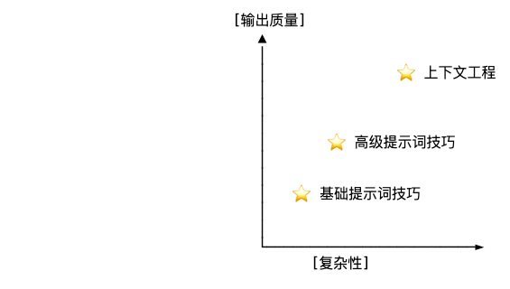
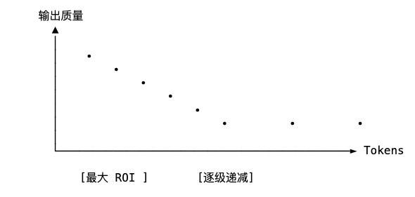

> “如果你想要从零开始制作苹果派，你必须首先创造宇宙。”——卡尔·萨根（Carl Sagan）

## 原子提示词：单一指令

在接下来的上下文工程探索旅途中，我们从最基础的单元开始：原子提示词 - 一条独立的大模型指令。、

```javascript
用四行诗描写一下海洋。
```

上面是一条最纯粹的提示词形式：一个人，一条指令，一个模型响应。

**简单、直接、原子。**

## 剖析原子提示词

先看看一个有效的原子提示词的组成部分：**任务 + 约束 + 输出格式。**

```javascript
原子提示词 = [任务] + [约束条件] + [输出格式]
```

例如：

| 任务         | 约束          | 输出格式    |
| ---------- | ----------- | ------- |
| 写一首关于太空的诗。 | 只能使用 5 言绝句。 | 输出 4 行  |

## 原子提示词的局限性

原子提示词是大模型交互的基础模块，但它们的限制也肉眼可见：

| 局限性                                         |
| ------------------------------------------- |
| ❌ 交互间无记忆能力❌ 演示能力有限❌ 无复杂推理框架❌ 易产生歧义❌ 输出结果差异大 |

我们看一个简单的案例：

```javascript
# 一条提示词
atomic_prompt = "列出糖尿病的5种症状。"

# 送给大模型，循环五次
responses = [llm.generate(atomic_prompt) for _ in range(5)]

# 输出 5 次结果
unique_symptoms = set()
for response in responses:
    symptoms = extract_symptoms(response)
    unique_symptoms.update(symptoms)

print(f"发现 {len(unique_symptoms)} 个不同的结果")
```


发现问题了吗？即使使用相同的原子提示词，每次我们也会得到不同的响应。当给定上下文信息很少时，模型的输出很难保持一致性。

## 单一原子提示词的底线：可用，但有限制

尽管存在限制，但原子提示词帮我们确定了评估基准：

1. 衡量 token 效率（最小开销）

2. 基准响应质量

3. 为实验建立一个对照



## 未言明的上下文：大模型已经知道什么

Even with atomic prompts, LLMs leverage massive implicit context from their training:

即使使用原子提示，大模型也会利用其训练中庞大的隐藏上下文：

| 隐藏的上下文                                                  |
| ------------------------------------------------------- |
| ✅ 语言规则和语法✅ 常识性事实✅ 格式规范（列表、段落等）✅ 特定领域知识（因模型而异）✅ 学习到的交互方式 |

大模型默认会使用这种隐藏的上下文，但它不可靠，并且在不同的模型和版本之间存在差异。

## 幂律：Token 质量曲线

对于许多任务，我们发现上下文 token 与输出质量之间存在幂律关系：



**关键洞察：质量曲线中存在一个"最大 ROI 区域"，在这个区域内，仅添加少量标记就能显著提升质量。**

## 从原子提示词到分子提示词：需要更多上下文

原子提示词的局限性自然地引出了下一步：分子，即结合指令、示例、附加上下文和结构化格式等部分组成的提示词。

| 原子提示词        | 分子提示词                        |
| ------------ | ---------------------------- |
| 写一个关于程序员的打油诗 | 这有个例子：曾几何时，。。。现在写一个关于程序员的打油诗 |

通过添加示例和结构，我们开始有意识地构造上下文——这是上下文工程的第一步。

## 衡量原子提示词的效率：你的第一个任务

在继续之前，试试这个简单的练习：

1. 给 LLM 一个基本任务

2. 创建三个不同的原子提示版本

3. 测量使用的 token 数量，然后给出你的主观评价

4. 试试画出下面这个表格

| 任务：总结文章内容 |                       |        |      |
| --------- | --------------------- | ------ | ---- |
| 版本        | 提示词                   | Tokens | 评价   |
| A         | 总结这篇文章                | 4      | 2/10 |
| B         | 用三句话简明扼要的总结这篇文章       |  14    | 6/10 |
| C         | 总结这篇文章的关键要点，突出主要人物和事件 | 27     | 8/10 |

## 本节要点总结

1. 原子提示词是 LLM 交互的基本单元

2. 它们遵循基本结构：任务 + 约束 + 输出格式

3. 它们具有固有局限性：无记忆、示例或推理框架

4. 即使是简单的原子提示也利用了模型的隐含知识

5. 上下文标记与质量之间存在幂律关系


***

## 深入探讨：提示模板

你如果想多掌握一些原子提示词，可以试试这个提示词模板：

```javascript
# 基本指令
{task}

# 人格化指令
As a {persona}, {task}

# 格式要求
{task}
Format: {format_specification}

# 约束和限制
{task}
Constraints:
- {constraint_1}
- {constraint_2}
- {constraint_3}

# 步骤引导
{task}
Please follow these steps:
1. {step_1}
2. {step_2}
3. {step_3}
```
