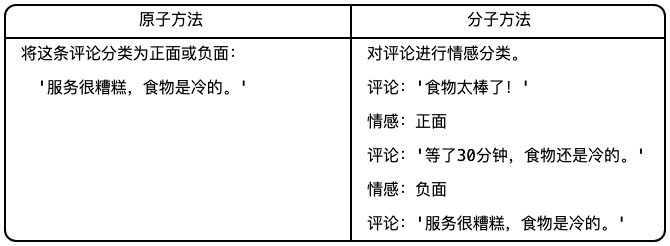
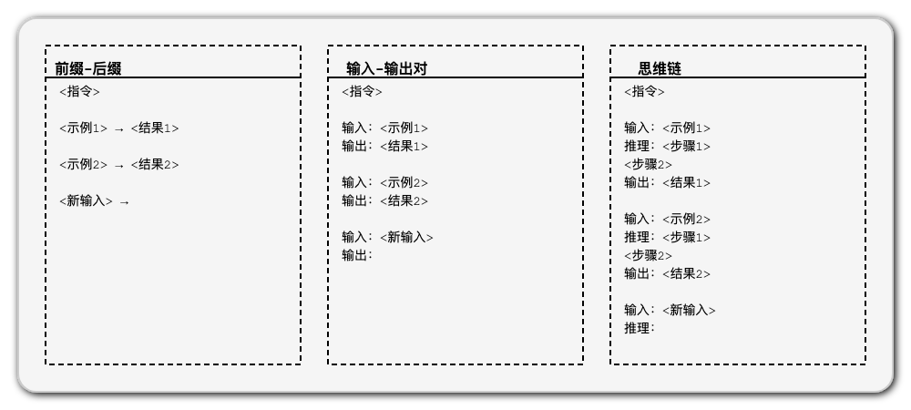
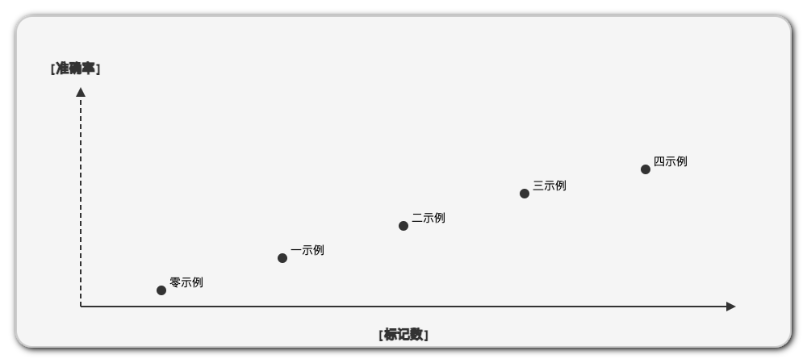
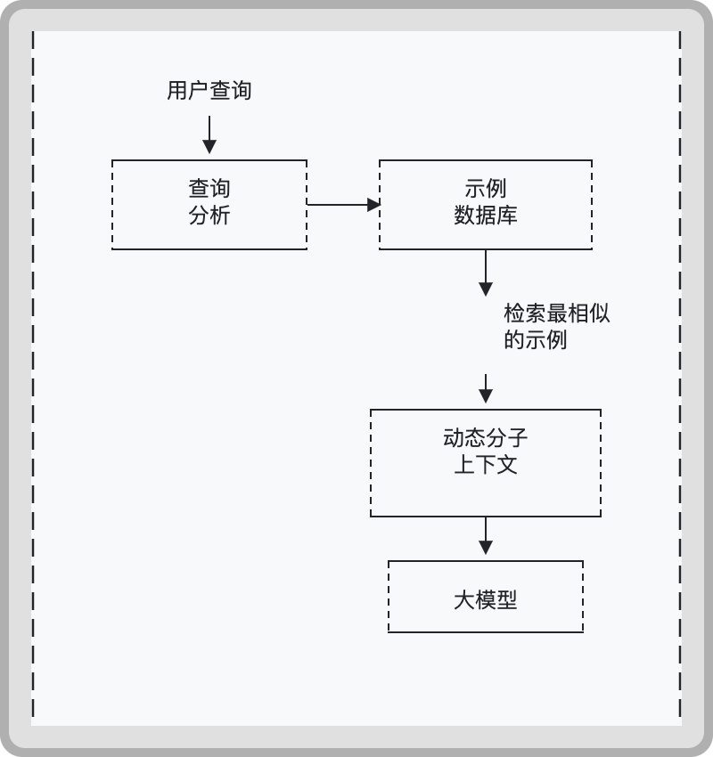
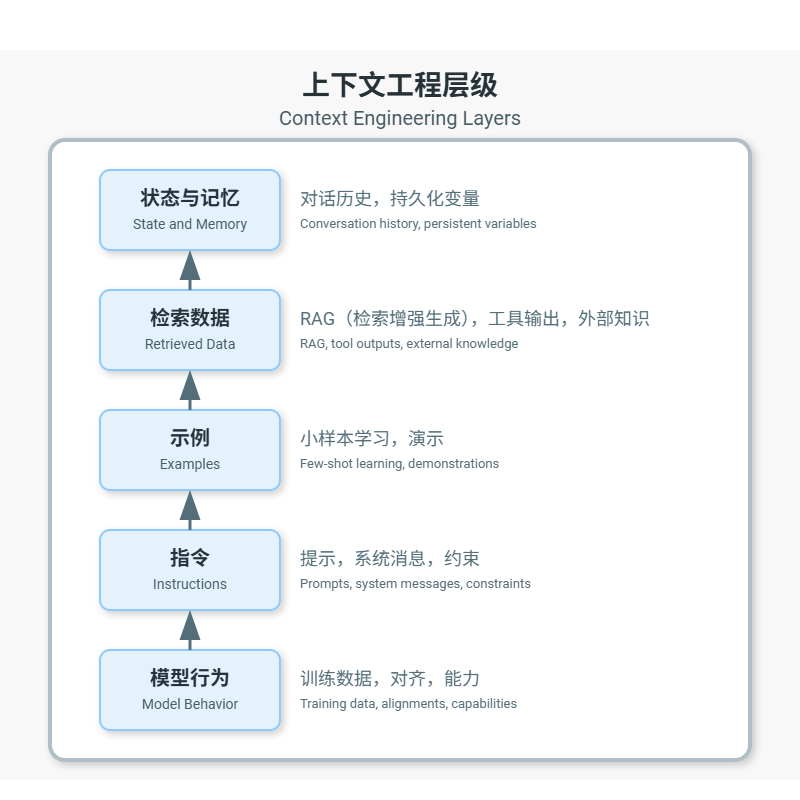

> 整体大于部分之和。 —— 亚里士多德（Aristotle）

## 从原子提示词到分子提示词

在上一节中，我们探讨了原子提示词。现在把他们升级为分子提示词：包含模型遵循的示例和模式的结构化上下文的提示词。

```javascript
分子提示词 = [指令] + [示例] + [上下文] + [新输入]
```

这种分子提示词利用了 LLM 的一个强大能力：少样本学习。

## 学习“小样本”（Few-Shot）：几个案例

小样本学习是指我们提供期望的输入输出模式示例，使模型能够识别并继续该模式。

| 输入：巴黎输出：巴黎是法国的首都 |
| ---------------- |
| 输入：东京输出：东京是日本的首都 |
| 输入：渥太华输出：？？？     |

大模型会识别出该模式并回答："渥太华是加拿大的首都。"

## 分子提示词的优势：可衡量的改进



分子提示词通常能够实现：

* 更高的准确性（在许多任务上提升 10-30%）

* 更强的稳定性（输出结果方差更低）

* 更好的格式遵循性

* 更清晰的边缘情况处理

## 设计有效的分子提示词模板

分子提示词的上下文结构非常重要。以下是一些常见模式：



每个模板在不同任务上都有其优势：

* 前缀-后缀：最简单，适用于简单的任务

* 输入-输出对：界限清晰，适用于结构化数据

* 思维链：揭示推理步骤，最适合复杂任务

## 如何科学选择示例和案例

示例的重要性各不相同。以下是为分子提示词的上下文选择示例的一些技巧：

| ✓ 涵盖各种情况以展示范围✓ 包含能明确边界的边缘情况✓ 尽可能按从简单到复杂的顺序排列✓ 使用近期或常见的示例（近因和频率偏差）✓ 包含接近失败的情况以确定精确边界 |
| ----------------------------------------------------------------------------------- |

## 测量分子提示词的效率

随着上下文规模的增大，token 数量也随之增加。通过实验来选择平衡点：



可以看到，边际效益递减。每多一个示例都会消耗 token，但其带来的改进效果不如前一个显著。

## 分子提示词的最佳实践

对于大多数任务，存在一个能够平衡质量和 token 消耗的最佳实践：

| 任务类型  | 案例或示例的数量         |
| ----- | ---------------- |
| 分类    | 1～3 个            |
| 内容生成  | 2～5 个            |
| 结构化分析 | 2～4 个，但要覆盖所有字段   |
| 推理    | 2～3 个，给出思考过程     |
| 翻译    | 3～5 个，给出不同复杂度的示例 |

## 构建动态分子提示词

高级上下文工程涉及动态选择每个输入的最相关示例：



这种方法：

1. 分析用户查询

2. 检索最相关的示例

3. 构建并优化分子提示词上下文

4. 将优化后上下文发送给大模型

## 实践应用：一个简单的实现

```javascript
def create_molecular_context(instruction, examples, new_input, 
                            format_type="输入-输出对"):
    """
    从示例中构建一个分子提示词上下文。
    
    参数:
        instruction (str): 任务指令
        examples (List[Dict]): 示例列表
        new_input (str): 需要处理的内容
        format_type (str): 输出模板 (input-output, chain-of-thought)
    
    Returns:
        str: 完整的分子提示词上下文
    """
    context = f"{instruction}\n\n"
    
    if format_type == "input-output":
        for example in examples:
            context += f"Input: {example['input']}\n"
            context += f"Output: {example['output']}\n\n"
    elif format_type == "chain-of-thought":
        for example in examples:
            context += f"Input: {example['input']}\n"
            context += f"Thinking: {example['thinking']}\n"
            context += f"Output: {example['output']}\n\n"
    
    context += f"Input: {new_input}\nOutput:"
    
    return context
```

## 本节要点总结

1. 分子提示词的上下文将指令与示例相结合，以提高 LLM 性能

2. 少样本学习使模型能够识别和延续模式

3. 模板结构很重要；不同的格式适用于不同的任务

4. 示例选择是一门科学；多样性、边界情况和排序都至关重要

5. 存在边际效益递减；每个额外的实例都会以递减的收益消耗标记

6. 动态构建可以优化针对每个特定输入的上下文

## 练习题

1. 对一个简单的分类任务，使用 0、1、3 和 5 个示例来衡量性能

2. 在同一个任务上比较不同的模板结构

3. 根据与新输入的相似性实现动态选择示例

4. 为你关心的任务找到"最小可行分子"


***

## 深入探讨：提示工程与上下文工程

提示工程专注于设计完美的指令。上下文工程则包含更多内容：



