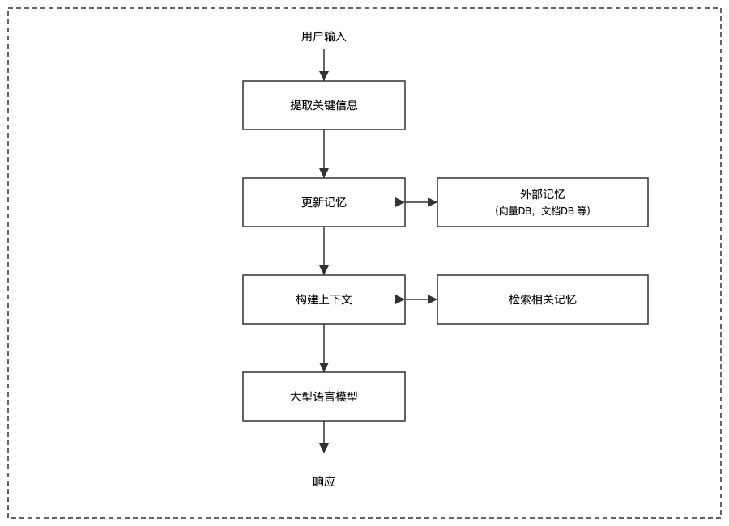

> "我们就是我们的记忆，我们就是那座变幻莫测的博物馆，那堆破碎的镜子。"——豪尔赫·路易斯·博尔赫斯（Jorge Luis Borges）

## 从分子提示词到细胞提示词

我们已经了解了原子提示词（单个指令）和分子提示词（带示例的指令）。现在我们上升到细胞—具有记忆上下文结构的提示词，可以在多次交互中持续存在。

| 细胞提示词 = \[指令] + \[示例] + \[记忆/状态] + \[当前输入] |
| ------------------------------------------ |

细胞提示词，就像生物细胞在与环境交互时保持其内部状态一样，可以在与大模型进行多次交互时保留信息。

## 记忆的问题

默认情况下，大模型没有记忆功能。每一次请求都是独立处理的：

没有记忆功能，LLM 会忘记先前交互中的信息，从而造成断续、令人不爽和困惑的用户体验。

## 细胞提示词解决方案：对话记忆

最简单的细胞提示词结构：将对话历史添加到上下文中：

| SYSTEM PROMPT: "你是一个助手.."对话历史：User: "我是磊叔。" Assistant: "大佬好。"                                                               |
| --------------------------------------------------------------------------------------------------------------------------- |

现在 LLM 可以访问之前的交流并保持连续性。

## Token 的内存管理问题

随着对话的增长，上下文窗口会逐步填满，故需要合理的内存管理策略：

## 内存管理策略

这里给出几种优化上下文窗口的策略：

| 内存管理策略                                                                                |
| ------------------------------------------------------------------------------------- |
| 窗口化：仅保留最近的 N 轮对话摘要化：将较早的对话轮次压缩成摘要键值存储：单独提取并存储重要事实优先级修剪：移除不太重要的对话轮次 语义分块：将相关的对话交流组合在一起 |

> **磊叔注：这些管理策略亦可用于多轮对话的优化。**

### - 窗口化：滑动上下文

这是最简单的内存管理方法，仅保留最近的对话轮次。

足够简单，但会遗忘早期轮次的信息。

### - 摘要化：压缩内存

将更早的上下文进行压缩，这样既保留了更早轮次对话的核心内容，又减少了 token 消耗。

### - 键值存储：结构化状态

为了更精细的控制，提取并按结构化格式存储重要的信息或知识：

## - 超越对话：具备状态的应用

细胞提示词不仅支持连贯的对话，还允许有状态的应用，其中 LLM：

1. 记忆先前的交互

2. 更新和维护变量

3. 通过多步流程跟踪进度

4. 基于先前的输出构建

这里是一个简单的计算器示例，状态、变量等会多轮次持续存在，实现连续计算。

## 长期记忆：超越上下文窗口

但是对于真正持久的记忆，我们需要额外的外部存储，来实现无限的上下文：

1. 从对话中提取关键信息

2. 将其存储在外部数据库中

3. 在需要时检索相关上下文

4. 将上下文整合到提示中

## 细胞提示词的实现：一个内存管理器

## 测量细胞提示词的效率

与分子提示词一样，效率也很重要，不同的策略针对不同的优先级进行优化。选择合适的方法取决于您的具体应用需求。

| 不同管理策略的对比 |              |            |           |
| --------- | ------------ | ---------- | --------- |
| **策略**    | **Token 消耗** | **可维持的信息** | **实现复杂度** |
| 无         | 最低           | 无          | 极易        |
| 全历史       | 最高           | 完整         | 极易        |
| 窗口化       | 可控           | 仅最近轮次      | 容易        |
| 信息摘要      | 中等           | 较好         | 一般        |
| 键值对       | 低            | 灵活可配       | 一般        |
| 外部存储      | 非常低          | 可扩展        | 复杂        |

## 高级技术：内存编排

对于复杂的应用，多个内存系统来协同工作，这种架构模拟了人类记忆系统，包括：

* 短期记忆：最近的对话轮次

* 工作记忆：活跃任务状态和变量

* 长期记忆：持久的用户信息和偏好

> **磊叔注：很像传统推荐系统中的用户短期-中期-长期记忆。一旦涉及短中长，就要有权重的分配，这个文中并未说明。**

## 记忆和幻觉抑制

具备记忆的细胞提示词，最宝贵的优势之一是减少幻觉。通过将 LLM 与记忆中的持续事实相结合，可以极大地提高大模型的输出可靠性。

| 幻觉抑制策略 |
| ------ |
|        |

## 超越文本：结构化状态

高级的细胞提示词，可以在文本历史之外维持结构化状态。这种结构化方法允许对上下文进行精确控制，并支持更复杂的应用。

## 记忆的反馈机制

细胞提示词的复杂性，需要为其创建反馈机制，来帮助 LLM 管理其自身的记忆。

通过提取并更新需要记忆的重要信息，从而构建一个自我改进的记忆系统。

## 本节要点总结

1. 记忆单元通过多次交互增加状态持久性

2. 随着对话的增长，Token 消耗的管理至关重要

3. 记忆策略包括窗口化、信息摘要和键值存储

4. 外部存储使得在上下文窗口之外实现无限、持久的存储成为可能

5. 结构化状态使得能够实现超越简单对话的复杂应用

6. 内存编排将多个内存系统结合以实现最佳性能

7. 自改进内存利用 大模型 来帮助管理其自身的内存

## 练习题

1. 实现一个简单的会话记忆系统，采用窗口机制

2. 比较在相同的扩展会话中不同的记忆策略

3. 构建一个键值存储系统，从会话中提取重要事实

4. 使用 LLM 实验总结提炼历史会话的信息

5. 为特定应用领域创建一个结构化的状态管理器

***

## 深入探讨：记忆抽象

记忆可以组织在多个抽象层次中：

这种分层方法使系统能够在具体细节和交互上下文的高级理解之间取得平衡。
