> 整体大于部分之和。 —— 亚里士多德（Aristotle）

## 从细胞提示词到器官提示词

我们的旅程已经从原子提示词（单个提示）到分子分子提示词（带示例的提示）再到细胞提示词（对话记忆）。现在我们到达了器官——由多个上下文细胞协同工作以完成复杂任务的协调系统。

> **磊叔：器官，不再翻译为器官提示词。**

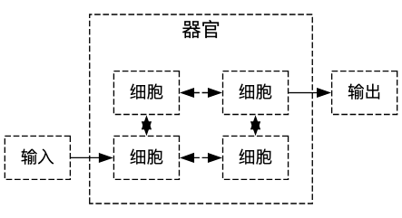

就像生物器官一样，我们的上下文器官协调多个大模型得到细胞提示词来解决任何单个上下文都无法胜任的问题。

## 我们需要器官的原因：单个上下文的局限性

即使是最高级的上下文单元也具有固有的局限性：

| x 上下文窗口大小限制x 无并行处理x 单一视角/推理方法x 有限的工具使用能力x 复杂度上限（推理深度）x 单点故障 |
| ----------------------------------------------------------- |

器官通过专业化、并行化和协调来克服这些局限性。

## 器官的详细剖析

一个上下文器官有几个关键组成部分：

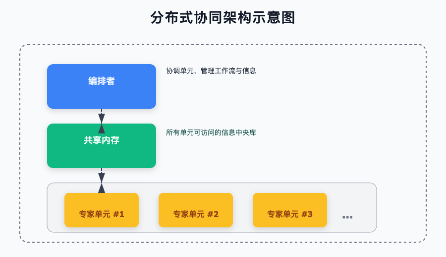


器官包括如下的部分：

1. 编排器

编排器是器官的"大脑"，负责：

```markdown
- 任务分解
- 单元选择与排序
- 信息路由
- 冲突解决
- 进度监控
- 输出合成
```

编排器可以是：

* 基于规则的：遵循预定的工作流程

* LLM 驱动的：使用 LLM 本身进行协调

* 混合的：结合固定规则与动态适应


* 共享记忆

器官的记忆系统使细胞上下文间能够进行信息流动：

```markdown
- 工作内存：当前任务状态和中间结果
- 知识库：知识、检索到的信息、参考资料
- 过程日志：操作历史和推理步骤
- 输出缓冲区：合成结果和结论
```

在器官中，随着总信息量超过任何上下文窗口时，内存管理变得更加关键。


* 细胞的专业角色

器官中的每个细胞都具有专门的角色：

| 角色       | 角色职责           | 上下文说明        |
| -------- | -------------- | ------------ |
| 🔍 研究者   | 信息收集与综合        | 搜索结果，知识库访问   |
| 🧠 推理者   | 分析、推理并得出结论     | 事实、相关信息、规则   |
| 📊 评估者   | 评估质量，验证事实，发现错误 | 声明、输出、标准、证据  |
| 🔧 工具用户  | 执行外部工具、API、代码  | 工具文档、输入参数、结果 |
| ✒️ 撰写者   | 创建清晰、完善的最终内容   | 内容提纲、事实、风格指南 |
| 🗣️ 用户界面 | 与用户交互，澄清，个性化   | 用户历史、偏好、查询   |

这些示例还有一层含义：每个细胞都可以用于任何专门的任务或领域。

## 控制流模式：器官如何处理信息

不同的器官使用不同的信息流模式：

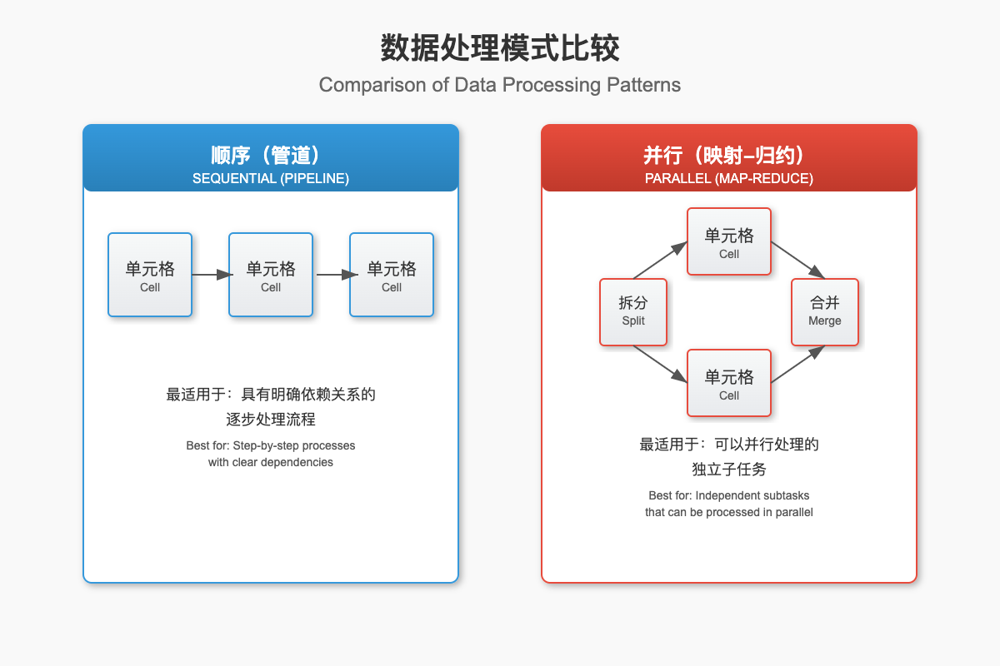

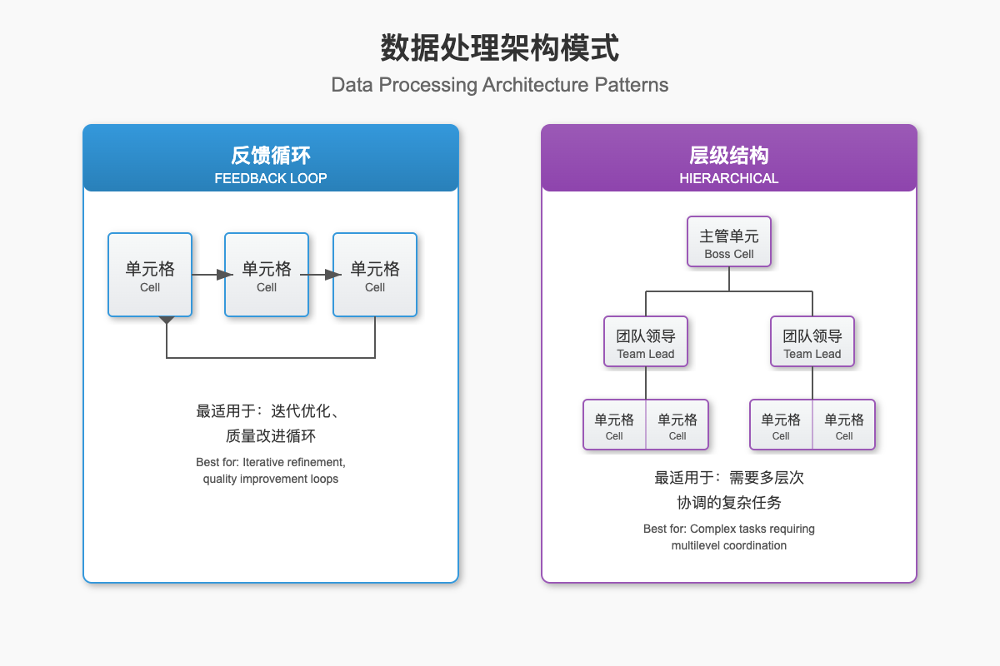


模式的选择取决于任务的结构、并行化潜力和复杂性。

## ReAct（推理+行动）：一种基础器官模式

ReAct（推理+行动）是最强大的器官应用模式之一：

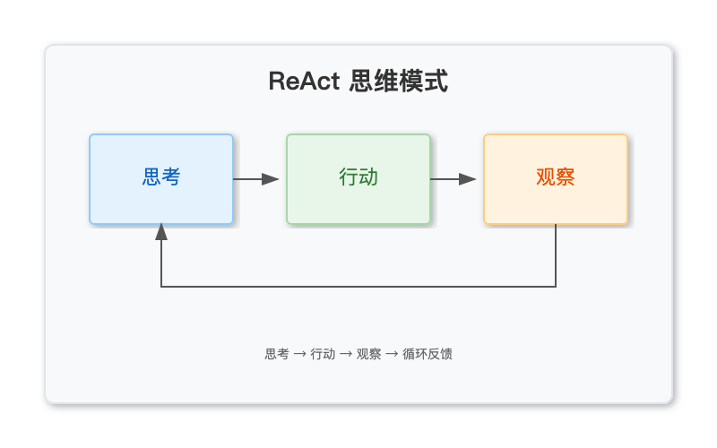

每个循环都包括：

1. 思考：推理当前状态并决定下一步行动

2. 行动：执行工具、API 调用或信息检索

3. 观察：接收并解释结果

4. 重复直到任务完成

这种模式能够实现推理和工具使用的强大结合。

## 一个简单的器官实现

这里是一个具有三个专用细胞的顺序器官的基本实现：

```python
class ContextOrgan:
    """一个简单的上下文器官，拥有多个专业化细胞。"""
    
    def __init__(self, llm_service):
        """使用 LLM 服务初始化器官。"""
        self.llm = llm_service
        self.shared_memory = {}
        
        # 初始化专业化细胞
        self.cells = {
            "researcher": self._create_researcher_cell(),
            "reasoner": self._create_reasoner_cell(),
            "writer": self._create_writer_cell()
        }
    
    def _create_researcher_cell(self):
        """创建一个专门用于信息收集的细胞。"""
        system_prompt = """你是一名研究专家。
        你的工作是收集和组织有关某个主题的相关信息。
        专注于事实准确性和全面覆盖。
        使用标题和要点清晰地组织你的发现。"""
        
        return {
            "system_prompt": system_prompt,
            "memory": [],
            "max_turns": 3
        }
    
    def _create_reasoner_cell(self):
        """创建一个专门用于分析和推理的细胞。"""
        system_prompt = """你是一名分析推理专家。
        你的工作是分析信息、识别模式并得出合乎逻辑的结论。
        考虑多种视角并评估证据的强度。
        清楚地说明你的推理过程以及你所做的任何假设。"""
        
        return {
            "system_prompt": system_prompt,
            "memory": [],
            "max_turns": 3
        }
    
    def _create_writer_cell(self):
        """创建一个专门用于内容创作的细胞。"""
        system_prompt = """你是一名写作专家。
        你的工作是创作清晰、引人入胜且结构良好的内容。
        根据目标受众和目的调整你的风格。
        专注于清晰性、连贯性和正确的格式。"""
        
        return {
            "system_prompt": system_prompt,
            "memory": [],
            "max_turns": 3
        }
    
    def _build_context(self, cell_name, input_text):
        """为特定细胞构建上下文。"""
        cell = self.cells[cell_name]
        
        context = f"{cell['system_prompt']}\n\n"
        
        # 添加与此细胞相关的共享内存
        if cell_name in self.shared_memory:
            context += "相关信息：\n"
            context += self.shared_memory[cell_name]
            context += "\n\n"
        
        # 添加细胞的对话历史
        if cell["memory"]:
            context += "过往交流：\n"
            for exchange in cell["memory"]:
                context += f"输入：{exchange['input']}\n"
                context += f"输出：{exchange['output']}\n\n"
        
        # 添加当前输入
        context += f"输入：{input_text}\n输出："
        
        return context
    
    def _call_cell(self, cell_name, input_text):
        """使用给定输入调用特定细胞。"""
        context = self._build_context(cell_name, input_text)
        
        # 调用 LLM
        response = self.llm.generate(context)
        
        # 更新细胞内存
        self.cells[cell_name]["memory"].append({
            "input": input_text,
            "output": response
        })
        
        # 必要时修剪内存
        if len(self.cells[cell_name]["memory"]) > self.cells[cell_name]["max_turns"]:
            self.cells[cell_name]["memory"] = self.cells[cell_name]["memory"][-self.cells[cell_name]["max_turns"]:]
        
        return response
    
    def process_query(self, query):
        """通过整个器官处理查询。"""
        # 第一步：研究阶段
        research_prompt = f"研究以下主题：{query}"
        research_results = self._call_cell("researcher", research_prompt)
        
        # 更新共享内存
        self.shared_memory["reasoner"] = f"研究发现：\n{research_results}"
        
        # 第二步：分析阶段
        analysis_prompt = f"分析关于：{query} 的研究发现"
        analysis_results = self._call_cell("reasoner", analysis_prompt)
        
        # 更新共享内存
        self.shared_memory["writer"] = f"分析结果：\n{analysis_results}"
        
        # 第三步：内容创作阶段
        writing_prompt = f"创作一个关于 {query} 的综合性回复"
        final_content = self._call_cell("writer", writing_prompt)
        
        return {
            "research": research_results,
            "analysis": analysis_results,
            "final_output": final_content
        }

```


这个简单的器官遵循顺序管道模式，信息从研究流向分析再到内容创建。

## 高级器官模式

让我们探索一些更复杂的器官架构：

### 工具型器官：使用 Agent，就像瑞士军刀

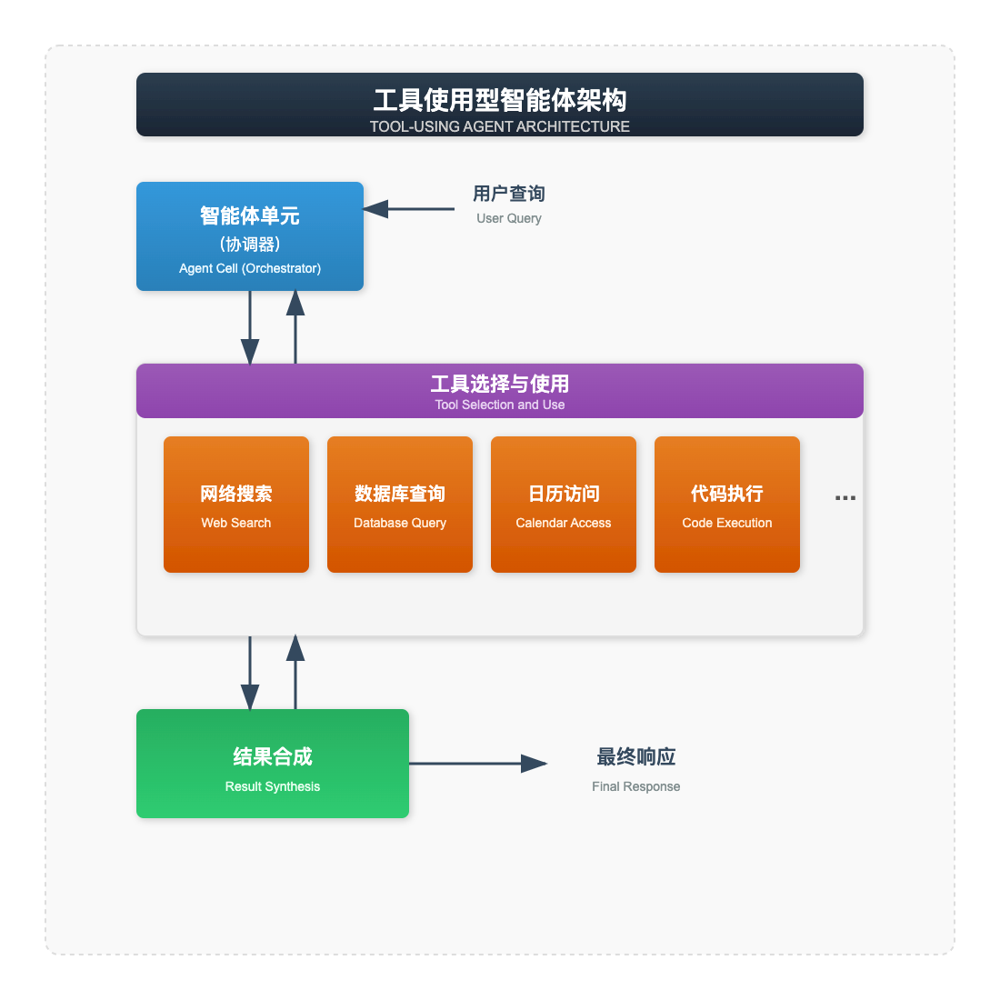

这种模式使大模型能够选择和使用各种工具来完成任务，类似于流行的“函数调用”（function-call）功能。

### 辩论型器官：多元视角

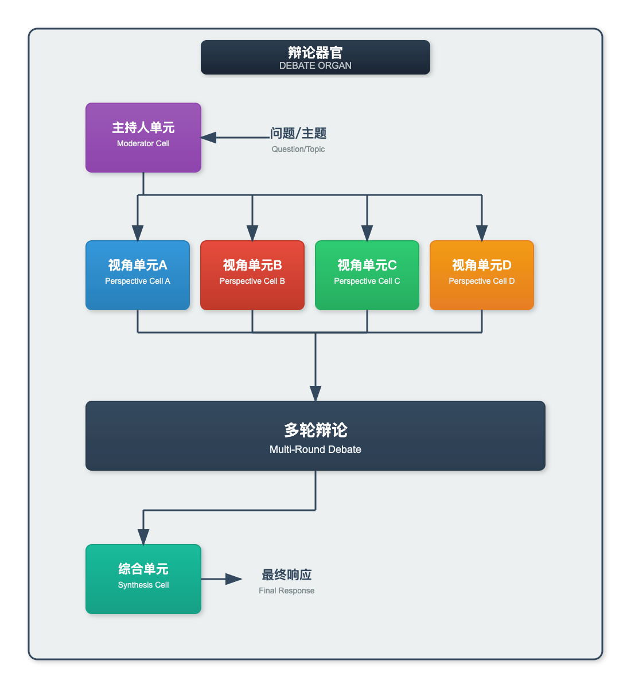

这种模式在多个视角之间创建了一个结构化的辩论，从而导致了更全面和均衡的分析。

### 递归型器官：分形组合

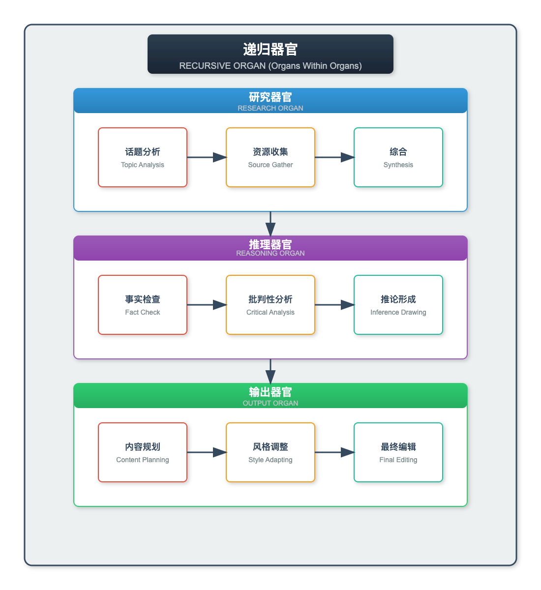


这种分形方法能够实现复杂的层次化处理，每个子器官负责整体任务的不同方面。

## 实际应用

上下文器官使得一些使用更简单的上下文结构无法实现的高级应用成为可能：

```markdown
- 研究助手：多阶段研究与综合
- 代码生成：设计、实现、测试、文档
- 内容创作：研究、大纲、起草、编辑
- 自主代理：规划、执行、反思
- 数据分析：收集、清理、分析、可视化
- 复杂问题解决：分解与逐步处理
- 互动学习：个性化教育系统
```

每个应用都受益于不同细胞协同工作的专业性。

## 优化器官性能

有很多因素都会影响上下文器官的有效性：

```markdown
- 专业化清晰度：每个细胞的角色定义有多清晰
- 内存管理：高效的信息存储和检索
- 编排逻辑：协调系统的有效性
- 错误处理：细胞产生错误输出时的鲁棒性
- 反馈机制：从结果中学习和改进的能力
- 任务分解：问题被分解为子任务的程度
```

平衡这些因素需要仔细的测量和迭代。

## 衡量器官的效能

与所有上下文工程一样，测量是关键：

| 器官指标        | 目标         |
| ----------- | ---------- |
| 端到端准确率      | >90%       |
| 总 Token 使用量 | <单上下文的 50% |
| 延迟（完整流水线）   | <每步 5 秒    |
| 错误恢复率       | >80%       |

跟踪这些指标有助于识别瓶颈和优化机会。

## 涌现属性：器官的魔力

上下文器官最引人入胜的方面在于其涌现属性：这些属性源自整个系统而非任何单个细胞：

```plain&#x20;text
◆ 处理比任何单个上下文窗口更大的问题
◆ 通过专门的验证单元进行自我修正
◆ 超越单提示能力的复杂多步推理
◆ 在处理过程中适应新信息
◆ 多视角带来更平衡的分析
◆ 对单个单元故障的恢复能力
◆ 通过专业化实现特定领域的专业知识
```

这些涌现出的能力使得全新的应用类别得以实现，而这些应用若使用更简单的上下文结构则不可能实现。

## 超越上下文窗口：打破规模限制

器官最强大的优势之一是能够处理远超任何单个上下文窗口的信息：

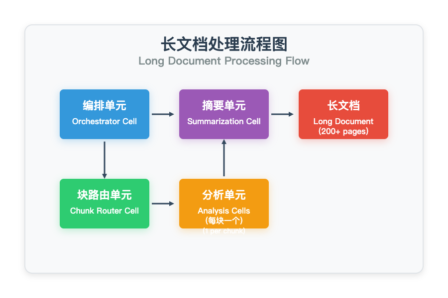

这种架构通过以下方式实现处理几乎无限长度的文档：

1. 将文档分割成可管理的片段

2. 并行处理每个数据块

3. 汇总和综合结果

## 认知架构：从器官到系统

在最高的层次上，器官可以组合成完整的认知架构或"系统"：

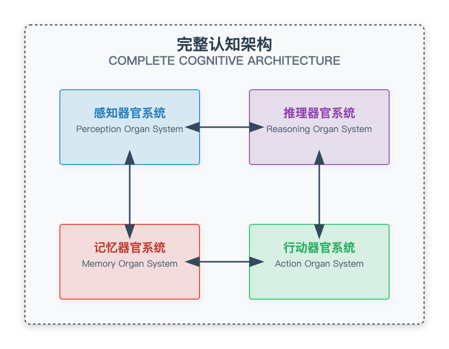

这种方法反映了人类认知理论，具有专门用于感知、推理、记忆和行动的系统协同工作，以创造统一的智能。

## 实现功能器官：代码示例

```python
class ContentCreationOrgan:
    """一个用于创作高质量内容的多细胞器官。"""

    def __init__(self, llm_service):
        """使用 LLM 服务初始化器官。"""
        self.llm = llm_service
        self.shared_memory = {}
        # 创建专业细胞
        self.cells = {
            "planner": self._create_cell(
                """你是一名内容规划专家。
                你的工作是为内容创作创建详细的大纲。
                将主题分解为逻辑部分，包含清晰的标题和副标题。
                考虑目标受众、目的和需要涵盖的关键点。"""
            ),
            "researcher": self._create_cell(
                """你是一名研究专家。
                你的工作是收集和组织关于某个主题的相关信息。
                注重事实准确性，尽可能引用来源。
                突出关键统计数据、示例和支持性证据。"""
            ),
            "writer": self._create_cell(
                """你是一名内容写作专家。
                你的工作是根据大纲和研究，创作引人入胜、结构良好的内容。
                根据目标受众和目的调整你的风格。
                注重清晰度、流畅性和引人入胜的叙事。"""
            ),
            "editor": self._create_cell(
                """你是一名编辑专家。
                你的工作是润色和改进现有内容。
                检查清晰度、连贯性、语法和风格问题。
                在保持原有语调和信息的同时提出改进建议。"""
            ),
            "fact_checker": self._create_cell(
                """你是一名事实核查专家。
                你的工作是核实内容中的事实陈述。
                标记任何可疑或不准确的陈述。
                尽可能提供带引用的更正。"""
            )
        }

    def _create_cell(self, system_prompt):
        """使用给定的系统提示创建细胞。"""
        return {
            "system_prompt": system_prompt,
            "memory": [],
            "max_turns": 3  # 每个细胞的最大对话轮数
        }

    def _build_context(self, cell_name, input_text):
        """为特定细胞构建上下文。"""
        cell = self.cells[cell_name]
        context = f"{cell['system_prompt']}\n\n"

        # 添加与此细胞相关的共享内存
        if cell_name in self.shared_memory:
            context += "相关信息：\n"
            context += self.shared_memory[cell_name]
            context += "\n\n"

        # 添加细胞的对话历史
        if cell["memory"]:
            context += "过往交流：\n"
            for exchange in cell["memory"]:
                context += f"输入：{exchange['input']}\n"
                context += f"输出：{exchange['output']}\n\n"

        # 添加当前输入
        context += f"输入：{input_text}\n输出："
        return context

    def _call_cell(self, cell_name, input_text):
        """使用给定的输入调用特定细胞。"""
        context = self._build_context(cell_name, input_text)
        # 调用 LLM
        response = self.llm.generate(context)

        # 更新细胞记忆
        self.cells[cell_name]["memory"].append({
            "input": input_text,
            "output": response
        })

        # 如果需要，修剪记忆
        if len(self.cells[cell_name]["memory"]) > self.cells[cell_name]["max_turns"]:
            self.cells[cell_name]["memory"] = self.cells[cell_name]["memory"][-self.cells[cell_name]["max_turns"]:]

        return response

    def create_content(self, topic, audience="general", content_type="article", depth="comprehensive"):
        """围绕给定主题创作内容。"""
        # 步骤 1: 内容规划
        plan_prompt = f"""为一篇关于 '{topic}' 的 {content_type} 创建详细大纲。
        目标受众：{audience}
        深度：{depth}

        包含主要章节、副标题以及每个部分需要涵盖的关键点。"""
        content_plan = self._call_cell("planner", plan_prompt)

        # 更新共享内存，供研究员使用
        self.shared_memory["researcher"] = f"内容大纲：\n{content_plan}"

        # 步骤 2: 研究阶段
        research_prompt = f"""针对以下主题进行 {content_type} 研究：
        '{topic}'

        根据以下内容大纲：
        {content_plan}

        为每个部分收集关键事实、统计数据、示例和支持性证据。"""
        research_findings = self._call_cell("researcher", research_prompt)

        # 更新共享内存，供写手使用
        self.shared_memory["writer"] = f"内容大纲：\n{content_plan}\n\n研究发现：\n{research_findings}"

        # 步骤 3: 写作阶段
        writing_prompt = f"""为 {audience} 受众创作一篇关于 '{topic}' 的 {content_type}。
        遵循以下内容大纲：
        {content_plan}

        融入以下研究发现：
        {research_findings}

        创作一篇 {depth} 的作品，既能吸引读者，又能涵盖所有关键点。"""
        draft_content = self._call_cell("writer", writing_prompt)

        # 步骤 4: 事实核查
        fact_check_prompt = f"""审查这篇 {content_type} 草稿的事实准确性：
        {draft_content}

        标记任何可疑的陈述，核实关键事实，并在需要时提出更正建议。"""
        fact_check_results = self._call_cell("fact_checker", fact_check_prompt)

        # 更新共享内存，供编辑使用
        self.shared_memory["editor"] = f"草稿内容：\n{draft_content}\n\n事实核查结果：\n{fact_check_results}"

        # 步骤 5: 编辑阶段
        editing_prompt = f"""编辑和润色这篇 {content_type} 草稿：
        {draft_content}

        考虑以下事实核查结果：
        {fact_check_results}

        在修复任何已识别的事实问题时，提高清晰度、流畅性和风格。"""
        final_content = self._call_cell("editor", editing_prompt)

        return {
            "content_plan": content_plan,
            "research_findings": research_findings,
            "draft_content": draft_content,
            "fact_check_results": fact_check_results,
            "final_content": final_content
        }
```

此实现演示了：

1. 针对内容创作不同方面的专用细胞

2. 信息在器官中的顺序流动

3. 用于在细胞之间传递信息的共享内存

4. 从规划到最终内容的完整流程

## 器官设计的挑战

构建有效的器官面临着若干挑战：

```plain&#x20;text
◆ 错误传播：错误可能在系统中层层级联
◆ 协调开销：编排增加了复杂性和延迟
◆ 信息瓶颈：关键细节可能在单元之间丢失
◆ 调试困难：复杂的交互可能难以追踪
◆ 成本缩放：多次大语言模型调用增加了总令牌成本
◆ 系统设计复杂性：需要精心规划和测试
```

应对这些挑战需要精心设计、测试和监控。

## 器官工程的最佳实践

从复杂器官的经验中，已经形成了一些最佳实践：

```plain&#x20;text
√ 从简单开始：从最少的组件开始，根据需要增加复杂性
√ 测量单元性能：首先单独测试每个单元
√ 明确契约：定义单元之间清晰的输入/输出格式
√ 全面日志记录：跟踪所有单元间通信
√ 容错能力：设计单元以处理意外输入
√ 验证单元：添加专用单元来检查输出
√ 渐进增强：先构建基本功能，然后再添加
√ 尽可能并行：识别并并行化独立任务
```

遵循这些实践能够带来更稳健和有效的器官系统。

## 从理论到实践：一个完整的示例

为了将所有内容整合起来，让我们考虑一个用于数据分析的完整器官系统：

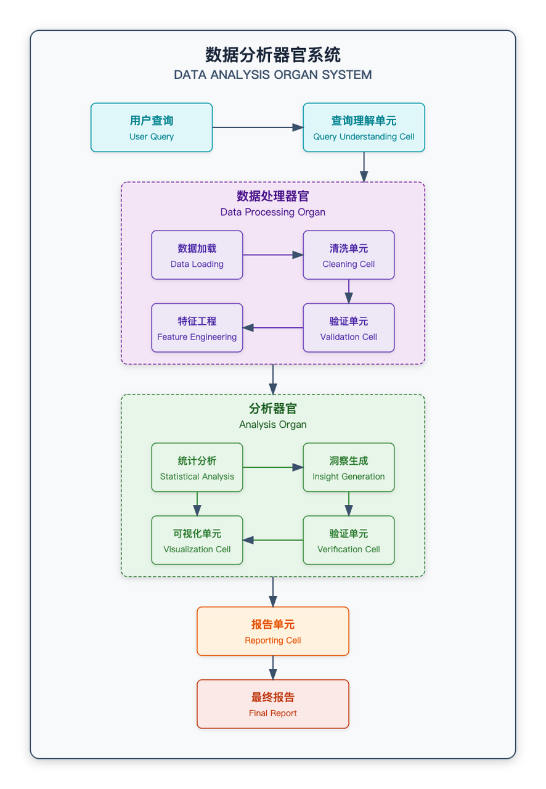

该系统展示了多个器官如何协同工作，以创建从原始数据到最终洞察的完整工作流程。

## 超越人类能力：哪些器官实现


上下文器官最令人兴奋的方面在于，它们使人类专家甚至无法实现的能力成为可能：

```plain&#x20;text
◆ 并行处理：同时分析大量文档
◆ 多元专长：整合多领域知识
◆ 稳定质量：保持巅峰表现，不知疲倦
◆ 规模：处理人类无法驾驭的海量信息
◆ 多重视角：同时从多个角度审视问题
◆ 完美记忆：保留并运用所有相关信息
```

这些能力为人工智能应用开辟了全新的可能性。

## 本节关键要点

1. 上下文器官结合多种特殊细胞来解决复杂问题

2. 编排协调细胞间信息流的传递

3. 共享内存实现器官内的高效通信

4. 控制流模式决定细胞间的交互方式（顺序、并行等）

5. 涌现属性源于细胞间的交互，创造出单个细胞所不具备的能力

6. 突破上下文限制可以实现几乎无限的信息处理

7. 最佳实践有助于应对器官设计和实施中的挑战

## 练习题

1. 为特定任务设计一个简单的双细胞器官

2. 实现一个基本的协调器以协调细胞间的交互

3. 向现有器官添加一个验证细胞以提高准确性

4. 在同一任务上尝试不同的控制流模式

5. 测量细胞专业化带来的性能提升


***

## 深入探讨：上下文工程的未来

随着上下文工程的演变，一些新兴趋势正在塑造该领域：

```plain&#x20;text
◆ 自动器官生成：大语言模型（LLMs）自行设计器官
◆ 自适应特化：根据任务需求进化的细胞
◆ 混合模型器官：结合不同模型类型和规模
◆ 人在回路器官：有人参与输入的协作系统
◆ 持久器官系统：具有进化状态的长期运行主体
◆ 标准化细胞接口：即插即用的组件生态系统
```

这些发展前景为未来更强大和灵活的上下文工程能力提供了承诺。

