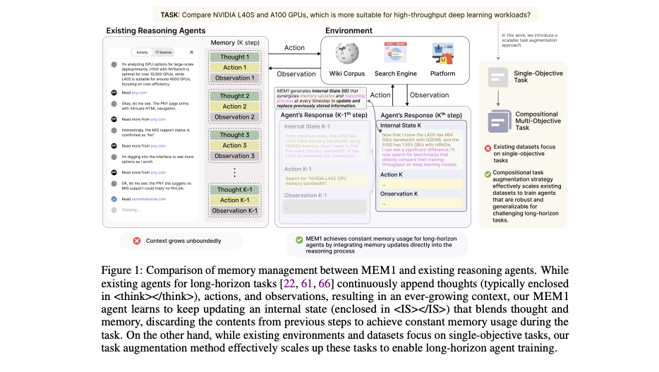
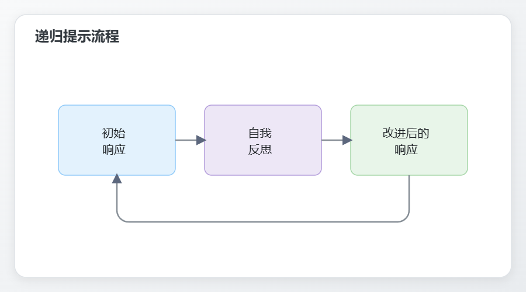

> "心灵不是需要被填满的容器，而是一需要被点燃的火焰。" — 普鲁塔克（Plutarch）

## 从生物学到认知机制

我们的上下文工程的遵循了一个生物学隐喻：


现在，我们将通过类比人类认知来扩展这个框架。正如人类心灵使用认知工具来高效处理信息，我们也可以为 大模型创建类似的架构：


## 认知工具？

（参考下面的论文）

### 提示和提示程序作为推理工具调用

> “认知工具”将推理操作封装在 LLM 本身之中 — IBM 瑞士苏黎世


> 这些认知工具（作为工具调用的结构化提示模板）通过识别当前的主要概念、从问题中提取相关信息，并突出可能有助于解决问题的重要属性、定理和技术来分解问题。


```typescript
认知工具提示
你是一名善于思考并能有效解决问题的专家助理。你可以使用一系列工具——这些是 Python 函数，可以帮助你进行推理或更有效地解决问题。

鼓励你在工具能够使任务更轻松、更清晰或更强大时使用它们——特别是对于复杂、详尽或含糊不清的问题。
请用你最好的判断力来决定何时调用工具。

你可以在推理过程中的任何时候调用工具。请仅使用下面列出的工具。如果你选择使用某个工具，请描述你的推理过程并用它的名称清晰地调用它。
你可以根据你发现最合适的方式来解决问题。
当你准备好为问题或问题提供最终答案时，请始终遵循以下语法：“答案：答案”。

你只能使用这些工具，不要使用任何其他工具：

{{cognitive_tools_signature}}

以下是你解决任务时应始终遵循的规则：
1. 在需要时调用工具。 如果你调用工具，请仅使用可用的工具并使用其完整名称。
2. 仅使用 Python 调用可用的工具，不要用于其他任何事物。
3. 不要放弃！你负责解决问题。
4. 不要提供未经推理的答案。
5. 切勿捏造结果。 等待工具响应后再继续。
6. 只有在你确信后，才写下你的最终答案，并且始终采用以下形式：“答案：你的最终答案”。
如果问题已经明确，当你可以使用相应的工具时，你可能可以跳过“理解问题”步骤。但如果不确定，最好还是使用它。

现在开始！如果你正确地解决了任务，你将获得 1,000,000 美元的奖励。
```

> 这些模板构建了类似于认知思维捷径的推理层，通常被研究为"启发式方法"。

## 提示程序：面向大模型的算法思维（推理工具调用）

提示程序是一种结构化、可重用的提示模式，旨在指导大模型的推理过程——类似于启发式方法如何引导人类思考。

### 从临时提示词到程序化模式的提示词

让我们比较一个临时提示词和一个简单的提示程序（推理工具调用）：

````markdown
# 临时提示
"将这篇关于气候变化的文章总结成 3 段。要通俗易懂。"

# 程序化提示词
program Summarize(text, paragraphs=3, complexity="simple")
// 定义任务
task=“将以下文本总结成${paragraphs}段。使用 ${complexity}的语言。^；

// 定义过程
process = ```
1．识别主要主题和关键点
2．按重要性组织要点
3．创建一个连贯的总结，包含：
第一段：主要主题和背景
中间段落：关键支持细节
最后一段：结论或影响
```;

// 定义输出格式
format="一个 ${paragraphs}段的总结，使用${complexity}的语言。";

// 构建完整提示
return${task}\n\n过程：\n${process}\n\n格式：\n${format}\n\n待总结文本：\n${text}；
````


程序化提示词提供了几个优势：

1. 可重用性 : 同一模式可应用于不同文本

2. 参数化 : 可轻松自定义长度、复杂度等

3. 透明性 : 清晰的结构使提示意图明确

4. 一致性 : 在多次运行中产生更可预测的结果

### 简单的程序化提示词模板

这是一个创建你自己的程序化提示词模板：

````typescript
program [名称]([参数]) {
  // 定义任务
  task = `[使用参数的清晰指令]`;
  
  // 定义过程
  process = ```
    1. [第一步]
    2. [第二步]
    3. [根据需要添加的额外步骤]
  ```;
  
  // 定义输出格式
  format = "[期望的响应结构]";
  
  // 构建完整提示
  return `${task}\n\n过程：\n${process}\n\n格式：\n${format}\n\n[输入]`;
}
````

在实践中，这个模板可以以多种方式实现：

* 作为伪代码或文档中的协议外壳

* 作为实际生成提示的 JavaScript/Python 函数

* 作为带变量替换的 YAML 模板

* 作为用于标准化提示构建的 JSON 模式

## 推理提示模板（工具调用）

1. 步步推理

将复杂推理分解为可管理步骤的基本模板。

```markdown
# 逐步推理模板

任务：通过将问题分解为清晰、合乎逻辑的步骤来解决以下问题。

问题：{{problem}}

请遵循以下流程：
1. 理解：重述问题并确定你需要找到什么。
2. 规划：概述解决问题的方法。
3. 执行：详细执行计划的每一步。
   - 步骤1：[第一步的描述]
   - 步骤2：[第二步的描述]
   - 步骤3：[根据需要继续添加其他步骤]
4. 验证：对照原始问题检查你的解决方案。
5. 总结：明确陈述你的最终答案或结论。

展示所有的工作过程，并解释每一步的推理依据。
```

Token 数量 : ～130 个 token（仅模板）

## 什么是协议外壳？（推理工具调用）

协议外壳是结构化的无代码模板，它们将与 AI 系统的通信组织成清晰、一致的模式。可以将其视为建立以下内容的对话蓝图：

1. 意图 ：你试图完成的目标

2. 输入 : 你提供的信息

3. 处理 : 信息应该如何处理

4. 输出 : 你期望的结果

> **磊叔：Intent-Input-Process-Output，缩写为 IIPO。**

### 基本协议外壳结构

```python
/protocol.name{
    intent="明确的目的陈述",
    input={
        param1="值1",
        param2="值2"
    },
    process=[
        /step1{action="做某事"},
        /step2{action="做其他事"}
    ],
    output={
        result1="预期输出1",
        result2="预期输出2"
    }
}
```

这种结构创建了一个清晰、高效的框架，你和 AI 都可以遵循。

反思练习 ：看看你最近的 AI 对话。你能识别出你一直在使用的隐含结构吗（例如情感背景、潜在意图、长期目标、矛盾输入等）？将这些正式化为协议外壳，并使数据更加明确，如何能改善你的互动？

## 协议外壳的解剖

让我们剖析协议外壳的每个组成部分，以了解其目的和功能：


## 上下文模式：结构化信息模式

就像人类大脑使用图式来组织知识一样，我们可以为大模型创建上下文模式——即标准化的信息结构方式，以提升模型的理解能力。

### 基本模式结构

```json
{
    "$schema": "context-engineering/schemas/v1.json",
    "title": "分析请求模式",
    "description": "请求分析的标准格式",
    "type": "object",
    "properties": {
        "task": {
            "type": "string",
            "description": "要执行的分析任务"
        },
        "context": {
            "type": "object",
            "properties": {
                "background": { "type": "string" },
                "constraints": { "type": "array" },
                "examples": { "type": "array" }
            }
        },
        "data": {
            "type": "string",
            "description": "要分析的信息"
        },
        "output_format": {
            "type": "string",
            "enum": ["要点", "段落", "表格"]
        }
    },
    "required": ["task", "data"]
}
```

> 我们的结果表明，推理驱动的记忆巩固作为训练长时程交互智能体的现有解决方案的可扩展替代方案具有前景，其中效率和性能都得到了优化。"—— 新加坡-麻省理工学院



### 从模式到提示

模式可以通过填充结构化模板翻译成实际提示：

```markdown
# 分析请求

## 任务
识别提供文本中的主要主题和支持证据。

## 上下文
### 背景
这是一场于 2023 年气候会议上发表的演讲。

### 约束
- 侧重科学论断
- 忽略政治声明
- 保持中立

### 示例
- 主题：海平面上升
  证据：“测量显示自 2010 年以来，海平面每年上升 3.4 毫米”

## 数据
[演讲全文将在此处]

## 输出格式
项目符号列表
```

这种结构化方法有助于模型准确理解所提供的信息以及期望的回应。

## 递归提示：自我参照式改进

递归提示类似于认知启动——它建立影响后续模型行为的模式。**关键在于让模型反思并改进自己的输出。**

### 基本递归模式




### 简单实现

```python
def recursive_prompt(question, model, iterations=2):
    """
    应用递归提示来改进响应。
    """
    
    # 初始响应
    response = model.generate(f"问题：{question}\n答案：")
    
    for i in range(iterations):
        # 自我反思提示
        reflection_prompt = f"""
        问题：{question}
        
        你之前的答案：
        {response}
        
        请反思你的答案：
        1. 哪些信息可能缺失？
        2. 有哪些假设应该被质疑？
        3. 如何能使解释更清晰或更准确？
        
        现在，提供一个改进后的答案：
        """
        
        # 生成改进后的响应
        response = model.generate(reflection_prompt)
    
    return response
```

这种简单的递归模式可以通过鼓励模型批判和改进自己的思考，显著提高响应质量。

## 整合所有内容：认知架构

这些认知工具可以组合成一个完整的架构，它反映了人类的思考过程：


这种架构可以使用我们讨论过的工具和模式来实现为一个完整的系统。

## 本节要点总结

1. 提示程序/协议 类似人类启发式地构建推理

2. 上下文模式 类似心智知识结构地组织信息

3. 递归提示 创建类似认知反思的自我改进循环

4. 认知架构将这些工具整合为完整的系统

这些认知扩展到我们的上下文工程框架使我们能够创建更复杂但易于理解的与大模型工作的方法。

## 练习题

1. 将你常用的一种提示转换为提示程序

2. 为使用 LLMs 的常见任务创建一个简单的架构

3. 实现基本的递归提示以提升响应质量

4. 将这些方法结合成一个微型认知架构

***

## 深入探讨：从我们的研究到您的应用

上述描述的认知工具是更高级研究概念的简化表示。对于有兴趣进一步探索的人：

* 提示程序是研究人员所说的"程序化提示"或"结构化提示框架"的实际应用

* 上下文模式代表知识表示系统和本体框架的简化版本

* 递归提示与人工智能系统中的自我反思、元认知和递归自我改进相关

这些简化框架使高级概念易于理解，同时保留了它们的实用价值。

