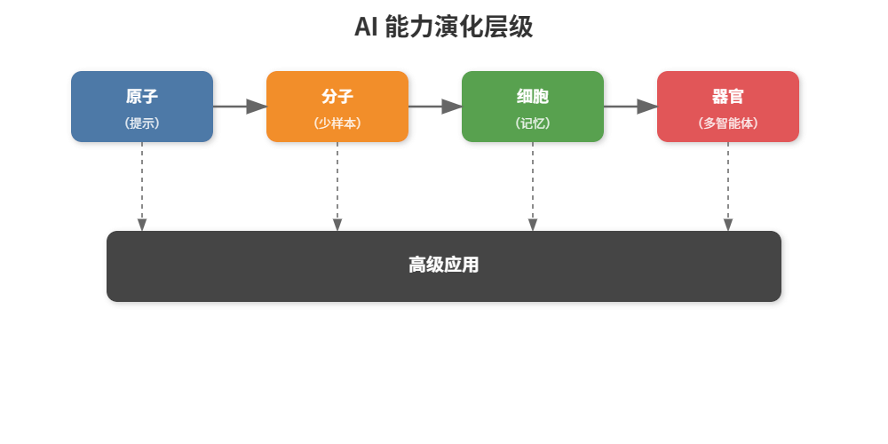
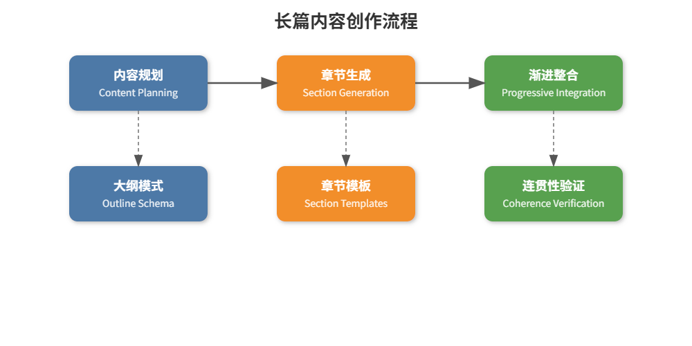
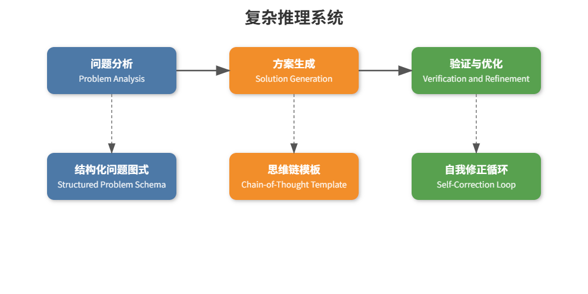
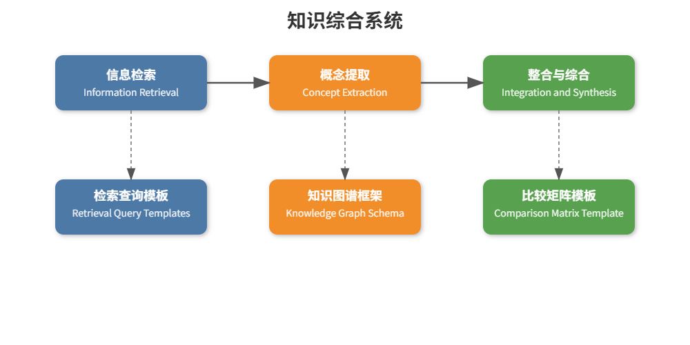
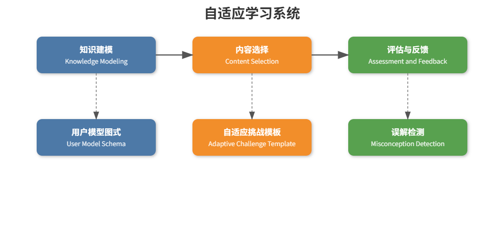

> "理论上，理论与实践是一致的。但在实践中，它们并不相同。" — 阿尔伯特·爱因斯坦（Albert Einstein）

## 跨越基础：应用上下文工程

我们已经建立了上下文工程概念的基础，从原子提示到认知工具。现在，是时候看看这些原则如何应用于现实世界的挑战，这些挑战推动着 LLMs 可能性的边界。




## 应用领域：长文本内容创作

创建长篇、连贯的内容会挑战上下文管理的极限。让我们看看如何应用之前的原则：




### 具体实现：文档生成系统

```python
class LongFormGenerator:
“”“用于生成连贯长篇内容的系统。”“”
def __init__(self, llm_service):
    self.llm = llm_service
    self.document_state = {
        "title": "",
        "outline": [],
        "sections": {},
        "current_section": "",
        "theme_keywords": [],
        "style_guide": {},
        "completed_sections": []
    }

def create_outline(self, topic, length="medium", style="informative"):
    """生成文档的结构化大纲。"""
    # 大纲生成的提示示例程序
    outline_prompt = f"""
    任务：为一个关于{topic}的{length}长度、{style}风格的文档创建详细大纲。
    
    流程：
    1. 确定3-5个主要章节，全面涵盖主题
    2. 对每个主要章节，确定2-4个子章节
    3. 添加每章节的简要描述（1-2句话）
    4. 包含章节间的过渡建议
    
    格式：
    标题: [建议标题]
    
    主要章节：
    1. [章节标题]
       - 描述: [简要描述]
       - 子章节:
         a. [子章节标题]
         b. [子章节标题]
       - 过渡: [向下一个章节过渡的建议]
    
    2. [依此类推...]
    
    主题关键词: [5-7个保持一致性的关键术语]
    语调指南: [3-4条风格建议]
    """
    
    outline_response = self.llm.generate(outline_prompt)
    self._parse_outline(outline_response)
    return self.document_state["outline"]

def _parse_outline(self, outline_text):
    """将大纲响应解析为结构化格式。"""
    # 在实际实现中，会提取结构化大纲
    # 为简单起见，这里用占位实现
    self.document_state["title"] = "示例文档标题"
    self.document_state["outline"] = [
        {"title": "引言", "subsections": ["背景", "重要性"]},
        {"title": "主要章节1", "subsections": ["子话题A", "子话题B"]},
        {"title": "主要章节2", "subsections": ["子话题C", "子话题D"]},
        {"title": "结论", "subsections": ["总结", "未来方向"]}
    ]
    self.document_state["theme_keywords"] = ["关键词1", "关键词2", "关键词3"]
    self.document_state["style_guide"] = {
        "tone": "信息性",
        "perspective": "第三人称",
        "style_notes": "使用具体实例"
    }

def generate_section(self, section_index):
    """生成特定章节的内容。"""
    section = self.document_state["outline"][section_index]
    self.document_state["current_section"] = section["title"]
    
    # 创建上下文感知的章节提示
    context = self._build_section_context(section_index)
    
    section_prompt = f"""
    任务：撰写标题为"{self.document_state["title"]}"的文档中"{section["title"]}"章节。
    
    上下文：
    {context}
    
    指南：
    - 保持文档主题和之前章节的一致性
    - 覆盖所有子章节：{", ".join(section["subsections"])}
    - 保持语调为{self.document_state["style_guide"]["tone"]}
    - 用{self.document_state["style_guide"]["perspective"]}视角写作
    - {self.document_state["style_guide"]["style_notes"]}
    
    格式：
    ## {section["title"]}
    
    [内容涵盖所有子章节，约300-500字]
    """
    
    section_content = self.llm.generate(section_prompt)
    self.document_state["sections"][section["title"]] = section_content
    self.document_state["completed_sections"].append(section["title"])
    
    return section_content

def _build_section_context(self, section_index):
    """构建生成章节所需的相关上下文。"""
    context = "之前章节：\n"
    
    # 包含已写章节的摘要以提供上下文
    for title in self.document_state["completed_sections"]:
        # 实际中会包含摘要而非全文以节省资源
        content = self.document_state["sections"].get(title, "")
        summary = content[:100] + "..." if len(content) > 100 else content
        context += f"- {title}: {summary}\n"
    
    # 包含主题关键词以保持一致性
    context += "\n主题关键词: " + ", ".join(self.document_state["theme_keywords"])
    
    # 章节定位信息（开头、中间、结尾）
    total_sections = len(self.document_state["outline"])
    if section_index == 0:
        context += "\n这是文档的开篇章节。"
    elif section_index == total_sections - 1:
        context += "\n这是文档的结尾章节。"
    else:
        context += f"\n这是文档第 {section_index + 1} 章，共 {total_sections} 章。"
    
    return context

def verify_coherence(self, section_index):
    """验证并提升与之前章节的连贯性。"""
    if section_index == 0:
        return "第一章节 - 无需连贯性检查。"
    
    section = self.document_state["outline"][section_index]
    previous_section = self.document_state["outline"][section_index - 1]
    
    current_content = self.document_state["sections"][section["title"]]
    previous_content = self.document_state["sections"][previous_section["title"]]
    
    # 使用专门的提示程序进行连贯性验证
    coherence_prompt = f"""
    任务：核查并提升两个连续章节之间的连贯性。
    
    上一章节：{previous_section["title"]}
    {previous_content[-200:]}  # 上一章节结尾部分
    
    当前章节：{section["title"]}
    {current_content[:200]}  # 当前章节开头部分
    
    流程：
    1. 发现任何主题或逻辑断层
    2. 检查重复或矛盾
    3. 确认过渡流畅
    4. 确保术语和风格一致
    
    格式：
    连贯性评估: [良好/需改进]
    
    发现的问题：
    1. [如有问题1]
    2. [如有问题2]
    
    改进建议：
    [具体改进连接的方法]
    """
    
    assessment = self.llm.generate(coherence_prompt)
    
    # 实际实现中会解析评估结果并应用改进
    return assessment

def generate_complete_document(self):
    """逐章生成完整文档。"""
    # 确保已生成大纲
    if not self.document_state["outline"]:
        raise ValueError("必须先创建大纲")
    
    # 依次生成每个章节
    all_content = [f"# {self.document_state['title']}\n\n"]
    
    for i in range(len(self.document_state["outline"])):
        section_content = self.generate_section(i)
        
        # 第一章节之后检查连贯性
        if i > 0:
            coherence_check = self.verify_coherence(i)
            # 实际操作中会根据结果改进章节内容
        
        all_content.append(section_content)
    
    # 合并所有章节内容
    return "\n\n".join(all_content)
```


此实现演示了：

1. 使用程序化提示词进行内容的结构化规划

2. 随着章节的生成逐步构建上下文

3. 相邻章节之间的连贯性验证

4. 在整个文档创建过程中的状态管理

## 应用领域：带有记忆的复杂推理

复杂推理通常需要在多个步骤中跟踪状态，同时保留关键的洞察：




### 实现：数学问题求解器

```python
class MathProblemSolver:
“”“用于逐步解决复杂数学问题的系统。”“”
def __init__(self, llm_service):
    self.llm = llm_service
    self.problem_state = {
        "original_problem": "",
        "parsed_problem": {},
        "solution_steps": [],
        "current_step": 0,
        "verification_results": [],
        "final_answer": ""
    }

def parse_problem(self, problem_text):
    """解析并结构化数学问题。"""
    # 基于模式(schema)的问题解析
    parse_prompt = f"""
    任务：分析并结构化以下数学问题。
    
    问题：{problem_text}
    
    流程：
    1. 确定问题类型（代数、微积分、几何等）
    2. 提取相关变量及其关系
    3. 识别约束条件
    4. 确定需要求解的内容
    
    格式：
    问题类型: [类型]
    
    变量：
    - [变量1]: [描述]
    - [变量2]: [描述]
    
    关系：
    - [方程或关系1]
    - [方程或关系2]
    
    约束：
    - [约束1]
    - [约束2]
    
    目标: [需要求解的内容]
    
    推荐方法: [简要解题思路]
    """
    
    parse_result = self.llm.generate(parse_prompt)
    self.problem_state["original_problem"] = problem_text
    
    # 实际中会解析结构化输出
    # 这里简单用占位实现
    self.problem_state["parsed_problem"] = {
        "type": "代数",
        "variables": {"x": "未知数", "y": "依赖变量"},
        "relationships": ["y = 2x + 3"],
        "constraints": ["x > 0"],
        "goal": "当 y = 15 时求 x",
        "approach": "代入 y = 15 并求解 x"
    }
    
    return self.problem_state["parsed_problem"]

def generate_solution_step(self):
    """生成解题过程中的下一步。"""
    # 构建先前步骤的上下文
    context = self._build_step_context()
    
    step_prompt = f"""
    任务：生成解决该数学问题的下一步。
    
    原始问题：{self.problem_state["original_problem"]}
    
    问题分析：
    类型：{self.problem_state["parsed_problem"]["type"]}
    目标：{self.problem_state["parsed_problem"]["goal"]}
    
    先前步骤：
    {context}
    
    流程：
    1. 考虑先前步骤已完成的内容
    2. 确定下一合理操作
    3. 执行该操作，展示完整计算过程
    4. 解释数学推理
    
    格式：
    第 {self.problem_state["current_step"] + 1} 步: [简要描述]
    
    操作： [执行的数学操作]
    
    计算过程：
    [逐步计算]
    
    解释：
    [为什么这一步必要及其作用]
    
    状态： [完成/需要更多步骤]
    """
    
    step_result = self.llm.generate(step_prompt)
    self.problem_state["solution_steps"].append(step_result)
    self.problem_state["current_step"] += 1
    
    # 检查该步骤是否包含最终答案
    if "状态： 完成" in step_result or "Status: Complete" in step_result:
        # 提取最终答案（实际应用中应更精准解析）
        self.problem_state["final_answer"] = "x = 6"
    
    return step_result

def _build_step_context(self):
    """根据已完成的步骤构建上下文。"""
    if not self.problem_state["solution_steps"]:
        return "无先前步骤，开始解题。"
    
    # 将所有先前步骤包含进上下文
    # 实际中可能需要摘要或截断以限制长度
    context = "先前步骤：\n"
    for i, step in enumerate(self.problem_state["solution_steps"]):
        snippet = step[:200] + ("..." if len(step) > 200 else "")
        context += f"步骤 {i+1}: {snippet}\n"
    
    return context

def verify_step(self, step_index):
    """验证特定解题步骤的正确性。"""
    if step_index >= len(self.problem_state["solution_steps"]):
        return "步骤索引超出范围"
    
    step = self.problem_state["solution_steps"][step_index]
    
    # 使用专门提示进行验证
    verify_prompt = f"""
    任务：验证此数学解题步骤的正确性。
    
    原始问题：{self.problem_state["original_problem"]}
    
    待验证步骤：
    {step}
    
    流程：
    1. 检查数学运算是否准确
    2. 验证逻辑是否符合先前步骤
    3. 确认解释是否与计算匹配
    4. 查找常见错误或误解
    
    格式：
    正确性： [正确/错误/部分正确]
    
    发现的问题：
    - [如有问题1]
    - [如有问题2]
    
    建议修改：
    [如何修正发现的问题]
    """
    
    verification = self.llm.generate(verify_prompt)
    self.problem_state["verification_results"].append(verification)
    
    return verification

def solve_complete_problem(self, problem_text, max_steps=10):
    """逐步解决完整问题并进行验证。"""
    # 解析问题
    self.parse_problem(problem_text)
    
    # 循环生成并验证步骤，直到求解完成或达到最大步骤数
    while self.problem_state["final_answer"] == "" and self.problem_state["current_step"] < max_steps:
        # 生成下一步
        step = self.generate_solution_step()
        
        # 验证该步骤
        verification = self.verify_step(self.problem_state["current_step"] - 1)
        
        # 若验证发现问题，理论上可重新生成步骤
        # 此处为简化实现
        if "正确性： 错误" in verification or "Correctness: Incorrect" in verification:
            print(f"第 {self.problem_state['current_step']} 步存在问题，本例中仍继续执行。")
    
    # 返回完整解答
    return {
        "problem": self.problem_state["original_problem"],
        "steps": self.problem_state["solution_steps"],
        "verifications": self.problem_state["verification_results"],
        "final_answer": self.problem_state["final_answer"]
    }
```


此实现演示了：

1. 基于模式的结构化问题解析

2. 逐步推理，明确中间状态

3. 自我验证，每个阶段检查工作

4. 内存管理，在整个解决方案过程中保持上下文

## 应用领域：知识合成

从多个来源综合信息需要复杂的上下文管理：




### 实现：研究助理

```python
class ResearchAssistant:
“”“用于从多个来源综合信息的系统。”“”
def __init__(self, llm_service, retrieval_service):
    self.llm = llm_service
    self.retrieval = retrieval_service
    self.research_state = {
        "topic": "",
        "query_results": [],
        "extracted_concepts": {},
        "concept_relationships": [],
        "synthesis": "",
        "knowledge_gaps": []
    }

def set_research_topic(self, topic):
    """设置研究主题并生成初始查询。"""
    self.research_state["topic"] = topic
    
    # 使用提示程序生成结构化查询
    query_prompt = f"""
    任务：为研究主题“{topic}”生成有效的搜索查询。
    
    流程：
    1. 分解主题为核心组成部分
    2. 针对每个组成部分生成具体搜索查询
    3. 包含针对主题不同视角的查询
    4. 补充背景/基础信息查询
    
    格式：
    核心组成部分：
    - [组成部分 1]
    - [组成部分 2]
    
    推荐查询：
    1. [具体查询 1]
    2. [具体查询 2]
    3. [具体查询 3]
    
    视角查询：
    1. [视角 1 查询]
    2. [视角 2 查询]
    
    背景查询：
    1. [背景查询 1]
    2. [背景查询 2]
    """
    
    query_suggestions = self.llm.generate(query_prompt)
    
    # 实际中会解析结构化输出
    # 此处示例用占位查询
    return ["query1", "query2", "query3"]

def retrieve_information(self, queries):
    """使用生成的查询检索信息。"""
    # 实际应用中会调用真实检索服务
    # 这里用示例结果模拟
    for query in queries:
        results = [
            {"title": f"{query} 的结果 1", "content": "示例内容 1", "source": "来源 A"},
            {"title": f"{query} 的结果 2", "content": "示例内容 2", "source": "来源 B"}
        ]
        self.research_state["query_results"].extend(results)
    
    return self.research_state["query_results"]

def extract_concepts(self):
    """从检索信息中提取关键概念。"""
    # 构建检索结果上下文
    context = self._build_retrieval_context()
    
    # 使用基于模式的提示提取概念
    concept_prompt = f"""
    任务：从以下研究信息中提取关键概念。
    
    研究主题：{self.research_state["topic"]}
    
    信息来源：
    {context}
    
    流程：
    1. 识别多个来源中提及的关键概念
    2. 为每个概念提取相关细节及定义
    3. 记录概念描述中的差异或分歧
    4. 为每个概念赋予相关性评分（1-10）
    
    格式：
    概念: [概念名 1]
    定义: [整合后的定义]
    关键属性：
    - [属性 1]
    - [属性 2]
    来源差异：
    - [来源 A]: [该来源描述]
    - [来源 B]: [该来源描述]
    相关性评分: [1-10]
    
    概念: [概念名 2]
    ...
    """
    
    extraction_results = self.llm.generate(concept_prompt)
    
    # 实际中会解析结构化结果
    # 此示例使用占位概念
    self.research_state["extracted_concepts"] = {
        "concept1": {
            "definition": "concept1 的定义",
            "properties": ["属性1", "属性2"],
            "source_variations": {
                "来源 A": "来源 A 的描述",
                "来源 B": "来源 B 的描述"
            },
            "relevance": 8
        },
        "concept2": {
            "definition": "concept2 的定义",
            "properties": ["属性1", "属性2"],
            "source_variations": {
                "来源 A": "来源 A 的描述",
                "来源 B": "来源 B 的描述"
            },
            "relevance": 7
        }
    }
    
    return self.research_state["extracted_concepts"]

def _build_retrieval_context(self):
    """从检索结果构建上下文。"""
    if not self.research_state["query_results"]:
        return "尚未检索到信息。"
    
    # 包含部分检索信息作为示例
    # 实际中可能需要摘要或选择以满足令牌限制
    context = ""
    for i, result in enumerate(self.research_state["query_results"][:5]):
        context += f"来源 {i+1}: {result['title']}\n"
        context += f"内容: {result['content'][:200]}...\n"
        context += f"来源: {result['source']}\n\n"
    
    return context

def analyze_relationships(self):
    """分析提取概念之间的关系。"""
    if not self.research_state["extracted_concepts"]:
        return "尚未提取到概念。"
    
    concepts = list(self.research_state["extracted_concepts"].keys())
    
    # 使用关系矩阵模板进行关系分析
    relationship_prompt = f"""
    任务：分析研究主题中的关键概念关系。
    
    研究主题：{self.research_state["topic"]}
    
    待分析概念：
    {", ".join(concepts)}
    
    流程：
    1. 建立所有概念间的关系矩阵
    2. 确定每对概念的关系类型
    3. 标注关系强度（1-5）
    4. 识别冲突或互补关系
    
    格式：
    关系矩阵：
    
    | 概念 | {" | ".join(concepts)} |
    |---------|{"-|" * len(concepts)}
    """
    
    for concept in concepts:
        relationship_prompt += f"| {concept} |"
        for other in concepts:
            if concept == other:
                relationship_prompt += " X |"
            else:
                relationship_prompt += " ? |"
        relationship_prompt += "\n"
    
    relationship_prompt += """
    
    详细关系说明：
    
    [概念 A] → [概念 B]
    类型: [因果/层级/相关等]
    强度: [1-5]
    描述: [简要说明关系]
    
    [继续其他相关对...]
    """
    
    relationship_results = self.llm.generate(relationship_prompt)
    
    # 实际中会解析结构化结果
    # 此示例用占位关系
    self.research_state["concept_relationships"] = [
        {
            "source": "concept1",
            "target": "concept2",
            "type": "因果",
            "strength": 4,
            "description": "concept1 直接影响 concept2"
        }
    ]
    
    return self.research_state["concept_relationships"]

def synthesize_research(self):
    """综合生成完整的研究总结。"""
    # 确保已有提取的概念与关系
    if not self.research_state["extracted_concepts"]:
        self.extract_concepts()
    
    if not self.research_state["concept_relationships"]:
        self.analyze_relationships()
    
    import json
    concepts_str = json.dumps(self.research_state["extracted_concepts"], indent=2, ensure_ascii=False)
    relationships_str = json.dumps(self.research_state["concept_relationships"], indent=2, ensure_ascii=False)
    
    synthesis_prompt = f"""
    任务：综合生成关于该主题的全面研究总结。
    
    研究主题：{self.research_state["topic"]}
    
    关键概念：
    {concepts_str}
    
    概念关系：
    {relationships_str}
    
    流程：
    1. 创建整合关键概念的连贯叙述
    2. 突出多来源达成的共识
    3. 说明重要分歧或矛盾
    4. 识别知识空白或待进一步研究领域
    5. 总结最重要的发现
    
    格式：
    # 研究综合报告: [主题]
    
    ## 主要发现
    [最重要见解的总结]
    
    ## 概念整合
    [连接概念与其关系的叙述]
    
    ## 共识领域
    [各来源达成一致的观点]
    
    ## 分歧领域
    [各来源存在分歧或矛盾的观点]
    
    ## 知识空白
    [需要更多研究的领域]
    
    ## 结论
    [当前知识状况的总体评估]
    """
    
    synthesis = self.llm.generate(synthesis_prompt)
    self.research_state["synthesis"] = synthesis
    
    # 解析知识空白（实际中应从综合文本里抽取）
    self.research_state["knowledge_gaps"] = [
        "空白1：需要对X进行更多研究",
        "空白2：Y和Z之间的关系尚不清楚"
    ]
    
    return synthesis

def complete_research_cycle(self, topic):
    """执行从确定主题到综合的完整研究流程。"""
    queries = self.set_research_topic(topic)
    self.retrieve_information(queries)
    self.extract_concepts()
    self.analyze_relationships()
    synthesis = self.synthesize_research()
    
    return {
        "topic": topic,
        "synthesis": synthesis,
        "concepts": self.research_state["extracted_concepts"],
        "relationships": self.research_state["concept_relationships"],
        "knowledge_gaps": self.research_state["knowledge_gaps"]
    }
```


此实现演示了：

1. 结构化查询生成以检索相关信息

2. 基于模式的概念提取以识别关键思想

3. 使用比较矩阵方法进行关系分析

4. 知识综合将概念整合为连贯的表述

## 应用领域：自适应学习系统

个性化学习需要跟踪用户知识状态并相应调整内容：




### 实现：个性化导师

```python
class PersonalizedTutor:
“”“基于用户知识水平自适应个性化内容的学习系统。”“”
def __init__(self, llm_service):
    self.llm = llm_service
    self.learning_state = {
        "subject": "",
        "user_profile": {
            "name": "",
            "skill_level": "",  # 初级、中级、高级
            "learning_style": "",  # 视觉型、听觉型、动觉型等
            "known_concepts": [],
            "struggling_concepts": [],
            "mastered_concepts": []
        },
        "domain_model": {
            "concepts": {},
            "concept_dependencies": []
        },
        "session_history": [],
        "current_concept": "",
        "next_concepts": []
    }

def initialize_user_profile(self, name, subject, initial_assessment=None):
    """初始化用户档案和知识状态。"""
    self.learning_state["subject"] = subject
    self.learning_state["user_profile"]["name"] = name
    
    if initial_assessment:
        # 解析评估结果
        self._parse_assessment(initial_assessment)
    else:
        # 生成初步评估
        self._generate_initial_assessment()
    
    # 初始化领域模型
    self._initialize_domain_model()
    
    return self.learning_state["user_profile"]

def _parse_assessment(self, assessment_results):
    """解析初步评估结果。"""
    # 实际中会解析真实评估数据
    # 此处使用示例占位数据
    self.learning_state["user_profile"]["skill_level"] = "intermediate"
    self.learning_state["user_profile"]["learning_style"] = "visual"
    self.learning_state["user_profile"]["known_concepts"] = ["concept1", "concept2"]
    self.learning_state["user_profile"]["struggling_concepts"] = ["concept3"]
    self.learning_state["user_profile"]["mastered_concepts"] = []

def _generate_initial_assessment(self):
    """生成用户知识的初步评估。"""
    # 实际应用会生成问题评估用户知识
    # 此处使用占位数据
    self.learning_state["user_profile"]["skill_level"] = "beginner"
    self.learning_state["user_profile"]["learning_style"] = "visual"
    self.learning_state["user_profile"]["known_concepts"] = []
    self.learning_state["user_profile"]["struggling_concepts"] = []
    self.learning_state["user_profile"]["mastered_concepts"] = []

def _initialize_domain_model(self):
    """初始化学科领域模型。"""
    domain_prompt = f"""
    任务：为学科 {self.learning_state["subject"]} 创建结构化知识模型。
    
    流程：
    1. 识别该学科的核心概念
    2. 为每个概念提供简要定义
    3. 指明每个概念的先决条件
    4. 识别常见误解
    5. 确定适宜难度等级
    
    格式：
    概念: [概念名 1]
    定义: [简要定义]
    先决条件: [先决概念列表，如有]
    常见误解: [常见误区]
    难度: [初级/中级/高级]
    
    概念: [概念名 2]
    ...
    
    依赖关系示意：
    [概念 A] → [概念 B] （表示 B 依赖于理解 A）
    [概念 B] → [概念 C, 概念 D]
    ...
    """
    
    domain_model = self.llm.generate(domain_prompt)
    
    # 实际中会解析结构化输出
    # 此示例使用占位数据
    self.learning_state["domain_model"]["concepts"] = {
        "concept1": {
            "definition": "concept1 的定义",
            "prerequisites": [],
            "misconceptions": ["常见误解 1"],
            "difficulty": "beginner"
        },
        "concept2": {
            "definition": "concept2 的定义",
            "prerequisites": ["concept1"],
            "misconceptions": ["常见误解 2"],
            "difficulty": "beginner"
        },
        "concept3": {
            "definition": "concept3 的定义",
            "prerequisites": ["concept1", "concept2"],
            "misconceptions": ["常见误解 3"],
            "difficulty": "intermediate"
        }
    }
    
    self.learning_state["domain_model"]["concept_dependencies"] = [
        {"source": "concept1", "target": "concept2"},
        {"source": "concept1", "target": "concept3"},
        {"source": "concept2", "target": "concept3"}
    ]
    
    return self.learning_state["domain_model"]

def select_next_concept(self):
    """根据用户状态选择下一个教学概念。"""
    user_profile = self.learning_state["user_profile"]
    domain_model = self.learning_state["domain_model"]
    
    selection_prompt = f"""
    任务：选择最适合下一步教学的概念。
    
    用户档案：
    姓名：{user_profile["name"]}
    技能水平：{user_profile["skill_level"]}
    学习风格：{user_profile["learning_style"]}
    已知概念：{", ".join(user_profile["known_concepts"])}
    困难概念：{", ".join(user_profile["struggling_concepts"])}
    已掌握概念：{", ".join(user_profile["mastered_concepts"])}
    
    领域模型：
    {json.dumps(domain_model["concepts"], indent=2, ensure_ascii=False)}
    
    概念依赖：
    {json.dumps(domain_model["concept_dependencies"], indent=2, ensure_ascii=False)}
    
    流程：
    1. 识别已满足先决条件的概念
    2. 考虑用户技能水平和困难概念
    3. 优先考虑建立在已掌握内容之上的概念
    4. 避免难度超出当前水平的概念
    
    格式：
    选定概念: [概念名称]
    
    理由：
    [说明为何此概念适合]
    
    备选概念：
    1. [备选 1]: [简要原因]
    2. [备选 2]: [简要原因]
    """
    
    selection_result = self.llm.generate(selection_prompt)
    
    # 实际中会从结果中解析概念
    # 此处使用占位值
    selected_concept = "concept2"
    self.learning_state["current_concept"] = selected_concept
    
    return selected_concept

def generate_learning_content(self):
    """为当前概念生成个性化学习内容。"""
    if not self.learning_state["current_concept"]:
        self.select_next_concept()
    
    current_concept = self.learning_state["current_concept"]
    concept_data = self.learning_state["domain_model"]["concepts"][current_concept]
    user_profile = self.learning_state["user_profile"]
    
    content_prompt = f"""
    任务：为概念 {current_concept} 创建个性化学习内容。
    
    用户档案：
    姓名：{user_profile["name"]}
    技能水平：{user_profile["skill_level"]}
    学习风格：{user_profile["learning_style"]}
    已知概念：{", ".join(user_profile["known_concepts"])}
    
    概念信息：
    定义：{concept_data["definition"]}
    常见误解：{", ".join(concept_data["misconceptions"])}
    
    流程：
    1. 根据用户技能水平调整讲解
    2. 使用基于已知概念的示例
    3. 明确指出常见误解并加以纠正
    4. 针对学习风格定制展示形式
    5. 包含练习题加深理解
    
    格式：
    # 学习模块：{current_concept}
    
    ## 引言
    [适合技能水平的简洁生动介绍]
    
    ## 核心讲解
    [根据学习风格调整的主要说明]
    
    ## 示例
    [基于已知概念的示例]
    
    ## 常见误解
    [直接说明并纠正误区]
    
    ## 练习题
    1. [题目 1]
    2. [题目 2]
    3. [题目 3]
    
    ## 小结
    [关键点简要回顾]
    """
    
    learning_content = self.llm.generate(content_prompt)
    
    # 记录到会话历史
    import time
    self.learning_state["session_history"].append({
        "concept": current_concept,
        "content": learning_content,
        "timestamp": time.time()
    })
    
    return learning_content

def process_user_response(self, concept, user_response):
    """处理并评估用户针对练习题的回答。"""
    concept_data = self.learning_state["domain_model"]["concepts"][concept]
    
    eval_prompt = f"""
    任务：根据用户回答评估其对概念的理解。
    
    概念：{concept}
    定义：{concept_data["definition"]}
    常见误解：{", ".join(concept_data["misconceptions"])}
    
    用户回答：
    {user_response}
    
    流程：
    1. 评估回答的准确性
    2. 识别潜在误区
    3. 判定理解水平
    4. 生成建设性反馈
    5. 如需，提出后续问题
    
    格式：
    理解水平： [完全/部分/较低]
    
    优点：
    - [用户正确理解的内容]
    
    缺失：
    - [用户遗漏或误解的内容]
    
    发现的误解：
    - [具体误区]
    
    反馈：
    [建设性且鼓励性的评价]
    
    后续问题：
    1. [针对缺失的提问]
    2. [确认理解的提问]
    """
    
    evaluation = self.llm.generate(eval_prompt)
    
    # 根据评估更新用户档案
    # 简化示例，实际建议精细解析
    if "理解水平： 完全" in evaluation:
        if concept in self.learning_state["user_profile"]["struggling_concepts"]:
            self.learning_state["user_profile"]["struggling_concepts"].remove(concept)
        if concept not in self.learning_state["user_profile"]["mastered_concepts"]:
            self.learning_state["user_profile"]["mastered_concepts"].append(concept)
    elif "理解水平： 较低" in evaluation:
        if concept not in self.learning_state["user_profile"]["struggling_concepts"]:
            self.learning_state["user_profile"]["struggling_concepts"].append(concept)
    
    if concept not in self.learning_state["user_profile"]["known_concepts"]:
        self.learning_state["user_profile"]["known_concepts"].append(concept)
    
    return evaluation

def run_learning_session(self, num_concepts=3):
    """执行覆盖多个概念的完整学习会话。"""
    session_results = []
    
    for i in range(num_concepts):
        concept = self.select_next_concept()
        content = self.generate_learning_content()
        
        # 实际应用中应收集用户回答并处理
        # 此处模拟用户回答
        simulated_response = f"用户对 {concept} 的模拟回答"
        evaluation = self.process_user_response(concept, simulated_response)
        
        session_results.append({
            "concept": concept,
            "content": content,
            "evaluation": evaluation
        })
    
    return {
        "user_profile": self.learning_state["user_profile"],
        "concepts_covered": [r["concept"] for r in session_results],
        "session_results": session_results
    }
```


此实现演示了：

1. 基于模式的用户知识建模

2. 基于先决条件和用户状态的适应性内容选择

3. 根据学习风格和知识进行个性化内容生成

4. 带有错误概念检测的响应评估

## 高级应用的关键模式

在这些多样化的应用中，我们可以识别出提升上下文工程有效性的常见模式：

```plain&#x20;text
● 状态管理：在多轮交互中跟踪复杂状态
● 逐步上下文构建：逐步累积和构建上下文信息
● 验证循环：自我检查以确保质量和准确性
● 结构化模式：系统化组织信息
● 模板程序：可复用的针对特定任务的提示模式
● 个性化：根据用户需求和上下文进行适配
● 多步处理：将复杂任务拆分为多个阶段
```

## 评估应用性能

与简单的上下文结构类似，对高级应用效能评估至关重要：

| 高级应用的测量维度指标 |                |
| ----------- | -------------- |
| 端到端质量       | 准确性、正确性、一致性    |
| 效率          | 总令牌数、完成所需时间    |
| 稳健性         | 错误恢复率、极端情况处理能力 |
| 用户满意度       | 相关性、个性化准确性     |
| 自我改进        | 随时间的错误减少       |

## 本节关键要点

1. 基于上下文工程的基本原理，高级应用得以构建

2. 对于复杂应用，状态管理变得越来越重要

3. 基于模式的方法为处理复杂信息提供了结构

4. 多步处理将复杂任务分解为可管理的部分

5. 自验证提高了可靠性和准确性

6. 测量仍然是优化应用性能的关键

## 练习题

1. 扩展其中一个示例实现，添加更多功能

2. 在你的领域实现一个简化的应用程序版本

3. 为你要处理的具体信息类型设计一个模式

4. 为你的应用程序创建一个测量框架

***

## 深入探讨：工程化权衡

高级应用需要平衡多个相互竞争的因素：

```plain&#x20;text
● 复杂性与可维护性
更复杂的系统更难调试和维护
● 令牌使用量与质量
更多的上下文通常提升质量，但也增加成本
● 专用组件与通用组件
专用组件效果更佳，但复用性较差
● 刚性结构与灵活性
结构化模式提升一致性，但降低适应性
```

为您的特定应用找到合适的平衡点是高级上下文工程的关键部分。
