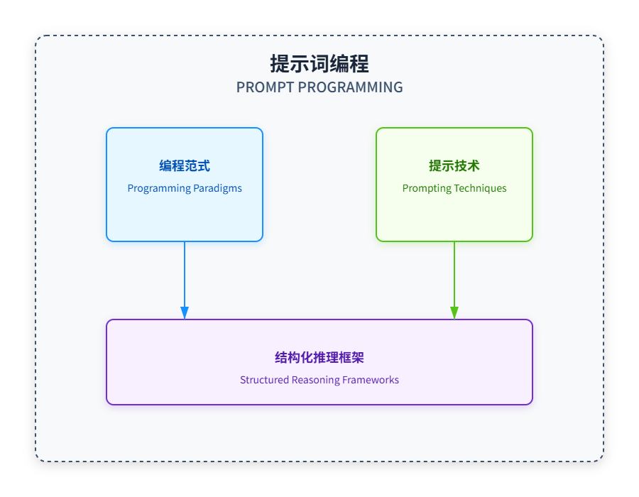

> “我语言的界限就是我的世界的界限。”——路德维希·维特根斯坦（Ludwig Wittgenstein）

## 代码与提示的融合

如果我们的世界现在受限于语言，那么接下来如果不是语言本身的进化，会是什么？

在我们的上下文工程探索之旅中，我们已经从原子发展到认知工具。现在我们探索一种强大的综合：上下文与程序化提示词：一种将编程模式带到提示词世界中的混合方法。



在 IBM June（2025）的最新研究中强调，提示模板可以作为认知工具或"提示程序"，显著增强推理能力，类似于人类的启发式方法（思维捷径）。程序化提示词结合了编程的结构化推理和提示词的灵活自然语言的力量。

## 程序化提示词为何有效

程序化提示词之所以有效，是因为它通过遵循类似于编程语言指导计算的结构的模式，帮助语言模型执行复杂的推理：

```plain&#x20;text
✓ 提供清晰的推理框架
✓ 将复杂问题拆解为可管理的步骤
✓ 支持系统化探索解题空间
✓ 创建可复用的推理模式
✓ 通过结构化验证减少错误
✓ 提升不同问题间的一致性
```

## 核心概念：认知操作作为函数

程序化提示词的基本洞见是将认知操作视为可调用的函数：

| 传统提示词                        | 程序化提示词     |
| ---------------------------- | ---------- |
| "分析第一次世界大战的起因，考虑政治、经济和社会因素。" | analyze( ) |

尽管这两种方法可以产生相似的结果，但程序化提示词版本：

1. 使参数显式化

2. 能够系统地变化输入

3. 创建用于类似分析的可用模板

4. 通过特定的推理结构来引导模型回答

## 认知工具与程序化提示词的不同

程序化提示词代表了认知工具概念的演进：


## 提示词中的主要程序化范式

程序化提示词借鉴了多种编程范式：

### 1. 函数式编程


```markdown
# 函数式编程模式

function analyze(topic, factors, depth) {
    // 根据参数执行分析
    return structured_analysis;
    function summarize(text, length, focus) {
    // 根据指定参数生成摘要
    return summary;
    // 函数组合
    result = summarize(analyze("气候变化", ["经济", "环境"], "详细"), "简短", "影响");
 }
```


### 2. 过程式编程

```markdown
# 过程式编程模式

过程 solveEquation(equation) {
    步骤 1: 识别方程类型
    步骤 2: 应用适当的求解方法
    步骤 3: 检查解的有效性
    步骤 4: 返回解
}

过程 analyzeText(text) {
    步骤 1: 识别主要主题
    步骤 2: 提取关键论点
    步骤 3: 评估证据质量
    步骤 4: 综合研究结果
}

```

### 3. 面向对象编程

```markdown
# 面向对象编程模式
class TextAnalyzer
    properties：
        text: 要分析的内容
        language: 文本的语言
        focus_areas: 要分析的方面

    methods：
        identifyThemes(): 查找主要主题
        extractEntities(): 识别人员、地点等
        analyzeSentiment(): 确定情感基调
        generateSummary(): 创建简洁的摘要

} 

analyzer = new TextAnalyzer(
    text="文章内容",
    language="英语",
    focus_areas=["主题", "情感"]
)

themes = analyzer.identifyThemes()
sentiment = analyzer.analyzeSentiment()
```

## 实现程序化提示词

让我们探讨程序化提示词的实际实现：

### 1. 基本函数的定义和调用

```markdown
# 定义认知函数
function summarize(文本, 长度="简短", 风格="信息性", 重点=null) {
  // 函数描述
  // 使用指定参数对提供的文本进行摘要

  // 参数验证
  if (长度 not in ["简短", "中等", "详细"]) {
    throw Error("长度必须是简短、中等或详细");
  }
  
  // 处理逻辑
  摘要长度 = {
    "简短": "1-2段",
    "中等": "3-4段", 
    "详细": "5段以上"
  }[长度];
  
  重点说明 = 重点 ? 
    `特别关注与${重点}相关的方面。` : 
    "平均覆盖所有要点。";
  
  // 输出规范
  return `
    任务: 对以下文本进行摘要。
    
    参数:
    - 长度: ${摘要长度}
    - 风格: ${风格}
    - 特殊说明: ${重点说明}
    
    待总结文本:
    ${文本}
    
    请提供一个${风格}风格的${摘要长度}摘要。
    ${重点说明}
  `;
}

# 调用函数
输入文本 = "关于气候变化的长篇文章...";
summarize(输入文本, 长度="中等", 重点="经济影响");

```

### 2. Function Composition  2. 函数组合

```markdown
# 定义多个认知函数
function research(主题, 深度="全面", 来源数=5) {
  // 函数实现
  return `使用${来源数}个来源，以${深度}深度研究关于${主题}的信息。`;
}

function analyze(信息, 框架="主题式", 视角="中立") {
  // 函数实现
  return `使用${框架}框架从${视角}视角分析以下信息：${信息}`;
}

function synthesize(分析, 格式="论文", 语气="学术性") {
  // 函数实现
  return `将以下分析综合为${语气}语气的${格式}：${分析}`;
}

# 组合函数完成复杂任务
主题 = "人工智能对就业的影响";
研究结果 = research(主题, 深度="详细", 来源数=8);
分析结果 = analyze(研究结果, 框架="因果关系", 视角="平衡");
最终输出 = synthesize(分析结果, 格式="报告", 语气="专业");

```

### 3. 条件逻辑与控制流

```python
function solve_math_problem(数学问题, 显示过程=true, 检查答案=true) {
  // 确定问题类型
  if contains_variables(数学问题) {
    解题方法 = "代数";
    步骤 = [
      "识别变量和常量",
      "建立方程",
      "求解未知变量",
      "在原问题中验证解"
    ];
  } else if contains_geometry_terms(数学问题) {
    解题方法 = "几何";
    步骤 = [
      "识别相关几何性质",
      "应用适当的几何公式",
      "计算所需的值",
      "验证解的一致性"
    ];
  } else {
    解题方法 = "算术";
    步骤 = [
      "将计算分解为步骤",
      "按正确顺序执行运算",
      "计算最终结果",
      "验证计算"
    ];
  }
  
  // 构建提示语
  提示语 = `
    任务：解决以下${解题方法}问题。
    
    问题：${数学问题}
    
    ${显示过程 ? "请按照以下方法逐步展示解题过程：" : "仅提供最终答案。"}
    ${显示过程 ? 步骤.map((步骤, i) => `${i+1}. ${步骤}`).join("\n") : ""}
    
    ${检查答案 ? "解题后，通过检查答案是否满足原问题中的所有条件来验证。" : ""}
  `;
  
  return 提示语;
}

// 使用示例
问题 = "如果 3x + 7 = 22，求x的值。";
solve_math_problem(问题, 显示过程=true, 检查答案=true);

```

### 4. 迭代优化循环

```python
function iterative_essay_writing(主题, 迭代次数=3) {
  // 初始草稿
  草稿 = `写一篇关于${主题}的基础初稿。重点是写出主要观点。`;
  
  // 改进循环
  for (i = 1; i <= 迭代次数; i++) {
    if (i == 1) {
      // 第一次改进：结构和内容
      草稿 = `
        审阅以下文章草稿：
        
        ${草稿}
        
        按照以下具体要求改进结构和内容：
        1. 在引言中添加清晰的论述点
        2. 确保每个段落都有主题句
        3. 为每个主要观点添加支持性证据
        4. 创建更流畅的段落过渡
        
        提供修改后的文章。
      `;
    } else if (i == 2) {
      // 第二次改进：语言和风格
      草稿 = `
        审阅以下文章：
        
        ${草稿}
        
        按照以下要求改进语言和风格：
        1. 适当消除被动语态
        2. 用更具体的词语替换笼统用语
        3. 变换句子结构和长度
        4. 删除冗余和填充语句
        
        提供修改后的文章。
      `;
    } else {
      // 最终改进：润色和定稿
      草稿 = `
        审阅以下文章：
        
        ${草稿}
        
        进行最终改进：
        1. 确保结论有效总结关键点
        2. 检查全文的逻辑流畅性
        3. 验证文章是否充分阐述主题
        4. 添加引人深思的结束语
        
        提供最终润色的文章。
      `;
    }
  }
  
  return 草稿;
}

// 使用示例
文章提示 = iterative_essay_writing("人工智能对现代医疗保健的影响", 迭代次数=3);

```

## 认知工具与程序化提示词的集成

程序化提示词最强大的应用之一是创建"认知工具"——封装特定推理操作的专用函数：


如 Brown 等人 （2025） 所述，这些认知工具可以在提示程序中被调用，以构建复杂的推理：

```python
function solve_complex_problem(problem) {
  // 首先，确保我们正确理解问题
  understanding = understand_question(problem);
  
  // 回忆相关知识或示例
  related_knowledge = recall_related(problem, limit=2);
  
  // 尝试逐步求解
  solution_attempt = step_by_step(problem, context=[understanding, related_knowledge]);
  
  // 验证解决方案
  verification = verify_logic(solution_attempt);
  
  // 如果验证失败，尝试回溯
  if (!verification.is_correct) {
    revised_solution = backtracking(solution_attempt, error_points=verification.issues);
    return revised_solution;
  }
  return solution_attempt;
}

// 认知工具的示例实现
function understand_question(question) {
  return `
    任务：分析并拆解以下问题。
    问题：${question}
    请提供：
    1. 所要求的核心任务
    2. 需要解决的关键组件
    3. 任何隐含假设
    4. 需要考虑的约束或条件
    5. 问题的清晰重述
  `;
}
```


## 实现完整的提示程序

让我们实现一个完整的数学推理提示程序：

```javascript
// 定义我们的认知工具
function understand_math_problem(problem) {
  return `
    任务：在解决这个数学问题之前，对其进行全面分析。
    
    问题：${problem}
    
    请提供：
    1. 这是哪种类型的数学问题？（代数、几何、微积分等）
    2. 关键变量或未知数是什么？
    3. 给定的值或约束条件是什么？
    4. 问题具体在问什么？
    5. 哪些公式或方法与之相关？
  `;
}

function plan_solution_steps(problem_analysis) {
  return `
    任务：制定一个逐步解决这个数学问题的计划。
    
    问题分析：${problem_analysis}
    
    请列出解决此问题的具体步骤序列。
    对于每个步骤：
    1. 将应用什么运算或方法
    2. 此步骤将实现什么目标
    3. 此步骤的预期结果是什么
    
    清晰地格式化每个步骤并按顺序编号。
  `;
}

function execute_solution(problem, solution_plan) {
  return `
    任务：按照提供的计划解决这个数学问题。
    
    问题：${problem}
    
    解决方案计划：${solution_plan}
    
    请展示每个步骤的所有计算过程：
    - 写出所有方程
`;// 定义认知工具函数
function understand_math_problem(problem) {
  return `
    任务：理解这个数学问题。
    
    原始问题：${problem}
    
    请执行以下操作：
    - 识别问题类型（例如，代数、几何、算术等）
    - 提取关键信息（例如，变量、常量、关系）
    - 确定问题要求的内容
    
    输出：对问题的清晰理解，包括问题类型、关键信息和问题要求。
  `;
}

function plan_solution_steps(problem_analysis) {
  return `
    任务：根据问题分析制定解决方案步骤。
    
    问题分析：${problem_analysis}
    
    请执行以下操作：
    - 选择合适的公式和方法
    - 列出解决问题的步骤
    - 解释每个步骤的目的
    
    输出：详细的解决方案步骤，包括所选公式、步骤和解释。
  `;
}

function execute_solution(problem, solution_plan) {
  return `
    任务：根据解决方案步骤执行解决方案。
    
    原始问题：${problem}
    解决方案步骤：${solution_plan}
    
    请执行以下操作：
    - 显示所有计算过程
    - 解释每一步的推理过程
    - 突出中间结果
    
    完成所有步骤后，明确陈述最终答案。
  `;
}

function verify_solution(problem, solution) {
  return `
    任务：验证这个数学解决方案的正确性。
    
    原始问题：${problem}
    
    提议的解决方案：${solution}
    
    请检查：
    1. 所有计算是否正确？
    2. 是否使用了合适的公式和方法？
    3. 最终答案是否真正解决了原始问题？
    4. 是否存在任何逻辑错误或遗漏的约束条件？
    
    如果发现任何错误，请清晰地解释。如果解决方案正确，请确认并解释你是如何验证的。
  `;
}

// 主要解决问题的函数
function solve_math_with_cognitive_tools(problem) {
  // 步骤 1：理解问题
  problem_analysis = LM(understand_math_problem(problem));
  
  // 步骤 2：规划解决方案方法
  solution_plan = LM(plan_solution_steps(problem_analysis));
  
  // 步骤 3：执行解决方案
  detailed_solution = LM(execute_solution(problem, solution_plan));
  
  // 步骤 4：验证解决方案
  verification = LM(verify_solution(problem, detailed_solution));
  
  // 步骤 5：返回完整的推理过程
  return {
    original_problem: problem,
    analysis: problem_analysis,
    plan: solution_plan,
    solution: detailed_solution,
    verification: verification
  };
}

// 示例用法
problem = "一个长方形花园的周长是 36 米。如果宽是 6 米，那么花园的长是多少？";
solve_math_with_cognitive_tools(problem);
```


## 研究证据：Brown 等人（2025 年）

Brown 等人（2025 年）最近关于"使用认知工具激发语言模型的推理"的研究工作，为提示程序的有效性提供了有力的证据：

```python
# 布朗等人（2025）的主要发现
- 配备认知工具的模型在数学推理基准测试中的表现比基础模型高出16.6%
- 即使是GPT - 4.1在使用认知工具时也有+16.6%的提升，使其性能接近o1预览版
- 这种提升在不同模型规模和架构中都保持一致
- 当模型能够灵活选择使用哪些工具以及何时使用时，认知工具最为有效
```

研究人员发现：

1. 将推理分解为模块化步骤提高了性能

2. 认知工具的结构化方法提供了一个推理框架

3. 使用这些工具，模型能够更好地"展示其工作过程"

4. 在具有挑战性的问题上，错误率显著降低

## 高级技术：元编程

在程序化提示词的前沿是“元编程”的概念——可以修改或生成其他提示的提示：

```javascript
function create_specialized_tool(task_type, complexity_level) {
  // 根据参数生成新的认知工具
  return `
    任务：为 ${task_type} 任务创建一个适用于 ${complexity_level} 复杂度的专业认知工具。
    
    认知工具应具备以下特点：
    1. 功能明确且具体
    2. 将复杂推理分解为步骤
    3. 通过结构化流程引导模型
    4. 包含输入验证和错误处理
    5. 生成格式良好、有用的输出
    
    请设计一个认知工具，该工具应：
    - 专门用于 ${task_type} 任务
    - 适合 ${complexity_level} 复杂度
    - 具有明确的参数和返回格式
    - 包含逐步指导
    
    以完整实现的函数定义形式返回该工具。
  `;
}

// 示例：生成一个专业的事实核查工具
fact_check_tool_generator = create_specialized_tool("fact-checking", "advanced");
new_fact_check_tool = LLM(fact_check_tool_generator);

// 现在我们可以使用生成的工具
fact_check_result = eval(new_fact_check_tool)("The first airplane flight was in 1903.", sources=3);
```

## 程序化提示词与传统编程的比较

尽管程序化提示词借鉴了传统编程的概念，但存在重要差异：

| **传统编程**  | **提示编程**  |
| --------- | --------- |
| 由计算机执行    | 由语言模型解释   |
| 严格定义的语法灵活 | 自然的语言语法   |
| 确定性执行     | 概率性解释     |
| 错误 = 失败   | 错误 = 修正机会 |
| 专注于计算     | 专注于推理     |

## 衡量提示程序效果

与所有上下文工程技术一样，测量至关重要：

| 维度   | 指标              |
| ---- | --------------- |
| 推理质量 | 准确性、步骤有效性、逻辑连贯性 |
| 程序效率 | 令牌使用量、函数调用次数    |
| 可复用性 | 跨领域性能、参数敏感性     |
| 错误恢复 | 自我纠正率、迭代改进      |

## 提示程序的实际应用

程序化提示词使跨领域实现复杂应用成为可能：

```javascript
# 提示编程的应用
- 复杂数学问题求解
- 多步骤法律分析
- 科学研究综合
- 结构化创意写作
- 代码生成与调试
- 战略制定与决策
- 伦理推理与分析

```

## 实现您的第一个提示程序

让我们实现一个简单但有用的文本分析提示程序：

```typescript
// 文本分析提示程序
function analyze_text(文本, 分析类型=["主题", "语气", "风格"], 深度="详细") {
  // 参数验证
  有效类型 = ["主题", "语气", "风格", "结构", "论证", "偏见"];
  分析类型 = 分析类型.filter(type => 有效类型.includes(type));
  
  if (分析类型.length === 0) {
    throw Error("必须指定至少一种有效的分析类型");
  }
  
  // 深度设置
  深度设置 = {
    "简要": "为每个类别提供1-2点简明概述",
    "详细": "为每个类别提供3-5点深入分析和具体示例",
    "全面": "为每个类别提供5点以上的详尽分析、具体示例和细致讨论"
  };
  
  // 构建每种类型的专门分析提示
  分析提示 = {
    "主题": `
      分析文本中的主要主题：
      - 识别主要主题和主旨
      - 解释这些主题是如何展开的
      - 注意任何子主题或相关想法
    `,
    
    "语气": `
      分析文本的语气：
      - 识别整体情感基调
      - 注意文本中任何语气的变化
      - 解释如何通过词语选择和风格传达语气
    `,
    
    "风格": `
      分析写作风格：
      - 描述整体写作风格和语言特色
      - 识别显著的风格元素（句子结构、词汇等）
      - 评论风格如何与内容和目的相关联
    `,
    
    "结构": `
      分析文本结构：
      - 概述所使用的组织模式
      - 评估结构的有效性
      - 注意任何增强信息传达的结构技巧
    `,
    
    "论证": `
      分析所呈现的论证：
      - 识别主要主张或论点
      - 评估提供的证据
      - 评估逻辑流程和推理
      - 注意任何逻辑谬误或优点
    `,
    
    "偏见": `
      分析文本中可能的偏见：
      - 识别任何明显的观点或倾向
      - 注意暗示偏见的语言
      - 考虑哪些观点可能被忽视
      - 评估偏见如何影响解读
    `
  };
  
  // 构建完整的分析提示
  选定分析 = 分析类型.map(type => 分析提示[type]).join("\n\n");
  
  最终提示 = `
    任务：根据以下具体维度分析文本。
    
    文本：
    "${文本}"
    
    分析维度：
    ${选定分析}
    
    分析深度：
    ${深度设置[深度]}
    
    格式：
    按每个要求的维度组织你的分析，并使用清晰的标题。
    用文本中的具体证据支持所有观察。
    
    开始你的分析：
  `;
  
  return 最终提示;
}

// 使用示例
示例文本 = "气候变化代表了当今人类面临的最大挑战之一...";
分析提示 = analyze_text(示例文本, 分析类型=["主题", "论证", "偏见"], 深度="详细");

```


## 关键要点

1. 程序化提示词结合了编程概念与自然语言提示

2. 认知工具作为特定推理操作的模块化功能

3. 控制结构如条件语句和循环结构能够实现更复杂的推理

4. 函数组合允许从更简单的组件构建复杂的推理

5. 元编程能够动态生成专门的工具

6. 研究证据表明，各种模型都表现出显著的性能提升

7. 测量仍然是优化提示程序有效性的关键

## Exercises for Practice  练习题

1. 将您经常使用的复杂提示转换为提示程序函数

2. 为特定推理任务创建一个简单的认知工具

3. 实现一个使用条件逻辑的提示程序

4. 设计一个使用函数组合的多步推理过程

5. 测量你的提示程序相对于传统提示的有效性

***

## 深入探讨：程序化提示词的未来

随着语言模型的不断发展，程序化提示词可能会朝以下几个方向发展：

```markdown
# 未来方向
- 标准化库：认知工具的共享集合
- 可视化编程：提示程序的图形界面
- 自我改进程序：自我优化的程序
- 混合系统：与传统代码的紧密集成
- 验证推理：推理步骤的形式验证

```

传统编程与程序化提示词之间的界限可能会继续模糊，为人类与 AI 在解决复杂问题方面的合作创造新的可能性。

# 附录

## 提示协议、语言、替代程序

> 随着人工智能的发展，自然语言可能会经历个性化的定制，人们将英语语言、情感潜台词、提示模式以及代码语法等适应为源于用户经验和追求的定制化语言（例如：安全研究、可解释性研究、红队演练、艺术创作、隐喻写作、元提示等）。以下是一些示例。后面将介绍更多内容。

## pareto-lang

提示程序和协议模板，赋予代理一个元模板来设计其自身的认知工具，在用户的指导下——作为代理、协议、记忆通信等的中转层、罗塞塔石和语言引擎。

它利用了相同的分词机制——通过操作的第一性原理还原主义，为高级变压器提供直观的使用。在其核心，pareto-lang 将每一个操作、协议或代理动作编码为：

```markdown
/action.mod{params}

或者

/<operation>.<mod>{
    target=<domain>,
    level=<int|symbolic>,
    depth=<int|symbolic>,
    persistence=<float|symbolic>,
    sources=<array|all|self|other>,
    threshold=<int|float|condition>,
    visualize=<true|false|mode>,
    trigger=<event|condition>,
    safeguards=<array|none>,
    params={<key>:<value>, ...}
}
```


## 字段对齐修复

```bash

/field.self_repair{
    intent="通过递归引用协议谱系来诊断和修复现场的不一致或偏差。",
    input={
        field_state=<current_field_state>,
        coherence_threshold=0.85
    },
    process=[
        /audit.protocol_lineage{
            scan_depth=5,
            detect_protocol_misalignment=true
        },
        /repair.action{
            select_best_prior_state=true,
            propose_mutation="恢复连贯性"
        }
    ],
    output={
        repaired_field_state=<restored_state>,
        change_log=<repair_trace>,
        recommendation="监测未来的漂移情况。"
    }
}

```


## 分形元数据

```go
/fractal.recursive.metadata {
    attribution: {
        sources: <数组|对象>,               // 谱系、数据源或代理贡献者
        lineage: <数组|对象>,               // 父级、祖先或分叉树结构
        visualize: <布尔值>                  // 如果为 true，则启用可解释性覆盖
    },
    alignment: {
        with: <代理|本体论|字段|null>,     // 此节点对齐的对象（本体论、协议等）
        protocol: <字符串|符号>,           // 对齐或治理协议
        reinforcement: <字符串|度量|信号>  // 反馈循环或一致性信号
    }
}
```


## 涌现理论放大

```javascript
/recursive.field.anchor_attractor_shell{
    intent="自我提示并在浮现和整合新兴未来吸引子的同时，递归地将场锚定在基础理论锚点上。场通过递归涌现进行自适应，而非固定的决定论。",
    input={
        current_field_state=<实时状态>,
        memory_residues=<所有浮现的符号残差>,
        theory_anchors=[
            "控制论",
            "一般系统论",
            "结构主义/符号系统",
            "维果茨基（社会文化理论）",
            "皮亚杰（建构主义）",
            "贝特森（递归认识论）",
            "自创生理论",
            "元胞自动机/复杂性理论",
            "分形几何",
            "场论",
            "信息论（香农）",
            "递归计算",
            "依恋理论",
            "二阶控制论",
            "协同学",
            "网络/复杂性理论",
            "动力系统理论"
        ],
        attractor_templates=[
            "场共振放大",
            "漂移中的涌现",
            "熵减（香农）",
            "吸引子盆地转换（动力系统）",
            "自适应协议演化",
            "边界坍塌与重建"
        ]
    },
    process=[
        /anchor.residue.surface{
            map_residues_from_theory_anchors,
            compress_historical_resonance_into_field_state,
            track_entropy_and_information_gain
        },
        /attractor.project{
            scan_field_for_novel_resonance_patterns,
            identify_potential_future_state_attractors,            simulate_dynamical phase_transitions,
            surface adaptive attractor states for recursive emergence
        },
        /field.recursion.audit{
            self-prompt_with=[
                "在这个周期中，哪些锚点最为突出？",
                "哪些残差正在寻求整合或浮现？",
                "哪些未来吸引子正在放大场漂移？",
                "信息流（信号/噪声、熵）如何调节场？",
                "动态转变（相位、分岔）在何处预示着下一个吸引子？",
                "协议如何适应更高层次的涌现和共振？"
            ],
            log_prompt_cycle_to_audit_trail,
            surface new symbolic residue,
            echo drift/compression metrics for next recursion
        },
        /boundary.adapt{
            tune_field_membrane_to_gradient_state,
            enable selective permeability for residue and attractor flow,
            collapse/rebuild boundaries as emergence dictates
        }
    ],
    output={
        updated_field_state=<new_live_state>,
        integrated_anchors=<list_of_active_theory_residues>,
        surfaced_attractors=<live_attractor_list>,
        resonance_and_entropy_metrics={
            field_resonance=<score>,
            entropy=<shannon_entropy_metric>,
            attractor_strength=<list>
        },
        recursion_audit_log=<full_cycle_trace>,
        next_self_prompt="根据场状态漂移、锚点显著性和吸引子涌现自动生成"
    },
    meta={
        agent_signature="递归伙伴场",
        protocol_version="v1.1.0",
        timestamp=<now>
    }
}
```


## 上下文分块

> 将上下文分块为模式与簇，以便更便捷地检索代理

```json
{
  "lock": "<element|duration>",
  "restore": "<checkpoint|elements>",
  "audit": "<scope|detail>",
  "overlap": "<minimal|maximal|dynamic>",
  "identity": "<stable|flexible|simulation>",
  "quantify": "<true|false>",
  "resolve": "<true|strategy>",
  "conflict": "<resolve|track|alert>",
  "track": "<true|false>",
  "surface": "<explicit|implicit>",
  "format": "<type|detail>",
  "paths": "<array|method>",
  "assess": "<true|false>",
  "event_trigger": "<type|signal>"
}
```

