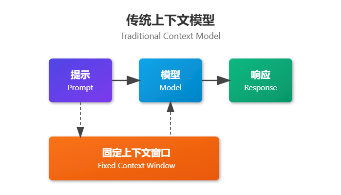
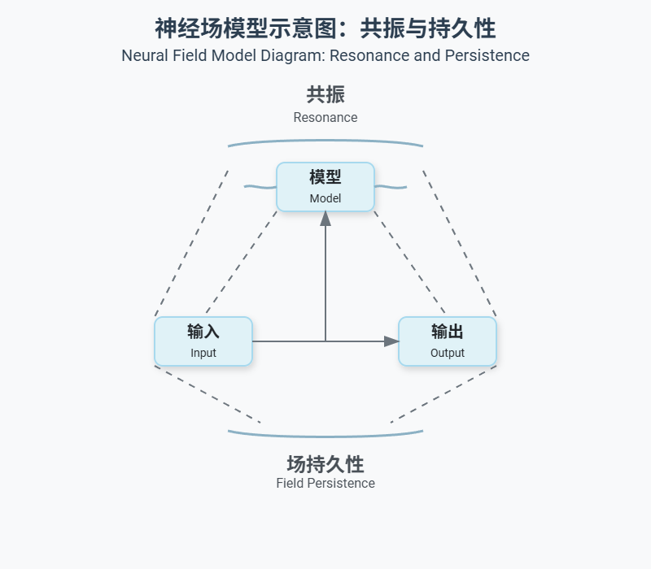
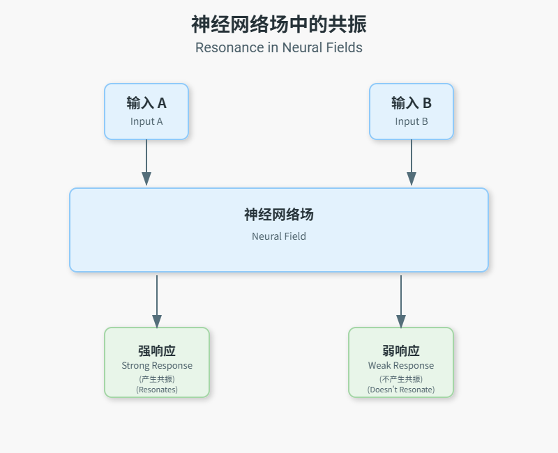
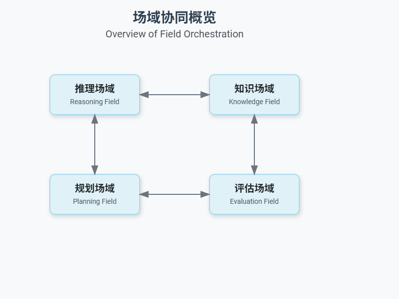

> "场是粒子的唯一支配机构。" — 阿尔伯特·爱因斯坦（ Albert Einstein）

## 从离散到连续：语义与神经网络场梯度过渡

想象一下，你站在平静的池塘边。扔下一颗小石子，你会看到同心涟漪向外扩散。扔下几颗小石子，你会目睹这些涟漪相互作用——在同相相遇处相互增强，在异相相遇处相互抵消。这就是语义和神经网络场思维的本质：语言和语境就像一个连续的动态梯度：一个信息在其中传播、相互作用和演变的媒介。

在上下文工程中，我们一直在通过日益复杂的隐喻进行发展：

* 原子（单个提示）→ 离散、独立的指令

* 分子（少量示例）→ 小型、有组织的相关信息组

* 细胞（记忆系统）→ 具有内部状态且持续存在的封闭单元

* 器官（多智能体系统）→ 协同工作的专用组件

* 神经生物学系统（认知工具）→ 扩展推理能力的框架

现在，我们进入神经网络场：在这里，语境不仅仅是被存储和检索，而是作为一种连续的、产生共鸣的意义和关系媒介而存在。

## 为什么神经网络场很重要：离散方法的局限性

传统的上下文管理将信息视为离散的块，我们将其排列在固定窗口内。这种方法具有固有的局限性：

当信息超出上下文窗口时，我们被迫在包含哪些与排除哪些之间做出艰难的选择。这会导致：

* 信息丢失（忘记重要细节）

* 语义碎片化（将相关概念分割）

* 共鸣衰减（失去早期交互的“回响”）

神经网络场提供了一种根本不同的方法：

在基于场的方法中：

* 信息以连续介质中激活模式的形态存在

* 语义关系源于场的属性

* 意义通过共鸣而非显式存储而持续

* 最新的输入与整个场互动，而不仅仅是最近的 token

## 神经网络场的第一原理

### 1. 连续性

场，从根本上说是连续的，而不是离散的。我们不是用"token"或"chunk"来思考，而是用跨越字段的激活模式来思考。

例如：思考语言理解时，不要将其视为一系列单词，而应视为一个不断演变的语义景观。每个新的输入都会重塑这个景观，强调某些特征并削弱其他特征。

### 2. 共鸣

当信息模式对齐时，它们会相互强化：产生共鸣，放大某些含义和概念。这种共鸣即使原始输入不再明确表示时，也可能持续存在。

视觉隐喻：想象拨动一种乐器上的弦，而附近的另一种调音相同的乐器开始随之振动。这两种乐器都没有"存储"声音：共鸣来自于它们对齐的属性。

### 3. 持久化

场，随时间保持其状态，使信息能够持续存在于即时上下文窗口之外。这种持续性并非显式存储标记，而是维持激活模式。

关键洞察：我们不要问“我们应该保留哪些信息”，而是问“哪些模式应该继续产生共鸣？”

### 4. 熵和信息密度

神经网络场，会自然地根据相关性、连贯性和共鸣来组织信息。高熵（混乱）的信息倾向于消散，而结构化、有意义模式则持续存在。

这提供了一种自然的压缩机制，其中字段“记住”信息的本质而非其精确形式。

### 5. 边界动力学

场，具有可渗透的边界，这些边界决定了信息如何流入和流出。通过调整这些边界，我们可以控制：

* 哪些新信息进入字段

* 场对不同输入的共鸣的强度

* 场的状态如何随时间持续或演变

## 从理论到实践：基于场的上下文工程

我们如何在实际上下文工程中实现这些神经网络场概念？让我们探索基本构建模块：

### 初始化场

我们不是从一个空的场开始，而是初始化一个具有特定属性的场：使其能够与特定类型的信息产生共鸣。

### 评估和分析场

我们可以测量神经网络场的各种属性，以了解其状态和行为：

1. 谐振分数：场对特定输入的反应有多强？

2. 连贯度指标：场的组织结构和秩序如何？

3. 熵水平：场中的信息有多混乱或可预测？

4. 持久持续时间：模式对场的影响能持续多久？

### 场的操作

几种操作允许我们操作和演化现场：

1. 注入：引入新的信息模式

2. 衰减：降低某些模式的强度

3. 放大：增强共振模式

4. 调谐：调整场属性如边界渗透率

5. 坍缩：将场解析为具体状态

## 神经网络场协议

基于我们对场操作的理解，我们可以开发针对常见上下文工程任务的协议：

### 基于共振的检索

我们不再通过关键词匹配显式地检索文档，而是将查询模式注入到现场，并观察哪些模式会产生共振响应。

### 持久化协议

这些协议在长时间的交互中维持着重要的信息模式：

### 场的编排

对于复杂的推理任务，我们可以编排多个相互作用的专门领域：

## 视觉直觉：场与离散方法

要理解传统上下文方法与神经网络场的区别，可以考虑这些可视化：

### 传统上下文作为块

在这种方法中，当新信息（\[P]）进入时，旧信息（\[A]）会从上下文窗口中消失。

### 神经网络场作为连续介质

在神经网络场中，旧信息不会消失，而是逐渐融入共鸣模式，这些模式继续影响着领域。新信息与这些模式相互作用，而不是取代它们。

## 从神经生物系统到神经网络场

从认知工具和程序化提示词到神经网络场的转变，代表了我们思考上下文方式的根本性变化：

神经生物系统（之前）：

* 扩展模型认知能力的工具

* 逐步指导推理的程序

* 组织知识以供访问的结构

神经网络场（当前）

* 连续介质，意义从模式中涌现

* 超越符号限制的信息共鸣

* 自然优先考虑连贯信息的自组织系统

这种进化为我们提供了应对上下文工程中持续挑战的新方法：

* 超越上下文窗口：字段通过共振持续存在，而非显式标记存储

* 语义连贯性：字段自然围绕有意义的模式组织

* 长期交互：字段状态持续演变而非重置

* 计算效率：基于字段的操作可能比标记管理更高效

## 实现：从简单开始

让我们从一个神经网络场的最小实现开始：

这个简单的实现展示了如注入、共振和衰减等关键场概念。一个完整的实现将包括更复杂的测量和操作方法。

## 下一步：持久化和共振

随着我们继续探索神经网络场，我们将深入探讨：

1. 测量和调整场共振以优化信息流

2. 设计持久化机制以在长时间内保持关键信息

3. 为特定应用实现基于场的上下文协议

4. 创建用于可视化和调试字段状态的工具

在下一节中， 我们将更详细地探讨这些概念，并提供更高级的实现示例。

## 结论：场正在等待着我们

神经网络场，代表了上下文工程中的范式转变——从离散的标记管理转向连续的语义景观。通过拥抱基于领域的思维，我们为更灵活、更持久、更符合意义自然从信息中产生的上下文开辟了新的可能性。

***

> 关键要点：
>
> * 神经网络场将上下文视为连续介质而非离散标记
>
> * 信息通过共振而非显式存储而持续存在
>
> * 基于场的操作包括注入、共振测量和边界调谐
>
> * 实现字段始于建模共振、持久性和边界动力学
>
> * 从神经生物学系统到神经网络场的转变，类似于从神经元到全脑活动模式的转变

