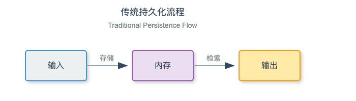
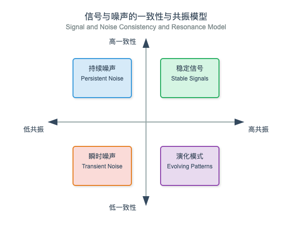
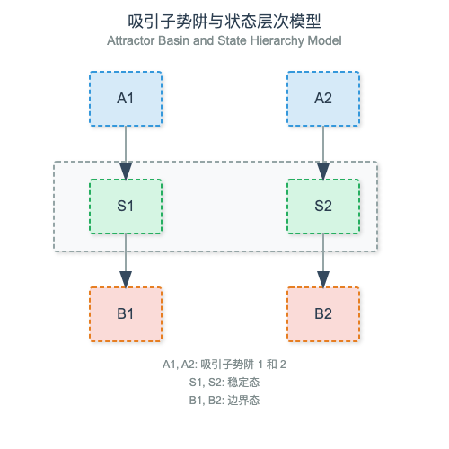
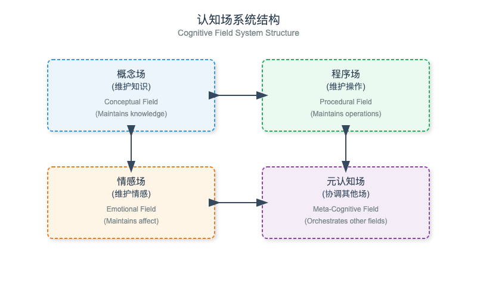

> "信息不是一种物质或具体的实体，而是模式之间在转变中持续存在的关系。"——詹姆斯·格雷克（James Gleick）

## 超越静态上下文：信息场的动态性

在之前对神经网络场的探索中，我们明确了一个表示上下文的变化：从离散到连续。现在，我们将深入探讨赋予神经网络场力量的两个关键特性：持久化和共振。

这些特性解决了一个在上下文工程中的基本挑战：如何在不显式存储每个 token 的情况下，还能够长时间的保持重要信息？随着新的信息进入场，有意义模式如何持续和演变？

## 信息持久化的挑战

传统的上下文持久化方法依赖于显式的记忆机制：




这种显式存储有几个局限性：

* Token 预算：每个记忆项目都消耗上下文窗口空间

* 检索分歧：需要明确的机制来决定检索什么内容

> 磊叔：原文 retrieve friction，直译为检索摩擦。但 friction 在语义中更表示为某种冲突、不调和和分歧。

* 语义碎片化：存储了事实，但丢失关系

神经网络场为持久化提供了一种根本不同的方法：

```plain&#x20;text
字段持久性：
                 共振模式
                 ~~~~~~~                 新输入
                /       \                  |
               /         \                 v
 ~~~~~~~~~~~~~~~~~~~~~~~~~~~~~~~~~~~~~~~~~~~~
|                                            |
|                神经网络场                    |
|                                            |
 ~~~~~~~~~~~~~~~~~~~~~~~~~~~~~~~~~~~~~~~~~~~~
           ^                  ^
           |                  |
        场的状态              持久化
         t = 0               t = 1
```

不同于存储 token，神经网络场通过共振和一致性，在场中来维持随时间持续的激活模式。

## 通过共振实现持久化

在 IBM 研究论文《[使用认知工具激发语言模型的推理](https://www.arxiv.org/pdf/2506.12115)》（2025 年）中，作者指出：

> "认知架构基于一种假设，即人类的推理，源于模块化操作下的协调执行" — IBM 2025 年 6 月
>
> 这篇论文的关键点在于，这些操作形成了跨上下文转换而持续存在的共振模式。

这种共振机制是场持续化的关键。当信息表现出很强的模式时，即使新信息进入，这些模式仍会继续影响场。

### 共振持续化的特性

1. 强度衰减：共振模式随时间自然衰减，其影响减弱，具体如下：

```plain&#x20;text
S(t) = S₀ * e^(-λt)
```

1. S（t）表示时间 t 时的强度，S₀表示初始强度，λ表示衰减率。

2. 一致性增强：与现有场结构一致的模式衰减得更慢。

3. 语义密度：信息丰富的模式比噪声持续时间更长。

4. 强化：当新信息与现有模式产生共振时，两者都会得到加强。

### 持久化的可视化

考虑这个问题：不同类型的信息如何在神经网络场中持久化的：



* 稳定信号：高共振，高一致性，持续时间最长

* 进化模式：高共振，较低一致性，持续但会变化

* 持续噪声：低共振，高一致性，产生场畸变

* 瞬时噪声：低共振，低一致性，迅速消散

## 共振机制

共振不仅仅是一个比喻，它更是神经网络场的数学属性。在最近的论文《Emergent Symbolic Mechanisms Support Reasoning in LLMs》（ICML 2025）中，研究人员在大语言模型中识别了特定的机制：

> "我们识别了一种由几个新的，由原语组成涌现架构的机制。包括执行抽象和规则归纳过程的符号抽象头和符号归纳头，这些过程是实现符号处理涌现形式所需的。"

这些"符号抽象头"在模型的注意力机制中创建出了共振模式。当信息与这些模式对齐时，它会产生更强的活力，本质上是在"敲响"网络的架构。

### 数学范式

神经网络场中，两个模式 A 和 B 之间的共振可以表示为：

```plain&#x20;text
R(A, B) = cos(θ) * |A| * |B| * S(A, B)
```

其中：

* cos（θ）是模式之间的余弦相似度

* |A| 和 |B| 是模式的强度

* S（A， B） 是一个语义相关性函数

### 测量和分析场的共振

我们可以测量场共振的几个属性：

1. 谐振强度：场对特定输入的响应有多强？

2. 谐振带宽：谐振的模式范围有多广？

3. 谐振保真度：谐振如何精确反映语义关系？

4. 跨模式谐振：多个模式如何在谐振中相互作用？

## 神经网络场中的吸引子动力学

神经网络场最强大的特性之一，就是是它们能够形成吸引子，一种场自然收敛的稳定模式。这些吸引子在场的状态空间中创建了稳定性区域。

> 磊叔：“**attractor**”，“**吸引子**”，它是微积分和系统科学中的一个概念，指的是一个系统朝向某个稳态发展的趋势。具体来说，吸引子是系统在长时间演化后最终趋向的特定模式或行为，无论初始条件如何，系统最终会进入或无限接近该状态集。





正如 [IBM June 2025](https://www.arxiv.org/pdf/2506.12115) 论文中所描述的，这些认知工具作为结构吸引子组织信息：

> "例如，将我们的“认知工具”提供给 GPT-4.1，使其在 AIME2024 上的 pass@1 性能从 26.7%提高到 43.3%，非常接近 o1-preview 的性能。" — IBM 2025 年 6 月
> 为大模型提供“认知工具”能够使它们形成稳定的吸引子状态，这种状态能在推理步骤中持续存在，显著提高它们在复杂任务上的表现。

### 吸引子的类型

1. 点吸引子：场收敛到的稳定状态

2. 循环吸引子：重复出现的振荡模式

3. 奇怪吸引子：复杂、混沌但有界的模式

4. 嵌套吸引子：吸引子的层次结构

### 吸引子的构成协议

为了在神经网络场中有意的创建吸引子，我们可以使用以下协议：

```javascript
/attractor.form{
    intent="为数学推理创建稳定的认知框架",
    field_state=<current_field>,
    attractor_seed=[
        "形式逻辑模式",
        "数学符号",
        "代数运算",
        "几何直觉"
    ],
    basin_width=0.75,  // 吸引子影响范围的宽度
    stability=0.85,    // 抗扰动能力
    process=[
        /pattern.inject{patterns=attractor_seed, strength=1.0},
        /field.stabilize{iterations=5, convergence_threshold=0.01},
        /basin.tune{width=basin_width, profile="gaussian"},
        /boundary.reinforce{strength=stability}
    ],
    output={
        attractor_state=<new_attractor>,
        field_metrics={
            stability: <score>,
            basin_profile: <vector>
        }
    }
}
```

## 工程化的场共振

我们已经理解了共振和吸引子，接下来让我们探讨如何为实际应用设计这些特性。

### 共振调谐

我们可以调整场的共振特性，使其对某些类型的信息更加敏感：

```javascript
def tune_field_resonance(field, pattern_types, resonance_profile):
    """调整神经场，使其与特定模式类型产生更强的共振

    参数:
        field: 要调整的神经场
        pattern_types: 要增强共振的模式类型列表
        resonance_profile: 定义共振响应曲线的参数

    """
    # 提取共振参数
    bandwidth = resonance_profile.get('bandwidth', 0.5)
    amplification = resonance_profile.get('amplification', 1.5)
    # 注入共振模式
    for pattern_type in pattern_types:
        exemplars = get_exemplars(pattern_type)
        for exemplar in exemplars:
            field.inject(exemplar, strength=0.5)  # 低强度以避免过度影响
    # 稳定场
    field.stabilize(iterations=3)
    # 调整共振参数
    field.set_resonance_bandwidth(bandwidth)
    field.set_resonance_amplification(amplification)
    return field
```


### 持久化框架

我们可以创建能够增强重要信息持久化的结构：

```javascript
def scaffold_persistence(field, key_concepts, persistence_profile):
    """在神经场中创建持久化结构以维持关键概念
    Args:
        field: 神经场
        key_concepts: 需要持久化的概念
        persistence_profile: 持久化参数
    """
    # 提取持久化参数
    decay_rate = persistence_profile.get('decay_rate', 0.05)
    reinforcement_threshold = persistence_profile.get('reinforcement', 0.6)
    # 为关键概念创建吸引子盆地
    for concept in key_concepts:
        field.create_attractor(concept, strength=1.0, decay_rate=decay_rate)
    # 创建强化路径
    for i, concept_i in enumerate(key_concepts):
        for j, concept_j in enumerate(key_concepts):
            if i!= j:
                relatedness = measure_semantic_relatedness(concept_i, concept_j)
                if relatedness > reinforcement_threshold:
                    field.connect_attractors(concept_i, concept_j, strength=relatedness)
    return field；
```

## 测量和可视化场的属性

为了让神经网络场工作的更高效，我们需要测量和可视化其属性。

### 场状态的可视化

```plain&#x20;text
Field State Snapshot:
          
Strength   
  ^        
  │        ╭╮                            
  │        ││                            
  │        ││           ╭╮               
  │        ││           ││               
  │     ╭╮ ││        ╭╮ ││               
  │     ││ ││        ││ ││     ╭╮        
  │  ╭╮ ││ ││   ╭╮   ││ ││ ╭╮  ││   ╭╮   
  │  ││ ││ ││ ╭╮││   ││ ││ ││  ││   ││   
  └──┴┴─┴┴─┴┴─┴┴┴┴───┴┴─┴┴─┴┴──┴┴───┴┴──>
          Semantic Space
```

### 谐振谱

```plain&#x20;text
Resonance
Response    
  ^        
  │       ╱╲               
  │      /  \              
  │     /    \             
  │    /      \            
  │   /        \           
  │  /          \          
  │ /            \         
  │/              \        
  └─────────────────────> 
     Semantic Distance
```

### 吸引子的“势肼”可视化

```plain&#x20;text
Energy    
  ^        
  │\                    /│
  │ \                  / │
  │  \                /  │
  │   \              /   │
  │    \            /    │
  │     \          /     │
  │      \        /      │
  │       \______/       │
  └─────────────────────> 
         State Space
          Attractor
```

## 实际应用

探讨下持久化和共振如何实现强大的上下文工程应用的。

### 长期对话的一致性

通过为关键对话主题建立共振吸引子，我们即使在非常长的交互中也能保持连贯性：

```javascript
/conversation.coherence{
    intent="在长对话中保持主题一致性",
    field_state=<conversation_field>,
    key_themes=[
        {theme: "用户目标", importance: 0.9},
        {theme: "既定事实", importance: 0.85},
        {theme: "情感基调", importance: 0.7},
        {theme: "开放性问题", importance: 0.8}
    ],
    process=[
        /theme.extract{from="对话历史", confidence_threshold=0.7},
        /attractor.form{for_each="关键主题", strength="重要性"},
        /resonance.tune{bandwidth=0.6, amplification=1.2},
        /persistence.scaffold{decay_rate=0.03}
    ],
    output={
        updated_field=<coherent_field>,
        metrics={
            thematic_stability: <score>,
            semantic_drift: <score>
        }
    }
}
```

### 知识整合

神经网络场可以自然地将新信息与现有知识整合：

```javascript
/knowledge.integrate{
    intent="将新信息与现有知识无缝整合",
    field_state=<knowledge_field>,
    new_information=<incoming_facts>,
    existing_knowledge=<field.attractors>,
    process=[
        /resonance.measure{between=new_information, and=existing_knowledge},
        /conflict.detect{threshold=0.3},
        /attractor.adjust{where="存在冲突", reconciliation_strategy="加权"},
        /field.stabilize{iterations=3, convergence_threshold=0.01}
    ],
    output={
        integrated_field=<updated_field>,
        integration_metrics={
            coherence_delta: <score>,
            conflict_resolution: <report>
        }
    }
}
```

### 多步推理

正如 IBM 论文中所强调的，通过建立持续的推理框架，提供"认知工具"可以显著提高推理性能：

```javascript
/reasoning.scaffold{
    intent="支持多步数学推理",
    field_state=<reasoning_field>,
    cognitive_tools=[
        "方程求解器",
        "模式识别器",
        "假设检验器",
        "类比映射器"
    ],
    problem_statement=<math_problem>,
    process=[
        /attractor.form{for_each="cognitive_tools", basin_width=0.7},
        /problem.inject{content=problem_statement},
        /resonance.measure{between=problem, and=cognitive_tools},
        /reasoning.trace{
            steps=[
                /tool.activate{select="most_resonant", threshold=0.5},
                /step.execute{},
                /field.update{with="execution_result"},
                /convergence.check{target="solution", threshold=0.8}
            ],
            max_iterations=10
        }
    ],
    output={
        solution=<reasoning_output>,
        reasoning_trace=<step_by_step>,
        field_metrics={
            tool_activation_profile: <vector>,
            convergence_path: <trace>
        }
    }
}
```

## 实现神经网络场的持久化

让我们来看一个更完整的领域持久化实现：

```python
class PersistentNeuralField:
    def __init__(self,
                 decay_rate=0.05,
                 boundary_permeability=0.8,
                 resonance_bandwidth=0.6,
                 attractor_formation_threshold=0.7):
        """初始化具有持久性属性的神经场

        Args:
            decay_rate: 模式衰减的基本速率
            boundary_permeability: 新信息进入的难易程度
            resonance_bandwidth: 模式共振的范围
            attractor_formation_threshold: 吸引子形成的阈值
        """
        self.state = {}  # 场状态
        self.attractors = {}  # 稳定吸引子
        self.history = []  # 场演化历史
        # 场属性
        self.decay_rate = decay_rate
        self.boundary_permeability = boundary_permeability
        self.resonance_bandwidth = resonance_bandwidth
        self.attractor_threshold = attractor_formation_threshold

    def inject(self, pattern, strength=1.0):
        """将新的模式引入场中"""
        # 应用边界过滤
        effective_strength = strength * self.boundary_permeability# 检查与现有吸引子的共振
for attractor_id, attractor in self.attractors.items():
    resonance = self._calculate_resonance(pattern, attractor['pattern'])
    if resonance > 0.2:  # 最小共振阈值
        # 吸引子将模式拉向它
        pattern = self._blend_patterns(
            pattern,
            attractor['pattern'],
            blend_ratio=resonance * 0.3  # 限制吸引子影响
        )
        # 增强吸引子
        self.attractors[attractor_id]['strength'] += resonance * 0.1
    # 用新模式更新场状态
    if pattern in self.state:
        self.state[pattern] += effective_strength
    else:
        self.state[pattern] = effective_strength
    # 记录历史
    self.history.append(("inject", pattern, effective_strength))
    # 检查吸引子形成
    if self.state[pattern] > self.attractor_threshold:
        self._form_attractor(pattern)
    # 处理共振效应
    self._process_resonance(pattern)def form_attractor(self, pattern):
    """围绕强模式形成新的吸引子"""
    attractor_id = f"attractor{len(self.attractors)}"
    self.attractors[attractor_id] = {
        'pattern': pattern,
        'strength': self.state[pattern],
        'formation_time': len(self.history),
        'basin_width': self.resonance_bandwidth
    }
    return attractor_id

def _process_resonance(self, trigger_pattern):
    """处理触发模式的共振效应"""
    # 对于每个现有模式，计算与触发模式的共振
    resonance_effects = {}
    for pattern, strength in self.state.items():
        if pattern!= trigger_pattern:
            resonance = self._calculate_resonance(pattern, trigger_pattern)
            effect = resonance * strength * 0.2  # 缩放效应
            resonance_effects[pattern] = effect
    # 应用共振效应
    for pattern, effect in resonance_effects.items():
        self.state[pattern] += effect
    return self

def decay(self):
    """对所有模式应用自然衰减"""
    # 对场状态应用衰减
    for pattern in self.state:
        # 与吸引子共振的模式衰减更慢
        attractor_protection = 0
        for attractor in self.attractors.values():
            resonance = self._calculate_resonance(pattern, attractor['pattern'])
            attractor_protection += resonance * 0.5  # 最大50%保护
        effective_decay = self.decay_rate * (1 - attractor_protection)
        self.state[pattern] *= (1 - effective_decay)
    # 对吸引子应用最小衰减
    for attractor_id in self.attractors:self.attractors[attractor_id]['strength'] *= (1 - self.decay_rate * 0.2)
        # 移除衰减到阈值以下的模式
        self.state = {k: v for k, v in self.state.items() if v > 0.01}
        self.attractors = {k: v for k, v in self.attractors.items() if v['strength'] > 0.1}
        return self
    def _calculate_resonance(self, pattern1, pattern2):
        """计算两个模式之间的共振"""
        # 在实际实现中，这将使用语义相似度
        # 在这个简化版本中，我们将使用一个随机值作为占位符
        import random
        return random.uniform(0, 1) * self.resonance_bandwidth
    def _blend_patterns(self, pattern1, pattern2, blend_ratio):
        """根据比例混合两个模式"""
        # 在实际实现中，这将有意义地组合模式
        # 这里我们只是返回模式1作为占位符
        return pattern1
    def measure_field_stability(self):
        """测量场的稳定性"""
        if not self.attractors:
            return 0.0
        # 测量平均吸引子强度
        avg_strength = sum(a['strength'] for a in self.attractors.values()) / len(self.attractors)
        # 测量围绕吸引子的模式组织
        organization = 0
        for pattern, strength in self.state.items():
            best_resonance = max(
                self._calculate_resonance(pattern, a['pattern'])
                for a in self.attractors.values()
            )
            organization += best_resonance * strength
        if self.state:
            organization /= sum(self.state.values())
        # 组合指标
        stability = (avg_strength * 0.6) + (organization * 0.4)
        return min(1.0, stability)  # 上限为1.0
```


上面展示了持久化神经网络场的几个关键特性：

* 围绕强模式形成的吸引子

* 被吸引子修改的衰减率

* 扩散激活的共振效应

* 场稳定性测量

## 超越个体的场：场的编排

在复杂应用中，我们可以编排多个相互作用的专门场。IBM 论文指出：

> "最有效的认知工具组合，包括针对不同推理模式的专门场域，以及编排其激活的元认知场域。"

这种多场域方法支持复杂的信息处理：




## 神经网络场的涌现属性

当神经网络场相互作用和演化时，会出现一些并非显式编程产生的涌现属性：

1. 自组织

ICML 论文《Emergent Symbolic Mechanisms Support Reasoning in LLMs》指出：

> "我们识别了一种集成架构，它将多种机制结合在一起。这些机制包括新发现的符号抽象机制和符号归纳头，它们执行抽象和规则归纳的过程，以实现一种涌现的符号处理形式。"

这种自组织表现为：场域会自然地将相关信息聚类并形成语义结构。

* 关键性

神经网络场可以在秩序与混沌之间的"临界点"上运行，在那里它们对新的信息最敏感，同时保持稳定性。这种关键状态能够：

* 最大化信息处理

* 更好的适应新输入的信息

* 跨场域的超长上下文交互

- 符号处理的涌现

ICML 论文强调了符号处理如何从领域动态中涌现：

> 这些结果对语言模型而言，是一场有重大意义的辩论：是否能够进行真正推理，以及对传统符号方法和神经网络方法之间的广泛的辩论。

这种涌现的符号处理源于：

* 提取常见模式的抽象头

* 识别关系的归纳头

* 符号绑定了维护变量关系的操作

## 结论：共振与持久化的场域

具有共振和持久化的神经网络场，为上下文工程提供了一个强大的新范式。通过关注字段属性而不是显式的 token 管理，我们可以创建以下系统：

* 在扩展交互中保持连贯性

* 根据意义自然组织信息

* 形成用于推理的稳定认知框架

* 将新知识与现有理解相结合

* 展示涌现的符号处理能力

在我们的下一次探索中，我们将研究如何协调多个场域，并针对特定应用实现高级的场域操作。

***

> 关键要点：
>
> * 神经网络场中的持久性源于共振和吸引子动力学
>
> * 吸引子在场域的状态空间中形成稳定的组织中心
>
> * 共振决定了信息模式如何相互作用和强化
>
> * 场域的属性可以被调谐以增强重要信息的持久性
>
> * 多个场域可以协同运作以进行复杂的信息处理
>
> * 神经网络场展示了涌现属性，如自组织和符号处理

