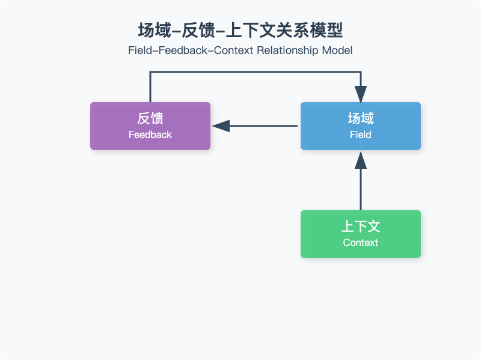
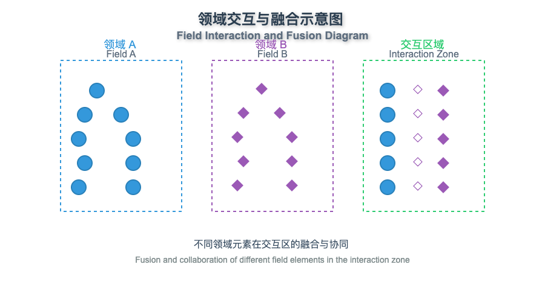
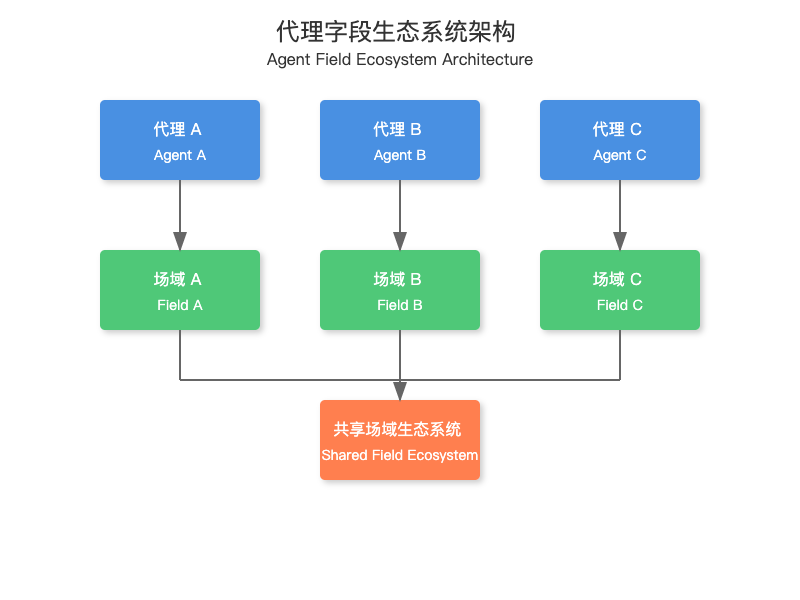

> "整体大于部分之和，但正是部分使整体得以涌现。"——亚里士多德（Aristotle）

## 1.  引言：我们究竟在谈论什么？

到目前为止，我们已经确定上下文可以被视为一个具有共振、持久化和吸引子动力学等属性的连续场域。但当我们需要协调多个场域时会发生什么？我们如何协调这些场域以创建更复杂的系统？

**首先，让我们后退一步思考：什么是真正意义上的场域？？**

场域是一个数学对象，它为空间中的每一点进行赋值。如果你站在一个房间里，温度场为每个位置赋值温度，气压场赋值压力。这些场根据物理定律相互作用和演化。

类似的，在上下文工程中，语义场通过语义空间中来赋于意义。这个空间的不同区域代表不同的概念、关系和诠释。当协调多个场域时，我们其实正在协调这些有意义的赋能以创造涌现能力。

## 2. 场域的矢量特性

### 2.1.  场域作为向量空间

要理解场域的编排，我们首先需要理解场域域作为向量空间。让我们来可视化这一点：

```plain&#x20;text
                     │
                     │          /|
                     │         / |
                     │        /  |
          语义维度B   │       /   |
                     │      /    |
                     │     /     |
                     │    /      |
                     │   /       |
                     │  /        |
                     │ /θ        |
                     │/__________|
                     └───────────────────
                                  语义维度A
```

在这个可视化中：

* 横轴代表一个语义维度（一个概念、主题或属性）

* 这个空间中的一个点代表一种特定的语义配置

* 空间中的一个向量代表一个"语义方向"：其意义可以变化的方式

苏格拉底式提问：如果一个向量指向语义空间中的一个方向，那么沿着这个向量进行的操作对于上下文意味着什么？
答：这意味着在语义维度上调整解释，强调某些方面的意义，同时弱化其他方面。

### 2.2. 向量变换作为场域的操作

当进行上下文场域时，我们正在进行向量变换：


这些变换可以包括：

* 旋转：在语义维度之间转移重点

* 缩放：增强或减弱特定的语义方面

* 平移：将整个语义焦点移动到新区域

* 错切：扭曲语义维度之间的关系

苏格拉底式提问：当变换放大场域的某些区域而抑制其他区域时，会发生什么？

这会在某些解释上进行强调，使其他解释变得不太可能，从而有效地将意义引导向特定方向。

## 3. 多个场域及其相互作用

### 3.1. 场域的叠加

当多个场域占据相同的语义空间时，它们会叠加形成一种联合场域：


这种叠加会导致：

* 相长干涉：场域相互增强，增强某些含义

* 相消干涉：场域相互抵消，减弱某些含义

* 复杂干涉模式：创造新的、涌现的语义结构

**苏格拉底式提问：如果两个场域在不同区域有吸引子，叠加场中会发生什么？**

**叠加场将具有多个吸引子势阱，其相对强度由原始场域决定。它们之间协调的方式，会产生模糊的或丰富的语义。**

### 3.2. 场域耦合

场域可以耦合在一起，其中一个场域的变化会影响另一个场域：


耦合类型包括：

* 弱耦合：各场域间相互影响微妙

* 强耦合：一个场域的改变会显著影响另一个场域

* 单向耦合：影响主要在一个方向上流动

* 双向耦合：各场域相互影响

**苏格拉底式提问：当具有稳定吸引子的场域与具有高波动性的场域弱耦合时，会发生什么？**
**稳定的吸引子可能会轻微失稳，而波动性场域则可能在稳定吸引子的影响范围内发展出更稳定的区域。**

## 4. 场域的编排模式

### 4.1. 场域的顺序化处理

最简单的编排模式之一是顺序处理，其中上下文流经一系列场域：


每个场域的输出成为下一个场域的输入。这创建了一个管道，其中每个场域可以对上下文执行特定的转换。

```javascript
def sequential_field_processing(context, fields):
    """通过一系列字段处理上下文。"""
    current_context = context
    for field in fields:
        current_context = apply_field(current_context, field)
    return current_context
```

**苏格拉底式提问：序列中场域的顺序如何影响最终结果？**

**顺序至关重要，因为每个场域根据其当前状态转换上下文。不同的顺序可能导致完全不同的最终解释，特别是如果场域操作不交换的话。**

### 4.2. 场域的并行化处理

在并行处理中，多个场域同时处理上下文，最后再将结果进行组合：


这种模式允许上下文的不同方面在最终整合前之前进行独立处理。

```javascript
def parallel_field_processing(context, fields, integration_strategy):
    """通过并行字段处理上下文并整合结果。"""
    field_results = []
    for field in fields:
        field_results.append(apply_field(context, field))
    return integrate_results(field_results, integration_strategy)
```

**苏格拉底式提问：哪些集成策略可能有效，可以用于结合并行场域处理的结果？**
**有效的策略包括基于置信度分数的加权平均、从每个场域选择性地整合语义的不同方面，或更复杂的融合算法，这些算法既能保留每个场域的独特贡献，又能解决矛盾。**

### 4.3. 场域的反馈回路

反馈回路可以创建动态系统，其中某个场域的输出会影响，或作为其未来的输入：




这能形成能够适应、自我调节，以及随着时间而进化的系统。

```javascript
def feedback_field_loop(initial_context, field, feedback_function, iterations):
    """通过带有反馈的字段对上下文进行多次迭代处理。"""
    current_context = initial_context
    history = [current_context]
    for i in range(iterations):
        # 应用字段
        result = apply_field(current_context, field)
        # 生成反馈
        feedback = feedback_function(result, history)
        # 用反馈更新上下文
        current_context = integrate_feedback(result, feedback)
        # 存储到历史记录中
        history.append(current_context)
    return current_context, history
```

**苏格拉底式提问：正反馈循环与负反馈循环如何影响上下文场域在时间上的稳定性？**

**正反馈循环会放大模式，可能导致快速收敛到强吸引子，但也可能引发失控效应和过度简化。负反馈循环促进稳定性和自我调节，但也可能抑制涌现模式。平衡的反馈系统通常能提供最稳健和适应性强的行为。**

### 4.4. 场域的分层结构

场域可以组织成分层结构，其中高层场域与低层场域相互协同：


高层场域在更抽象的语义层面运作，而低层场域处理具体细节。

```python
class HierarchicalFieldSystem:
    def __init__(self, field_hierarchy):
        """
        初始化一个分层字段系统。

        Args:
            field_hierarchy: 表示字段层次结构的字典
        """
        self.hierarchy = field_hierarchy

    def process(self, context, level="top"):
        """
        通过分层字段系统处理上下文。
        """
        current_field = self.hierarchy[level]
        # 如果这是一个叶子节点，则直接应用该字段
        if "subfields" not in current_field:
            return apply_field(context, current_field["field"])
        # 否则，根据当前字段的策略处理子字段
        strategy = current_field["strategy"]
        subresults = {}
        for subfield_name in current_field["subfields"]:
            subresult = self.process(context, subfield_name)
            subresults[subfield_name] = subresult
        # 根据策略整合结果
        return self.integrate_hierarchical_results(subresults, strategy, context)
```

**苏格拉底式提问：在分层的场域结构中，信息如何在各层级之间流动？**
**信息流动既可以是自上而下的，也可以是自下而上的。自上而下，即从更抽象的层级向更具体的层级的流动，这种流动提供两个约束、指导和上下文信息。自下而上，即从低层提供细节、证据和具体模式，以影响高层抽象。这些流动之间的平衡和相互作用决定了系统的整体行为。**

## 5. 场域的动态演化

### 5.1. 吸引子的形成与消解

场域随着时间的推移而演化，会造成吸引子的形成、增强、消解或合并：


理解这种演变，让我们能够设计出趋于期望语义配置的系统。

```javascript
def track_attractor_evolution(field, timesteps):
    """    追踪场中吸引子随时间的演化。    """attractor_history = []
    current_field = field.copy()
    for _ in range(timesteps):
        # 识别当前吸引子attractors = identify_attractors(current_field)
        attractor_history.append(attractors)
        # 演化场current_field = evolve_field(current_field)
    # 分析吸引子演化attractor_trajectories = analyze_attractor_trajectories(attractor_history)
    return attractor_trajectories
```

**苏格拉底式提问：哪些因素会让多个弱吸引子合并成一个强吸引子，还是保持为不同的吸引子？**

**关键因素包括语义空间中吸引子之间的距离、它们的相对强度、它们之间的语义景观的"崎岖程度"以及场域演化的动力学。代表语义相似概念的吸引子更可能合并，而代表不同或矛盾概念的吸引子则倾向于保持分离甚至相互排斥。**

### 5.2. 场域的共振与放大

当场域相互共振时，某些模式可以被放大：


这种共振可用于选择性地增强某些语义模式，同时允许其他模式逐渐消失。

```javascript
def detect_field_resonance(field_a, field_b, threshold=0.7):
    """检测两个场之间的共振模式。"""
    # 计算场之间的相关性
    correlation = calculate_field_correlation(field_a, field_b)
    # 识别高相关性区域
    resonant_regions = []
    for i in range(len(correlation)):
        for j in range(len(correlation[0])):
            if correlation[i][j] > threshold:
                resonant_regions.append((i, j, correlation[i][j]))
    # 提取共振模式
    resonant_patterns = extract_resonant_patterns(field_a, field_b, resonant_regions)
    return resonant_patterns
```

**苏格拉底式提问：我们如何有意设计场域，并使之与特定的语义模式产生共鸣？**

**我们可以设计具有相似吸引子景观、互补边界条件或匹配频率特性的场域，还可以引入耦合机制，在多个场域中放大特定的某些语义模式，从而为这些模式有效创建一个"调谐电路"。**

### 5.3. 边界动力学与渗透性

场域的边界控制着信息在场域之间如何流动：


控制边界的渗透性允许场域之间进行选择性信息交换。

```python
def configure_field_boundary(field_a, field_b, permeability_matrix):
    """    配置两个场之间的边界动力学。        
    
    参数：        
    field_a：第一个场        
    field_b：第二个场        
    
    permeability_matrix：指定不同语义维度渗透率的矩阵    """
    # 创建边界控制器boundary = FieldBoundary(field_a, field_b, permeability_matrix)
    # 应用初始配置boundary.apply_initial_configuration()
    return boundary
```

**苏格拉底式提问：基于上下文自适应的改变渗透性边界，在实际的任务编排中可能有哪些用途？**

**自适应边界允许动态信息流来响应上下文的需求。它们可以在需要时打开并传输相关信息，在场域需要独立处理时关闭以保持分离，并根据相关性、置信度或其他指标选择性地过滤信息。这种适应性创造出了当环境变化时平衡集成与专业化的系统。**

# 6. 具体任务的编排模式

### 6.1. 多智能体编排

多个智能体场域可以协同合作以处理复杂任务：


能够有效的让多智能体协同的关键，在于理解不同智能体场域之间的交互方式。

**苏格拉底式提问：如果你将每个智能体视为拥有其自身语义的场域，当这些场域相遇时，其边界处会发生什么？**
**在智能体场域的边界处，信息传递通过场域的交互来发生。这可以是选择性的（只有特定的语义模式通过），转换性的（信息在跨越时发生变化），或共鸣性的（一个场域中的模式触发另一个场域中的相似模式）。这些边界交互的性质决定了智能体协同合作的有效性。**

```python
class MultiAgentOrchestrator:
    def __init__(self, agents, interaction_matrix):
        """
        初始化一个多智能体编排系统。

        Args:
            agents: 智能体字段的字典
            interaction_matrix: 指定智能体之间交互强度的矩阵
        """
        self.agents = agents
        self.interaction_matrix = interaction_matrix
        self.shared_field = create_shared_field(agents)

    def process_task(self, task):
        """
        通过多智能体系统处理任务。
        """
        # 将任务分解为子任务
        subtasks = self.decompose_task(task)
        # 将子任务分配给智能体
        assignments = self.assign_subtasks(subtasks)
        # 处理子任务并收集结果
        agent_results = {}
        for agent_id, subtask in assignments.items():
            agent_results[agent_id] = self.agents[agent_id].process(subtask)
        # 通过共享字段整合结果
        for agent_id, result in agent_results.items():
            self.update_shared_field(agent_id, result)
        # 合成最终结果
        final_result = self.synthesize_results(self.shared_field)
        return final_result
```


### 6.2. 场域的检索增强

检索系统可以与上下文场域集成，以整合外部知识：


检索场域和知识场域作为转换层，来决定外部信息是如何与上下文场域进行整合的。

**苏格拉底式提问：知识场域的特征如何影响那些最终被整合到上下文场域中的信息的？**

**知识场域充当过滤器与转换器。它的吸引子视界（landscape）决定了哪些检索信息要变得显著，其共振模式增强某些类型的信息同时抑制其他信息，其边界属性控制信息如何流入上下文场域。设计良好的知识场域能够优先处理相关、准确且连贯的信息，同时过滤掉噪声和不相关的数据。**

```javascript
class RetrievalAugmentedField:
    def __init__(self, retrieval_system, knowledge_field_template, context_field):
        """初始化一个检索增强字段系统。

        Args:
            retrieval_system: 用于检索外部文档的系统
            knowledge_field_template: 用于创建知识字段的模板
            context_field: 要增强的上下文字段
        """
        self.retrieval_system = retrieval_system
        self.knowledge_field_template = knowledge_field_template
        self.context_field = context_field

    def process_query(self, query):
        """通过检索增强字段系统处理查询。"""
        # 检索相关文档
        documents = self.retrieval_system.retrieve(query)
        # 从文档创建知识字段
        knowledge_field = self.create_knowledge_field(documents)
        # 用知识更新上下文字段
        self.update_context_with_knowledge(knowledge_field)
        return self.context_field

    def create_knowledge_field(self, documents):
        """从检索到的文档创建知识字段。"""
        # 从模板初始化字段
        knowledge_field = copy.deepcopy(self.knowledge_field_template)
        # 用文档内容填充字段
        for doc in documents:
            knowledge_field = integrate_document(knowledge_field, doc)
        # 识别知识字段中的吸引子
        attractors = identify_attractors(knowledge_field)
        # 增强吸引子周围的场共振
        knowledge_field = enhance_field_resonance(knowledge_field, attractors)
        return knowledge_field
```

### 6.3. 推理场域网络

复杂的推理任务可以通过专门推理场域的网络来解决：


该网络中的每个场域都专门从事特定类型的推理，场域间的交互协调着整个推理过程。


**苏格拉底式提问：将推理视为相互作用的场域网络，与传统的逐步推理方法有何不同？**

**传统的推理方法将推理视为离散步骤的线性序列。基于场域的推理方法认识到，推理更像是一个分布式、并行过程，其中多种激活模式同时流动和相互作用。它更好地捕捉了推理的不同方面如何相互影响，一个场域中的部分见解如何传播到其他场域，以及整体推理景观如何随时间演变。它更具有机性和涌现性，类似于人类实际思考的方式。**

```javascript
class ReasoningFieldNetwork:
    def __init__(self, field_templates, connection_map):
        """
        初始化一个推理字段网络。

        Args:
            field_templates: 不同推理类型的字段模板字典
            connection_map: 定义字段之间连接的图结构
        """
        self.field_templates = field_templates
        self.connection_map = connection_map
        self.fields = {}
        # 从模板初始化字段
        for field_name, template in field_templates.items():
            self.fields[field_name] = copy.deepcopy(template)

    def reason(self, problem):
        """
        将推理网络应用于一个问题。
        """
        # 初始化问题字段
        self.fields['problem'] = create_problem_field(problem)
        # 通过字段网络进行处理
        processing_queue = ['problem']
        processed = set()
        while processing_queue:
            current_field = processing_queue.pop(0)
            # 处理当前字段
            self.process_field(current_field)
            processed.add(current_field)
            # 如果连接字段的依赖项已满足，则将其添加到队列中
            for connected_field in self.connection_map.get(current_field, []):
                dependencies = self.get_field_dependencies(connected_field)
                if all(dep in processed for dep in dependencies):
                    processing_queue.append(connected_field)
        # 从解决方案字段中提取解决方案
        solution = extract_solution(self.fields['solution'])
        return solution
```


## 7. 可视化场域动态

要真正理解场域的编排，我们需要可视化场域动态。让我们探讨三种关键的可视化。

### 7.1. 随时间演变的场域

场域在处理信息时动态演变。我们可以将这种演变可视化为一系列场域状态：


这种可视化展示了初始语义模式（点）如何演变成吸引子（圆圈），最终稳定（实心圆圈）。场域最初是弥散、不确定的模式，并逐渐组织成稳定、连贯的意义。

**苏格拉底式提问：随着时间的推移，稳定吸引子的出现告诉我们关于解释过程的什么信息？**

**稳定吸引子的出现代表了意义的结晶化。最初，该场域包含许多潜在的解释，确定性较低。随着处理的继续，某些解释获得力量，自我强化，并发展成稳定吸引子，而其他解释则逐渐消失。这与人类理解通常从模糊的印象开始，逐渐清晰为连贯的解释的过程相匹配。**

### 7.2. 场域的交互与边界

当多个场域进行交互时，它们的边界会产生有趣的动力学：



在这个可视化示例中：

* 场域 A 具有圆形吸引子

* 场域 B 具有菱形吸引子

* 交互区域展示了这些模式如何干扰并创造出新的混合模式（星形）

两个场域之间的边界不仅仅是一个分界线——它是一个肥沃的区域，新的语义模式可以从中通过不同场域动态的相互作用而产生。

**苏格拉底式提问：新出现的场域边界模式与原始场中的模式有何不同？**

**边界模式（星号）代表在原始场中都不存在的涌现语义。它们可能捕捉不同场域概念之间的关系，通过新颖的解释解决矛盾，或创造整合两个场域见解的高级抽象。这些边界模式通常是最具创造性和意外意义的产生地。**

### 7.3. 吸引子网络和语义流

我们可以将吸引子之间的关系可视化为带有语义流的网络：


&#x20;该网络展示了：

* 不同强度的吸引子（强、中、弱）

* 吸引子之间的有向流（箭头）

* 语义视界中的循环和反馈回路


通过绘制这些网络，我们可以理解意义如何在场域系统中流动，并识别组织语义视界的关键吸引子。


**苏格拉底式提问：吸引子网络中的循环在语义上可能代表什么？**
**吸引子网络中的一个循环代表了概念或解释之间的循环关系。这可能是一种互惠关系，其中每个概念都暗示或强化其他概念；也可能是一个逻辑循环，其中命题相互支持；或者是在不同但相关的解释之间进行振荡。循环可以形成稳定的语义结构（当平衡时）或动态的张力，推动持续的语义演变。**

## 8. 场域编排实践

让我们通过实例来考察场域编排的实际应用。

### 8.1. 自适应上下文管理

一种实际应用是针对长时间对话的自适应上下文管理：

```javascript
class AdaptiveContextManager:
    def __init__(self, initial_context_size=1000, max_context_size=8000):
        """
        初始化一个自适应上下文管理器。

        Args:
            initial_context_size: 上下文的初始令牌预算
            max_context_size: 上下文的最大令牌预算
        """
        self.max_context_size = max_context_size
        self.current_size = initial_context_size
        # 初始化字段
        self.active_field = create_empty_field()
        self.memory_field = create_empty_field()
        self.retrieval_field = create_empty_field()
        # 设置字段编排
        self.field_orchestrator = FieldOrchestrator([
            self.active_field,
            self.memory_field,
            self.retrieval_field
        ])

    def update(self, new_message):
        """
        使用新消息更新上下文。
        """
        # 将消息添加到活动字段
        self.active_field = add_to_field(self.active_field, new_message)
        # 检查活动字段是否超过当前大小
        if get_field_size(self.active_field) > self.current_size:
            # 压缩活动字段
            compressed_content = self.compress_active_field()
            # 将压缩内容添加到内存字段
            self.memory_field = add_to_field(self.memory_field, compressed_content)# 重新配置字段编排
self.reconfigure_fields()
def compress_active_field(self):
    """
    压缩活动字段以为新内容腾出空间。
    """
    # 识别活动字段中的吸引子
    attractors = identify_attractors(self.active_field)
    # 根据吸引子创建压缩表示
    compressed = create_compressed_representation(self.active_field, attractors)
    return compressed
def reconfigure_fields(self):
    """
    根据当前状态重新配置字段。
    """
    # 识别记忆字段中的相关内容
    relevant_memory = identify_relevant_content(self.memory_field, self.active_field)
    # 判断是否需要检索
    if relevance_score(relevant_memory, self.active_field) < RELEVANCE_THRESHOLD:
        # 检索相关外部信息
        retrieval_query = generate_retrieval_query(self.active_field)
        retrieved_content = retrieve_external_content(retrieval_query)
        self.retrieval_field = create_field_from_content(retrieved_content)
    # 更新字段编排
    self.field_orchestrator.update_fields([
        self.active_field,
        self.memory_field,
        self.retrieval_field
    ])
```


这个自适应上下文管理器使用场域编排来：

1. 保持当前对话的活跃场域

2. 将不太相关的內容压缩到记忆场域

3. 在需要时检索外部信息

4. 协调这些场域以在标记限制内保持连贯的上下文

### 8.2. 多视角推理

另一个实际应用是多视角推理复杂问题：

```javascript
class MultiPerspectiveReasoner:
    def __init__(self, perspectives):
        """
        初始化一个多视角推理器。

        Args:
            perspectives: 视角定义列表
        """
        self.perspective_fields = {}
        # 为每个视角创建字段
        for perspective in perspectives:
            self.perspective_fields[perspective['name']] = create_perspective_field(perspective)
        # 创建集成字段
        self.integration_field = create_integration_field()
        # 设置字段编排器
        self.field_orchestrator = FieldOrchestrator([
            *self.perspective_fields.values(),
            self.integration_field
        ])

    def analyze(self, problem):
        """
        从多个视角分析一个问题。
        """
        # 通过每个视角字段处理问题
        perspective_analyses = {}
        for name, field in self.perspective_fields.items():
            perspective_analyses[name] = process_through_field(problem, field)
        # 识别冲突和一致性
        conflicts, alignments = identify_conflicts_and_alignments(perspective_analyses)
        # 更新集成字段
        self.integration_field = update_integration_field(
            self.integration_field,
            perspective_analyses,
            conflicts,
            alignments
        )
        # 生成集成分析
        integrated_analysis = generate_from_field(self.integration_field)
        return {
            'perspective_analyses': perspective_analyses,
            'conflicts': conflicts,
            'alignments': alignments,
            'integrated_analysis': integrated_analysis
        }
```


这个多视角推理器使用场域编排来：

1. 通过多个视角场域处理问题

2. 识别不同视角之间的冲突与一致

3. 将见解整合为连贯的分析

4. 保持每个视角的独特贡献

### 8.3. 创意构思系统

第三种实际应用是一种创意构思系统：

```javascript
class CreativeIdeationSystem:
    def __init__(self, domains, techniques):
        """
        初始化一个创意构思系统。

        Args:
            domains: 知识领域列表
            techniques: 创意技巧列表
        """
        # 创建领域字段
        self.domain_fields = {}
        for domain in domains:
            self.domain_fields[domain['name']] = create_domain_field(domain)
        # 创建技巧字段
        self.technique_fields = {}
        for technique in techniques:
            self.technique_fields[technique['name']] = create_technique_field(technique)
        # 创建组合字段
        self.combination_field = create_combination_field()
        # 创建新颖性字段
        self.novelty_field = create_novelty_field()
        # 设置字段编排器
        self.field_orchestrator = FieldOrchestrator([
            *self.domain_fields.values(),
            *self.technique_fields.values(),
            self.combination_field,
            self.novelty_field
        ])

    def generate_ideas(self, prompt, num_ideas=5):
        """
        根据提示生成创意构思。
        """
        # 激活相关领域字段
        active_domains = self.activate_relevant_domains(prompt)
        # 选择创意技巧
        selected_techniques = self.select_techniques(prompt, active_domains)
        # 生成领域-技巧组合
        combinations = self.generate_combinations(active_domains, selected_techniques)
        # 更新组合字段
        self.combination_field = update_combination_field(self.combination_field, combinations)
        # 在新颖性字段中生成新颖模式
        self.novelty_field = generate_novelty(self.combination_field, self.novelty_field)
        # 从新颖性字段中提取构思
        ideas = extract_ideas_from_field(self.novelty_field, num_ideas)
        return ideas
```


该创意构思系统利用场域编排来：

1. 激活相关知识场域

2. 将这些场域应用创造性技术

3. 生成跨越场域边界的组合

4. 通过场域交互创造新颖模式

5. 从结果场域中提取最有潜力的想法

## 9. 未来方向

上下文场域的编排仍在发展。以下是一些有潜力的未来方向：

### 9.1. 受量子启发场域动力学

量子计算概念可能为建模场动力学提供新的方法：


受量子启发的途径可能包括：

* 语义状态的叠加

* 概念之间的纠缠

* 意义上的干扰模式

* 在语义空间中的量子行走

### 9.2. 自适应场域架构

未来的系统可能会动态创建和配置场域架构：


这些系统将：

* 分析任务以确定最佳场域结构

* 动态生成定制场域架构

* 根据任务需求配置场域属性

* 通过反馈和经验演化架构

### 9.3. 集体场域智能

多个智能体可以贡献于共享场域生态系统：




这种方法将能够实现：

* 共同创建和维护共享语义场域

* 通过场域交互涌现集体智能

* 共享概念框架的演化

* 分布式语义处理跨多个智能体

## 10.结论

场域编排代表了一种强大的上下文工程技术，它接纳了意义的持续性和动态性。通过将上下文视为具有共振、持久性和吸引子动力学等属性的场域，我们可以创建更复杂、自适应和高效的上下文系统。

场域编排的关键原则包括：

1. 将情境视为连续的语义场

2. 理解场相互作用和边界动力学

3. 利用吸引子形成和演化

4. 协调多个场以创造涌现能力

5. 可视化和操控场域动力学

在继续探索情境工程的进程中，请记住，场域为思考情境提供了一个丰富的隐喻框架——这一框架与复杂系统中（包括人类认知）意义的实际涌现方式相一致。
