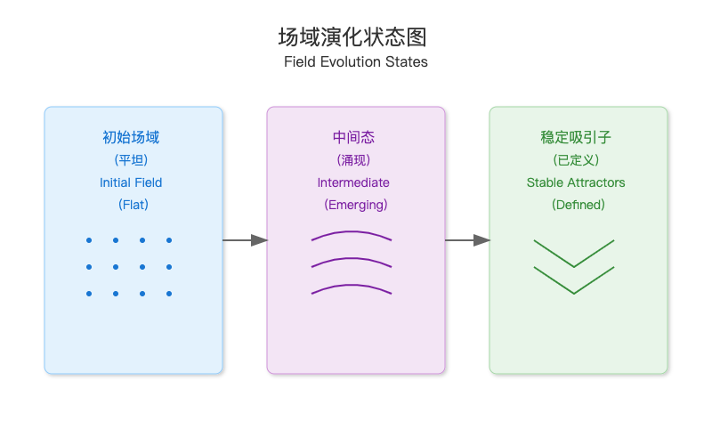
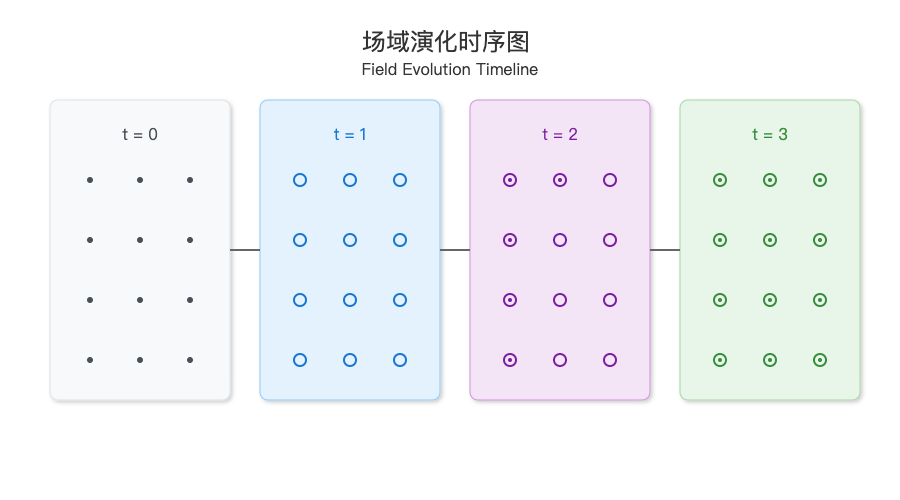
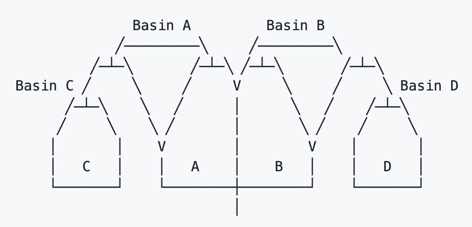
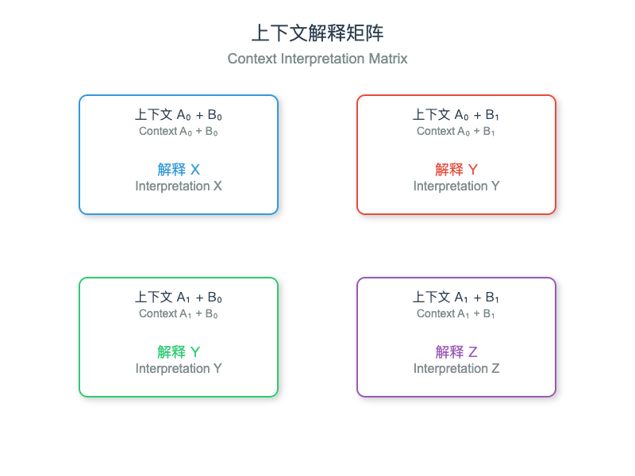

*理解意义如何在上下文场域域中结晶*

> “系统的本质不在于其元素本身，而在于它们之间的相互关系。”
>
> — 诺伯特·维纳（Norbert Wiener），控制论之父

# 1. 引言：涌现的奥秘

你有没有想过，一群鸟如何在空中创造出那些令人着迷的图案？或者，你的大脑如何从数十亿个独立的神经元中产生意识？甚至更简单的问题，水——仅仅由氢和氧组成——如何突然冻结成复杂的雪花？

这些都是涌现的例子——当简单组件相互作用时，会创造出复杂且出乎意料的行为，而这些行为无法仅从单个组件中轻易预测。令人惊讶的是，这种现象同样发生在上下文场域域中。

**苏格拉底式提问：在对话中，你观察到了哪些看似出乎意料地"涌现"的内容，这些内容超越了任何单个消息的贡献？**

在这个模块中，我们将探讨两个将改变您对上下文工程思考方式的基本概念：

1. 涌现：意义如何从简单元素之间的交互中结晶化

2. 吸引子动力学：稳定模式如何在语义场中形成和演化

让我们从三个角度来探讨这个问题：

* 具象：运用视觉和物理隐喻建立直觉

* 数值：理解计算模式和测量

* 抽象：探索理论原则和结构


吸引子视界模型指的是系统随时间演化所可能达到的状态范围。

# 2. 构建直觉：吸引子到底是什么？

### 2.1. 碗中球的比喻

想象一个球在碗中滚动：

```plain&#x20;text
       ↘    ↙
        \  /
         \/
    ─────●─────
```

无论初始时将球放置在何处，它最终都会静止在碗底。碗底就是一个吸引子，也就是系统自然演化的稳定状态。

在上下文场域域中，吸引子是稳定的语义配置——在处理信息时，场域自然演化的解释或意义。

**苏格拉底式提问：如果你旁边有多个深度不同的碗，会发生什么？球最终会停留在哪里？**

### 2.2. 从碗到视界

现在让我们从简单的碗扩展到更复杂的视界：

```plain&#x20;text
       ____                 ____
      /    \    ______    /    \
_____/      \__/      \__/      \____
      A        B        C
```

这个视界有三个势阱（A、B 和 C）。根据你最初放置球的位置，它会滚入这三个势阱中的一个。每个势阱代表一个吸引子。

从语义角度来看：

* 每个势阱是一个稳定的解释或意义

* 势阱的深度表示该解释的"强度"或"说服力"

* 势阱的宽度表示该解释的广泛性或包容性

* 势阱之间的边界（即山丘）代表不同解释之间的语义障碍

**苏格拉底式提问：将球正好放在两个势阱之间的峰顶上会发生什么？这告诉我们关于上下文场域中模糊输入的哪些信息？**

### 2.3. 三维吸引子

让我们进一步将视界隐喻扩展到三维空间中并进行可视化：

```plain&#x20;text
                 Z (Semantic Depth)
                 │
                 │     ⟱
                 │   ╱─╲  
                 │  ╱   ╲ 
                 │ ╱     ╲
                 │╱       ╲
                 └─────────────────── X (Semantic Dimension 1)
                /
               /
              /
             /
            /
           Y (Semantic Dimension 2)
```

现在，我们的吸引子是三维视界中的山谷或势阱。势阱越深，吸引子的力量就越强。

在真实的上下文场域中，我们处理的是更多维度的情形，可能达到数百或数千。但原理保持不变：吸引子是场自然稳定的区域。

# 3. 吸引子的数学知识

### 3.1. 向量场和流

要从数学上理解吸引子，我们需要考虑向量场。向量场将一个向量（一个方向和大小）分配给空间中的每个点：

```plain&#x20;text
    ↖ ↑ ↗        ↖ ↑ ↗
    ← o →        ← o →
    ↙ ↓ ↘        ↙ ↓ ↘
```

在上下文场域中，这些向量表示语义状态在每个点倾向于如何变化。这些向量形成流模式，显示了意义随时间如何演变。

数学上，我们可以将其表示为一个函数 F，该函数将场中的每个点 x 映射到一个向量 F（x），指示变化的方向和大小：

```plain&#x20;text
F(x) = direction and rate of semantic change at point x
```

**苏格拉底式提问：如果我们把上下文处理看作是沿着这些流线进行，当区域内的所有向量都指向中心点时会发生什么？**

### 3.2. 不动点和稳定性

向量场中的一个不动点是指 F（x） = 0 的点，这意味着没有变化的趋势。不动点有三种类型：

```plain&#x20;text
    Attractor          Repeller          Saddle Point
    ↘ ↓ ↙              ↗ ↑ ↖              ↗ ↑ ↖
    → o ←              ←  o →              →  o ←
    ↗ ↑ ↖              ↘ ↓ ↙              ↘ ↓ ↙
```

* 吸引子：所有附近的轨迹都收敛到这个点

* 排斥子：所有附近的轨迹都从这个点发散

* 鞍点：轨迹沿某些方向收敛，沿其他方向发散

在上下文场域中：

* 吸引子代表稳定的解释

* 排斥子代表不稳定或不一致的解释

* 鞍点代表在某些方面稳定但在其他方面不稳定的解释

### 3.3. 吸引子势阱

The basin of attraction for an attractor is the set of all points that eventually flow to that attractor:

吸引子的势阱是指所有最终流向该吸引子的点的集合：

```plain&#x20;text
              Basin Boundary
                    │
    Basin A         │         Basin B
                    │
    ↘ ↓ ↙         │           ↘ ↓ ↙
    → A ←          |           → B ←
    ↗ ↑ ↖         |           ↗ ↑ ↖
                    │
```

在上下文工程中，理解吸引子势阱有助于我们预测给定输入最终将解析为哪种解释。

苏格拉底式提问：如果我们稍微修改矢量场，吸引子势阱会发生什么？这与上下文中的微小变化有何关联？

# 4. 显现：当整体超过总和时

### 4.1. 涌现的层次

涌现发生在不同的组织层次上：

```plain&#x20;text
第三级：涌现模式（鸟群形成）
           ↑
第二级：交互作用（鸟类遵循规则）
           ↑
第一级：组件（单个鸟类）
```

在上下文场域中，我们可以识别出类似的层次：

```plain&#x20;text
Level 3: 涌现意义（连贯解读）
           ↑
Level 2: 语义关系（概念之间的联系）
           ↑
Level 1: 标记/单词（单个元素）
```

当某一层次的相互作用在更高层次上创造出无法通过单独观察各个组成部分来预测的模式时，就会发生涌现。

### 4.2. 涌现系统的性质

涌现系统通常表现出几种关键性质：

1. 非线性：微小的变化可能产生不成比例的巨大影响

2. 自组织：在没有外部指导的情况下出现秩序

3. 鲁棒性：涌现模式能够在组件变化时持续存在

4. 新颖性：出现了一些在组件中原本不存在的新属性

在上下文场域中，这些属性表现为：

1. 非线性：单个词语的变化可能显著改变解释

2. 自组织：从 token 的交互中涌现出连贯的意义

3. 鲁棒性：整体意义即使在改述的情况下依然存在

4. 新颖性：解释中包含未明确陈述的见解

**苏格拉底式提问：你能想到哪些例子，在句子中添加一个单词会完全改变其意义吗？这如何体现了非线性？**

### 4.3. 量子视角下的涌现

Agostino 等人 （2025） 的最新研究表明，语义涌现表现出类似量子特性。在量子语义框架中，意义存在于潜在解释的叠加态中，直到通过与解释代理的相互作用而"坍缩"：

```plain&#x20;text
          意义叠加                                  解释崩塌
    ┌─────────────┐                ┌─────────┐
    │    ╱╲   ╱╲        │                │               │
    │   ╱  ╲ ╱  ╲       │      →         │      ╱╲     │
    │ ╱      V    ╲      │                │      ╱  ╲    │
    │    ╱╲   ╱╲        │                │     ╱    ╲   │
    └─────────────┘                └─────────┘
```

这一视角有助于解释为何仅从组件本身无法确定性地预测意义。意义的出现具有内在的观察者依赖性和上下文性。

# 5. 上下文场域中的吸引子动力学

### 5.1. 吸引子的形成

在上下文场域中，吸引子通过多种机制形成：

1. 语义连贯性：相关概念相互强化

2. 上下文约束：上下文缩小了可能的解释范围

3. 模式识别：熟悉模式能被快速识别并稳定

4. 共振：兼容的解释相互共鸣并放大

我们可以将吸引子形成可视化为一个地形变形过程：




随着信息在领域中流动，地形逐渐形成峰和谷，代表语义吸引和排斥的区域。

### 5.2. 吸引子随时间的演化

吸引子并非静止不变——随着领域处理更多信息，它们会演化：




这种演化涉及：

1. 形成：初始语义模式开始组织

2. 强化：某些模式变得更加主导

3. 竞争：更强的吸引子可能吸收较弱的吸引子

4. 稳定：场最终稳定在一个配置中

**苏格拉底式提问：在演化过程中，哪些因素可能导致一个吸引子比另一个更强？**

### 5.3. 分岔与相变

有时，场中微小的变化会导致剧烈的重构——这些被称为分岔或相变：

```plain&#x20;text
      分岔前                           分岔后
┌─────────┐            ┌───────────┐
│               │            │                  │
│      ╱╲      |            │    ╱╲  ╱╲      │
│     ╱  ╲     |    →       │   ╱  ╲╱  ╲.   │
│    ╱    ╲    |            │  ╱        ╲     │
│               |             │                  │
└─────────┘            └───────────┘
```

单个吸引子突然分裂成两个独立的吸引子。在语义上，这代表了一种消歧——先前统一的解释分裂成不同的替代方案。

这些转变可能由以下因素触发：

1. 关键信息：迫使重新解释的关键细节

2. 阈值效应：超过临界点的证据积累

3. 上下文变化：更广泛上下文中的变化

# 6. 测量与可视化吸引子

### 6.1. 吸引子检测

我们如何在上下文场域中检测吸引子？几种方法包括：

1. 梯度分析：识别语义梯度汇聚的区域

2. 稳定性测试：扰动场并观察恢复模式

3. 轨迹跟踪：跟随解释随时间演变的过程

4. 势阱映射：识别哪些初始状态会导致哪些最终状态

这里是一个基于梯度的吸引子检测的简单算法：

```javascript
def detect_attractors(field, threshold=0.01):
    """使用梯度分析检测语义场中的吸引子。

    参数:
        field: 语义场
        threshold: 收敛阈值

    返回:
        检测到的吸引子列表
    """
    # 计算梯度场（最陡下降方向）
    gradient_field = calculate_gradient(field)
    # 识别梯度幅值低于阈值的点
    candidate_points = []
    for x in range(field.shape[0]):
        for y in range(field.shape[1]):
            if np.linalg.norm(gradient_field[x, y]) < threshold:
                candidate_points.append((x, y))
    # 分类不动点（吸引子、排斥子、鞍点）
    attractors = []
    for point in candidate_points:
        if is_attractor(field, point):
            attractors.append(point)
    return attractors
```

### 6.2. 势阱可视化

可视化吸引子势阱有助于我们理解语义视界：




此可视化展示了：

* 四个吸引子势阱（A、B、C、D）

* 吸引子势阱之间的边界（分水岭线）

* 每个吸引子势阱的相对大小和深度

在上下文工程中，这有助于我们理解：

* 哪些解释最有可能

* 解释对输入微小变化的敏感程度

* 哪些地方可能存在歧义（在势阱边界附近）

### 6.3. 量子的上下文性测量

量子语义框架建议通过贝尔不等式检验来测量非经典上下文性：




经典系统应满足不等式 |S| ≤ 2，其中：

```plain&#x20;text
S = E(A₀,B₀) - E(A₀,B₁) + E(A₁,B₀) + E(A₁,B₁)
```

Agostino 等人（2025 年）的研究发现值为 2.3 至 2.8 之间，表明在语义解释中存在类似量子的上下文性。

**苏格拉底式提问：这种非经典行为可能暗示我们应该如何应对上下文工程？**

# 7. 吸引子的工程化

### 7.1. 有意的创造吸引子

我们如何在上下文场域中有意的创造吸引子？

1. 语义锚定：提供清晰、显著的构念，作为吸引子成核点

```javascript
context:
  anchors:
    - concept: "气候变化"
      associations:
        - "全球变暖"
        - "温室气体"
        - "海平面上升"
      salience: 0.8
```

2. 场域塑造：建立边界和梯度以引导解释

```javascript
def shape_field_gradients(field, target_regions, gradient_strength=1.0):
    """在一个场中塑造梯度，以便在目标区域创建吸引子。"""
    # 创建梯度掩码
    gradient_mask = np.zeros_like(field)
    # 对于每个目标区域
    for region in target_regions:
        center_x, center_y = region['center']
        radius = region['radius']
        strength = region.get('strength', gradient_strength)
        # 创建指向中心的径向梯度
        for x in range(field.shape[0]):
            for y in range(field.shape[1]):
                dist = np.sqrt((x - center_x)**2 + (y - center_y)**2)
                if dist <= radius:
                    # 创建指向中心的梯度
                    angle = np.arctan2(center_y - y, center_x - x)
                    gradient_mask[x, y, 0] = strength * np.cos(angle)
                    gradient_mask[x, y, 1] = strength * np.sin(angle)
    # 将梯度掩码应用到场
    field = apply_gradient_mask(field, gradient_mask)
    return field
```

3. 共振放大：增强与预期解释一致的模式

```javascript
def amplify_resonance(field, target_patterns, amplification_factor=1.5):
    """    放大场模式与目标模式之间的共振。    """# 计算与目标模式的共振resonance_map = calculate_resonance(field, target_patterns)
    # 应用基于共振的放大amplified_field = field * (1.0 + (resonance_map * (amplification_factor - 1.0)))
    return amplified_field
```

### 7.2. 管理吸引子竞争

当存在多个吸引子时，我们需要策略来管理它们的竞争：

1. 吸引子强化：强化特定吸引子

```javascript
def strengthen_attractor(field, attractor_location, strength_factor=1.5):
    """    增强场中特定的吸引子。    """x, y = attractor_location# 加深吸引子盆地radius = 5  # 根据场的大小进行调整for i in range(max(0, x - radius), min(field.shape[0], x + radius + 1)):
        for j in range(max(0, y - radius), min(field.shape[1], y + radius + 1)):
            dist = np.sqrt((i - x)**2 + (j - y)**2)
            if dist <= radius:
                # 应用随距离衰减的增强因子factor = strength_factor * (1 - dist/radius)
                field[i, j] *= (1 + factor)
    return field
```

* 吸引子势阱重塑：修改吸引子势阱之间的边界

```javascript
def reshape_basin_boundary(field, boundary_points, shift_vector, strength=1.0):
    """通过移动边界点重塑盆地之间的边界。"""
    # 对边界点应用移动
    for point in boundary_points:
        x, y = point
        dx, dy = shift_vector
        # 计算垂直于边界的梯度
        gradient = calculate_perpendicular_gradient(field, (x, y))
        # 在梯度方向上应用移动
        for i in range(max(0, x - 3), min(field.shape[0], x + 4)):
            for j in range(max(0, y - 3), min(field.shape[1], y + 4)):
                dist = np.sqrt((i - x)**2 + (j - y)**2)
                if dist <= 3:
                    # 应用随距离衰减的移动
                    factor = strength * (1 - dist/3)
                    field[i, j] += factor * (dx * gradient[0] + dy * gradient[1])
    return field
```

3. 吸引子合并：将邻近的吸引子合并为一个统一的吸引子

```javascript
def merge_attractors(field, attractor1, attractor2, bridge_strength=0.5):
    """通过在两个吸引子之间创建桥梁来合并它们。"""
    x1, y1 = attractor1
    x2, y2 = attractor2
    # 在吸引子之间的线上生成点
    points = generate_line_points(x1, y1, x2, y2)
    # 通过降低线上的场来创建桥梁
    for x, y in points:
        if 0 <= x < field.shape[0] and 0 <= y < field.shape[1]:
            # 降低场值以创建连接吸引子的山谷
            field[x, y] *= (1 - bridge_strength)
    return field
```

### 7.3. 引导涌现

与其完全指定吸引子，我们可以创建引导涌现行为的条件：

1. 初始条件：设置初始场状态

```javascript
def initialize_field_with_bias(shape, bias_regions):
    """    初始化一个对特定区域有偏向的场。    """# 创建空场field = np.zeros(shape)
    # 应用偏向for region in bias_regions:
        center_x, center_y = region['center']
        radius = region['radius']
        bias = region['bias']
        # 对区域应用偏向for x in range(shape[0]):
            for y in range(shape[1]):
                dist = np.sqrt((x - center_x)**2 + (y - center_y)**2)
                if dist <= radius:
                    # 应用随距离衰减的偏向field[x, y] += bias * (1 - dist/radius)
    return field
```

* 局部规则：定义场元素如何相互作用

```javascript
def apply_local_rules(field, rules, iterations=10):
    """    应用局部交互规则来演化场。    """
    current_field = field.copy()
    for _ in range(iterations):
        next_field = current_field.copy()
        # 在每个点应用规则
        for x in range(1, field.shape[0]-1):
            for y in range(1, field.shape[1]-1):
                # 获取邻域
                neighborhood = current_field[x-1:x+2, y-1:y+2]
                # 应用规则
                for rule in rules:
                    next_field[x, y] = rule(neighborhood, current_field[x, y])
        current_field = next_field
    return current_field
```

3. 场约束：设定界限和约束，引导涌现现象

```javascript
def apply_field_constraints(field, constraints):
    """    将约束应用于通道场演化。    """
    constrained_field = field.copy()
    # 应用每个约束
    for constraint in constraints:
        constraint_type = constraint['type']
        if constraint_type == 'boundary':
            # 应用边界约束
            region = constraint['region']
            value = constraint['value']
            constrained_field = apply_boundary_constraint(constrained_field, region, value)
        elif constraint_type == 'gradient':
            # 应用梯度约束
            direction = constraint['direction']
            strength = constraint['strength']
            constrained_field = apply_gradient_constraint(constrained_field, direction, strength)
        elif constraint_type == 'symmetry':
            # 应用对称约束
            axis = constraint['axis']
            constrained_field = apply_symmetry_constraint(constrained_field, axis)
    return constrained_field
```

# 8. 量子语义场

量子语义框架为上下文工程提供了额外的工具：

### 8.1. 解释的叠加

在量子语义学中，意义存在于潜在解释的叠加中：

```javascript
def create_semantic_superposition(expression, basis_interpretations, coefficients=None):
    """创建一个受量子启发的解释叠加态。"""
    n_interpretations = len(basis_interpretations)
    # 如果未提供系数，则使用等概率
    if coefficients is None:
        coefficients = np.ones(n_interpretations) / np.sqrt(n_interpretations)
    # 确保系数已归一化
    norm = np.sqrt(np.sum(np.abs(coefficients)**2))
    coefficients = coefficients / norm
    # 创建叠加态
    superposition = {
        'basis_interpretations': basis_interpretations,
        'coefficients': coefficients
    }
    return superposition
```

### 8.2. 测量作为解释

解释是一个使叠加态坍缩的测量的建模过程：

```javascript
def interpret(superposition, context_operator):
    """通过应用上下文算子来解释语义叠加。"""
    # 将上下文算子应用于系数
    new_coefficients = context_operator @ superposition['coefficients']
    # 计算概率
    probabilities = np.abs(new_coefficients)**2
    # 归一化
    new_coefficients = new_coefficients / np.sqrt(np.sum(probabilities))
    # 创建新的叠加
    interpreted = {
        'basis_interpretations': superposition['basis_interpretations'],
        'coefficients': new_coefficients,
        'probabilities': probabilities
    }
    return interpreted
```


### 8.3. 非可交换的上下文操作

上下文操作不一定可交换，这意味着应用的顺序很重要：

```javascript
def apply_sequential_contexts(superposition, context_operators):
    """将一系列上下文算子应用于叠加态。"""
    current_state = superposition.copy()
    # 依次应用每个算子
    for operator in context_operators:
        current_state = interpret(current_state, operator)
    return current_state
```

**苏格拉底式提问：上下文操作的非交换性如何影响我们设计上下文系统？**

# 9. 实际应用

### 9.1. 消除模糊性

吸引子动力学有助于解决语言中的歧义：

```javascript
class AmbiguityResolver:
    def __init__(self, field_template):
        """
        初始化一个歧义解析器。

        Args:
            field_template: 用于创建语义场的模板
        """
        self.field_template = field_template

    def resolve(self, text, context):
        """
        使用吸引子动力学解决文本中的歧义。
        """
        # 创建初始场
        field = create_field_from_text(text, self.field_template)
        # 应用上下文来塑造场
        field = apply_context_to_field(field, context)
        # 演化场以找到稳定状态
        field = evolve_field_to_stability(field)
        # 识别主导吸引子
        attractors = identify_attractors(field)
        # 根据主导吸引子生成解释
        interpretation = generate_interpretation(text, attractors)
        return interpretation
```

### 9.2. 生成创意构思

场域动力学可用于创意构思生成：

```javascript
class CreativeIdeaGenerator:
    def __init__(self, domain_fields, technique_fields):
        """
        初始化一个创意生成器。

        参数:
            domain_fields: 不同领域的字段字典
            technique_fields: 不同创意技术的字段字典
        """
        self.domain_fields = domain_fields
        self.technique_fields = technique_fields

    def generate(self, domain, technique, iterations=10):
        """
        使用场动力学生成创意。
        """
        # 获取相关字段
        domain_field = self.domain_fields[domain]
        technique_field = self.technique_fields[technique]
        # 创建组合场
        combined_field = combine_fields(domain_field, technique_field)
        # 添加随机扰动以鼓励新的吸引子
        perturbed_field = add_perturbations(combined_field)
        # 演化场
        evolved_field = evolve_field(perturbed_field, iterations)
        # 识别涌现的吸引子
        attractors = identify_attractors(evolved_field)
        # 根据吸引子生成创意
        ideas = [generate_idea_from_attractor(attractor) for attractor in attractors]
        return ideas
```

### 9.3. 自适应上下文系统

场域动力学使自适应上下文管理成为可能：

```javascript
class AdaptiveContextManager:
    def __init__(self, initial_field):
        """        初始化一个自适应上下文管理器。                Args:            initial_field: 初始语义场        """
        self.field = initial_field
        self.attractor_history = []
    def update(self, new_information):
        """        使用新信息更新上下文场。        """
        # 将新信息整合到场中
        self.field = integrate_information(self.field, new_information)
        # 识别当前吸引子
        current_attractors = identify_attractors(self.field)
        self.attractor_history.append(current_attractors)
        # 分析吸引子演化
        stability = analyze_attractor_stability(self.attractor_history)
        # 根据稳定性调整场
        if stability < STABILITY_THRESHOLD:
            # 增强稳定吸引子
            self.field = enhance_stable_attractors(self.field, self.attractor_history)
        return self.field
```


# 10. 未来研究方向

对上下文场域中涌现和吸引子动力学的研究仍在发展中。以下是一些有前景的未来方向：

### 10.1. 受量子启发的上下文工程

量子语义框架为上下文工程提出了新的方法：

```javascript
class QuantumContextEngine:
    def __init__(self, dimensions=1024):
        """
        初始化一个量子启发的上下文引擎。

        Args:
            dimensions: 语义希尔伯特空间的维度
        """
        self.dimensions = dimensions
        self.state = np.zeros(dimensions, dtype=complex)
        self.operators = {}

    def create_superposition(self, expressions, weights=None):
        """
        创建语义表达式的叠加态。
        """
        # 如果未提供权重，则默认为等权重
        if weights is None:
            weights = np.ones(len(expressions)) / np.sqrt(len(expressions))
        else:
            # 归一化权重
            norm = np.sqrt(np.sum(np.abs(np.array(weights))**2))
            weights = [w / norm for w in weights]
        # 创建状态向量
        self.state = np.zeros(self.dimensions, dtype=complex)
        for expr, weight in zip(expressions, weights):
            expr_vector = self.encode_expression(expr)
            self.state += weight * expr_vector
        return self.state

    def define_context_operator(self, name, context_matrix):
        """
        定义一个上下文算子。
        """
        self.operators[name] = context_matrix
return name
def apply_context(self, operator_name):
    """
    将上下文算子应用于当前状态。
    """
    if operator_name not in self.operators:
        raise ValueError(f"算子 {operator_name} 未定义")
    # 应用算子
    operator = self.operators[operator_name]
    new_state = operator @ self.state
    # 归一化
    norm = np.sqrt(np.sum(np.abs(new_state)**2))
    self.state = new_state / norm
    return self.state
def measure(self, basis_expressions):
    """
    在给定基下测量当前状态。
    """
    # 编码基表达式
    basis_vectors = [self.encode_expression(expr) for expr in basis_expressions]
    # 计算概率
    probabilities = []
    for vector in basis_vectors:
        # 计算投影
        projection = np.vdot(vector, self.state)
        probability = np.abs(projection)**2
        probabilities.append(probability)
    # 归一化概率
    total = sum(probabilities)
    normalized_probabilities = [p / total for p in probabilities]
    return list(zip(basis_expressions, normalized_probabilities))
```


这种受量子启发的方法能够：

* 同时表示多种潜在意义

* 非交换式上下文操作

* 通过测量进行概率解释

* 不同语义模式之间的干扰

### 10.2. 自组织场域系统

未来的系统可能会利用自组织原理：

```javascript
class SelfOrganizingFieldSystem:
    def __init__(self, initial_field, local_rules):
        """
        初始化一个自组织场系统。

        Args:
            initial_field: 初始场状态
            local_rules: 局部交互规则
        """
        self.field = initial_field
        self.rules = local_rules
        self.history = [initial_field.copy()]

    def evolve(self, iterations=100):
        """
        根据局部规则演化场。
        """
        for _ in range(iterations):
            # 应用局部规则更新场
            next_field = np.zeros_like(self.field)
            for x in range(self.field.shape[0]):
                for y in range(self.field.shape[1]):
                    # 获取邻域
                    x_min = max(0, x - 1)
                    x_max = min(self.field.shape[0], x + 2)
                    y_min = max(0, y - 1)
                    y_max = min(self.field.shape[1], y + 2)
                    neighborhood = self.field[x_min:x_max, y_min:y_max]
                    # 应用规则
                    next_field[x, y] = self.apply_rules(neighborhood, self.field[x, y])
            self.field = next_field
            self.history.append(next_field.copy())
        return self.field

    def apply_rules(self, neighborhood, current_value):        
        """        
        应用局部规则来确定下一个状态。        
        """
        next_value = current_valuefor rule in self.rules:
        next_value = rule(neighborhood, current_value)
        return next_valuedef analyze_emergence(self):
        """
        分析场演化中的涌现模式。        
        """
        # 计算随时间变化的熵
        entropies = [calculate_entropy(field) for field in self.history]
        # 识别吸引子模式
        attractors = []
        for i, field in enumerate(self.history[:-1]):
            if i > 0 and np.allclose(field, self.history[i+1], rtol=1e-5):
                attractors.append((i, field))
        # 识别振荡模式oscillations = []
        for period in range(2, min(20, len(self.history) // 2)):
            for i in range(len(self.history) - period * 2):
                if np.allclose(self.history[i], self.history[i+period], rtol=1e-5):
                    if np.allclose(self.history[i+period], self.history[i+2*period], rtol=1e-5):
                        oscillations.append((i, period, self.history[i:i+period]))
        return {
            'entropies': entropies,
            'attractors': attractors,
            'oscillations': oscillations
        }
```

这些系统可以：

* 通过自组织发现新的语义模式

* 适应变化的信息环境

* 无需显式设计即可生成涌现吸引子

* 表现出振荡和相变等复杂行为

### 10.3. 基于场域的元学习

上下文字段可以支持元学习以实现自适应上下文管理：

```javascript
class FieldMetaLearner:
    def __init__(self, field_template, meta_parameters):
        """
        初始化一个基于场的元学习器。

        Args:
            field_template: 创建场的模板
            meta_parameters: 控制元学习的参数
        """
        self.field_template = field_template
        self.meta_parameters = meta_parameters
        self.task_fields = {}
        self.meta_field = create_meta_field(meta_parameters)

    def learn_task(self, task_id, examples):
        """
        从示例中学习新任务。
        """
        # 创建任务场
        task_field = create_task_field(self.field_template, examples)
        # 存储任务场
        self.task_fields[task_id] = task_field
        # 更新元场
        self.update_meta_field(task_id, task_field)
        return task_field

    def update_meta_field(self, task_id, task_field):
        """
        用任务场的知识更新元场。
        """
        # 从任务场中提取吸引子模式
        attractors = identify_attractors(task_field)
        # 用新的吸引子更新元场
        self.meta_field = update_meta_field_with_attractors(
            self.meta_field,
            attractors,
            self.meta_parameters
        )

    def adapt_to_task(self, task_description):
        """
        根据元知识适应新任务。
        """
        # 生成任务嵌入
        task_embedding = generate_task_embedding(task_description)
        # 在元场中查找相似任务
        similar_tasks = find_similar_tasks(self.meta_field, task_embedding)
        # 为新任务创建适应场
        adapted_field = create_adapted_field(
            self.field_template,
            self.meta_field,
            similar_tasks,
            task_description
        )
        return adapted_field
```

这种方法能够实现：

* 跨多个上下文任务的学习

* 在不同场域之间迁移吸引子模式

* 基于元知识适应新任务

* 通过经验进化上下文策略

# 11. 实践实施指南

要在自己的上下文工程项目中应用涌现和吸引子动力学，请按照以下步骤操作：

### 11.1. 针对涌现性进行设计

1. 从简单组件开始

   * 定义基本语义元素

   * 建立局部交互规则

   * 让模式自然涌现，而非显式指定

2. 创造肥沃条件

   * 提供多样化的信息来源

   * 允许灵活的解释

   * 建立能够引导而非限制的边界条件

3. 平衡秩序与混沌

   * 结构过多会阻碍涌现

   * 结构过少会导致噪声

   * 寻找涌现蓬勃发展的"混沌边缘"

### 11.2. 与吸引子一起工作

1. 识别期望的吸引子模式

   * 你想鼓励哪些稳定的解释？

   * 解释之间应该存在怎样的关系？

   * 在语义空间中应该强调哪些区域？

2. 塑造吸引子视界

   * 创建初始吸引子作为语义锚点

   * 定义指导解释的梯度

   * 建立竞争性解释之间的边界

3. 监控和改进

   * 追踪吸引子形成和演化

   * 增强有效吸引子

   * 调整或移除问题吸引子

### 11.3. 评估与优化

1. 测量涌现属性

   * 领域熵（无序/不确定性）

   * 吸引子强度和稳定性

   * 吸引子势阱的大小和形状

   * 对扰动的恢复能力

2. 比较不同的场域设计

   * 测试多种场域配置

   * 评估在相关任务上的性能

   * 分析涌现行为模式

3. 迭代优化

   * 从简单的场域设计开始

   * 逐步增加复杂性

   * 根据结果进行测试和调整

# 12. 结论：涌现与吸引子之舞

正如在本模块中所探讨的，涌现与吸引子动力学为理解和设计上下文场域提供了一个强大的框架。通过将上下文视为一个具有涌现特性和吸引子动力学的连续语义场，我们可以创建更复杂、自适应和有效的上下文系统。

主要收获：

1. 涌现创造意义：复杂的语义模式从简单的交互中涌现

2. 吸引子稳定解释：稳定的语义配置指导理解

3. 场域动态演化：上下文系统可以适应和自我组织

4. 量子视角增添丰富性：非经典效应增强上下文处理

5. 设计利用自然动态：有效的上下文工程顺应而非对抗涌现模式

通过应用这些原则，您可以创建能够：

* 适应变化的信息环境

* 自然地解决模糊性

* 产生创造性见解

* 在复杂任务中保持连贯性

* 通过经验进化


本节练习：
-----

1. 语义场中吸引子与吸引子势阱之间的关系是什么？

2. 量子语义框架如何解释意义的观察者依赖性？

3. 为什么非交换上下文操作可能对上下文工程很重要？

4. 分歧在语义场演化中扮演什么角色？

5. 如何设计一个上下文场域以鼓励特定的涌现模式？


