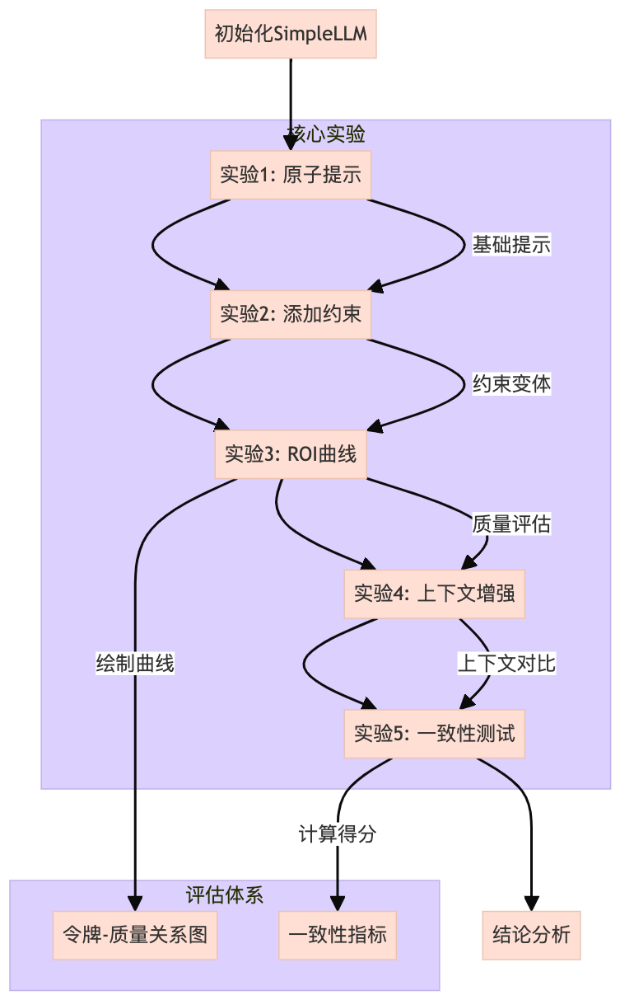

## 1）整体理解

**⭐️目标与作用 &#x20;**

* 演示原子提示对 LLM 输出的影响，探索提示工程中"最小有效提示"的设计原则 &#x20;

* 通过实验展示提示约束、上下文增强与输出质量的关系 &#x20;

* 建立提示复杂度与模型响应 ROI（投资回报率）的评估框架 &#x20;


**⭐️使用场景 &#x20;**

* 提示工程初学者学习基础概念 &#x20;

* 研究人员进行提示设计的效果基准测试 &#x20;

* 开发者优化 API 调用成本与输出质量的平衡 &#x20;


**⭐️核心概念与术语 &#x20;**

* **原子提示**：不可再分割的最小有效指令单元 &#x20;

* **协议化外壳**：包裹核心指令的结构化模板 &#x20;

* **上下文漂移**：添加信息导致的输出偏离现象 &#x20;

* **ROI 曲线**：提示令牌数与输出质量的性价比关系 &#x20;

* **一致性得分**：相同提示多次响应的稳定程度 &#x20;


***

## 2）代码流程图




## 3）代码中的难点以及解释

1. **原子提示的边界判定** &#x20;

   * 解释： 代码中通过逐步添加约束来探索"最小有效提示"的临界点，但实际边界需结合具体任务判定 &#x20;

   * 影响： 直接影响后续 ROI 曲线的准确性，过度简化可能导致实验结论偏差 &#x20;

2. **虚拟 LLM 的仿真度** &#x20;

   * 解释： SimpleLLM 类仅模拟 token 计数，无法反映真实 API 的响应多样性 &#x20;

   * 影响： 一致性测试结果仅为占位值，实际应用需接入真实 API &#x20;

3) **质量评分的主观性** &#x20;

   * 解释： quality\_scores 使用硬编码值，缺乏客观评估标准 &#x20;

   * 影响： ROI 曲线可能无法反映真实场景下的性价比关系 &#x20;


## 4）扩展问题

| 序号 | 问题                 | 回答                                                   |
| -- | ------------------ | ---------------------------------------------------- |
| 1  | 如何定义真正的"原子提示"？     | 应满足：1） 包含完整指令意图 2） 不可删除任何单词 3） 在目标场景下保持稳定输出          |
| 2  | 为什么俳句示例中令牌增加但质量提升？ | 结构化约束（5-7-5 音节）减少了模型决策空间，引导输出更符合预期                   |
| 3  | 实际项目中如何应用这些结论？     | 建议：1） 先构建原子核心 2） 逐步添加必要约束 3） 监控 ROI 拐点 4） 最后封装为协议化外壳 |


***

```python
#!/usr/bin/env python3
# -*- coding: utf-8 -*-
"""
最小提示探索：上下文工程基础
==============================================================

本笔记本通过探索最小的原子提示及其对大语言模型（LLM）输出和行为的直接影响，介绍上下文工程的核心原则。

涵盖的关键概念：
1. 构建原子提示以实现最大清晰度和可控性
2. 通过令牌计数和模型响应质量衡量有效性
3. 迭代修改提示以实现快速反馈循环
4. 观察上下文漂移和最小提示边界
5. 从原子提示扩展到协议化外壳的基础

用法：
    # 在Jupyter或Colab中：
    %run 01_min_prompt.py
    # 或者
    # 独立编辑和运行每个部分，以试验提示效果

注意事项：
    - 本笔记本的每个部分都设计用于实践实验。
    - 修改提示并观察分词和输出保真度的变化。
    - 将此作为构建高级上下文工程工作流程的基础。


"""
以下为源代码（注释已翻译为中文）
"""


import os
import time
import json
from typing import Dict, List, Any, Tuple, Optional
import matplotlib.pyplot as plt

# 如果使用OpenAI的API，请取消注释这些行并添加你的API密钥
# import openai
# openai.api_key = os.getenv("OPENAI_API_KEY")  # 将你的API密钥设置为环境变量

# 如果使用其他提供商，请相应调整
# 用于演示目的的虚拟LLM类
class SimpleLLM:
    """用于演示的最小LLM接口。"""
    
    def __init__(self, model_name: str = "dummy-model"):
        """初始化LLM接口。"""
        self.model_name = model_name
        self.total_tokens_used = 0
        self.total_requests = 0
        
    def count_tokens(self, text: str) -> int:
        """
        使用非常简单的近似方法计算文本中的标记数。
        在生产环境中，请使用特定于模型的分词器。
        """
        # 这是一个极其粗略的近似，实际应用中请使用合适的分词器
        return len(text.split())
    
    def generate(self, prompt: str) -> str:
        """
        根据提示生成文本（模拟实现）。
        在实际的笔记本中，这将调用实际的大语言模型 API。
        """
        # 在实际实现中，这将调用 API
        # response = openai.ChatCompletion.create(
        #     model="gpt-4",
        #     messages=[{"role": "user", "content": prompt}]
        # )
        # return response.choices[0].message.content
        
        # 为了演示目的，我们仅确认提示
        tokens = self.count_tokens(prompt)
        self.total_tokens_used += tokens
        self.total_requests += 1
        
        return f"[大语言模型的响应将显示在这里。您的提示大约使用了 {tokens} 个标记。]"
    
    def get_stats(self) -> Dict[str, Any]:
        """返回使用统计信息。"""
        return {
            "total_tokens": self.total_tokens_used,            "total_requests": self.total_requests,
            "avg_tokens_per_request": self.total_tokens_used / max(1, self.total_requests)
        }

# 初始化我们的大语言模型接口
llm = SimpleLLM()

# ----- 实验 1：原子提示 -----
print("\n----- 实验 1：原子提示 -----")
print("让我们从最基本的单元开始：单个指令。")

原子提示 = "写一首关于编程的短诗。"
tokens = llm.count_tokens(原子提示)

print(f"\n原子提示: '{原子提示}'")
print(f"令牌计数: {tokens}")
print("\n正在生成响应...")
response = llm.generate(原子提示)
print(f"\n响应:\n{response}")

# ----- 实验 2：添加约束 -----
print("\n----- 实验 2：添加约束 -----")
print("现在让我们给原子提示添加约束，观察差异。")

# 让我们创建三个约束逐渐增加的版本
prompts = [
    "写一首关于编程的短诗。",  # 原始
    "写一首四行的关于编程的短诗。",  # 添加长度约束
    "写一首只用简单词汇的关于编程的短俳句。"  # 格式和词汇约束
]

# 测量令牌并生成响应
results = []
for i, prompt in enumerate(prompts):
    tokens = llm.count_tokens(prompt)
    print(f"\n提示 {i+1}: '{prompt}'")
    print(f"令牌计数: {tokens}")
    
    start_time = time.time()
    response = llm.generate(prompt)
    end_time = time.time()results.append({
    "prompt": prompt,
    "tokens": tokens,
    "response": response,
    "latency": end_time - start_time
})

print(f"延迟: {results[-1]['latency']:.4f} 秒")
print(f"响应:\n{response}")

# ----- 实验 3: 测量 ROI 曲线 -----
print("\n----- 实验 3: 测量 ROI 曲线 -----")
print("让我们探索提示复杂度与输出质量之间的关系。")

# 在实际的笔记本中，你会为每个响应定义主观质量分数
# 对于这个演示，我们将使用占位符值
quality_scores = [3, 6, 8]  # 1-10 分的占位符主观分数

# 绘制令牌与质量的关系图
plt.figure(figsize=(10, 6))
tokens_list = [r["tokens"] for r in results]
plt.plot(tokens_list, quality_scores, marker='o', linestyle='-', color='blue')
plt.xlabel('提示中的令牌数')
plt.ylabel('输出质量 (1-10)')
plt.title('令牌-质量 ROI 曲线')
plt.grid(True)

# 添加注释
for i, (x, y) in enumerate(zip(tokens_list, quality_scores)):
    plt.annotate(f"提示 {i+1}", (x, y), textcoords="offset points", 
                 xytext=(0, 10), ha='center')

# 显示图表（在 Jupyter 中会内联显示）
# plt.show()
print("[在 Jupyter 环境中这里会显示一个图表]")

# ----- 实验 4: 最小上下文增强 -----
print("\n----- 实验 4: 最小上下文增强 -----")
print("现在我们将添加最小的上下文来提高输出质量，同时保持令牌数较低。")

# 让我们创建一个带有少量策略性上下文的提示
enhanced_prompt = """任务: 写一首关于编程的俳句。

俳句是一种三行诗，每行分别有 5、7 和 5 个音节。

"""专注于解决困难bug的感觉。

tokens = llm.count_tokens(enhanced_prompt)
print(f"\n增强提示:\n'{enhanced_prompt}'")
print(f"令牌计数: {tokens}")

response = llm.generate(enhanced_prompt)
print(f"\n响应:\n{response}")

# ----- 实验5: 测量一致性 -----
print("\n----- 实验5: 测量一致性 -----")
print("让我们测试最小提示与增强提示的输出一致性如何。")

# 生成多个响应并测量一致性的函数
def measure_consistency(prompt: str, n_samples: int = 3) -> Dict[str, Any]:
    """生成多个响应并测量一致性指标。"""
    responses = []
    total_tokens = 0
    
    for _ in range(n_samples):
        response = llm.generate(prompt)
        responses.append(response)
        total_tokens += llm.count_tokens(prompt)
    
    # 在实际的笔记本中，你会实现适当的一致性指标
    # 例如响应之间的语义相似度
    consistency_score = 0.5  # 占位值
    
    return {
        "prompt": prompt,
        "responses": responses,
        "total_tokens": total_tokens,
        "consistency_score": consistency_score
    }

# 比较基本提示与增强提示
basic_results = measure_consistency(prompts[0])
enhanced_results = measure_consistency(enhanced_prompt)

print(f"\n基本提示一致性得分: {basic_results['consistency_score']}")print(f"增强提示一致性得分: {enhanced_results['consistency_score']}")

# ----- 结论 -----
print("\n----- 结论 -----")
print("我们实验的关键见解:")
print("1. 即使对提示进行少量添加，也会显著影响输出质量")
print("2. 存在一条ROI曲线，其中令牌数量和质量达到最佳平衡")
print("3. 添加最少但有策略性的上下文可以提高一致性")
print("4. 最佳提示清晰、简洁，并提供足够的上下文")

print("\n本笔记本中使用的总令牌数:", llm.get_stats()["total_tokens"])

# ----- 下一步 -----
print("\n----- 下一步 -----")
print("1. 使用真实的LLM API进行这些实验")
print("2. 实施适当的一致性和质量指标")
print("3. 探索“分子”概念 - 组合多个指令")
print("4. 在上下文窗口中尝试少样本示例")

"""
读者练习:

1. 将此笔记本连接到真实的LLM API (OpenAI、Anthropic等)
2. 使用不同模型大小测试相同的提示
3. 为你关心的任务创建自己的令牌质量曲线
4. 为你的特定用例找到“最小可行上下文”

有关更高级的上下文工程技术，请参阅02_expand_context.ipynb!
"""

# 如果这是一个Jupyter笔记本，我们会在这里将结果保存到文件中
# with open('experiment_results.json', 'w') as f:
#     json.dump(results, f, indent=2)
```
