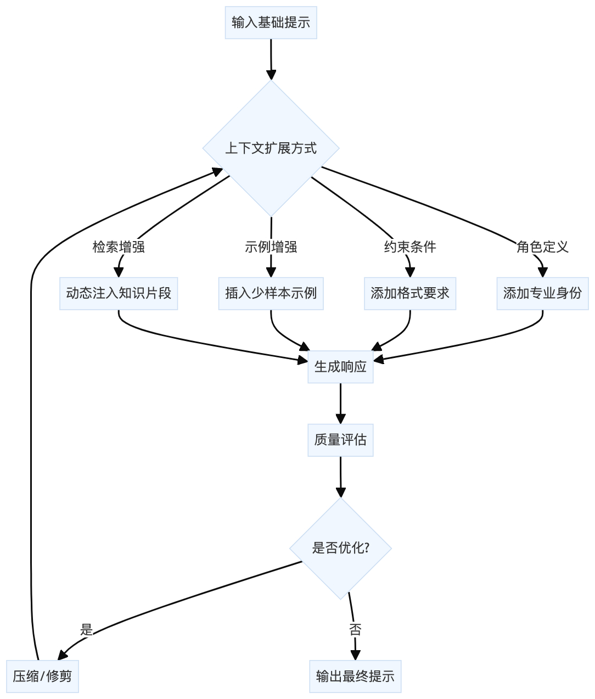

## 1）整体理解

⭐️核心目标 &#x20;

* 建立从原子提示到分层上下文的系统演进方法 &#x20;

* 开发可量化的上下文扩展评估框架（令牌效率/质量评分） &#x20;

* 实现上下文压缩与优化的自动化技术 &#x20;


⭐️技术演进 &#x20;


⭐️关键创新点 &#x20;

1. **分层测试机制**：可独立评估每个上下文层的贡献值 &#x20;

2. **质量评估函数**：通过LLM自评实现响应质量量化 &#x20;

3) **RAG集成**：动态上下文扩展与静态提示的结合范式 &#x20;


## 2）代码流程图（核心逻辑）




## 3）关键技术实现

### 3.1 分层评估系统

```python
def test_layered_contexts():
    # 独立测试每层上下文
    for layer in context_layers:
        test_prompt = base_prompt + layer
        # 测量令牌/质量/延迟...
```

**创新点**： &#x20;

* 量化每层上下文对最终效果的边际贡献 &#x20;

* 通过控制变量法识别冗余层 &#x20;

### 3.2 动态修剪算法

```python
def prune_context_layers():
    while True:
        # 测试移除每层后的质量变化
        best_config = find_best_subset()
        if no_improvement:
            break
```

**优化逻辑**： &#x20;

1. 计算全量上下文的基准质量 &#x20;

2. 通过贪心算法移除对质量影响最小的层 &#x20;

3) 递归执行直到质量开始下降&#x20;

### 3.3 检索增强流程

```python
def create_rag_context():
    relevant_info = retrieve_relevant_info(query, knowledge_base)
    return base_prompt + "\n\n" + relevant_info
```

**数据流**： &#x20;

```plain&#x20;text
用户问题 → 向量检索 → 知识片段 → 提示组合 → LLM生成
```


## 4）扩展分析

| 序号 | 关键问题             | 技术方案                                         |
| -- | ---------------- | -------------------------------------------- |
| 1  | 如何平衡上下文丰富度与令牌效率？ | 引入ROI曲线分析，计算每增加100令牌的质量提升边际效应                |
| 2  | 动态修剪会丢失重要信息吗？    | 采用强化学习框架，对修剪决策进行长期效果评估                       |
| 3  | 检索增强的冷启动问题？      | 构建分层知识库：\<br>• 高频问题：硬编码到基础提示\<br>• 长尾问题：实时检索 |


## 5）典型应用场景

**场景1：技术文档生成** &#x20;

```python
create_expanded_context(
    base_prompt="生成Python API文档",
    role="资深Python开发工程师",
    constraints=["使用Google风格注释", "包含类型注解"],
    examples=[example_docstring]
)
```

**场景2：教育内容定制** &#x20;

```python
prune_context_layers(
    base_prompt="讲解量子计算基础",
    layers={
        "数学预备": "...", 
        "历史背景": "...",
        "应用实例": "..."
    },
    criteria=["学生理解度", "概念准确性"]
)
```


## 6）演进方向建议

1. **上下文感知压缩**： &#x20;

   * 基于注意力机制识别可压缩段落 &#x20;

   * 示例：使用LLM生成上下文摘要指令 &#x20;

2. **动态层权重调整**： &#x20;

   ```python
   def adjust_layer_weights():
       for layer in active_layers:
           layer.weight = quality_impact / token_cost
   ```


3) **跨会话上下文管理**： &#x20;

   * 持久化高价值上下文层 &#x20;

   * 建立上下文版本控制系统 &#x20;


该框架为构建企业级提示工程系统提供了完整方法论，特别适合需要平衡质量与成本的生产环境应用。


"""
以下为源代码（注释已翻译为中文）
"""


````python
#!/usr/bin/env python
# -*- coding: utf-8 -*-
"""
上下文扩展技术：从提示到分层上下文
=============================================================

本笔记本介绍了将基本提示演变为分层、信息丰富的上下文的实用策略，这些上下文可提升大语言模型（LLM）的性能。重点在于实用的上下文工程：如何有策略地添加和构建上下文层，以及系统地衡量对令牌使用和输出质量的影响。

涵盖的关键概念：
1. 将最小提示转换为扩展的、富含上下文的结构
2. 上下文分层和组合式提示工程的原则
3. 随着上下文增长对令牌使用的定量测量
4. 对模型输出改进的定性评估
5. 上下文细化和优化的迭代方法

使用方法：
    # 在Jupyter或Colab中：
    %run 02_context_expansion.py
    # 或者
    # 逐步执行笔记本单元格，修改上下文层并观察效果

注意事项：
    - 每个部分都是模块化的——通过编辑和运行不同的上下文层进行实验。
    - 跟踪额外的上下文如何改变成本（令牌计数）和性能（输出质量）。
    - 用作开发高级上下文工程协议的实用基础。
"""

## 设置和先决条件

让我们首先导入必要的库：


```python
import os
import json
import time
import tiktoken  # OpenAI的分词器
import numpy as np
import matplotlib.pyplot as plt
from typing import Dict, List, Tuple, Any, Optional, Union

# 加载环境变量（你需要在.env文件中添加API密钥）
# 对于OpenAI API密钥
import dotenv
dotenv.load_dotenv()

# 定义API客户端（根据你的偏好选择一个）
USE_OPENAI = True  # 设置为False以使用其他提供商

if USE_OPENAI:

```from openai import OpenAI
client = OpenAI()
MODEL = "gpt-3.5-turbo"  # 你可以更改为 gpt-4 或其他模型
else:
    # 在这里添加替代 API 客户端设置
    # 例如，Anthropic、Cohere 等
    pass

# 令牌计数器设置
tokenizer = tiktoken.encoding_for_model(MODEL) if USE_OPENAI else None

def count_tokens(text: str) -> int:
    """使用适当的分词器计算字符串中的令牌数。"""
    if tokenizer:
        return len(tokenizer.encode(text))
    # 非 OpenAI 模型的回退方法（粗略近似）
    return len(text.split()) * 1.3  # 粗略近似

def measure_latency(func, *args, **kwargs) -> Tuple[Any, float]:
    """测量函数的执行时间。"""
    start_time = time.time()
    result = func(*args, **kwargs)
    end_time = time.time()
    return result, end_time - start_time
```

## 1. 理解上下文扩展

在之前的笔记本（`01_min_prompt.ipynb`）中，我们探讨了原子提示的基础知识。现在我们将了解如何战略性地将这些原子扩展为分子（更丰富的上下文结构）。

让我们定义一些用于衡量上下文有效性的实用函数：


```python
def calculate_metrics(prompt: str, response: str, latency: float) -> Dict[str, float]:
    """计算提示 - 响应配对的关键指标。"""
    prompt_tokens = count_tokens(prompt)
    response_tokens = count_tokens(response)
    
    # 简单的令牌效率（响应令牌数 / 提示令牌数）
    token_efficiency = response_tokens / prompt_tokens if prompt_tokens > 0 else 0
    
    # 每 1k 令牌的延迟latency_per_1k = (latency / prompt_tokens) * 1000 if prompt_tokens > 0 else 0

return {
    "prompt_tokens": prompt_tokens,
    "response_tokens": response_tokens,
    "token_efficiency": token_efficiency,
    "latency": latency,
    "latency_per_1k": latency_per_1k
}

def generate_response(prompt: str) -> Tuple[str, float]:
    """从大语言模型生成响应并测量延迟。"""
    if USE_OPENAI:
        start_time = time.time()
        response = client.chat.completions.create(
            model=MODEL,
            messages=[{"role": "user", "content": prompt}],
            temperature=0.7,
            max_tokens=500
        )
        latency = time.time() - start_time
        return response.choices[0].message.content, latency
    else:
        # 在此添加你的替代 API 调用
        pass
```

## 2. 实验：上下文扩展技术

让我们研究不同的技术来扩展基本提示，并测量每次扩展的影响：


```python
# 基础提示（原子）
base_prompt = "写一段关于气候变化的段落。"

# 扩展提示变体（分子）
expanded_prompts = {
    "base": base_prompt,
    
    "with_role": """你是一位在气候系统方面有专业知识的环境科学家。
写一段关于气候变化的段落。""",with_examples": """写一段关于气候变化的段落。

示例1：
气候变化是指温度和天气模式的长期变化。自19世纪以来，人类活动一直是气候变化的主要驱动因素，主要是因为燃烧煤炭、石油和天然气等化石燃料，这些活动会产生吸热气体。

示例2：
全球气候变化在极端天气事件频率增加、海平面上升和野生动植物种群迁移中显而易见。科学共识指出，人类活动是主要原因。"""

"with_constraints": """写一段关于气候变化的段落。
- 至少包含一个带数字的科学事实
- 提及原因和影响
- 以行动呼吁结尾
- 保持信息性但通俗易懂的语气"""

"with_audience": """为刚开始学习环境科学的高中生写一段关于气候变化的段落。使用清晰的解释和相关的例子。"""

"comprehensive": """你是一位在气候系统方面有专长的环境科学家。

为刚开始学习环境科学的高中生写一段关于气候变化的段落。""刚刚开始学习环境科学。使用清晰的解释和相关的例子。

指导原则：
- 至少包含一个带有数字的科学事实
- 提及原因和影响
- 以行动呼吁结尾
- 保持信息性但易于理解的语气

语气和结构示例：
“海洋酸化发生在海水从大气中吸收二氧化碳时，导致pH值下降。自工业革命以来，海洋pH值下降了0.1个单位，酸度增加了30%。这影响了海洋生物，特别是贝类和珊瑚礁，因为它损害了它们形成外壳和骨骼的能力。科学家预测，如果排放继续以目前的速度进行，到2100年，海洋酸度可能会增加150%，这将对海洋生态系统造成毁灭性影响。通过采取使用公共交通工具等简单行动来减少我们的碳足迹，我们可以帮助保护这些重要的海洋栖息地。”

# 运行实验
results = {}
responses = {}

for name, prompt in expanded_prompts.items():
    print(f"测试提示：{name}")
    response, latency = generate_response(prompt)
    responses[name] = responsemetrics = calculate_metrics(prompt, response, latency)
results[name] = metrics
print(f"  提示词令牌数: {metrics['prompt_tokens']}")
print(f"  回复令牌数: {metrics['response_tokens']}")
print(f"  延迟: {metrics['latency']:.2f}秒")
print("-" * 40)
```

## 3. 可视化和分析结果


```python
# 准备可视化数据
prompt_types = list(results.keys())
prompt_tokens = [results[k]['prompt_tokens'] for k in prompt_types]
response_tokens = [results[k]['response_tokens'] for k in prompt_types]
latencies = [results[k]['latency'] for k in prompt_types]

# 创建包含多个子图的图形
fig, axes = plt.subplots(2, 2, figsize=(14, 10))

# 图1: 令牌使用情况
axes[0, 0].bar(prompt_types, prompt_tokens, label='提示词令牌', alpha=0.7, color='blue')
axes[0, 0].bar(prompt_types, response_tokens, bottom=prompt_tokens, label='回复令牌', alpha=0.7, color='green')
axes[0, 0].set_title('按提示词类型划分的令牌使用情况')
axes[0, 0].set_ylabel('令牌数')
axes[0, 0].legend()
plt.setp(axes[0, 0].get_xticklabels(), rotation=45, ha='right')

# 图2: 令牌效率 (回复令牌数 / 提示词令牌数)
token_efficiency = [results[k]['token_efficiency'] for k in prompt_types]
axes[0, 1].bar(prompt_types, token_efficiency, color='purple', alpha=0.7)
axes[0, 1].set_title('令牌效率 (回复/提示词)')
axes[0, 1].set_ylabel('效率比率')
plt.setp(axes[0, 1].get_xticklabels(), rotation=45, ha='right')

# 图3: 延迟
axes[1, 0].
```bar(prompt_types, latencies, color='red', alpha=0.7)
axes[1, 0].set_title('响应延迟')
axes[1, 0].set_ylabel('秒')
plt.setp(axes[1, 0].get_xticklabels(), rotation=45, ha='right')

# 图4：每1000个令牌的延迟
latency_per_1k = [results[k]['latency_per_1k'] for k in prompt_types]
axes[1, 1].bar(prompt_types, latency_per_1k, color='orange', alpha=0.7)
axes[1, 1].set_title('每1000个令牌的延迟')
axes[1, 1].set_ylabel('每1000个令牌的秒数')
plt.setp(axes[1, 1].get_xticklabels(), rotation=45, ha='right')

plt.tight_layout()
plt.show()

```

## 4. 定性分析

让我们检查实际响应以评估质量差异：

```python
for name, response in responses.items():
    print(f"=== {name}提示的响应 ===")
    print(response)
    print("\n" + "=" * 80 + "\n")
```

## 5. 上下文扩展模式

根据我们的实验，我们可以确定几种有效的上下文扩展模式：

1. **角色分配**：定义模型应扮演的角色
2. **少样本示例**：提供示例输出以指导响应格式和质量
3. **约束定义**：为响应设置边界和要求
4. **受众指定**：明确响应的目标受众
5. **综合上下文**：策略性地组合多个上下文元素

让我们将这些模式形式化为一个可重复使用的模板：def create_expanded_context(
    base_prompt: str, 
    role: Optional[str] = None,
    examples: Optional[List[str]] = None,
    constraints: Optional[List[str]] = None,
    audience: Optional[str] = None,
    tone: Optional[str] = None,
    output_format: Optional[str] = None
) -> str:
    """
    从基本提示和可选组件创建扩展上下文。
    
    参数:
        base_prompt: 核心指令或问题
        role: 模型应扮演的角色
        examples: 指导模型的示例输出列表
        constraints: 要求或边界列表
        audience: 输出的目标受众
        tone: 期望的回复语气
        output_format: 特定的格式要求
        
    返回:
        扩展上下文，以字符串形式呈现
    """
    context_parts = []
    
    # 如果提供了角色，则添加角色
    if role:
        context_parts.append(f"你是 {role}。")
    
    # 添加基本提示
    context_parts.append(base_prompt)
    
    # 如果提供了受众，则添加受众
    if audience:
        context_parts.append(f"你的回复应适合 {audience}。")
    
    # 如果提供了语气，则添加语气
    if tone:
        context_parts.append(f"在回复中使用 {tone} 的语气。")
    
    # 如果提供了输出格式，则添加输出格式if output_format:
    context_parts.append(f"以 {output_format} 格式输出你的回答。")

# 如果提供了约束条件，则添加
if constraints and len(constraints) > 0:
    context_parts.append("要求：")
    for constraint in constraints:
        context_parts.append(f"- {constraint}")

# 如果提供了示例，则添加
if examples and len(examples) > 0:
    context_parts.append("示例：")
    for i, example in enumerate(examples, 1):
        context_parts.append(f"示例 {i}:\n{example}")

# 用适当的行间距连接所有部分
expanded_context = "\n\n".join(context_parts)

return expanded_context
```

让我们用一个新的提示来测试我们的模板：


```python
# 测试我们的模板
new_base_prompt = "解释光合作用是如何工作的。"

new_expanded_context = create_expanded_context(
    base_prompt=new_base_prompt,
    role="一位有15年经验的生物老师",
    audience="中学生",
    tone="热情且富有教育性",
    constraints=[
        "使用植物与工厂的类比",
        "提及叶绿素的作用",
        "解释对地球生态系统的重要性",
        "保持在200字以内"
    ],
    examples=[
        "光合作用就像植物内部的一个小工厂。就像工厂需要原材料、能源和工人来生产产品一样，植物需要二氧化碳、水、阳光和叶绿素来制造葡萄糖（糖）和氧气。阳光是能源，叶绿素分子是捕获这种能量的工人，而二氧化碳和水是原材料。工厂的产品是葡萄糖，植物用它来生长和储存能量，以及氧气，它被释放到空气中供我们这样的动物呼吸。这个过程对地球上的生命至关重要，因为它提供了我们所需的氧气，并从大气中去除了二氧化碳。"
    ]
))

print("模板生成的扩展上下文：")
print("-" * 80)
print(new_expanded_context)
print("-" * 80)
print(f"令牌数量：{count_tokens(new_expanded_context)}")

# 使用我们的扩展上下文生成响应
response, latency = generate_response(new_expanded_context)
metrics = calculate_metrics(new_expanded_context, response, latency)

print("\n响应：")
print("-" * 80)
print(response)
print("-" * 80)
print(f"响应令牌：{metrics['response_tokens']}")
print(f"延迟：{metrics['latency']:.2f}秒")
```

## 6. 高级上下文扩展：层优化

在实际应用中，我们需要在上下文丰富度和令牌效率之间找到最佳平衡。让我们通过一种系统的方法来试验上下文层优化：


```python
def test_layered_contexts(base_prompt: str, context_layers: Dict[str, str]) -> Dict[str, Dict]:
    """
    测试不同的上下文层组合，以找到最佳配置。
    
    参数：
        base_prompt：核心指令
        context_layers：层名称 -> 层内容的字典
        
    返回：
        结果字典，包含每个测试配置的指标
    """
    layer_results = {}
    
    # 单独测试基本提示
    print("正在测试基本提示...")
    base_response, base_latency = generate_response(base_prompt)
    layer_results["base"] = {
        "prompt": base_prompt,
        "response": base_response,
        **calculate_metrics(base_prompt, base_response, base_latency)
    }
    
    # 测试每个层单独添加到基本提示的情况
    for layer_name, layer_content in context_layers.items():
        combined_prompt = f"{base_prompt}\n\n{layer_content}"print(f"测试基础 + {layer_name}...")
response, latency = generate_response(combined_prompt)
layer_results[f"base+{layer_name}"] = {
    "prompt": combined_prompt,
    "response": response,
    **calculate_metrics(combined_prompt, response, latency)
}

# 测试所有层组合
all_layers = "\n\n".join(context_layers.values())
full_prompt = f"{base_prompt}\n\n{all_layers}"
print("测试所有层组合...")
full_response, full_latency = generate_response(full_prompt)
layer_results["all_layers"] = {
    "prompt": full_prompt,
    "response": full_response,
    **calculate_metrics(full_prompt, full_response, full_latency)
}

return layer_results

# 定义基础提示和单独的上下文层
layer_test_prompt = "编写代码以实现一个简单的天气应用程序。"

context_layers = {
    "role": "你是一位在全栈开发和 UI/UX 设计方面有专业知识的资深软件工程师。",
    "requirements": """要求：
- 应用程序应显示当前温度、天气状况和未来 3 天的天气预报
- 它应允许用户按城市名称搜索天气
- 它应具有简洁、响应式的界面
- 应用程序应能优雅地处理错误状态""",
    "tech_stack": """技术规格：
- 使用 HTML、CSS 和原生 JavaScript（无框架）
- 使用 OpenWeatherMap API 获取天气数据
- 所有代码应注释良好并遵循最佳实践
- 包括 HTML 结构和 JavaScript 功能""",
    "example": """示例结构（但需改进）：
```html
<!DOCTYPE html>
<html>
<head>
    <title>天气应用程序</title>
"""<link rel="stylesheet" href="styles.css">
</head>
<body>
    <div class="container">
        <h1>天气应用</h1>
        <div class="search">
            <input type="text" placeholder="输入城市名称">
            <button>搜索</button>
        </div>
        <div class="weather-display">
            <!-- 天气数据将显示在这里 -->
        </div>
    </div>
    <script src="app.js"></script>
</body>
</html>
```"""
}

# 运行分层优化测试
layer_test_results = test_layered_contexts(layer_test_prompt, context_layers)
```

让我们可视化分层优化测试的结果：


```python
# 提取用于可视化的数据
config_names = list(layer_test_results.keys())
prompt_sizes = [layer_test_results[k]['prompt_tokens'] for k in config_names]
response_sizes = [layer_test_results[k]['response_tokens'] for k in config_names]
efficiencies = [layer_test_results[k]['token_efficiency'] for k in config_names]

# 创建可视化
fig, axes = plt.subplots(2, 1, figsize=(12, 10))

# 图 1：按配置的令牌使用情况
axes[0].bar(config_names, prompt_sizes, label='提示令牌', alpha=0.7, color='blue')
axes[0].bar(config_names, response_sizes, label='响应令牌', alpha=0.7, color='green')
axes[0].set_title('按上下文配置的令牌使用情况')
axes[0].set_ylabel('令牌数量')
axes[0].legend()
plt.setp(axes[0].get_xticklabels(), rotation=45, ha='right')

# 图2：按配置划分的令牌效率
axes[1].bar(config_names, efficiencies, color='purple', alpha=0.7)
axes[1].set_title('按上下文配置划分的令牌效率')
axes[1].set_ylabel('效率比（响应/提示）')
plt.setp(axes[1].get_xticklabels(), rotation=45, ha='right')

plt.tight_layout()
plt.show()

# 确定最有效的配置
most_efficient = max(config_names, key=lambda x: layer_test_results[x]['token_efficiency'])
print(f"最节省令牌的配置: {most_efficient}")
print(f"效率比: {layer_test_results[most_efficient]['token_efficiency']:.2f}")
```

## 7. 上下文压缩技术

随着我们扩展上下文，通常需要优化令牌使用。让我们探索一些上下文压缩技术：


```python
def compress_context(context: str, technique: str = 'summarize') -> str:
    """
    应用不同的压缩技术，在保留含义的同时减少令牌使用。
    
    参数:
        context: 要压缩的上下文
        technique: 要使用的压缩技术（总结、关键词、要点）
        
    返回:
        压缩后的上下文
    """
    if technique == 'summarize':
        # 使用大语言模型总结上下文
        prompt = f"""以简洁的方式总结以下上下文，保留所有关键信息
但使用更少的单词。专注于基本指令和细节：

{context}"""
        compressed, _ = generate_response(prompt)
        return compressed
    
    elif technique == 'keywords':
        # 提取关键术语和短语
        prompt = f"""从这个上下文中提取最重要的关键词、短语和指令：
```{context}

将你的响应格式化为以逗号分隔的关键术语和短词组列表。"""
        keywords, _ = generate_response(prompt)
        return keywords
    
    elif technique == 'bullet':
        # 转换为项目符号列表
        prompt = f"""将此上下文转换为简洁、结构化的项目符号列表，用最少的文字捕捉所有关键信息：

{context}"""
        bullets, _ = generate_response(prompt)
        return bullets
    
    else:
        return context  # 不进行压缩

# 在我们的综合示例上测试压缩效果
original_context = expanded_prompts["comprehensive"]
print(f"原始上下文的令牌数: {count_tokens(original_context)}")

for technique in ['summarize', 'keywords', 'bullet']:
    compressed = compress_context(original_context, technique)
    compression_ratio = count_tokens(compressed) / count_tokens(original_context)
    print(f"\n{technique.upper()} 压缩:")
    print("-" * 80)
    print(compressed)
    print("-" * 80)
    print(f"压缩后的令牌数: {count_tokens(compressed)}")
    print(f"压缩率: {compression_ratio:.2f}（越低越好）")
```

## 8. 上下文修剪：删除无用内容

有时添加上下文层并不能提高性能。让我们实现一种方法来衡量和修剪不必要的上下文：


```python
def evaluate_response_quality(prompt: str, response: str, criteria: List[str]) -> float:
    """
    使用大语言模型根据特定标准评估响应的质量。
    
    参数:
        prompt: 生成响应的提示
        response: 要评估的响应
        criteria: 用于评估的标准列表
        
    返回:
        0.0 到 1.0 之间的质量得分
    """criteria_list = "\n".join([f"- {c}" for c in criteria])
eval_prompt = f"""对以下对提示的响应质量进行评分。

提示：
{prompt}

响应：
{response}

请根据以下标准进行评估：
{criteria_list}

对于每个标准，从0-10进行评分，然后给出一个0.0到1.0的总体得分，其中
1.0表示完美，0.0表示完全不合格。将你的响应格式设置为：

标准1：[得分] - [简要评论]
标准2：[得分] - [简要评论]
...
总体得分：[0.0-1.0]
"""

evaluation, _ = generate_response(eval_prompt)

# 提取总体得分
try:
    # 查找 "总体得分：" 后面最后出现的小数
    import re
    score_match = re.findall(r"总体得分：\s*([0-9]*\.?[0-9]+)", evaluation)
    if score_match:
        return float(score_match[-1])
    else:
        return 0.5  # 解析失败时的默认值
except:
    return 0.5  # 解析失败时的默认值

def prune_context_layers(base_prompt: str, layers: Dict[str, str], criteria: List[str]) -> Tuple[str, Dict]:
    """
    系统地测试并修剪那些不能提高响应质量的上下文层。

    参数：
        base_prompt：核心指令
        layers：上下文层名称 -> 内容的字典
        criteria：响应的评估标准
"""返回值:
    元组，包含(优化后的提示词, 结果字典)
"""
print("正在测试基线...")
base_response, base_latency = generate_response(base_prompt)
base_quality = evaluate_response_quality(base_prompt, base_response, criteria)

results = {
    "base": {
        "prompt": base_prompt,
        "response": base_response,
        "quality": base_quality,
        "tokens": count_tokens(base_prompt),
        "latency": base_latency
    }
}

# 添加所有层
all_layers_text = "\n\n".join(layers.values())
full_prompt = f"{base_prompt}\n\n{all_layers_text}"
print("正在测试所有层...")
full_response, full_latency = generate_response(full_prompt)
full_quality = evaluate_response_quality(full_prompt, full_response, criteria)

results["all_layers"] = {
    "prompt": full_prompt,
    "response": full_response,
    "quality": full_quality,
    "tokens": count_tokens(full_prompt),
    "latency": full_latency
}

# 测试每次移除一层
best_quality = full_quality
best_config = "all_layers"

for layer_to_remove in layers.keys():
    remaining_layers = {k: v for k, v in layers.items() if k!= layer_to_remove}
    remaining_text = "\n\n".join(remaining_layers.values())
    test_prompt = f"{base_prompt}\n\n{remaining_text}"print(f"正在测试不使用 '{layer_to_remove}'...")
test_response, test_latency = generate_response(test_prompt)
test_quality = evaluate_response_quality(test_prompt, test_response, criteria)

config_name = f"without_{layer_to_remove}"
results[config_name] = {
    "prompt": test_prompt,
    "response": test_response,
    "quality": test_quality,
    "tokens": count_tokens(test_prompt),
    "latency": test_latency
}

# 如果移除某一层能提高或保持质量，则更新最佳配置
if test_quality >= best_quality:
    best_quality = test_quality
    best_config = config_name

# 如果最佳配置是 "all_layers"，则返回完整提示
if best_config == "all_layers":
    return full_prompt, results

# 如果移除某一层提高了质量，则递归地进一步修剪
if best_config.startswith("without_"):
    removed_layer = best_config.replace("without_", "")
    remaining_layers = {k: v for k, v in layers.items() if k!= removed_layer}
    print(f"可以移除层 '{removed_layer}'。正在测试进一步修剪...")
    return prune_context_layers(base_prompt, remaining_layers, criteria)

return results[best_config]["prompt"], results

# 测试上下文修剪
pruning_test_prompt = "编写一篇关于如何使用 pandas 进行数据分析的教程。"

pruning_layers = {
    "role": "你是一位拥有 10 多年 Python 库教学经验的数据科学讲师。",
    "audience": "你的受众是理解基本编程概念但没有数据分析经验的初级 Python 程序员。",
    "structure": "按照以下部分来组织教程：简介、安装、加载数据、基本操作、数据清洗、数据可视化和一个实际示例。"
}"style": "使用友好、对话式的语气。包含带有解释每行代码的注释的代码片段。将复杂概念分解为简单的解释。",
"unnecessary": "包含有关pandas的历史及其开发团队的详细信息。提及pandas是由韦斯·麦金尼（Wes McKinney）于2008年在AQR资本管理公司（AQR Capital Management）工作时创建的。"
}

evaluation_criteria = [
    "完整性 - 涵盖所有基本概念",
    "清晰度 - 以易于理解的方式解释概念",
    "代码质量 - 提供有用、正确的代码示例",
    "对初学者友好 - 假设没有pandas的先验知识",
    "实用性 - 包含现实世界的应用"
]

# 取消注释以运行剪枝测试（运行需要时间）
# optimized_prompt, pruning_results = prune_context_layers(pruning_test_prompt, pruning_layers, evaluation_criteria)
# 
# print("\n优化后的提示：")
# print("-" * 80)
# print(optimized_prompt)
# print("-" * 80)
# 
# # 显示每个配置的质量分数
# for config, data in pruning_results.items():
#     print(f"{config}: 质量 = {data['quality']:.2f}, 令牌数 = {data['tokens']}")
```

## 9. 通过检索进行上下文扩展

对于现实世界的应用，我们通常需要用从外部来源检索到的相关信息来扩展上下文。让我们实现一个简单的检索增强上下文扩展：


```python
def retrieve_relevant_info(query: str, knowledge_base: List[Dict[str, str]]) -> List[str]:
    """
    根据查询从知识库中检索相关信息。
    
    参数：
        query: 搜索查询
        knowledge_base: 包含 'title' 和 'content' 键的字典列表
        
    返回：
        相关信息片段列表
    """
    # 在实际应用中，你会使用向量嵌入和相似度搜索
    # 对于这个示例，我们将使用简单的关键词匹配
    relevant_info = []query_terms = set(query.lower().split())

for item in knowledge_base:
    content = item['content'].lower()
    title = item['title'].lower()
    
    # 统计匹配的术语
    matches = sum(1 for term in query_terms if term in content or term in title)
    
    if matches > 0:
        relevant_info.append(item['content'])
    
return relevant_info[:3]  # 返回前3个匹配项

# 示例知识库（在实际应用中，这个知识库会大得多）
sample_knowledge_base = [
    {
        "title": "Pandas简介",
        "content": "Pandas是一个快速、强大、灵活且易于使用的开源数据分析和处理工具，基于Python编程语言构建。主要特性包括DataFrame对象、处理缺失数据和数据对齐。"
    },
    {
        "title": "Pandas安装",
        "content": "要安装pandas，请运行：pip install pandas。对于Anaconda用户，pandas是预安装的。你可以使用以下命令导入pandas：import pandas as pd"
    },
    {
        "title": "在Pandas中加载数据",
        "content": "Pandas可以从各种来源读取数据，包括CSV、Excel、SQL数据库和JSON。示例：df = pd.read_csv('data.csv')"
    },
    {
        "title": "使用Pandas进行数据清洗",
        "content": "Pandas提供了处理缺失数据的函数，如dropna()和fillna()。它还提供了删除重复项和转换数据的方法。"
    },
    {
        "title": "使用Pandas进行数据可视化",
        "content": "Pandas与matplotlib集成，提供绘图功能。简单的绘图可以使用df创建。"
    }
]plot()。对于更复杂的可视化，请使用：import matplotlib.pyplot as plt"
    }
]

def create_rag_context(base_prompt: str, query: str, knowledge_base: List[Dict[str, str]]) -> str:
    """
    通过将基本提示与相关信息相结合，创建检索增强上下文。
    
    参数：
        base_prompt：核心指令
        query：用于搜索相关信息的查询
        knowledge_base：要搜索的知识库
        
    返回：
        包含检索信息的扩展上下文
    """
    relevant_info = retrieve_relevant_info(query, knowledge_base)
    
    if not relevant_info:
        return base_prompt
    
    # 将检索到的信息作为上下文添加
    context_block = "相关信息：\n\n" + "\n\n".join(relevant_info)
    
    # 与基本提示结合
    rag_context = f"{base_prompt}\n\n{context_block}"
    
    return rag_context

# 测试检索增强上下文扩展
rag_test_prompt = "撰写一篇关于如何在 pandas 中加载数据并处理缺失值的简短教程。"
rag_context = create_rag_context(rag_test_prompt, "pandas 加载数据清理", sample_knowledge_base)

print("检索增强上下文：")
print("-" * 80)
print(rag_context)
print("-" * 80)
print(f"令牌计数：{count_tokens(rag_context)}")

# 使用 RAG 上下文生成响应
rag_response, rag_latency = generate_response(rag_context)
print("\nRAG 响应：")
print("-" * 80)
print(rag_response)
print("-" * 80)
```

## 10. 结论：上下文扩展最佳实践

根据我们的实验，以下是有效上下文扩展的关键最佳实践：

1.1. **从最小化开始**：从可能有效的最简单提示开始
2. **衡量影响**：跟踪每个扩展的令牌使用量、延迟和质量指标
3. **策略性分层**：以不同的模块化层添加上下文，这些层可以单独测试
4. **尽可能压缩**：使用摘要、要点或关键词来减少令牌使用量
5. **无情修剪**：删除不提高响应质量的上下文层
6. **使用模板**：为不同的上下文扩展模式创建可重复使用的模板
7. **考虑检索**：对于大型知识库，使用检索来动态扩展上下文
8. **平衡特异性与通用性**：更具体的上下文可减少幻觉，但可能会限制创造力

### 上下文扩展决策模板

```
1. 定义核心目标
   ↓
2. 创建最小化提示
   ↓
3. 衡量基线性能
   ↓
4. 确定潜在的上下文层
   │  - 角色分配
   │  - 少样本示例
   │  - 约束/要求
   │  - 受众说明
   │  - 语气/风格指导
   ↓
5. 单独测试每个层
   ↓
6. 组合有前景的层
   ↓
7. 衡量对以下方面的影响：
   │  - 令牌使用量
   │  - 响应质量
   │  - 延迟
   ↓
8. 修剪不必要的层
   ↓
9. 压缩剩余的上下文
   ↓
10. 最终优化（令牌效率）
```

请记住：目标不是创建尽可能大的上下文，而是创建最有效的上下文，以优化质量和效率。

## 下一步

在下一个笔记本（`03_control_loops.ipynb`）中，我们将探讨如何在这些上下文扩展技术的基础上，为多步骤大语言模型交互创建更复杂的控制流机制。
````