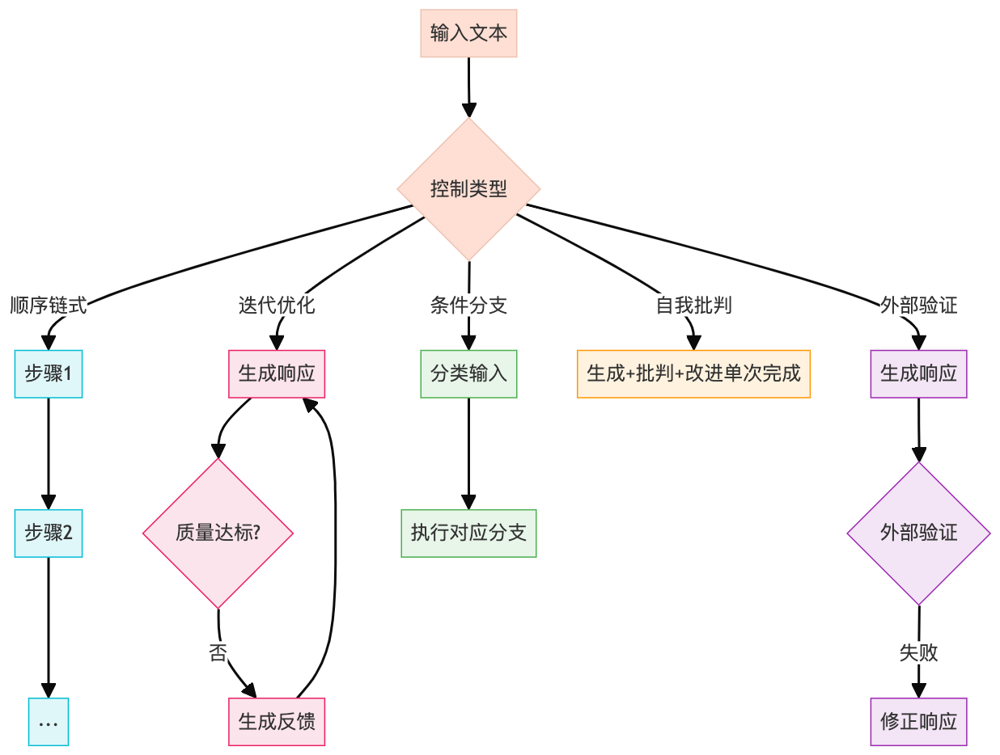

## 1）整体理解

⭐️目标与作用 &#x20;

* 实现多步骤LLM交互的控制流机制，提供5种核心模式（顺序链式、迭代优化、条件分支、自我批判、外部验证） &#x20;

* 构建可扩展的上下文工程框架，平衡token效率与上下文连贯性 &#x20;

* 提供可视化工具和指标监控，支持交互式调试 &#x20;


⭐️使用场景 &#x20;

* AI工程师构建复杂LLM工作流 &#x20;

* 研究人员实验不同交互模式的效果 &#x20;

* 教学场景演示上下文工程技术 &#x20;


⭐️核心概念与术语 &#x20;

* **顺序链式(SequentialChain)**：前序步骤输出作为后续输入 &#x20;

* **迭代优化(IterativeRefiner)**：通过反馈循环逐步改进响应 &#x20;

* **条件分支(ConditionalBrancher)**：基于LLM输出选择执行路径 &#x20;

* **自我批判(SelfCritique)**：单次调用完成生成-批判-改进流程 &#x20;

* **外部验证(ExternalValidation)**：通过外部工具验证响应有效性 &#x20;

* **Token效率**：响应token数与提示token数的比值 &#x20;


## 2）代码流程图




## 3）代码中的难点及解释

1. **动态提示模板** &#x20;

   * 解释: 使用Python的format()实现{input}占位符的动态替换，支持跨步骤传递上下文 &#x20;

   * 影响: 提高模板复用率，但需严格验证模板完整性 &#x20;

2. **验证函数设计** &#x20;

   * 解释: ExternalValidation类要求用户提供validator\_fn，需处理LLM输出的不确定性 &#x20;

   * 影响: 增加系统灵活性，但需要开发者实现可靠的验证逻辑 &#x20;

3) **停止条件优化** &#x20;

   * 解释: IterativeRefiner通过stopping\_condition参数支持自定义终止逻辑 &#x20;

   * 影响: 避免无效迭代，但条件设置不当可能导致过早终止 &#x20;

4) **跨步骤指标聚合** &#x20;

   * 解释: ControlLoop基类自动累计各步骤的token用量和延迟 &#x20;

   * 影响: 提供全局视角，但可能掩盖个别步骤的性能问题 &#x20;


## 4）扩展问题

| 序号 | 问题             | 回答                                                          |
| -- | -------------- | ----------------------------------------------------------- |
| 1  | 如何选择最适合的控制模式？  | 根据任务特性：\<br>- 线性流程用顺序链式\<br>- 质量优化用迭代/自我批判\<br>- 多场景处理用条件分支 |
| 2  | token效率指标如何解读？ | >1.0表示响应比提示更丰富，<1.0可能提示设计冗余，需结合质量评估                         |
| 3  | 外部验证有哪些实现方式？   | 常见方法：\<br>- 代码：语法检查\<br>- 事实：知识库校验\<br>- 逻辑：规则引擎验证          |


"""
以下为源代码（注释已翻译为中文）
"""


```python
#!/usr/bin/env python
# -*- 编码：utf-8 -*-
"""
上下文工程：用于多步 LLM 交互的控制循环
=================================================================

本模块演示如何实现控制流机制
用于编排复杂的多步骤 LLM 交互。基于
上下文扩展技术来自之前的笔记本，我们现在
探索以下模式：

1. 顺序链 (一步的输出→下一步的输入)
2. 迭代细化 (通过循环改进响应)
3. 条件分支 (基于 LLM 输出的不同路径)
4. 自我批评和修正 (对输出进行元评估)
5. 外部验证循环 (使用工具 / 知识进行验证)

这些模式的实现侧重于令牌效率和
在各个步骤中保持上下文一致性。

用途：
在 Jupyter 或 Colab 中：
%run 03_control_loops.py
# 或
从 control_loops 导入 SequentialChain、IterativeRefiner 和 ConditionalBrancher
"""

Import os
Import re
Import json
Import 时间
Import tiktoken
从键入 import Dict、List、Tuple、Any、Optional、Union、Callable、TypeVar

# 用于更好类型暗示的类型变量
T = TypeVar(‘T‘)
响应 = Union [str，Dict [str，Any]]]

# 用于日志记录和可视化
导入日志
Import numpy as np
将 matplotlib.pyplot 导入为 plt
来自 IPython.display import display、Markdown、HTML

# 配置日志
Logging.basicConfig(
Level=logging.info,
format=‘%(asctime)s -%(name)s -%(levelname)s -%(message)s’
)
Logger = logging.getLogger(__name__)

# API 客户端的设置
尝试：
从 openai 导入 OpenAI
OPENAI_AVAILABLE = True
Except ImportError:
OPENAI_AVAILABLE = False
Logger.warning (“OpenAI 软件包未找到。安装方式：pip install openai”)

尝试：
Import dotenv
加载环境变量
ENV_LOADED = True
Except ImportError:
ENV_LOADED = False
Logger.warning ("未找到 python-dotenv。使用：pip install python-dotenv")

# 常量
DEFAULT_MODEL =“gpt-3.5-turbo”
DEFAULT_TEMPERATURE = 0.7
DEFAULT_MAX_TOKENS = 500


# 辅助函数
# ================

Def setup_client(api_key=None,model=DEFAULT_MODEL):
"""
为 LLM 交互设置 API 客户端。

Args:
Api_key:API key (如果为 None, 则在 env 中查找 OPENAI_API_KEY)
Model: 要使用的 model name

返回：
元组：(客户端，model_name)
"""
如果 api_key 为 None:
Api_key = os.environ.get("OPENAI_API_KEY")
如果 api_key 为 None 且不是 ENV_LOADED:
Logger.warning ("找不到 API key。设置 OPENAI_API_KEY env var 或传递 api_key param。")

如果 OPENAI_AVAILABLE:
Client = OpenAI(api_key=api_key)
返回客户端，model
Else:
Logger.error ("需要 OpenAI 包。安装方式：pip install openai")
Return None，model


Def count_tokens(text: str，model: str = DEFAULT_MODEL) -> int:
"""
使用适当的 tokenizer 对 text 字符串中的 tokens 进行 count。

Args:
Text: 要分词的文本
Model: 用于分词的型号名称

返回：
Int: 令牌计数
"""
尝试：
Encoding = tiktoken.encoding_for_model(model)
Return len(encoding.encode(text))
Except Exception as e:
# 当 tiktoken 不支持 model 时的回退
Logger.warning (f“无法使用 tiktoken 作为 {model}:{e}”)
# 粗略估计：1 个 token≈4 个字符
Return len(text) // 4


Def generate_response(
提示：str
Client=None,
model: str = DEFAULT_MODEL,
温度：float = DEFAULT_TEMPERATURE,
max_tokens:int = DEFAULT_MAX_TOKENS,
system_message: str =“你真是个有用的助手。”
-> Tuple[str，Dict[str，Any]]:
"""
从 LLM 生成响应并返回元数据。

Args:
Prompt: 发送提示符
客户端：API 客户端 (如果为 None, 则创建一个)
Model: 模型名称
Temperature: 温度参数
Max_tokens: 要生成的最大 token
System_message: 要使用的系统消息

返回：
元组：(response_text, 元数据)
"""
如果 client 为 None:
Client，model = setup_client(model = model)
如果 client 为 None:
返回 “ERROR: 无 API 客户端可用”,{“error”:“无 API 客户端”}

Prompt_tokens = count_tokens(prompt，model)
System_tokens = count_tokens(system_message，model)

元数据 = {
“prompt_tokens”:prompt_tokens,
system_tokens:system_tokens,
model: 模型，
“temperature”: 温度，
Max_tokens:max_tokens,
timestamp: time.time()
}

尝试：
Start_time = time.time()
Response = client.chat.completions.create(
Model=model,
消息 =[
{“角色”:“系统”,“内容”:system_message},

],
temperature=temperature,
max_tokens=max_tokens
)
Latency = time.time()-start_time

Response_text = response.choices[0].message.content
Response_tokens = count_tokens (response_text, 模型)

Metadata.update({
“latency”:latency,
“response_tokens”:response_tokens,
“total_tokens”:prompt_tokens + system_tokens + response_tokens,
“token_efficiency”:response_tokens / (prompt_tokens + system_tokens) if (prompt_tokens + system_tokes) > 0 else 0,
“tokens_per_second”:response_tokens / latency if latency > 0 else 0
})

返回 response_text 和元数据

Except Exception as e:
Logger.error (f“错误生成 response: {e}”)
Metadata[“error”] = str(e)
Return f“ERROR: {str(e)}”，metadata


Def format_metrics(metrics: Dict[str，Any]) -> str:
"""
将 metrics 字典格式化为可读字符串。

Args:
Metrics:metrics 的字典

返回：
Str: 格式化的 metrics 字符串
"""
# 选择最重要的 metrics 以显示
Key_metrics = {
“prompt_tokens”: metrics.get("prompt_tokens"，0),
“response_tokens”:metrics.get("response_tokens",0),
“total_tokens”:metrics.get("total_tokens",0),
“latency”:f“{metrics.get(‘latency’，0:.2f}s”),
“token_efficiency”:f“{metrics.get(‘token_efficiency’,0:.2f}”
}

Return " | ".join([f"{k}: {v}" for k，v in key_metrics.items()])


Def display_response(
提示：字符串
Response: str,
指标：Dict [str，Any],
show_prompt: bool = True
-> None:
"""
在笔记本中显示一个带有指标的 prompt-response 对。

Args:
Prompt: 提示文本
响应：响应文本
度量指标：度量指标字典
Show_prompt: 是否显示提示文本
"""
如果 show_prompt:
Display(HTML("<h4>prompt:</h4>"))
Display(Markdown(f"“n{prompt}n“‘))

Display(HTML(“<h4>Response:</h4>”)
Display(Markdown(response))

Display(HTML(“<h4>metrics:</h4>”))
Display(Markdown(f"“n{format_metrics(metrics)}n“)"))


# ControlLoop 基类
# =========================

ControlLoop 类：
"""
所有 Control Loop 实现的基类。
提供跟踪指标和历史记录的常见功能。
"""

Def __init__(
Self,
client=None,
model: str = DEFAULT_MODEL,
system_message:str =“你真是个有用的助手。”
Max_tokens:int = DEFAULT_MAX_TOKENS,
temperature: float = DEFAULT_TEMPERATURE,
verbose: bool = False
):
"""
初始化控制循环。

Args:
客户端：API 客户端 (如果为 None, 则创建一个)
Model: 要使用的型号名称
System_message: 要使用的系统消息
Max_tokens: 要生成的最大 token
温度：温度参数
详细信息：是否打印调试信息
"""
Self.client，self.model = setup_client (model=model) 如果客户端为 None else (客户端，model)
Self.system_message = system_message
Self.max_tokens = max_tokens
Self.temperature = 温度
Self.verbose = verbose

# 初始化历史记录和指标跟踪
Self.history = []
Self.metrics = {
“total_prompt_tokens”:0,
total_response_tokens:0,
total_prompt_tokens:0,
“total_latency”:0,
“步骤”:0
}

Def _log(self，message: str) -> None:
"""
如果启用了 verbose 模式，则记录 str。

Args:
Message: 要记录的消息
"""
If self.verbose:
Logger.info(message)

Def _call_llm(
Self,
提示：str
custom_system_message:Optional[str] = None
)-> 元组 [str，Dict [str，Any]:
"""
调用 LLM 并更新指标。

Args:
Prompt: 提示发送
Custom_system_message: 覆盖系统消息 (可选)

返回：
元组：(response_text, 元数据)
"""
System_msg = custom_system_message if custom_system_message else self.system_message

Response，metadata = generate_response(
Prompt=prompt
Client=self.client,
model=self.model,
temperature=self.temperature,
max_tokens=self.max_tokens,
system_message=system_msg
)

# 更新 metrics
Self.metrics[“total_prompt_tokens”] += metadata.get("prompt_tokens"，0)
Self.metrics[“total_response_tokens”] += metadata.get("response_tokens"，0)
Self.metrics[“total_tokens”] += metadata.get("total_tokens"，0)
Self.metrics[“total_response_tokens”] += metadata.get("latency"，0)
Self.metrics[“steps”] += 1

# 添加到历史记录
Step_record = {
"prompt": prompt
响应：response,
“metrics”: 元数据，
Timestamp: time.time()
}
Self.history.append(step_record)

返回响应，元数据

Def get_summary_metrics(self) -> Dict[str，Any]:
"""
获取所有步骤的摘要 metrics。

返回：
Dict: 摘要指标
"""
Summary = self.metrics.copy()

# 添加派生指标
If summary[“steps”] > 0:
Summary[“avg_latency_per_step”] = summary[“total_latency”] / summary[“steps”]

If summary[“total_prompt_tokens”] > 0:
Summary["total_efficiency"] = (
Summary[“total_response_tokens”] / summary[“total_prompt_tokens”]
)

返回 summary

Def visualize_metrics (self) -> 无：
"""
创建跨步骤 metrics 的可视化。
"""
如果不是 self.history:
Logger.warning (“没有可视化的历史”)
返回

# 提取用于绘图的数据
Steps = list(range(1，len(self.history) + 1))
Prompt_tokens = [h["metrics"].get("prompt_tokens"，0) for h in self.history]
Response_tokens = [h["metrics"].get("response_tokens"，0) for h in self.history]
Latencies = [h["metrics"].get("latency",0) for h in self.history]
效率 =[h ["metrics"].get ("token_efficiency",0) for h in self.history]

# 创建图表
Fig，axes = plt.subplots(2，2，figsize = (12，8))


# 图 1:token 的使用
Axes[0,0].bar(steps，prompt_tokens，label=“Prompt Tokens”，color=“blue”，alpha=0.7)
Axes[0，0]. bar(steps，response_tokens，bottom= Prompt_tokens，label=“Response Tokens”,
color=“green”,alpha=0.7)
Axes [0，0].set_title ("Token 用法")
Axes[0,0].set_xlabel("Step")
Axes[0,0].set_xlabel("Tokens")
Axes[0,0].legend()
Axes[0,0].grid(alpha=0.3)

#plot 2:Latency
Axes[0，1].plot(steps，latency，mark=‘o’，color=“red”，alpha=0.7)
Axes[0，1].set_title("Latency")
Axes[0,1].set_xlabel("Step")
Axes[0，1].set_xlabel("Seconds")
Axes[0,1].grid(alpha=0.3)

#plot 3: 令牌效率
Axes[1，0].plot(steps，efficiency，marker=‘s’，color=“purple”，alpha=0.7)
Axes[1，0].set_title("Token Efficiency (Response/Prompt)")
Axes[1，0].set_xlabel("Step")
Axes[1，0].set_xlabel("Ratio")
Axes[1，0].grid(alpha=0.3)

#plot 4:accumulative tokens
Cumulative_tokens = np.cumsum([h[“metrics”]. get(“total_tokens，0”) for h in self.history))
Axes[1，1].plot(steps，cumulative_tokens，mark=‘^’，color=“orange”，alpha=0.7)
Axes[1，1].set_title("cumulative token usage")
Axes[1，1].set_xlabel("Step")
Axes[1，1].set_label("Total Tokens")
Axes[1，1].grid(alpha=0.3)

Plt.tight_layout()
Plt.subplots_adjust(top=0.9)
Plt.show()


类 SequentialChain (ControlLoop):
"""
一个 ControlLoop, 它按顺序链接多个 Dict [str，Any],
其中每个步骤的输出成为下一个步骤的输入。
"""

Def __init__(self，steps: List[Dict[str，Any]，**kwargs):
"""
初始化顺序链。

Args:
步骤：步骤配置的 Dict [str，Any], 每个配置包含：
Prompt_template: 带 {input} 占位符的 str
System_message:(可选) 自定义系统消息
Name:(可选) steps name
**kwargs: 传递给 ControlLoop 的额外参数
"""
Super().__init__(**kwargs)
Self.steps = steps
Self._validate_steps()

Def _validate_steps(self) -> None:
"""验证步骤配置"""
对于 i, 在 enumerate (self.steps) 中执行步骤：
如果 “prompt_template” 不在 step 中：
引发 ValueError (f“Step {i} 缺少‘prompt_template’”)

# 确保每个 step 都有一个 name
如果 “name” 不在步骤中：
Step[“name”] = f“step_{i+1}”

Def run(self，initial_input: str) -> Tuple[str，Dict[str，Any]:
"""
使用给定的初始 input 运行顺序链。

Args:
Initial_input: 第一步的输入

返回：
元组：(final_output，all_outputs)
"""
Current_input = initial_input
All_outputs = {"initial_input": initial_input}

对于 i, 在 enumerate (self.steps) 中输入 stepname:
Step_name = step[“name”]
Self._log(f"running step {i+1}/{len(self.steps)}: {step_name}")

# 使用 current input 设置 prompt_template
Prompt = step[“prompt_template”]. format(input=current_input)
System_message = step.get("system_message"，self.system_message)

# 调用 LLM
响应，元数据 = self._call_llm (提示，system_message)

# 存储输出
All_outputs[step_name] = {
"prompt": prompt,
响应：响应，
“度量”: 元数据
}

# 更新下一步的输入
Current_input = 响应

返回 current_input,all_outputs

Def display_chain_results(self，all_outputs: Dict[str，Any]) -> None:
"""
显示链中每个步骤的结果。

Args:
All_outputs:run () 的输出字典
"""
显示 (HTML (“<h2> 顺序链结果 </h2>”)

# 显示初始输入
Display (HTML (“<h3> 初始输入 </h3>”))
Display(Markdown(all_outputs[“initial_input”]))

# 显示每个步骤
对于 i, 在 enumerate (self.steps) 中显示 stepname:
Step_name = step["name"]
如果 step_name 在 all_outputs 中：
Step_output = all_outputs[step_name]

显示 (HTML (f“<h3> Step {i+1}: {step_name}</h3>))

# 显示提示
Display(HTML("<h4>Prompt:</h4>"))
显示 (Markdown (f"“n {step_output [‘prompt’]} n“))

#显示 response
Display(HTML("<h4>response:</h4>"))
Display(Markdown(step_output[“response”]))

# 显示 metrics
Display(HTML("<h4>metrics:</h4>"))
显示 (Markdown (f"“n {format_metrics (step_output [‘metrics’])} n“))

# 显示摘要 metrics
Display (HTML ("<h3> 摘要指标 </h3>"))
Summary = self.get_summary_metrics()
Display(Markdown(f)""
总步骤：{summary [‘total_tokens’]}
总令牌：{summary [‘total_tokens’]}
总延迟：{summary [‘total_latency’]:.2f} s
每步 avg.latency:{summary.get (‘avg_latency_per_step’,0):.2f} s
总体效率：{summary.get (‘total_latency_per_step’，0):.2f}
"""))


类 IterativeRefiner (ControlLoop):
"""
一种控制循环，它通过多个循环迭代地优化输出
反馈和改进的循环，直到满足停止条件。
"""

Def __init__(
Self,
max_iterations:int = 5,
refinement_template: str =“请改进以下文本：{previous_response} nn 需要的特定改进：{feedback}”,
feedback_template: str =“评估此 response 的质量并提出具体改进建议：{response}”,
stop_condition:Optional[Callable[[str，Dict[str，Any]，bool]]] = None,
**kwargs
):
"""
初始化迭代调优器。

Args:
Max_iterations: 最大细化迭代次数
Refinement_template: 用于细化提示的 template
Feedback_template: 用于生成反馈的模板
Stop_condition: 接收 (响应、元数据) 并返回的函数。
如果细化应该停止，则为 true
**kwargs: 传递给 ControlLoop 的额外参数
"""
Super().__init__(**kwargs)
Self.max_iterations = max_iterations
Self.refinement_template = refinement_template
Self.feedback_template = feedback_template
Self.stopping_condition = stop_condition

Def generate_feedback (self，response: str)-> 元组 [str，Dict [str，Any]:
"""
对当前响应生成反馈。

Args:
Response: 要评估的当前 response

返回：
元组：(feedback, 元数据)
"""
Prompt = self.feedback_template.format(response=response)
Return self._call_llm(prompt)

Def fine_response(
Self,
previous_response: str,
反馈：str
-> 元组 [str，Dict [str，Any]:
"""
根据反馈细化 response。

Args:
Previous_response: 先前用于优化的响应
反馈：用于 Refined_response 的反馈

返回：
元组：(refined_response, 元数据)
"""
Prompt = self.refinement_template.format(
Previous_response=previous_response,
feedback=feedback
)
Return self._call_llm(prompt)

Def run(
Self,
initial_prompt: str,
use_auto_feedback: bool = True
) -> Tuple[str，Dict[str，List[Dict[str，Any]]]]:
"""
运行迭代细化过程。

Args:
Initial_prompt: 生成第一个响应的初始提示符
Use_auto_feedback: 是否自动生成反馈 (如果为 False,
你需要手动提供反馈)

返回：
元组：(final_response，refinement_history)
"""
# 生成初始响应
Self._log ("生成初始响应")
Current_response, 元数据 = self._call_llm (initial_prompt)

Refinement_history = {
“initial”:{
“prompt”:initial_prompt,
响应：current_response,
度量：元数据
},
“迭代”:[]
}

# 迭代细化循环
Iteration = 0
Should_continue = True

当 should_continue 和 iteration < self.max_iterations:
迭代 += 1
Self._log (f“精炼迭代 {iteration}/{self.max_iterations}”))

# 生成反馈
如果使用 auto_feedback:
反馈，refeedback_metadata = self.generate_feedback (current_response)
Self._log(f"auto-feedback: {feedback}")
Else:
# 手动 feedback 模式
Print(f"nnCurrent response(iteration {iteration}):")
Print("-" * 80)
Print(current_response)
Print("-" * 80)
Feedback = input ("输入你的反馈 (或 “停止” 以完成最终细化):")

If feedback.lower() == ’stop’:
分手

Feedback_metadata = {“手动”:True}

# fine response
Fine_response,fine_metadata = self.refine_response(current_response,refeedback)

# 记录 iteration
Fine_history[“iterations”].append({
“iterations”:iterations,
“feedback”: 反馈，
“feedback_metrics”:refeed_metadata,
“finement_response”:finement_response,
“finement_metrics”:finement_metadata
})

# 更新 current response
Current_response = finefine_response

# 检查 stoping_condition
If self.stoping_condition:
Should_continue = 非 self.stoping_condition (current_response，refinement_metadata)

返回 current_response、refine_history

Def display_refinement_history (self，refinement_history: Dict [str，Any]) -> 无：
"""
在笔记本上显示 finement history。

Args:
Refinement_history: 来自 run () 的细化历史
"""
显示 (HTML (“<h2> 迭代完善结果 </h2>”)

# 显示初始 prompt 和响应
显示 (HTML (“<h3> 初始提示 </h3>”)
Display(Markdown(f““n{refinement_history[‘initial’][‘prompt’]}n“)))

Display (HTML (“<h3> 初始 response</h3>”)
Display(Markdown(refinement_history[‘initial’][‘response’]))

# 显示精细化迭代
对于 finement_history 中的 iteration [“iteration”]:
Iteration_num = iteration[“iteration”]]

显示 (HTML (f"<h3>iteration {iteration_num}</h3>"))

# 显示反馈
显示 (HTML (“<h4> 反馈：</h4>”)
显示 (Markdown (迭代 [“feedback”))

# 显示 refined_response
Display(HTML(“<h4> Refined_response:</h4>”))
Display (Markdown (迭代 [“refined_response”]))

# 显示指标
Display(HTML("<h4>metrics:</h4>"))
Metrics = 迭代 [“refinement_metrics”]
显示 (Markdown (f““n {format_metrics (metrics)} n“)))

# 显示摘要
Display(HTML("<h3> Refinement Summary</h3>"))
Total_iterations = len(refinement_history[“iterations”])
Display(Markdown(“f”“”)
初始提示 tokens:{refinement_history [‘initial’][‘metrics’][‘prompt_tokens’]}
初始响应 tokens:{refinement_history [‘initial’][‘metrics’][‘response_tokens’]}

最终响应 tokens:{refinement_history [‘iterations’][-1][‘refinement_metrics’][‘response_tokens’] 如果 total_iterations>0 则 refinement_history [‘initial’][‘metrics’][‘response_tokes’]}
"""))


ConditionalBrancher (ControlLoop) 类：
"""
基于 LLM 输出实现条件分支的控制循环。
根据条件允许不同的执行路径。
"""

Def __init__(
Self,
分支：Dict [str，Dict [str，Any]],
classifier_template: str = "分析以下输入并将其分类为以下类别之一：{categories} nnInput: {input} nnCategory:",
**kwargs
):
"""
初始化条件分支。

Args:
分支：字典将分支名称映射到配置：
Prompt_template: 带 {input} 占位符的 str
System_message:(可选) 自定义系统消息
Classifier_template: 分类提示符的 template
**kwargs: 传递给 ControlLoop 的额外参数
"""
Super().__init__(**kwargs)
Self.branches = 分支
Self.classifier_template = classifier_template
Self._validate_branches()

Def _validate_branches(self) -> None:
"""验证分支配置"""
如果不是 self.branches:
引发 ValueError (“未定义分支”)

对于 branch_name, 在 self.branches.items () 中进行配置：
如果 config 中没有 “prompt_template”:
引发 ValueError (f“branch‘{branch_name}’缺少‘prompt_template’”)

Def classify_input(self，input_text: str) -> Tuple[str，Dict[str，Any]:
"""
对 input 进行分类，以确定采用哪个 branch_name。

Args:
Input_text: 要分类的输入文本

返回：
元组：(branch_name, 元数据)
"""
Categories = list(self.branches.keys())
Categories_str = "，".join(categories)

Prompt = self.classifier_template.format()
Categories=categories_str,
input=input_text
)

# 使用特定的 system_message 进行分类
System_message =“你是一个能够准确无误地对 input 进行分类的分类器”
Response，metadata = self._call_llm (提示符，system_message)

# 从响应中提取分支名称
# 首先尝试精确匹配一个 category
对于 category 中的 category:
If category.lower () 在 response.lower () 中：
返回 category, 元数据

# 如果没有完全匹配，将第一行作为 response, 并找到最接近的匹配
First_line = response.strip().split(’n’)[0].lower()

Best_match = None
Best_score = 0

对于 category 中的 category:
# 简单的字符串相似度得分
Cat_lower = category.lower()
Matches = sum (第一行中的 c 对 cat_lower 中的 c)
Score = matches / len(cat_lower) if len(cat_lower) > 0 else 0

If score > best_score:
Best_score = score
Best_match = 类别

如果 best_match 和 best_score>0.5:
返回 best_match, 元数据

# 如果没有找到匹配，则回退到第一个 categories
Self._log (f“警告：无法对输入进行分类。使用第一个分支：{categories [0]}”)
返回 categories [0], 元数据

Def execute_branch(
Self,
branch_name: str,
input_text: str
-> Tuple[str，Dict[str，Any]:
"""
使用给定的 input 执行特定的 branch。

Args:
Branch_name: 要执行的分支名称
Input_text: 分支的输入文本

返回：
元组：(响应、元数据)
"""
如果 branch_name 不在 self.branches 中：
引发 ValueError (f“未知 branch_name: {branch_name}”)

Branch_config = self.branches[branch_name]
Prompt = branch_config[“prompt_template”]. format(input=input_text)
System_message = branch_config.get("system_message"，self.system_message)

Return self._call_llm(prompt，system_message)

Def run(
Self,
input_text: str,
branch_name:Optional[str] = None
) -> Tuple[str，Dict[str，Any]:
"""
运行条件分支进程。

Args:
Input_text: 要处理的输入文本
Branch_name: 要使用的可选分支 (跳过分类)

返回：
元组：(响应，run_details)
"""
Run_details = {"input": input_text}

# 如果未指定分支，则对 input 进行分类
如果 branch_name 为 None:
Self._log("classifying input")
Branch_name,classification_metadata = self.classify_input(input_text)
Run_details[“classification”] = {
"branch":branch_name,
“metrics”:classification_元数据
}

Self._log(f"execute branch: {branch_name}")

# 执行选定的分支
响应，元数据 = self.execution_branch (branch_name，input_text)

Run_details[“execution”] = {
"branch":branch_name,
“response”:response,
metrics: 元数据
}

Return response，run_details

Def display_branching_results(self，run_details: Dict[str，Any]) -> None:
"""
在笔记本上显示条件分支的结果。

Args:
Run_details: 从 run () 中运行 details
"""
Display (HTML ("<h2> 条件分支结果 </h2>"))

# 显示输入
Display(HTML("<h3>input</h3>"))
Display(Markdown(run_details[“input”]))

# 如果可用，显示分类
如果 run_details 中存在 “classification”:
Display(HTML("<h3>classification</h3>"))
Branch = run_details[“classification”][“branch”]
Display (Markdown (f“选定的 branch:**{branch}**”)

# 显示 classification 指标
Display(HTML("<h4>classification metrics:</h4>"))
Metrics = run_details[“classification”][“metrics”]
显示 (Markdown (f““n {format_metrics (metrics)} n“)))

# 显示执行结果
显示 (HTML (“<h3> 执行结果 </h3>”)
Display(HTML(“<h4>Branch:</h4>”)
Display(Markdown(f“**{run_details[‘execution’][‘branch’]}**”))

Display(HTML("<h4>response:</h4>"))
Display(Markdown(run_details[“execution”][“response”]))

Display(HTML("<h4>execution metrics:</h4>"))
Metrics = run_details[“execution”][“metrics”]
Display(Markdown(f““n{format_metrics(metrics)}n“‘)))


"""
一个控制循环，用于生成响应，然后进行批判和改进。
在单个流中，无需多次 API 调用即可进行细化。
"""

Def __init__(
Self,
critic_template: str = "第 1 步：生成对问题的回应。n 第 2 步：批评你的回应中的任何错误、遗漏或改进。n 第 3 步：根据你的批评提供最终的、改进的回应。nnQuestion: {input}",
parse_sections: bool = True,
**kwargs
):
"""
初始化自我模板控制循环。

Args:

Parse_sections: 是否将响应解析为 section
**kwargs: 传递给 ControlLoop 的额外 args
"""
Super().__init__(**kwargs)
Self.critique_template = critique_template
Self.parse_sections = parse_sections

Def run(self，input_text: str) -> Tuple[str，Dict[str，Any]:
"""
运行自我批评过程。

Args:
Input_text: 要响应的输入

返回：
元组：(final_response,run_details)
"""
# 格式提示
Prompt = self.critique_template.format(input=input_text)

# 生成 self.critique_template 响应
响应，元数据 = self._call_llm (prompt)

# 如果请求，则解析 section
Section = {}
If self.parse_sections:
# 尝试解析初始 response、critic_match 和最终 response
Initial_match = re.search(r“Step 1:(.*?)Step 2:，response，re.DOTALL)
Critic_match = re.search(r“Step 2:(.*?)Step 3:，response，re.DOTALL)
Final_match = re.search(r“Step 3:(.*?)$”,response,re.DOTALL)

If initial_match:
Section[“initial_response”] = initial_match.group(1.strip()

Sections["critique"] = critique_match.group(1).strip()
If final_match:
Section[“final_response”] = final_match.group(1.strip()

# 如果解析失败，请使用完整响应
如果没有 sections 和 self.parse_sections:
Self._log ("无法从 response 中解析 sections")
Sections[“full_response”] = response

# 创建运行详细信息
运行详情 = {
Input:input_text,
“full_response”: 响应，
“sections”:sections,
度量：元数据
}

# 返回 final_response (如果解析失败，则返回完整 response)
Final_response = sections.get("final_response"，response)
Return final_response，run_details

Def display_results(self，run_details: Dict[str，Any]) -> None:
"""
在笔记本上显示自我批评的结果。

Args:
Run_details: 从 run () 中运行 details
"""
显示 (HTML (“<h2> 自我批评结果 </h2>”))

# 显示输入
Display(HTML(“<h3>input</h3>”))
显示 (Markdown (run_details [“input”]))

# 显示已解析的 sections (如果可用)
如果 run_details 和 run_details [“sections”] 中有 “sections”:
Sections = run_details[“sections”]


Display (HTML ("<h3> 初始响应 </h3>"))
Display(Markdown(sections[“initial_response”]))


Display (HTML (“<h3> 自我批评 </h3>”)
Display(Markdown(sections[“critique”]))


Display(HTML("<h3>final_response</h3>"))
Display(Markdown(sections[“final_response”]))

# 如果没有 sections, 则显示 full response
在 run_details 中输入 “full_response”:
Display(HTML(“<h3>full response</h3>”))
Display(Markdown(run_details[“full_response”)))

# 显示 metrics
Display(HTML("<h3>metrics</h3>"))
Metrics = run_details[“metrics”]
Display(Markdown(f"“n{format_metrics(metrics)}n“)))


类外部验证 (ControlLoop):
"""
使用外部工具或知识进行验证的 ControlLoop。
并修正 LLM 响应，创建一个封闭的反馈循环。
"""

Def __init__(
Self,
validation_fn: Callable[[str]，Tuple[bool，str],
correction_template: str =“您之前的响应存在一些问题：nn {validation_feedback} nn 请修正您的响应以解决这些问题：nn {previous_response}”,
max_attempts: int = 3,
**kwargs
):
"""
初始化外部 validation_feedback 循环。

Args:
Validate_fn: 接收响应并返回的函数。
(is_valid，feedback_message)
Correction_template: 用于校正提示的模板
Max_attempts: 最大验证尝试次数
**kwargs: 传递给 ControlLoop 的额外参数
"""
Super().__init__(**kwargs)
Self.validator_fn = validator_fn
Self.correct_template = correction_template
Self.max_attempts = max_attempts

Def run(self，input_text: str) -> Tuple[str，Dict[str，Any]:
"""
运行外部验证过程。

Args:
Input_text: 要响应的输入

返回：
元组：(final_response,run_details)
"""
# 生成初始 response
Response, 元数据 = self._call_llm (input_text)

Attempts = []
Current_response = response
Is_valid = False
Validation_feedback = ""

# 添加初始 attempt
Attempts.append({
“attempt”:1,
响应：current_response,
metrics: 元数据，
"验证": {
“悬而未决”:True
}
})

# 验证循环
For attempt in range(1，self.max_attempts + 1):
# 验证 current_response
Self._log (f"验证尝试 {attempt}")
Is_valid,validation_feedback = self.validator_fn(current_response)

# 更新当前试验的 validating 结果
Attempts[-1][“validation”] = {
"is_valid":is_valid,
“反馈”:validation_feedback,
“悬而未决”:False
}

# 如果有效则停止
If is_valid:
Self._log (f“对尝试的有效响应 {attempt}”)
分手

# 如果到达 max attempts, 则停止
If attempt >= self.max_attempts:
Self._log (f“最大尝试 ({self.max_attempts}) 已达到，但没有有效响应”)
分手

# 创建校正提示符
Self._log (f“尝试修正 (attempt {attempt+1}))”)
Correct_prompt = self.correct_template.format(
Validation_feedback = validation_feedback,
previous_response=current_response
)

# 生成 corrected response
Correct_response,correct_metadata = self._call_llm(correct_prompt)
Current_response = correction_response

# 添加新尝试
Attempts.append({
“attempt”: 尝试 + 1,
响应：current_response,
metrics:correct_metadata,
"验证": {
"pending": True
}
})

# 创建运行详细信息
运行详情 = {
Input: input_text,
“attempts”: 尝试，
Final_response:current_response,
“is_valid”:is_valid,
validation_feedback: validation_feedback,
“attempts_count”:len(attempts)
}

Return current_response，run_details

Def display_results(self，run_details: Dict[str，Any]) -> None:
"""
在笔记本上显示外部验证结果。

Args:
Run_details: 从 run () 中运行 details
"""
显示 (HTML (“<h2> 外部验证结果 </h2>”)

# 显示输入
Display(HTML("<h3>input</h3>"))
Display(Markdown(run_details[“input”]))

# 显示尝试
对于 run_details [“attempts”] 中的 attempt_data:
Attempt_num = attempt_data["attempt"]
显示 (HTML (f“<h3> Attempt {attempt_num}</h3>))

# 显示 response
Display(HTML(“<h4>response:</h4>”))
Display(Markdown(attempt_data[“response”]))

# 显示 validation 结果
如果未尝试_data [“validation”][“pending”:
Is_valid = attempt_data[“validation”][“is_valid”]
Display(HTML("<h4>validation:</h4>"))

如果 is_valid:
Display(HTML("<p style=’color: green; font-weight: bold;’>✓ Valid</p>"))
Else:
Display (HTML (“<p style=‘color: red; font-weight: bold;’>✗ 无效 </p>”))
Display(HTML("<h4>feedback:</h4>"))
Display(Markdown(attempt_data[“validation”][“feedback”]))

# 显示 metrics
Display(HTML("<h4>metrics:</h4>"))
Metrics = attempt_data[“metrics”]]
显示 (Markdown (f““n {format_metrics (metrics)} n“)))

# 显示摘要
Display(HTML(“<h3>Summary</h3>”))
Is_valid = run_details[“is_valid”]
Status =“✓ 有效”(如果 is_valid) 或 “✗ 无效”
Display(Markdown(“f”“”)
最终 status:**{status}**
总尝试次数：{run_details [‘attempts_count’]}
总令牌数：{self.metrics [‘total_tokens’]}
总延迟：{self.metrics [‘total_latency’]:.2f} s
"""))


# 示例用法
# =============

Def example_sequential_chain():
"""用于数据分析的 sequential_chain 示例"""
Steps = [
{
"name": "extract_entities",
“prompt_template”:“从这段文本中提取主要实体 (人、地点、组织)。对于每个实体，提供简要描述。nnText: {input},
“system_message”:“你是从文本中提取和分类命名实体的专家。”
},
{
“name”:“analyze_relationships”,
“prompt_template”:“基于这些实体，分析它们之间的关系：nn {input}”,
“system_message”:“你是分析实体之间关系的专家。”
},
{
"name": "generate_report",
“prompt_template”:“根据这个关系分析创建一个简洁的摘要 report:nn {input}”,
“system_message”:“你是创建清晰、简洁报告的专家。”
}
]

Chain = SequentialChain(steps=steps，verbose=True)

Sample_text = """
1995 年，杰夫・贝佐斯在西雅图创立了亚马逊。最初是一家在线书店，
在贝佐斯的领导下，亚马逊迅速扩张。到 2021 年，亚马逊已经成为
作为世界上最有价值的公司之一，贝佐斯曾短暂超越
埃隆・马斯克成为世界首富。马斯克是特斯拉和 SpaceX 的首席执行官。
后来，在特斯拉股价飙升后，他重新夺回了首位。与此同时，微软
微软于 1975 年由比尔・盖茨在阿尔伯克基创立，至今仍是一家主要的技术公司。
首席执行官萨蒂亚・纳德拉 (Satya Nadella) 领导下的竞争对手。
"""

Final_output，all_outputs = chain.run(sample_text)

# 显示结果
Chain.display_chain_results(all_outputs)

# 可视化 metrics
Chain.visualize_metrics()

返回 final_output,all_outputs


Def example_iterative_refiner():
"""论文写作的迭代 Refiner 示例。"""
# 根据 quality Threshold 定义停止条件
Def quality_threshold(response，metadata):
# 如果 response_tokens 超过 500 个 tokens 且 latency 可接受，则停止
Response_tokens = metadata.get("response_tokens"，0)
Latency = metadata.get("latency"，0)
返回 response_tokens > 500 且 latency < 5.0

Refiner = IterativeRefiner(
Max_iterations=3,
stop_condition=quality_threshold,
verbose=True
)

Prompt =“写一篇关于人工智能未来的短文”

Final_response、refinement_history = refiner.run(prompt)

# 显示结果
Refiner.display_refinement_history(refinement_history)

# 显示 metrics
Refinery.visualize_metrics()

Return final_response，refinement_history


Def example_conditional_brancher():
"""查询路由的 conditional brancher 示例"""
Branches = {
"technical": {
“prompt_template”:“为专家听众提供关于这个主题的 technical、详细的解释：nn {input}”,
“system_message”:“你是一位提供详细、准确解释的技术专家。”
},
“简化”:{
“prompt_template”:“用 10 岁孩子都能理解的简单术语解释这个主题：nn {input}”,
“system_message”:“你是一位教育工作者，你用简单易懂的语言解释复杂的主题。”
},
“实用”:{
“prompt_template”:“就这个主题提供切实可行的建议：nn {input}”,
“system_message”:“你是一位实用的顾问，能够提供具体、可行的指导。”
}
}

Brancher = ConditionalBrancher(brancs=brancs,verbose=True)

Querys = [
“量子计算是如何工作的？”
“什么是气候变化？”,
“我如何提高我的公开演讲技巧？”
]

Results = []
对于查询中的 query:
Response，run_details = brancher.run(query)
Results.append((query、response、run_details))

# 显示结果
Brancher.display_branching_results(run_details)

# 显示 metrics
Brancher.visualize_metrics()

返回结果


Def example_self_critique():
"""用于事实核查的 self_critique 示例。"""

Critique_template = """
用事实信息回答以下 input:

问题：{input}

第一步：写一个初步回应，包含所有你认为相关的信息。

第二步：批判性地回顾你的回应。检查以下内容：
事实错误或不准确
遗漏重要信息
潜在偏见或片面观点
- 在你不确定的领域，应该表现出较少的自信

第三步：撰写一份改进的最终回应，解决你在批评中发现的问题。
""",
详细 = 真实
)

Query =“第一次世界大战的主要原因是什么？它们是如何导致冲突的？”

Final_response,run_details = critique.run(query)

# 显示结果
Critic.display_results(run_details)

# 可视化 metrics
Critic.visualize_metrics()

Return final_response，run_details


Def example_external_validation():
"""代码生成的外部验证示例。"""
# 检查 Python 语法错误的简单 validator 函数
Def python_validator(code_response):
# 提取代码块
Import re
Code_blocks = re.findall(r““python(.*?)“”,code_response，re.DOTALL)

如果没有 code_blocks:
Return False,“在 response 中没有找到 Python code block”。

# 检查每个代码块是否存在语法错误
对于 i, 在 enumerate (code_blocks) 中使用 <string> 块：
尝试：
Compile(block，"<string>"，"exec")

Return False，f“code_blocks 中的语法错误 {i+1}: {str (e)}”

Return True,“代码语法有效”。

Validator = ExternalValidation(
Validator_fn=python_validator,
max_attempts=3,
verbose=True
)

Prompt =“编写一个 Python 函数来检查一个字符串是否是回文”。

Final_response,run_details = validator.run(prompt)

# 显示结果
Validator.display_results(run_details)

# 显示 metrics
Validator.visualize_metrics()

返回 final_response,run_details


# 主执行 (当作为脚本运行时)
If __name__ == "__main__":
Print ("多步骤 LLM 交互的控制循环")
Print ("单独运行示例或导入类供自己使用。")
```

***

