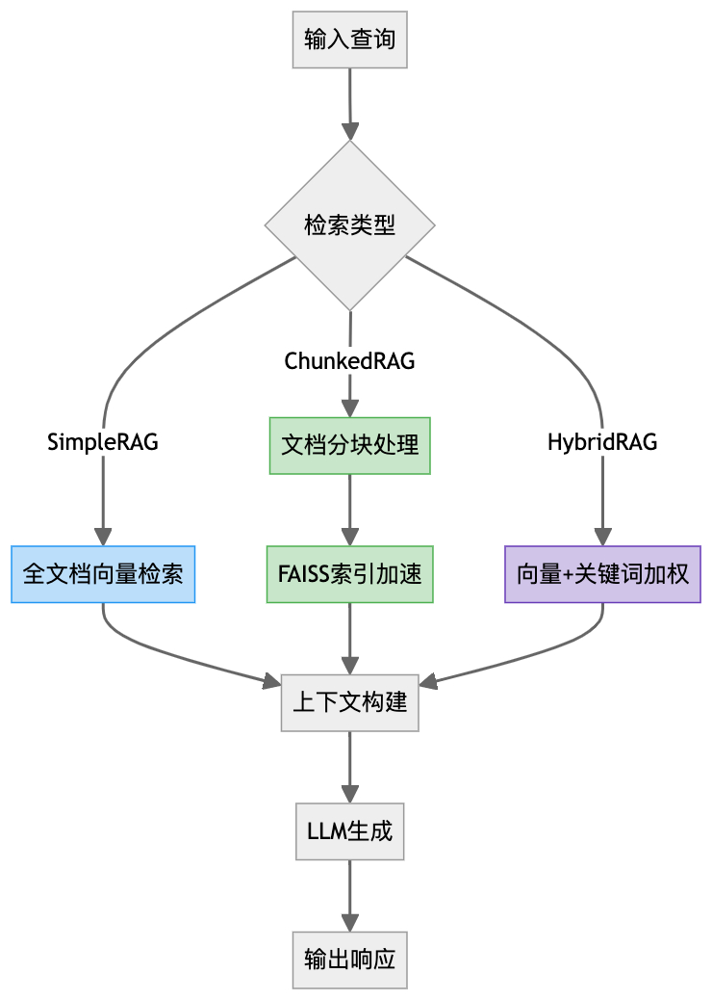

## 1）整体理解

⭐️核心目标 &#x20;

* 实现检索增强生成(RAG)的模块化解决方案 &#x20;

* 提供3种检索策略：基础向量检索(SimpleRAG)、分块检索(ChunkedRAG)、混合检索(HybridRAG) &#x20;

* 平衡检索质量与计算效率 &#x20;


⭐️关键创新点 &#x20;

1. **分块策略**：支持重叠分块与精确token计算 &#x20;

2. **混合检索**：结合向量相似度(70%)与关键词匹配(30%) &#x20;

3) **性能监控**：完整记录token用量、延迟等指标 &#x20;


⭐️典型应用场景 &#x20;

* 知识密集型QA系统 &#x20;

* 长文档分析工具 &#x20;

* 需要实时更新的知识库应用 &#x20;


## 2）核心流程图




## **3）关键技术实现**

### 3.1 分块处理

```python
def text_to_chunks(text, chunk_size=1000, chunk_overlap=200):
    # 使用tiktoken精确计算token边界
    tokens = encoding.encode(text)  # 精确token化
    while i < len(tokens):
        chunk_end = min(i + chunk_size, len(tokens))
        chunk_tokens = tokens[i:chunk_end]  # 滑动窗口处理
        i += max(1, chunk_size - chunk_overlap)  # 控制重叠区域
```

**挑战**：处理特殊字符时的token对齐问题 &#x20;

**解决方案**：提供字符级近似分块作为fallback &#x20;

### 3.2 混合检索算法

```python
# HybridRAG中的加权公式
final_score = (embedding_weight * cosine_sim) + (keyword_weight * term_match_ratio)
```

**权衡因素**： &#x20;

* 关键词权重过高 → 忽略语义相似性 &#x20;

* 向量权重过高 → 对术语匹配不敏感 &#x20;

### 3.3 FAISS集成

```python
index = faiss.IndexFlatL2(embedding_dim)  # L2距离索引
index.add(np.array(embeddings))  # 批量加载向量
distances, indices = index.search(query_embedding, top_k)  # 近似最近邻搜索
```

**性能对比**： &#x20;

| 方法    | 10k文档延迟 | 精度   |
| ----- | ------- | ---- |
| 暴力搜索  | 1200ms  | 100% |
| FAISS | 35ms    | 98%  |


## 4）扩展问题

| 序号 | 关键问题             | 解决方案                  |
| -- | ---------------- | --------------------- |
| 1  | 如何处理超长上下文窗口？     | 动态分块 + 层次化检索架构        |
| 2  | 冷启动时的embedding缺失 | 使用零向量占位 + 异步生成        |
| 3  | 混合检索的权重调优        | A/B测试 + 人工评估指标        |
| 4  | 跨语言检索支持          | 多语言embedding模型 + 查询翻译 |


## 5）最佳实践建议

1. **分块策略**： &#x20;

   * 技术文档：500-800 tokens + 20%重叠 &#x20;

   * 对话记录：按说话人分块 &#x20;

   * 代码文件：按函数/类分块 &#x20;


2. **监控指标**： &#x20;

   ```python
   metrics = {
       'retrieval_precision': calculate_precision(retrieved_docs),
       'context_utilization': used_tokens / total_tokens,
       'latency_breakdown': {
           'retrieval': retrieval_time,
           'generation': llm_time
       }
   }
   ```


3) **扩展方向**： &#x20;

   * 支持增量索引更新 &#x20;

   * 加入rerank模块提升精度 &#x20;

   * 实现多模态检索能力 &#x20;


该实现展示了生产级RAG系统的核心要素，特别适合需要平衡响应速度与答案准确性的场景。


"""
以下为源代码（注释已翻译为中文）
"""


```javascript
#!/usr/bin/env python
# -*- 编码：utf-8 -*-
"""
上下文工程：用于检索增强生成的 RAG 方法
===================================================================

本模块演示了 Research-Augmented Generation 的实际实现
用于利用外部知识增强 LLM 上下文的生成 (RAG) 模式。
我们专注于强调关键概念的最小化、高效的实现。
无需复杂的基础设施。

涵盖的关键概念：
1. 基本 RAG 管道构建
2. 上下文窗口管理和分组策略
3. 嵌入和检索技术
4. 测量检索质量和相关性
5. 上下文集成模式
6. 高级 RAG 变体

用途：
在 Jupyter 或 Colab 中：
%run 04_rag_recipes.py
# 或
从 rag_recipes 导入 SimpleRAG、ChunkedRAG、HybridRAG
"""

Import os
Import re
Import json
Import 时间
Import numpy as np
导入日志
Import tiktoken
从键入 import Dict、List、Tuple、Any、Optional、Union、Callable、TypeVar
从 data 类导入 data 类
将 matplotlib.pyplot 导入为 plt
来自 IPython.display import display、Markdown、HTML

# 配置日志
Logging.basicConfig(
Level=logging.info,
format=‘%(asctime)s -%(name)s -%(levelname)s -%(message)s’
)
Logger = logging.getLogger(__name__)

# 检查所需库
尝试：
从 openai 导入 OpenAI
OPENAI_AVAILABLE = True
Except ImportError:
OPENAI_AVAILABLE = False
Logger.warning (“OpenAI 软件包未找到。安装方式：pip install openai”)

尝试：
Import dotenv
加载环境变量
ENV_LOADED = True
Except ImportError:
ENV_LOADED = False
Logger.warning ("未找到 python-dotenv。使用：pip install python-dotenv")

尝试：
从 sklearn.metrics.pairwise import cosine_similarity
SKLEARN_AVAILABLE = True
Except ImportError:
SKLEARN_AVAILABLE = False
Logger.warning ("找不到 scikit-learn。安装方式：pip install scikit-learn")

尝试：
Import numpy as np
NUMPY_AVAILABLE = True
Except ImportError:
NUMPY_AVAILABLE = False
Logger.warning ("未找到 NumPy。安装方式：pip install numpy")

尝试：
Import Faiss
FAISS_AVAILABLE = True
Except ImportError:
FAISS_AVAILABLE = False
Logger.warning ("FAISS 未找到。安装方式：pip install Fais-cpu 或 Fais-gpu")

# 常量
DEFAULT_MODEL =“gpt-3.5-turbo”
DEFAULT_EMBEDDING_MODEL =“text-embedding-ada-002”
DEFAULT_TEMPERATURE = 0.7
DEFAULT_MAX_TOKENS = 500
DEFAULT_CHUNK_SIZE = 1000
DEFAULT_CHUNK_OVERLAP = 200
DEFAULT_TOP_K = 3


# 基本 data 结构
# =====================

@dataclass
Class 文档：
"""表示具有元数据的文档或文本块。"""
Content: str
元数据：Dict [str，Any] = None
Embedding:Optional[List[float]] = None
Id:Optional[str] = None

Def __post_init__(self):
"""如果没有提供默认值，请初始化它。"""
如果 self.metadata 为 None:
Self.metadata = {}

如果 self.id 为 None:
# 基于内容哈希生成一个简单的 ID
Import hashlib
Self.id = hashlib.md5(self.content.encode()).hexdigest()[:8]


# 辅助函数
# ===============

Def setup_client(api_key=None,model=DEFAULT_MODEL):
"""
为 LLM 交互设置 API 客户端。

Args:
Api_key:API key (如果为 None，则在 env 中查找 OPENAI_API_KEY)
Model: 要使用的型号名称

返回：
元组：(客户端，model_name)
"""
如果 api_key 为 None:
Api_key = os.environ.get("OPENAI_API_KEY")
如果 api_key 为 None 且不是 ENV_LOADED:
Logger.warning ("找不到 API key。设置 OPENAI_API_KEY env var 或传递 api_key param。")

如果 OPENAI_AVAILABLE:
Client = OpenAI(api_key=api_key)
返回客户端，model
Else:
Logger.error ("需要 OpenAI 包。安装方式：pip install openai")
Return None，model


Def count_tokens(text: str，model: str = DEFAULT_MODEL) -> int:
"""
使用适当的 tokenizer 对 text 字符串中的 tokens 进行 count。

Args:
Text: 要分词的文本
Model: 用于分词的型号名称

返回：
Int: 令牌计数
"""
尝试：
Encoding = tiktoken.encoding_for_model(model)
Return len(encoding.encode(text))
Except Exception as e:
# 当 tiktoken 不支持 model 时的回退
Logger.warning (f“无法使用 tiktoken 作为 {model}:{e}”)
# 粗略估计：1 个 token≈4 个字符
Return len(text) // 4


Def generate_embedding(
Text: str,
client=None,
model: str = DEFAULT_EMBEDDING_MODEL
-> List[float]:
"""
为给定的文本生成嵌入向量。

Args:
Text: 要嵌入的文本
客户端：API 客户端 (如果为 None，则创建一个)
Model: 嵌入模型名称

返回：
List: 嵌入向量
"""
如果 client 为 None:
Client，_ = setup_client()
如果 client 为 None:
# 如果没有客户端可用，返回虚拟嵌入
Return [0.0] * 1536 # 许多嵌入模型的默认大小

尝试：
Response = client.embeddings.create(
Model=model,
input=[text]
)
Return response.data[0]. embedding
Except Exception as e:
Logger.error (f“错误生成的 embedding: {e}”)
# 在 error 上返回虚拟嵌入
Return [0.0] * 1536


Def generate_response(
提示：str
Client=None,
model: str = DEFAULT_MODEL,
temperature: float = DEFAULT_TEMPERATURE,
max_tokens:int = DEFAULT_MAX_TOKENS,
system_message: str =“你真是个有用的助手。”
) -> Tuple[str，Dict[str，Any]:
"""
从 LLM 生成响应并返回元数据。

Args:
Prompt: 发送提示符
客户端：API 客户端 (如果为 None，则创建一个)
Model: 模型名称
温度：温度参数
Max_tokens: 要生成的最大 token
System_message: 要使用的系统消息

返回：
元组：(response_text，元数据)
"""
如果 client 为 None:
Client，model = setup_client(model = model)
如果 client 为 None:
返回 “ERROR: 无 API 客户端可用”,{“error”:“无 API 客户端”}

Prompt_tokens = count_tokens(prompt，model)
System_tokens = count_tokens(system_message，model)

元数据 = {
“prompt_tokens”:prompt_tokens,
system_tokens:system_tokens,
model: 模型，
“temperature”: 温度，
Max_tokens:max_tokens,
timestamp: time.time()
}

尝试：
Start_time = time.time()
Response = client.chat.completions.create(
Model=model,
消息 =[
{“角色”:“系统”,“内容”:system_message},

],
temperature=temperature,
max_tokens=max_tokens
)
Latency = time.time()-start_time

Response_text = response.choices[0].message.content
Response_tokens = count_tokens (response_text，模型)

Metadata.update({
“latency”:latency,
“response_tokens”:response_tokens,
“total_tokens”:prompt_tokens + system_tokens + response_tokens,
“token_efficiency”:response_tokens / (prompt_tokens + system_tokens) if (prompt_tokens + system_tokes) > 0 else 0,
“tokens_per_second”:response_tokens / latency if latency > 0 else 0
})

返回 response_text 和元数据

Except Exception as e:
Logger.error (f“错误生成 response: {e}”)
Metadata[“error”] = str(e)
Return f“ERROR: {str(e)}”，metadata


Def format_metrics(metrics: Dict[str，Any]) -> str:
"""
将 metrics 字典格式化为可读字符串。

Args:
Metrics:metrics 的字典

返回：
Str: 格式化的 metrics 字符串
"""
# 选择最重要的 metrics 以显示
Key_metrics = {
“prompt_tokens”: metrics.get("prompt_tokens"，0),
“response_tokens”:metrics.get("response_tokens",0),
“total_tokens”:metrics.get("total_tokens",0),
“latency”:f“{metrics.get(‘latency’，0:.2f}s”),
“token_efficiency”:f“{metrics.get(‘token_efficiency’,0:.2f}”
}

Return " | ".join([f"{k}: {v}" for k，v in key_metrics.items()])


Def display_response(
提示：str
Response: str,
retrieved_context:Optional[str] = None,
度量指标：Dict [str，Any] = None,
show_prompt: bool = True,
show_context: bool = True
-> None:
"""
在笔记本中显示一个带有指标的 prompt-response 对。

Args:
Prompt: 提示文本
响应：响应文本
Retrieved_context: 已检索的上下文 (可选)
指标：指标字典 (可选)
Show_prompt: 是否显示提示文本
Show_context: 是否显示已检索的 context
"""
如果 show_prompt:
Display(HTML("<h4>Query:</h4>"))
Display(Markdown(f"“n{prompt}n“‘))

如果 received_context 和 show_context:
Display(HTML("<h4>Query:</h4>"))
Display(Markdown(f"“n{retrieved_context}n“))

Display(HTML(“<h4>response:</h4>”))
Display(Markdown(response))

如果指标：
Display(HTML("<h4>metrics:</h4>"))
显示 (Markdown (f““n {format_metrics (metrics)} n“)))


# 文档处理函数
# ============================

Def text_to_chunks(
Text: str,
chunk_size: int = DEFAULT_CHUNK_SIZE,
chunk_overlap: int = DEFAULT_CHUNK_OVERLAP,
model: str = DEFAULT_MODEL
) -> List[Document]:
"""
将文本分割成具有指定标记大小的重叠 chunk。

Args:
Text: 要拆分的文本
Chunk_size: 每个 chunk 的最大 token
Chunk_overlap: 块之间要重叠的标记数
Model: 用于标记化的模型

返回：
List:Document 对象列表
"""
如果不是文本：
Return []

# 获取 tokenizer
尝试：
Encoding = tiktoken.encoding_for_model(model)
除非：
Logger.warning (f“无法使用近似 chunk 获取 {model} 的 tokenizer。”)
Return _approximate_text_to_chunks(text，chunk_size，chunk_overlap)

# 对文本进行分词
Token = encoding.encode(text)

# 创建 chunks
Chunks = []
I = 0
当 i <len (tokens):
# 提取 chunk_end token
Chunk_end = min(i + chunk_size，len(tokens))
Chunk_tokens = tokens[i:chunk_end]

# 解码回文本
Chunk_text = encoding.decode(chunk_tokens)

# 创建文档
Chunks.append(Document(
Content=chunk_text,
元数据 ={
start_idx: i,
end_idx:chunk_end,
“chunk_size”:len(chunk_tokens)
}
))

# 移动到下一个 chunk, 考虑重叠
I += max(1，chunk_size-chunk_overlap)

返回 chunks


Def _approximate_text_to_chunks(
Text: str,
chunk_size: int = DEFAULT_CHUNK_SIZE,
chunk_overlap: int = DEFAULT_CHUNK_OVERLAP
-> List[Document]:
"""
使用简单的基于字符的近似值将文本划分为 chunk。

Args:
Text: 要分割的文本
Chunk_size: 每个 chunk 的近似字符数 (假设约 4 个字符 /token)
Chunk_overlap: 将字符近似重叠

返回：
List: 文档对象的列表
"""
# 将标记大小转换为字符大小 (近似值)
Char_size = chunk_size * 4
Char_overlap = chunk_overlap * 4

# 首先按段落分割 (如果可能的话，避免在段落中间中断)
Paragraphs = text.split(’nn’)

Chunks = []
Current_chunk = [ ]
Current_size = 0

对于段落中的段落：
Paragraph_size = len (段落)

# 如果添加这个段落会超过块大小
If current_size + paragraph_size > char_size 和 current_chunk:
# 从当前 text 创建一个 chunk
Chunk_text = ’nn’.join(current_chunk)
Chunks.append(Document(
Content=chunk_text,
metadata={"approx_size": current_size}
))

# 用重叠开始一个新的 chunk
# 查找应包含在重叠中的段落
Overlap_size = 0
Overlap_paragraphs = [ ]

对于反向 (current_chunk) 中的 p:
P_size = len(p)
If overlap_size + p_size <= char_overlap:
Overlap_paragraphs.insert(0，p)
Overlap_size += p_size
Else:
分手

Current_chunk = overlap_paragraphs
Current_size = overlap_size

#添加当前段落
Current_chunk.append (段落)
Current_size += paragraph_size

# 如果还有剩余，添加最后一个 chunk
If current_chunk:
Chunk_text = ’nn’.join(current_chunk)
Chunks.append (文档 (
Content=chunk_text,
metadata={“approx_size”:current_size}
))

返回 chunk


Def extract_document_batch_embeddings(
Document: List[Document],
client=None,
model: str = DEFAULT_EMBEDDING_MODEL,
batch_size:int = 10
) -> List[Document]:
"""
高效地为一批 Document 生成嵌入。

Args:
Documents: 要嵌入的 Document 对象的 List
客户端：API 客户端 (如果为 None，则创建一个)
Model: 要使用的嵌入模型
Batch_size: 每次 API 调用中要嵌入的 Document 数量

返回：
List: 使用 embedding 更新的 Document 对象
"""
如果没有文档：
Return []

如果 client 为 None:
Client，_ = setup_client()
如果 client 为 None:
Logger.error ("没有可用于嵌入的 API client")
返回 documents

# 批处理中的处理
对于范围 (0,len (documents),batch_size):
Batch = documents[i:i+batch_size]
Batch_texts = [doc.content for doc in batch]

尝试：
# 为 batch 生成 embedding
Response = client.embeddings.create(
Model=model,
input=batch_texts
)

# 使用 embedding 更新文档
对于 j,doc in enumerate (batch):
如果 j <len (response.data):
Doc.embedding = response.data[j].embedding
Else:
Logger.warning (f“文档的缺失 embedding {i+j}”)
Except Exception as e:
Logger.error (f"错误生成批量 embedding: {e}")

Return document


Def similarity_search(
Query_embedding: List[float],
文档：List [Document],
top_k:int = DEFAULT_TOP_K
) -> List[Tuple[Document，float]]:
"""
查找与查询嵌入最相似的文档。

Args:
Query_embedding: 查询嵌入向量
Document: 包含 embedding 的 Document 对象列表
Top_k: 要返回的结果数

返回：
List:(document，similarity_score) 元组的 List
"""
如果不是 NumPy_AVAILABLE:
Logger.error ("最近邻搜索所需的 NumPy")
Return []

# 过滤掉没有 embedding 的文档
Docs_with_embeddings = [如果 doc.embedding 不为 None, 则文档中的 doc for doc]

如果未发现 doc_with_embeddings:
Logger.warning ("没有找到包含 embedding 的文档")
Return []

# 将 embedding 转换为 numpy 数组
Query_embedding_np = np.array(query_embedding.reshape(1，-1)
Doc_embeddings = np.array([doc.embedding for doc in docs_with_embeddings])

# 计算余弦相似度
如果 SKLEARN_AVAILABLE:
相似度 = 余弦相似度 (query_embedding_np,doc_embeddings)[0]
Else:
# 回退到手动余弦距离计算
Norm_query = np.linalg.norm(query_embedding_np)
Norm_docs = np.linalg.norm(doc_embeddings,axis=1)
Dot_products = np.dot(query_embedding_np,doc_embeddings.T)[0]
相似性 = dot_products/(norm_query * norm_docs)

# 创建 (文档、相似性) 对
Doc_sim_pairs = list(zip(docs_with_embeddings，similarity))

# 按相似度排序 (降序) 并取 top_k
Sorted_pairs = sorted(doc_sim_pairs，key=lambda x: x[1]，reverse=True)
Return sorted_pairs[:top_k]


Def create_faiss_index (documents: List [Document]) -> 任意：
"""
从 Document 嵌入创建 FAISS 索引，以进行高效的最近邻搜索。

Args:
Documents: 包含嵌入的 Document 对象 List

返回：
Object: FAISS 索引或 None (如果 FAISS 不可用)
"""
如果不是 FAISS_AVAILABLE:
Logger.error ("建立索引所需的 FAISS")
返回 None

# 过滤掉没有 embedding 的文档
Docs_with_embeddings = [如果 doc.embedding 不为 None, 则文档中的 doc for doc]

如果未发现 doc_with_embeddings:
Logger.warning (“没有找到包含 embedding 的文档”)
返回 None

# 从第一个文档获取 embedding 维度
Embedding_dim = len(docs_with_embeddings[0.embedding])

# 创建 FAISS 索引
索引 = faiss.IndexFlatL2 (embedding_dim)

# 向 index 添加 embedding
Embeddings = np.array([doc.embedding for doc in docs_with_embeddings]，dtype= np.float32)
Index.add(embeddings)

返回 index,docs_with_embeddings


Def faiss_similarity_search(
Query_embedding: List[float],
faiss_index: 任意，
文档：List [Document],
top_k:int = DEFAULT_TOP_K
) -> List[Tuple[Document，float]]:
"""
使用 FAISS 索引查找最相似的文档。

Args:
Query_embedding: 查询嵌入向量
Fais_index:FAISS 索引 (来自 create_faiss_index)
Document: 与 index 对应的 Document 对象的列表
Top_k: 要返回的结果数

返回：
List:(document，similarity_score) 元组的 List
"""
如果不是 FAISS_AVAILABLE:
Logger.error ("最近邻搜索所需的 FAISS")
Return []

如果 feiss_index 为 None:
Logger.error("FAISS index is None")
Return []

# 如果从 create_feiss_index 返回，则解压缩索引和文档

Index，docs_with_embeddings = Fais_index
Else:
Index = Faiss_index
Docs_with_embedding = 文档

# 将 query 转换为 numpy array
Query_np = np.array([query_embedding]，dtype = np.float32)

# 搜索 index
距离，索引 = index.search (query_enbedding，top_k)

# 创建 (文档、相似度) 对
# 将 L2 距离转换为相似度评分 (越高越好)
Results = []
对于范围内的 i (len (indices [0])):
Idx = indices[0][i]
如果 idx <len (docs_with_embeddings):
# 将 L2distance 转换为相似度 (1/(1+distance))
Similarity = 1.0 / (1.0 + 距离 [0][i])
Results.append((docs_with_embeddings[idx]，similarity))

返回结果


# RAG 系统基类
# =====================

Class RAG 系统：
"""
适用于检索增强型生成系统的基类。
提供常见的功能和接口。
"""

Def __init__(
Self,
client=None,
model: str = DEFAULT_MODEL,
embedding_model: str = DEFAULT_EMBEDDING_MODEL,
system_message:str =“你是一个有用的助手，可以根据检索到的上下文来回答问题。”
Max_tokens:int = DEFAULT_MAX_TOKENS,
temperature: float = DEFAULT_TEMPERATURE,
verbose: bool = False
):
"""
初始化 RAG 系统。

Args:
客户端：API 客户端 (如果为 None，则创建一个)
Model: 用于生成的模型名称
Embedding_model: 用于 embedding 的 model 名称
System_message: 要使用的系统消息
Max_tokens: 要生成的最大 token
温度：温度参数
详细信息：是否打印调试信息
"""
Self.client，self.model = setup_client (model=model) 如果客户端为 None else (客户端，model)
Self.embedding_model = embedding_model
Self.system_message = system_message
Self.max_tokens = max_tokens
Self.temperature = 温度
Self.verbose = verbose

# 初始化 document 存储
Self.documents = []

# 初始化历史记录和指标跟踪
Self.history = []
Self.metrics = {
“total_prompt_tokens”:0,
total_response_tokens:0,
total_prompt_tokens:0,
“total_latency”:0,
“retrieval_latency”:0,
“查询”:0
}

Def _log(self，message: str) -> None:
"""
如果启用了 verbose 模式，则记录 str。

Args:
Message: 要记录的消息
"""
If self.verbose:
Logger.info(message)

Def add_documents (self，documents: List [Document]) -> 无：
"""
将 Document 添加到 Document 存储。

Args:
Documents: 要添加的 Document 对象的 List
"""
Self.documents.extend(documents)

Def add_texts(
Self,

元数据：Optional [List [Dict [str，Any]]]] = None
-> None:
"""
向包含可选元数据的文档存储中添加 texts。

Args:
Text: 要添加的文本字符串列表
Metadata: 元数据字典列表 (可选)
"""
如果元数据为 None:
元数据 = [{} for _ in 文本]

# 创建 document 对象
文档 = [


]

Self.add_documents(documents)

Def _retrieve(
Self,
查询：str,
top_k:int = DEFAULT_TOP_K
) -> List[Tuple[Document，float]]:
"""
检索查询的相关 Document。

Args:
Query: 查询字符串
Top_k: 要返回的结果数

返回：
List:(document，similarity_score) 元组的列表
"""
# 这是一个占位符 —— 子类应该实现它
Raise NotImplementedError("Subclasses must implement _retrieve")

Def _format_context(
Self,
retrieved_documents: List[Tuple[Document，float]]]
——> str:
"""
将 retrieved_documents 格式化为上下文字符串。

Args:
Retrieved_documents:(document，similarity_score) 元组的列表

返回：
Str: 格式化的 context 字符串
"""
Context_parts = []

对于 i, 在 enumerate (retrieved_documents) 中使用 (doc，score):
# 使用元数据格式化文档
Source_info = ""
If doc.metadata:
# 提取 source 信息 (如果可用)
Source = doc.metadata.get("source"，"")
如果 source:
Source_info = f“(source: {source})”

Context_parts.append (f’[文档 {i+1}{source_info}] n {doc.content} n’)

Return "n.join(context_parts)

Def _create_prompt(
Self,
query: str,
context: str
) -> str:
"""
创建一个结合查询和已检索上下文的提示符。

Args:
Query: 用户查询
Context: 检索到的上下文

返回：
Str: 格式化提示符
"""
Return f""" 根据检索到的 context 回答以下问题。如果 context 不包含相关信息，请直接说出来，而不是编造答案。

检索到的上下文：
{context}

问题：{query}

答案：“”

Def query(
Self,
query: str,
top_k:int = DEFAULT_TOP_K
) -> Tuple[str，Dict[str，Any]:
"""
通过 RAG 管道处理查询。

Args:
Query: 查询字符串
Top_k: 要返回的结果数

返回：
元组：(响应，详细信息)
"""
Self._log (f"处理查询：{query}")

# 检索相关文档
Start_time = time.time()
Retrieved_docs = self._retrieve(query，top_k)
Retrieval_latency = time.time()-start_time

# 设置 retrieve_docs 文档的 format_context
Context = self._format_context(retrieved_docs)

# 创建 prompt
Prompt = self._create_prompt (查询，context)

# 生成响应
Response，metadata = generate_response(
Prompt=prompt
Client=self.client,
model=self.model,
temperature=self.temperature,
max_tokens=self.max_tokens,
system_message=self.system_message
)

# 更新 metrics
Self.metrics[“total_prompt_tokens”] += metadata.get("prompt_tokens"，0)
Self.metrics[“total_response_tokens”] += metadata.get("response_tokens"，0)
Self.metrics[“total_tokens”] += metadata.get("total_tokens"，0)
Self.metrics[“total_response_tokens”] += metadata.get("latency"，0)
Self.metrics[“retrival_latency”] += retrival_latency
Self.metrics[“queries”] += 1

# 添加到历史记录
Query_record = {
Query:queries,
“retrieved_docs”:[(doc.content，score) for doc，score in retrieved_docs],
上下文：上下文，
"prompt": prompt,
“response”:response,
“度量值”:{
元数据
“retrieval_latency”:retrieval_latency
},
timestamp: time.time()
}
Self.history.append(query_record)

# 创建 details 字典
Details = {
Query: 查询，
“retrieved_docs”: retrieved_docs,
上下文：上下文，
“response”:response,
“metrics”:{
** 元数据，
Retrieval_latency:retrieval_latency
}
}

返回响应，详细信息

Def get_summary_metrics(self) -> Dict[str，Any]:
"""
获取所有 queries 的 summary 指标。

返回：
Dict: 摘要指标
"""
Summary = self.metrics.copy()

# 添加派生指标
如果 summary [“queries”] > 0:
Summary["avg_retrieval_latency_per_query"] = summary["total_latency"] / summary["queries"]
Summary[“avg_retrieval_latency”] = summary[“retrieval_latency”] / summary[“queries”]

If summary[“total_prompt_tokens”] > 0:
Summary["total_efficiency"] = (
Summary[“total_response_tokens”] / summary[“total_prompt_tokens”]
)

返回 summary

Def display_query_results (self，details: Dict [str，Any]，show_context: bool = True)-> 无：
"""
在笔记本中显示 query_results。

Args:
Detail: 来自 query () 的查询详情
Show_context: 是否显示检索到的上下文
"""
Display(HTML("<h2>RAG Query Results</h2>"))

# 显示查询
Display(HTML(“<h3>Query</h3>”))
Display(Markdown(details[“query”]))

# 显示已检索的文档
如果 show_context 和 “retrieved_docs” 在 details 中：
Display(HTML("<h3>retrieved_docs</h3>"))

对于 i,(Document，score) 在枚举 (details [“retrived_docs”) 中：
Display(HTML(f)<h4>Document {i+1}(score: {score: .4f})</h4>)))

# 如果可用，显示元数据
如果 doc.metadata:
Display (HTML ("<p><em> 元数据：</em></p>"))
显示 (Markdown (f““jsonn {json.dumps (doc.metadata,indent=2)} n“)))

# 显示内容
Display(Markdown(f"“jsonn{doc.content}n“))

# 显示 response
Display(HTML("<h3>response</h3>"))
Display(Markdown(details[“response”]))

# 显示 metrics
如果 details 中有 “metrics”:
Display(HTML("<h3>metrics</h3>"))
Metrics = details[“metrics”]

# 格式化 metrics
Display(Markdown(“f”“”)
提示标记：{metrics.get (‘prompt_tokens’,0)}
响应 tokens:{metrics.get (‘response_tokens’,0)}
总 tokens:{metrics.get (‘total_tokens’,0)}
生成 latency:{metrics.get (‘latency’，0):.2f} s
检索 latency:{metrics.get (‘retrieval_latency’,0):.2f} s
总延迟：{metrics.get (‘latency’，0) + metrics.get (‘retrieval_latency’，0):.2f} s
"""))

Def visualize_metrics (self) -> 无：
"""
创建跨查询的 metrics 可视化。
"""
如果不是 self.history:
Logger.warning (“没有可视化的历史”)
返回

# 提取用于绘图的数据
Querys = list(range(1，len(self.history) + 1))
Prompt_tokens = [h["metrics"].get("prompt_tokens"，0) for h in self.history]
Response_tokens = [h["metrics"].get("response_tokens"，0) for h in self.history]
Generation_latencies = [h[“metrics”].get(“latency”,0) for h in self.history]
Retrieval_latencies = [h[“metrics”].get(“retrieval_latency，0”) for h in self.history]
Total_latencies = [g + r for g，r in zip(generation_latencies，retrieval_latencies)]

# 创建图表
Fig，axis = plt.subplots(2，2，figsize = (14，10))
Fig.subplots("RAG System Metrics by Query",fontsize=16)

# 图 1:token 的使用
Axes[0，0]. bar(queries，prompt_tokens，label=“Prompt Tokens”，color=“blue”，alpha=0.7)
Axes[0，0]. bar(queries，response_tokens，bottom= prompt_tokens,
label=“Response Tokens”,color=“green”,alpha=0.7)
Axes [0，0].set_title ("Token 用法")
Axes[0,0].set_xlabel("Query")
Axes[0,0].set_xlabel("Tokens")
Axes[0,0].legend()
Axes[0,0].grid(alpha=0.3)

# 情节 2: 延迟分解
Axes[0，1]. bar(queries，retrieval_latencies，label=“Retrieval”，color=“orange”，alpha=0.7)
Axes[0，1]. bar(queries，generation_latencies，bottom=retrieval_latencies,
label=“Generation”,color=“red”,alpha=0.7)
Axes[0，1].set_title("Latency Breakdown")
Axes [0，1].set_xlabel ("查询")
Axes[0，1].set_xlabel("Seconds")
Axes[0，1].legend()
Axes[0,1].grid(alpha=0.3)

# 场景 3:retrieved_docs
If any(“retrieved_docs” in h for h in self.history):
Doc_counts = [len(h.get("retrieved_docs"，[])) for h in self.history]
Axes[1，0].plot(Query，doc_counts，mark=‘o’，color=“purple”，alpha=0.7)
Axes[1，0].set_title("retrieved_docs Count")
Axes[1，0].set_xlabel("Query")
Axes[1，0].set_xlabel("Count")
Axes[1，0].grid(alpha=0.3)

#plot 4:accumulative token
Cumulative_tokens = np.cumsum([h[“metrics”]. get(“total_tokens，0”) for h in self.history))
Axes[1，1].plot(Query，cumulative_tokens，mark=‘^’，color=“brown”，alpha=0.7)
Axes[1，1].set_title("cumulative token usage")
Axes[1，1].set_xlabel("Query")
Axes[1，1].set_label("Total Tokens")
Axes[1，1].grid(alpha=0.3)

Plt.tight_layout()
Plt.subplots_adjust(top=0.9)
Plt.show()


# RAG 系统实现
# =========================

Class SimpleRAG(RAGSystem):
"""
一个使用嵌入进行最近邻搜索的简单 RAG 系统。
"""

Def __init__(self，**kwargs):
"""初始化简单 RAG 系统。"""
Super().__init__(**kwargs)

# 文档是否已嵌入
Self.documents_embeded = False

Def add_documents (self，documents: List [Document]) -> 无：
"""
将 documents 添加到 Document 存储并重置 embeded 标志。

Args:
Document: 要添加的 Document 对象的 List
"""
Super().add_documents(documents)
Self.documents_embeded = False

Def _ensure_documents_embeded (self) -> 无：
"""确保所有 documents 都有 embedding。"""
If self.documents_embeded:
返回

Docs_to_embed = [doc for doc in self.documents if doc.embedding is None]

If docs_to_embed:
Self._log (f“为 {len (docs_to_embed)} documents 生成 embedding”)
Extract_document_batch_embeddings(
Docs_to_embed,
client=self.client,
model=self.embedding_model
)

Self.documents_embed = True

Def _retrieve(
Self,
查询：str,
top_k:int = DEFAULT_TOP_K
) -> List[Tuple[Document，float]]:
"""
使用嵌入相似性检索查询的相关 Document。

Args:
Query: 查询字符串
Top_k: 要返回的结果数

返回：
List:(document，similarity_score) 元组的列表
"""
# 确保 documents 已嵌入
Self._ensure_documents_embeded()

如果没有 self.documents:
Self._log (“文档存储中没有文档”)
Return []

# 生成 query embedding
Query_embedding = generate_embedding(
Query,
client=self.client,
model=self.embedding_model
)

# 执行最近邻搜索
Results = similarity_search(
Query_embedding,
self.documents,
top_k
)

返回结果


Class ChunkedRAG(SimpleRAG):
"""
一个在索引之前对文档进行 chunk 的 RAG 系统。
"""

Def __init__(
Self,
chunk_size: int = DEFAULT_CHUNK_SIZE,
chunk_重叠：int = DEFAULT_CHUNK_OVERLAP,
**kwargs
):
"""
初始化分块 RAG 系统。

Args:
Chunk_size: 每个 chunk 的最大 token
Chunk_overlap: 块之间要重叠的标记数
**kwargs: 传递给 RAGSystem 的额外参数
"""
Super().__init__(**kwargs)
Self.chunk_size = chunk_size
Self.chunk_overlap = chunk_overlap

# 分块前的 original_documents
Self.original_documents = [ ]

# 是否使用 FAISS 进行检索 (如果可用)
Self.use_faiss = FAISS_AVAILABLE
Self.faiss_index = None

Def add_documents(self，documents: List[Document]) -> None:
"""
将 Document 添加到 Store, 对它们进行分块，并重置嵌入标志。

Args:
Documents: 要添加的 Document 对象的 List
"""
# 存储 original_documents
Self.original_documents.extend(documents)

# 对每个 documents 进行 chunked
Chunked_docs = []
对于文档中的 doc:
Chunks = text_to_chunks()
Doc.content,
chunk_size=self.chunk_size,
chunk_overlap=self.chunk_overlap,
model=self.model
)

# 将元数据复制到 chunks 并添加 parent 引用
对于 i,enumerate (chunk) 中的 chunk:
Chunk.metadata.update(doc.metadata)
Chunk.metadata[“parent_id”] = doc.id
Chunk.metadata[“chunk_index”] = i
Chunk.metadata [“parent_content”] = doc.content [:100] + ...(如果 len (doc.content)> 100) 其他 doc.content

Chunked_docs.extend(chunk)

# 添加 chunked_content 以存储
Super().add_documents(chunked_docs)

# 如果使用 FAISS, 则重置 FAISS 索引
If self.use_faiss:
Self.faiss_index = None

Def _ensure_documents_embeded(self) -> None:
"""确保所有文档都有嵌入，并在需要时构建 FAISS 索引。"""
Super()._ensure_documents_embeded()

# 如果使用 FAISS, 则构建 FAISS 索引
如果 self.use_faiss 和 self.faiss_index 为 None 且 self.documents:
Self._log (“构建 FAISS 索引”)
Self.faiss_index = create_faiss_index(self.documents)

Def _retrieve(
Self,
查询：str,
top_k:int = DEFAULT_TOP_K
) -> List[Tuple[Document，float]]:
"""
使用嵌入相似性或 FAISS 检索相关 Document 块。

Args:
Query: 查询字符串
Top_k: 要返回的结果数

返回：
List:(document，similarity_score) 元组的列表
"""
# 如果需要，确保文档被嵌入并构建 FAISS 索引
Self._ensure_documents_embeded()

如果没有 self.documents:
Self._log (“文档存储中没有文档”)
Return []

# 生成 query embedding
Query_embedding = generate_embedding(
Query,
client=self.client,
model=self.embedding_model
)

# 如果可用，请使用 FAISS 进行检索
如果 self.use_faiss 和 self.faiss_index 不是 None:
Results = Faiss_similarity_search(
Query_embedding,
self.feiss_index,
self.documents,
top_k
)
Else:
# 回归基本最近邻搜索
Results = similarity_search(
Query_embedding,
self.documents,
top_k
)

返回结果


类 HybridRAG (ChunkedRAG):
"""
将嵌入相似性与关键字搜索相结合的 RAG 系统。
"""

Def __init__(
Self,
keyword_weight:float = 0.3,
**kwargs
):
"""
初始化混合 RAG 系统。

Args:
Keyword_weight: 关键字搜索的 weight (0.0 到 1.0)
**kwargs: 传递给 ChunkedRAG 的额外 args
"""
Super().__init__(**kwargs)
Self.keyword_weight = max(0.0，min(1.0，keyword_weight))
Self.embedding_weight = 1.0-self.keyword_weight

Def_keyword_weight 查询 (
Self,
query: str,
文档：List [Document],
top_k:int = DEFAULT_TOP_K
) -> List[Tuple[Document，float]]:
"""
对 Document 执行关键字查询。

Args:
Query: 查询字符串
Document:Document 对象的 list
Top_k: 要返回的结果数

返回：
List:(document、similarity_score) 元组的 list
"""
# 简单关键字匹配
Query_terms = set(query.lower().split())

Results = []
对于文档中的 doc:
Content = doc.content.lower()

# 计算匹配项并计算分数
Matches = sum (如果术语在 content 中，则为 query_terms 中的术语 1)
Score = matches /len (query_terms), 如果 query_terms 为 0.0

Results.append((doc，score))

# 按 score 排序 (向下) 并取 top_k
Sorted_results = sorted(results，key=lambda x: x[1]，reverse=True)
Return sorted_results[:top_k]

Def _retrieve(
Self,
查询：str,
top_k:int = DEFAULT_TOP_K
) -> List[Tuple[Document，float]]:
"""
使用混合搜索检索相关 Document 块。

Args:
Query: 查询字符串
Top_k: 要返回的结果数

返回：
List:(document，similarity_score) 元组的列表
"""
# 确保 documents 已嵌入
Self._ensure_documents_embeded()

如果没有 self.documents:
Self._log (“文档存储中没有文档”)
Return []

# 生成 query embedding
Query_embedding = generate_embedding(
Query,
client=self.client,
model=self.embedding_model
)

# 获取语义搜索结果
如果 self.use_faiss 和 self.faiss_index 不是 None:
Semantic_results = Faiss_similarity_search(
Query_embedding
```

***


