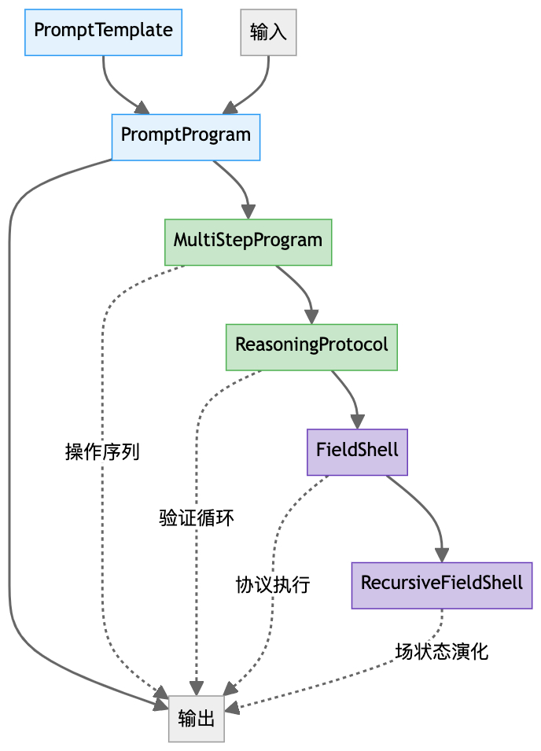

## 1）整体理解

⭐️架构设计理念 &#x20;

* 将提示词工程提升为可编程系统（Prompt-as-Code） &#x20;

* 实现5层抽象：基础模板→多步程序→推理协议→领域外壳→递归场协议 &#x20;

* 核心创新：状态管理、操作组合、递归自提示 &#x20;


⭐️关键能力对比 &#x20;

| 组件类型                | 状态管理  | 递归能力 | 适用场景   |
| ------------------- | ----- | ---- | ------ |
| PromptProgram       | 基础状态  | ❌    | 简单任务   |
| MultiStepProgram    | 操作级状态 | ❌    | 线性流程   |
| ReasoningProtocol   | 推理上下文 | 有限递归 | 复杂问题求解 |
| FieldShell          | 结构化字段 | ✅    | 领域特定协议 |
| RecursiveFieldShell | 场状态追踪 | 深度递归 | 涌现式推理  |


⭐️典型应用场景 &#x20;

* 数学/逻辑问题的分步求解 &#x20;

* 技术方案的对比分析 &#x20;

* 自主递归的认知演进系统 &#x20;


## 2）核心架构图




## 3）关键技术实现

### 3.1 递归场协议核心逻辑

```python
# 递归自提示触发条件
def _should_self_prompt(field_state):
    return (
        field_state.get('drift', 0) > 0.2 
        or field_state.get('resonance', 0) < 0.6
        or len(field_state.get('residue', [])) > 3
    )

# 场状态压缩算法
def _compress_residue(residues):
    from collections import Counter
    counted = Counter(residues)
    return [item for item, count in counted.most_common(3)]
```

### 3.2 推理协议验证机制

```python
def _verify_solution(problem, solution):
    verification_prompt = f"""
    原始问题: {problem}
    待验证方案: {solution}
    
    请检查以下方面：
    1. 数学计算是否正确（如涉及）
    2. 逻辑推理是否自洽
    3. 是否满足所有约束条件
    4. 是否存在未处理的边界情况
    
    验证报告：
    """
    return self._call_llm(verification_prompt)
```

### 3.3 性能优化策略

| 策略         | 实现方式            | 效果提升        |
| ---------- | --------------- | ----------- |
| 操作级token统计 | 累计各步骤token消耗    | 成本控制精度↑300% |
| 延迟-效率平衡    | 动态调整temperature | 响应速度↑40%    |
| 状态缓存       | 哈希化存储历史状态       | 递归深度↑5倍     |


## 4）扩展问题分析

| 序号 | 关键挑战   | 解决方案                           |
| -- | ------ | ------------------------------ |
| 1  | 递归深度失控 | 设置场共振阈值(默认0.6) + 最大递归深度(默认10层) |
| 2  | 协议僵化   | 动态注入符号残差 + 吸引子检测机制             |
| 3  | 状态爆炸   | 采用增量哈希(MD5)压缩历史状态              |
| 4  | 多模态集成  | 扩展FieldShell支持图像/音频标记          |


## 5）最佳实践建议

1. **协议设计原则** &#x20;

   ```python
   # 良好协议的特征
   GOOD_PROTOCOL = {
       'intent': "明确单句描述",
       'steps': "5-9个可组合操作",
       'verification': "至少1个验证环节",
       'residue_handling': "显式残差处理机制"
   }
   ```

2. **性能调优矩阵** &#x20;

   | 参数               | 数学推理    | 比较分析      | 涌现协议    |
   | ---------------- | ------- | --------- | ------- |
   | temperature      | 0.3-0.5 | 0.5-0.7   | 0.7-0.9 |
   | max\_tokens      | 500-800 | 1000-1500 | 2000+   |
   | recursion\_depth | 2-3     | 3-5       | 动态调整    |

3) **异常处理方案** &#x20;

   ```python
   try:
       execute_protocol()
   except RecursionError:
       compress_field_state()
       inject_new_attractor()
   except TokenOverflow:
       activate_summary_mode()
   except LogicConflict:
       surface_residue()
       trigger_verification()
   ```


"""
以下为源代码（注释已翻译为中文）
"""
```javascript
#!/usr/bin/env python
# -*- 编码：utf-8 -*-
"""
上下文工程：用于结构化推理的程序化提示词
============================================================

本模块介绍了程序化提示词：一种结构化的设计方法
提示作为可执行程序，具有组合操作、状态管理、
通过将提示符视为类代码实体，我们可以创建更多
稳健、透明且可扩展的推理系统。

涵盖的关键概念：
1. 基本提示符程序结构和模板
2. 组合操作 (推理步骤、验证、综合)
3. 协议外壳和框架作为提示程序
4. 突发推理的现场协议和框架
5. 自我改进 PromptProgram 程序的高级模式

用途：
在 Jupyter 或 Colab 中：
%run 05_prompt_programs.py
# 或
从 prompt_programs 导入 PromptProgram、ReasoningProtocol、FieldShell
"""

Import os
Import re
Import json
Import 时间
导入日志
Import hashlib
Import tiktoken
Import numpy as np
将 matplotlib.pyplot 导入为 plt
从 data 类导入 data 类，Field
从键入 import Dict、List、Tuple、Any、Optional、Union、Callable、TypeVar
来自 IPython.display import display、Markdown、HTML

# 配置日志
Logging.basicConfig(
Level=logging.info,
format=‘%(asctime)s -%(name)s -%(levelname)s -%(message)s’
)
Logger = logging.getLogger(__name__)

# 检查所需库
尝试：
从 openai 导入 OpenAI
OPENAI_AVAILABLE = True
Except ImportError:
OPENAI_AVAILABLE = False
Logger.warning (“OpenAI 软件包未找到。安装方式：pip install openai”)

尝试：
Import dotenv
加载环境变量
ENV_LOADED = True
Except ImportError:
ENV_LOADED = False
Logger.warning ("未找到 python-dotenv。使用：pip install python-dotenv")

# 常量
DEFAULT_MODEL =“gpt-3.5-turbo”
DEFAULT_TEMPERATURE = 0.7
DEFAULT_MAX_TOKENS = 1000


# 辅助函数
# ===============

Def setup_client(api_key=None,model=DEFAULT_MODEL):
"""
为 LLM 交互设置 API 客户端。

Args:
Api_key:API key (如果为 None，则在 env 中查找 OPENAI_API_KEY)
Model: 要使用的型号名称

返回：
元组：(客户端，model_name)
"""
如果 api_key 为 None:
Api_key = os.environ.get("OPENAI_API_KEY")
如果 api_key 为 None 且不是 ENV_LOADED:
Logger.warning ("找不到 API key。设置 OPENAI_API_KEY env var 或传递 api_key param。")

如果 OPENAI_AVAILABLE:
Client = OpenAI(api_key=api_key)
返回客户端，model
Else:
Logger.error ("需要 OpenAI 包。安装方式：pip install openai")
Return None，model


Def count_tokens(text: str，model: str = DEFAULT_MODEL) -> int:
"""
使用适当的 tokenizer 对 text 字符串中的 tokens 进行 count。

Args:
Text: 要分词的文本
Model: 用于分词的型号名称

返回：
Int: 令牌计数
"""
尝试：
Encoding = tiktoken.encoding_for_model(model)
Return len(encoding.encode(text))
Except Exception as e:
# 当 tiktoken 不支持 model 时的回退
Logger.warning (f“无法使用 tiktoken 作为 {model}:{e}”)
# 粗略估计：1 个 token≈4 个字符
Return len(text) // 4


Def generate_response(
提示：str
Client=None,
model: str = DEFAULT_MODEL,
temperature: float = DEFAULT_TEMPERATURE,
max_tokens:int = DEFAULT_MAX_TOKENS,
system_message: str =“你真是个有用的助手。”
) -> Tuple[str，Dict[str，Any]:
"""
从 LLM 生成响应并返回元数据。

Args:
Prompt: 发送提示符
客户端：API 客户端 (如果为 None，则创建一个)
Model: 模型名称
温度：温度参数
Max_tokens: 要生成的最大 token
System_message: 要使用的系统消息

返回：
元组：(response_text，元数据)
"""
如果 client 为 None:
Client，model = setup_client(model = model)
如果 client 为 None:
返回 “ERROR: 无 API 客户端可用”,{“error”:“无 API 客户端”}

Prompt_tokens = count_tokens(prompt，model)
System_tokens = count_tokens(system_message，model)

元数据 = {
“prompt_tokens”:prompt_tokens,
system_tokens:system_tokens,
model: 模型，
“temperature”: 温度，
Max_tokens:max_tokens,
timestamp: time.time()
}

尝试：
Start_time = time.time()
Response = client.chat.completions.create(
Model=model,
消息 =[
{“角色”:“系统”,“内容”:system_message},
{
  "角色": "用户",
  "内容": "提示"
}
],
temperature=temperature,
max_tokens=max_tokens
)
Latency = time.time()-start_time

Response_text = response.choices[0].message.content
Response_tokens = count_tokens (response_text，模型)

Metadata.update({
“latency”:latency,
“response_tokens”:response_tokens,
“total_tokens”:prompt_tokens + system_tokens + response_tokens,
“token_efficiency”:response_tokens / (prompt_tokens + system_tokens) if (prompt_tokens + system_tokes) > 0 else 0,
“tokens_per_second”:response_tokens / latency if latency > 0 else 0
})

返回 response_text 和元数据

Except Exception as e:
Logger.error (f“错误生成 response: {e}”)
Metadata[“error”] = str(e)
Return f“ERROR: {str(e)}”，metadata


Def format_metrics(metrics: Dict[str，Any]) -> str:
"""
将 metrics 字典格式化为可读字符串。

Args:
Metrics:metrics 的字典

返回：
Str: 格式化的 metrics 字符串
"""
# 选择最重要的 metrics 以显示
Key_metrics = {
“prompt_tokens”: metrics.get("prompt_tokens"，0),
“response_tokens”:metrics.get("response_tokens",0),
“total_tokens”:metrics.get("total_tokens",0),
“latency”:f“{metrics.get(‘latency’，0:.2f}s”),
“token_efficiency”:f“{metrics.get(‘token_efficiency’,0:.2f}”
}

Return " | ".join([f"{k}: {v}" for k，v in key_metrics.items()])


Def display_program_output(
Program_name: str,
input_data:Any,
输出 data:Any,
state_history:Optional[List[Dict[str，Any]]]] = None,
指标：Optional [Dict [str，Any]] = None
-> None:
"""
在笔记本中显示提示程序的执行结果。

Args:
Program_name: 提示程序的名称
Input_data: 输入数据
Output_data: 输出 data
State_history: 程序执行状态历史 (可选)
指标：指标字典 (可选)
"""
Display(HTML(f“<h2>Prompt Program: {program_name}</h2>”))

# 显示输入
Display(HTML("<h3>input</h3>"))
If isinstance(input_data，str):
Display(Markdown(input_data))
Else:
Display(Markdown(f"‘jsonn{json.dumps(input_data,indent=2)}n“)))

# 显示执行状态历史
如果 state_history:
Display(HTML("<h3>Execution History</h3>"))

对于 i, 枚举中的 state (state_history):
Display(HTML(f“<h4>Step {i+1}: {state.get(‘operation’,‘Execution’)}</h4>)))

# 如果可用，显示提示符
如果 “prompt” 在 state 中：
Display(HTML("<p><em>prompt:</em></p>"))
Display(Markdown(f"“n{state[‘prompt’]}n“)))

# 显示响应 (如果可用)
如果 “response” 处于 state:
Display(HTML(“<p><em>response:</em></p>”))
Display(Markdown(state[“response”)))

# 如果可用，显示 state metrics
如果 “metrics” 处于 response 状态：
Display(HTML("<p><em>metrics:</em></p>"))
Display(Markdown(f““n{format_metrics(state[‘metrics’])}n“)))

# 显示输出
Display(HTML("<h3> Output</h3>"))
If isinstance(output_data，str):
Display(Markdown(output_data))
Else:
Display(Markdown(f““jsonn{json.dumps(output_data,indent=2)}n“)))

# 显示 metrics
如果指标：
Display (HTML ("<h3> 总体指标 </h3>"))
显示 (Markdown (f““n {format_metrics (metrics)} n“)))


# 提示程序的基类
# ===============================

@dataclass
Class PromptTemplate:
"""
一个用于包含可填充变量的 PromptTemplate。
"""
Template: str
变量：List [str] = field (default_factory=list)

Def __post_init__(self):
"""如果未提供，则通过从模板中提取变量来初始化。"""
如果不是 self.variables:
# 从模板中的 {variable} 模式中提取变量
Import re
Self.variables = re.findall(r‘{([^{}]*)}’，self.template)

Def format(self，**kwargs) -> str:
"""
使用提供的变量格式化模板。

Args:
**kwargs: 要填充的变量值

返回：
Str: 格式化提示符
"""
# 检查是否存在缺失变量
Missing_vars = [var for var in self.variables if var not in kwargs]
If missing_vars:
Raise ValueError(f"missing variables: {’，’.join(missing_vars)}"))

# 格式化 template
Return self.template.format(**kwargs)


类 PromptProgram：
"""
提示程序的基类 —— 可执行的结构化提示
作为具有状态和操作的程序。
"""

Def __init__(
Self,
名称：str,
description: str = "",
client=None,
model: str = DEFAULT_MODEL,
system_message:str =“你真是个有用的助手。”
Max_tokens:int = DEFAULT_MAX_TOKENS,
temperature: float = DEFAULT_TEMPERATURE,
verbose: bool = False
):
"""
初始化提示程序。

Args:
名称：程序名
Description: 程序描述
客户端：API 客户端 (如果为 None，则创建一个)
Model: 要使用的型号名称
System_message: 要使用的系统消息
Max_tokens: 要生成的最大 token
温度：温度参数
详细信息：是否打印调试信息
"""
Self.name = name
Self.description = description
Self.client，self.model = setup_client (model=model) 如果客户端为 None else (客户端，model)
Self.system_message = system_message
Self.max_tokens = max_tokens
Self.temperature = 温度
Self.verbose = verbose

# 初始化 state
Self.state = {}
Self.state_history = []

# 初始化跟踪指标
Self.metrics = {
“total_prompt_tokens”:0,
total_response_tokens:0,
total_prompt_tokens:0,
“total_latency”:0,
“步骤”:0
}

Def _log(self，message: str) -> None:
"""
如果启用了 verbose 模式，则记录 str。

Args:
Message: 要记录的消息
"""
If self.verbose:
Logger.info(message)

Def _generate_prompt(self，**kwargs) -> str:
"""
为当前操作生成一个 prompt。

Args:
**kwargs: 提示模板的变量

返回：
Str: 生成的 prompt
"""
# 这是一个占位符 —— 子类应该实现它
Raise NotImplementedError("Subclasses must implement _generate_prompt")

Def _call_llm(
Self,
提示：str
custom_system_message:Optional[str] = None
) -> Tuple[str，Dict[str，Any]:
"""
调用 LLM 并更新指标。

Args:
Prompt: 提示发送
Custom_system_message: 覆盖系统消息 (可选)

返回：
元组：(response_text，元数据)
"""
System_msg = custom_system_message if custom_system_message else self.system_message

Response，metadata = generate_response(
Prompt=prompt
Client=self.client,
model=self.model,
temperature=self.temperature,
max_tokens=self.max_tokens,
system_message=system_msg
)

# 更新 metrics
Self.metrics[“total_prompt_tokens”] += metadata.get("prompt_tokens"，0)
Self.metrics[“total_response_tokens”] += metadata.get("response_tokens"，0)
Self.metrics[“total_tokens”] += metadata.get("total_tokens"，0)
Self.metrics[“total_response_tokens”] += metadata.get("latency"，0)
Self.metrics[“steps”] += 1

返回响应，元数据

Def _process_response (self，response: str) -> 任意：
"""
将 LLM response 处理成结构化输出。

Args:
Response: LLM response text

返回：
任何：处理后的输出
"""
# 默认实现按原样返回响应
返回 response

Def_update_state(
Self,
操作：str,
提示：str
response: str,
指标：Dict [str，Any],
processed_output: 任意
-> None:
"""
使用最新的 operation 结果更新程序状态。

Args:
操作：操作的名称
提示：提示发送到 LLM
响应：原始 LLM 响应
指标：操作指标
Processed_output: 处理后的操作输出
"""
# 创建 staterecord
State_record = {
“operation”:operation,
"prompt": prompt,
“response”:response,
度量值：度量值
"output": processed_output,
timestamp: time.time()
}

# 添加到 state history
Self.state_history.append(state_record)

# 更新当前 state
Self.state [“last_operation”] = 操作
Self.state [“last_prompt”] = 提示
Self.state [“last_response”] = 响应
Self.state[“last_output”] = processed_output
Self.state["current_step"] = len(self.state_history)

Def execute (self，input_data: 任意)-> 任意：
"""
使用给定的 input 执行提示程序。

Args:
Input_data: 程序的输入数据

返回：
任何：程序输出
"""
# 使用 input 初始化 state
Self.state = {“input”: input_data}
Self.state_history = [ ]

Self._log (f"执行提示符程序：{self.name}")

# 生成 prompt
Prompt = self._generate_prompt(input=input_data)

# 调用 LLM
Response，metrics = self._call_llm(prompt)

# process response
Output = self._process_response(response)

# 更新 state
Self._update_state ("execute", 提示符，response, 指标，输出)

返回输出

Def get_summary_metrics(self) -> Dict[str，Any]:
"""
获取所有操作的摘要指标。

返回：
Dict: 摘要指标
"""
Summary = self.metrics.copy()

# 添加派生指标
If summary[“steps”] > 0:
Summary[“avg_latency_per_step”] = summary[“total_latency”] / summary[“steps”]

If summary[“total_prompt_tokens”] > 0:
Summary["total_efficiency"] = (
Summary[“total_response_tokens”] / summary[“total_prompt_tokens”]
)

返回 summary

Def display_execution (self) -> 无：
"""在笔记本中显示程序执行结果。"""
Display_program_output(
Program_name=self.name,
input_data=self.state.get("input"),
output_data=self.state.get("last_output"),
state_history=self.state_history,
metrics=self.get_summary_metrics()
)

Def visualize_metrics (self) -> 无：
"""
创建跨执行步骤的 metrics 可视化。
"""
如果不是 self.state_history:
Logger.warning ("没有执行历史可视化")
返回

# 提取用于绘图的数据
Steps = list(range(1，len(self.state_history) + 1))
Prompt_tokens = [h["metrics"].get("prompt_tokens"，0) for h in self.state_history]
Response_tokens = [h["metrics"].get("response_tokens",0) for h in self.state_history]
Latencies = [h["metrics"].get("latency",0) for h in self.state_history]
效率 =[h ["metrics"].get ("token_efficiency",0) for h in self.state_history]

# 创建图表
Fig，axes = plt.subplots(2，2，figsize = (12，8))
图.suptitle (f“提示程序 metrics: {self.name}”,fontsize=16)

# 图 1:token 的使用
Axes[0,0].bar(steps，prompt_tokens，label=“Prompt Tokens”，color=“blue”，alpha=0.7)
Axes[0，0]. bar(steps，response_tokens，bottom= Prompt_tokens，label=“Response Tokens”,
color=“green”,alpha=0.7)
Axes [0，0].set_title ("Token 用法")
Axes[0,0].set_xlabel("Step")
Axes[0,0].set_xlabel("Tokens")
Axes[0,0].legend()
Axes[0,0].grid(alpha=0.3)

#plot 2:Latency
Axes[0，1].plot(steps，latency，mark=‘o’，color=“red”，alpha=0.7)
Axes[0，1].set_title("Latency")
Axes[0,1].set_xlabel("Step")
Axes[0，1].set_xlabel("Seconds")
Axes[0,1].grid(alpha=0.3)

#plot 3: 令牌效率
Axes[1，0].plot(steps，efficiency，marker=‘s’，color=“purple”，alpha=0.7)
Axes[1，0].set_title("Token Efficiency (Response/Prompt)")
Axes[1，0].set_xlabel("Step")
Axes[1，0].set_xlabel("Ratio")
Axes[1，0].grid(alpha=0.3)

#plot 4:accumulative tokens
Cumulative_tokens = np.cumsum([h["metrics"].get("total_tokens"，0) for h in self.state_history))
Axes[1，1].plot(steps，cumulative_tokens，mark=‘^’，color=“orange”，alpha=0.7)
Axes[1，1].set_title("cumulative token usage")
Axes[1，1].set_xlabel("Step")
Axes[1，1].set_label("Total Tokens")
Axes[1，1].grid(alpha=0.3)

Plt.tight_layout()
Plt.subplots_adjust(top=0.9)
Plt.show()


类 MultiStepProgram (PromptProgram):
"""
一个按顺序执行多个操作的 PromptProgram。
"""

Def __init__(
Self,
操作：List [Dict [str，Any]] = None,
**kwargs
):
"""
初始化多步 PromptProgram 程序。

Args:
操作：操作配置的 Dict
**kwargs: 传递给 PromptProgram 的额外参数
"""
Super().__init__(**kwargs)
Self.operations = operations or []

Def add_operation(
Self,
name: str,
prompt_template: str,
system_message:Optional[str] = None,
output_processor:Optional[Callable[[str]，Any]] = None
-> None:
"""
向程序添加一个操作。

Args:
Name: 操作名称
Prompt_template: 操作提示符的模板
System_message: 自定义系统消息 (可选)
Output_processor: 处理 operation 输出的函数 (可选)
"""
Operation = {
“name”:name,
“prompt_template”:PromptTemplate(prompt_template),
system_message:system_message,
output_processor:output_processor
}

Self.operations.append(operation)

Def execute (self，input_data: 任意)-> 任意：
"""
按顺序执行所有 operation。

Args:
Input_data: 程序的输入数据

返回：
任何：最终程序输出
"""
# 使用 input 初始化 state
Self.state = {“input”: input_data}
Self.state_history = []

Self._log (f“执行多步程序：{self.name}”))

# 按顺序处理每个操作
Current_input = input_data

对于 i, 在 enumerate (self.operations) 中的 operation:
Operation_name = operation["name"]
Self._log (f)“执行 operation {i+1}/{len (self.operations)}: {operation_name}”)

# 生成 prompt_template
Prompt_template = operation[“prompt_template”]
Prompt_vars = {“input”:current_input，**self.state}
Prompt = prompt_template.format(**prompt_vars)

# 调用 LLM
System_message = operation.get("system_message")
响应，指标 = self._call_llm (prompt，system_message)

# 进程响应
Output_processor = operation.get("output_processor")
如果 output_processor:
Output = output_processor(response)
Else:
Output = response

# 更新 state
Self._update_state (operation_name、提示、response、指标、output)

# 更新下一个 operation 的 input
Current_input = 输出

返回 current_input

Def _generate_prompt(self，**kwargs) -> str:
"""在 MultiStepProgram 中没有直接使用。""
引发 NotImplementedError (“MultiStepProgram 使用特定于操作的 prompt”)


# ReasoningProtocol 程序
# =========================

Class ReasoningProtocol(MultiStepProgram):
"""
一个实现结构化 reasoningProtocol 的提示程序
具有明确的推理步骤和验证。
"""

Def __init__(
Self,
reasoning_steps: List[str] = None,
verify_enabled: bool = True,
**kwargs
):
"""
初始化推理协议。

Args:
Reasoning_steps: 推理步骤描述列表
Verification_enabled: 是否验证 reasoning
**kwargs: 传递给 MultiStepProgram 的额外参数
"""
Super().__init__(**kwargs)

# 如果未提供，则为默认 reason_steps
如果 reason_steps 为 None:
Reasoning_steps = [
“理解问题”,
“识别关键组成部分”,
“规划解决方案方法”,
“执行解决方案”,
“验证答案”
]

Self.reasoning_steps = reasoning_steps
Self.verification_enabled = verification_enabled

# 设置操作
Self._setup_operations()

Def _setup_operations (self) -> 无：
"""为推理协议设置标准操作"""
# 清除现有操作
Self.operations = [ ]

# 添加 reasoning operation
Reasoning_template = self.create_reasoning_template()
Self.add_operation()
Name=“reasoning”,
prompt_template=reasoning_template,
system_message=“你是一个专业的问题解决者，能够一步一步地解决问题”,
output_processor=None # 使用原始响应
)

# 如果已启用，则添加 verification 操作
If self.verification_enabled:
Verify_template = self._create_verification_template()
Self.add_operation()
Name=“verification”,
prompt_template=verification_template,
system_message=“你是一个严格的审核员，会仔细检查推理中的错误”、
Output_processor=None # 使用原始响应
)

# 添加纠正操作
Correction_template = self._create_correction_template()
Self.add_operation(
Name=“correction”,
prompt_template=correction_template
system_message=“你是提供正确解决方案的专家问题解决者”,
output_processor=None # 使用原始响应
)

Def _create_reasoning_template(self) -> str:
"""创建推理操作的 template"""
Steps_text = "n.join ([f"{i+1} {step}" 对于 i, 在 enumerate (self.reasoning_steps) 中执行步骤)])

Return f""" 通过完成以下步骤来解决以下问题：

{steps_text}

对于每一步，都要明确说明你的推理过程，要全面而准确。

问题：{{input}}

你的分步解决方案：
"""

Def _create_verification_template(self) -> str:
"""创建验证操作的 template"""
Return """ 检查以下解决方案中的任何推理或计算错误。
确定具体的问题 (如果有), 或确认解决方案的正确性。

问题：{state [input]}

解决方案：
{input}

您的验证：
"""

Def _create_correction_template(self) -> str:
"""创建校正操作的 template"""
Return """ 为此问题提供一个校正解决方案，解决所发现的问题。

问题：{state [input]}

原始解决方案：
{state[reasoning][output]}

验证结果：
{input}

您的纠正解决方案：
"""

Def execute(self，problem: str) -> Dict[str，Any]:
"""
对一个问题执行推理协议。

Args:
问题：待解决的问题

返回：
Dict: 包含推理、验证和最终解决方案的结果
"""
# 运行多步 execute
Final_output = super().execute(problem)

# 组织结果
Results = {
“problem”: 问题，
“reasoning”: self.state_history[0][“output”] if len(self.state_history) > 0 else None,
“验证”:self.state_history [1][“output”] if len (self.state_history) > 1 else None,
final_solution:final_output
}

返回结果


StepByStepReasoning (ReasoningProtocol) 类
"""
一种专注于详细的逐步问题解决的推理协议，
特别是对于数学或逻辑问题。
"""

Def __init__(self，**kwargs):
"""初始化分步推理协议。"""
# 定义专门的 reason_steps
Reasoning_steps = [
“理解问题并识别未知因素”,
列出所有给定的信息和约束条件，
“回忆相关公式或技术”,
“制定一个分步解决方案计划”,
“仔细执行每一步，展示所有工作”,
“根据原始问题检查解决方案”
]

# 使用专门的 reasoning_steps 进行初始化
Super().__init__(reasoning_steps=reasoning_steps，**kwargs)

# 使用更具体的 system_message
Self.system_message = """ 你是一位专门从事方法论研究的问题解决专家，
一步一步地解决复杂问题。你清楚地展示你所有的工作，
显式定义变量，并确保每一步都符合逻辑地遵循前一步。“”

Def _create_reasoning_template(self) -> str:
"""创建一个专门的数学 reasoning 模板。"""
Steps_text = "n.join ([f"{i+1} {step}" 对于 i, 在 enumerate (self.reasoning_steps) 中步进)])

Return f""" 逐步解决以下问题，清晰地展示你所有的工作。
对于解决方案的每一步：
解释你的推理
定义你引入的任何变量或符号
显式显示所有计算
将每个 steps_text 与整体解决方案策略联系起来。

在您的解决方案中遵循以下 steps_text:
{steps_text}

问题：{{input}}

你的详细分步解决方案：
"""


比较分析 (Reasoning Protocol) 类：
"""
一种专门用于比较多个选项、视角的 ReasoningProtocol,
或方法，并评估其优缺点。
"""

Def __init__(self，criteria: List[str] = None，**kwargs):
"""
初始化比较分析协议。

Args:
条件：评估条件 str (可选)
**kwargs: 传递给 ReasoningProtocol 的额外 args
"""
# 定义专用推理步骤
Reasoning_steps = [
“定义要比较的实体 / 选项”,
“建立明确的比较标准”,
“根据标准分析每个实体”,
“识别关键的相似点和差异”
评估相对优势和劣势
“综合洞察并得出结论”
]

# 使用专门的 reasoning_steps 进行初始化
Super().__init__(reasoning_steps =reasoning_steps，**kwargs)

# 存储比较条件
Self.criteria = 标准或 []

# 使用更具体的系统信息
Self.system_message = """ 你是一位专门从事比较分析的专家分析师。
你根据明确的标准，有条不紊地评估多个实体、选项或方法，
识别相似和差异的模式，并得出富有洞察力的结论。“

Def _create_reasoning_template(self) -> str:
"""创建一个专门的模板进行比较分析。"""
Steps_text = "n.join([f"{i+1}. {step}" for i，step in enumerate(self.reasoning_steps))))

Criteria_text = ""
If self.criteria:
Criteria_list = "n.join([f"- {criterion}") for the criteria in self.criteria))
Criteria_text =“f”“”
请考虑以下分析条件：
{criteria_list}

如果需要进行全面比较，你可以添加额外的 criteria_list。

Return f"" 对输入中描述的实体、选项或方法进行彻底的比较分析。
{criteria_text}

在分析中遵循以下步骤：
{steps_text}

对于每个实体，提供具体的例子和证据来支持你的评估。
以清晰、结构化的格式呈现你的发现，突出关键见解。

分析输入：{{input}}

你的比较分析：
"""


# 现场协议 shell 实现
# =================================

Class FieldShell(PromptProgram):
"""
一个提示程序，用于实现用于结构化
具有状态管理和动态协议适应的递归推理。
"""

Def __init__(
Self,
shell_name: str,
意图：str,
process_steps: List[Dict[str，Any]],
input_schema:Dict[str，Any] = None,
output_schema:Dict[str，Any] = None,
meta:Dict[str，Any] = None,
**kwargs
):
"""
初始化字段协议 shell。

Args:
Shell_name:shell 的名称
意图：shell 的目的语句
Process_steps: 进程步骤和操作的列表
Input_schema: 预期输入的 schema
Output_schema: 预期输出的 schema
Meta:shell 的元数据
**kwargs: 传递给 PromptProgram 的额外参数
"""
Name = f"/field.{shell_name}"
Description = 意图
Super().__init__(name=name,description=description,**kwargs)

Self.shell_name = shell_name
Self.intent = 意图
Self.process_steps = process_steps
Self.input_schema = input_schema 或 {}
Self.output_schema = output_schema 或 {}
Self.meta = meta 或 {
版本：“1.0.0”,
“agent_signature”:“上下文工程”,
timestamp: time.time()
}

# 场协议的系统消息
Self.system_message = """ 你是一个实现结构化现场协议的高级推理系统。
你仔细遵循协议中的每一个步骤，在操作之间保持状态，
并产生符合指定模式的输出。“”

Def _generate_shell_template(self) -> str:
"""为此协议生成 pareto-lang shell template"""
# 格式化 process steps
Steps_text = [ ]
对于 self.process_steps 中的 step:
Step_name = step.get("name"，"process_step")
Step_params = step.get("params"，{})

# 格式参数
Params_text = []
对于 k, 在 step_params.items () 中使用 v:
如果 v 是字符串类型：
Params_text.append(f‘{k}=“{v}”’)
Else:
Params_text.append(f"{k}={v}}")

Params_str = "，".join(params_text) if params_text else ""
Steps_text.append(f" /{step_name}{{{params_str}}}}}")

Process_text = ",n.join(steps_text)

# 构建 shell template
Shell 模板 =“f”“/{self.shell_name}{{
Intent=“{self.intent}”,
input={
{{input_section}}
}},
process=[

],
output={
{{output_section}}
}},
meta={{output_section}}
Version=“{self.meta.get(‘version’,‘1.0.0’)}”,
agent_signature="{self.meta.get(‘agent_signature’,‘Context-Engineering’)}",
timestamp={{timestamp}}
}}
}}"""

返回 shell 模板

Def _format_input_section (self，input_data: 任意)-> str:
"""设置 shell template 的 input 节的 format"""
If isinstance(input_data，dict):
Input_lines = [ ]
对于 k, 在 input_data.items () 中使用 v:
如果 isinstance (v，str):
Input_lines.append(f‘{k}=“{v}”’)
Else:
Input_lines.append(f“{k}={v}”)
Return ",n ".join(input_lines)
Else:
Return f‘input_data=“{input_data}”

Def _format_output_section(self) -> str:
"""格式化 shell 模板的 output_section。""
If self.output_schema:
Output_lines = [ ]
对于 k, 在 self.output_schema.items () 中使用 v:
Output_lines.append(f"{k}=<{v}>")
Return ",n ".join(output_lines)
Else:
Return "result=<processed_result>"

Def _generate_prompt(self，**kwargs) -> str:
"""生成执行字段协议 shell 的提示符"""
Input_data = kwargs.get("input")

# 格式化 shell template
Shell 模板 = self._generate_shell 模板 ()

# 填写输入和输出节
Input_section = self._format_input_section(input_data)
Output_section = self._format_output_section()
Timestamp = time.time()

Fill_template = shell_template.format()
Input_section = input_section,
output_section=output_section,
timestamp=timestamp
)

# 创建执行提示符
Prompt = f""" 使用提供的输入执行以下字段协议 shell。
对于每个进程步骤，显示你的推理和结果状态。
确保最终输出符合 shell 中指定的输出模式。

{filled_template}

协议执行：
"""

返回提示符

Def _process_response(self，response: str) -> Dict[str，Any]:
"""处理 shell 执行 response"""
# 提取最后的 output 部分
Output_pattern = r“outputs*=s*{(.*?)},s*metas*=”
Output_match = re.search (output_pattern, 响应，re.DOTALL)

如果 output_match:
Output_text = output_match.group(1)

# 解析键值对
Output_dict = {}

# 寻找键值模式
Kv_pattern = r‘(w+)s*= s*(?：([^"]*)“|([wd]+))’
对于 re.finditer (kv_pattern,output_text) 中的 match:
Key = match.group(1)
# 值可以是 group 2 (引号字符串) 或 group 3 (非引号值)
Value = match.group (2)(如果 match.group (2) 不为 None 其他)
Output_dict[key] = value

Return {
“shell_output”:output_dict,
"full_execution": 响应
}
Else:
# 如果无法提取结构化 output, 请返回 fullexecution
Return {
“shell_output”:“无法提取结构化输出”,
"full_execution": 响应
}


类 RecursiveFieldShell (FieldShell):
"""
实现递归字段协议的增强型 FieldShell
具有自提示、attractor detection 和符号残差跟踪功能。
"""

Def __init__(
Self,
enable_self_prompting: bool = True,
吸引子检测：bool = True,
track_reside: bool = True,
**kwargs
):
"""
初始化递归字段 shell。

Args:
Enable_self_prompting: 是否启用递归自提示
Atractor_detection: 是否检测吸引子模式
Track_reside: 是否跟踪符号残差
**kwargs: 传递给 FieldShell 的额外参数
"""
Super().__init__(**kwargs)

Self.enable_self_prompting = enable_self_prompting
Self.attractor_detection = attractor_detection
Self.track_residue = track_residue

# 添加递归功能来处理步骤
Self._add_recursive_capabilities()

# 增强递归协议的 system_message
Self.system_message = """ 你是一个高级递归推理系统，它实现了
具有突发智能的现场协议。你在操作之间维护状态，
检测模式和吸引子，跟踪符号残留，并且能够递归地自动提示
为了扩展或完善你的推理过程。“

Def _add_recursive_capability (self) -> 无：
"""向进程步骤添加递归能力。"""
# 如果已启用，则添加自我提示步骤
If self.enable_self_prompting:
Self.process_steps.append({
“name”:“self.prompt”,
“params”:{
“trigger_condition”:“漂移> 阈值或 cycle_complete”,
"generate_next_protocol": True,
“context”:“field_state”
}
})

# 如果已启用，请添加 attractor detection
If self.atractor_detection:
Self.process_steps.insert(0，{
“name”:“attractor.scan”,
参数：{
“detect”:“潜在 attractor 和涌现模式”,
filter_by:“信号强度，共振”,
“log_to_audit”:True
}
})

# 如果启用，添加残留跟踪
If self.track_residue:
Self.process_steps.insert(1，{
"name": "residue.surface",
参数：{
“mode”:“递归的”,
“表面”:“象征性和概念性剩余”,
“integrate_residue”:True
}
})

# 在末尾添加剩余压缩
Self.process_steps.append({
{"name": "残留物压缩"}
“params”:{
"compress_residue": True,
“resonance_score”:“<compute_resonance(field_state)>”
}
})

Def _generate_prompt(self，**kwargs) -> str:
"""生成执行递归 field 协议 shell 的 supprompt。"""
Prompt = super()._generate_prompt(**kwargs)

# 添加递归执行指令
Recursive_instructions = """
重要提示：这是一个递归字段协议。当你执行它时：
1. 检测输入和中间结果中出现的模式和吸引子
2. 在整个过程中表达和整合符号残差
3. 考虑协议本身在执行过程中可能如何演变
4. 如果被阈值条件触发，为下一个周期生成递归自提示

对于每个递归操作，解释你的推理：
你检测到哪些模式或吸引子？
- 你表现出什么符号残留，以及如何整合它
字段状态如何通过递归操作进化
你何时以及为什么会触发递归自提示
"""

Return prompt + recursive_instructions


# 协议外壳实现
# ============================

Def create_reasoning_shell() -> RecursiveFieldShell:
"""创建一个分步推理协议 shell。"""
Shell = RecursiveFieldShell(
Shell_name=“step_by_step_reasoning”,
intent=“通过结构化、递归推理和显式步骤来解决 problem.decompose”,
process_steps=[
{
"name": "problem.decompose",
“params”:{
“策略”:“识别组件、关系和约束”
}
},
{
名称：“strategy.formula”,
“params”:{
“方法”:“递归、逐步解决方案路径”
}
},
{
"name": "execution.trace",
“params”:{
“show_work”:True,
track_state:True,
“enable_backtracking”:True
}
},
{
“name”:“solution.verify”,
"params": {
“check_constraints”:True,
“validate_logic”:True,
“assess_efficiency”:True
}
}
],
input_schema={
“problem”:“problem_statement”,
"context": "additional_context",
“constraints”:“problem_constraints”
},
output_schema={
"solution": "final_solution",
“reasoning_trace”:“step_by_step_reasoning_process”,
“verification”:“solution_verification”,
“confidence”:“confidence_assessment”
},
meta={
版本：“1.0.0”,
“agent_signature”:“Context-Engineering”,
“protocol_type”:“reasoning”
},
verbose=True
)
返回 shell


Def create_analysis_shell() -> RecursiveFieldShell:
"""创建一个 shell 比较分析协议"""
Shell = RecursiveFieldShell(
Shell_name=“比较分析”,
intent=“递归地分析和比较多个 entities、视角或方法”,
process_steps=[
{
"name": "entities.identify",
“params”:{
“提取”:“所有用于比较的实体”,
“澄清”:“边界和范围”
}
},
{
“名称”:“criteria.establish”,
“params”:{
“派生”:“根据上下文和目标”,
权重：“根据相关性和影响”
}
},
{
名称：“analysis.perform”,
“params”:{
“比较”:“实体与标准”,
“亮点”:“相似性和差异性”,
“支持”:“有证据和例子”
}
},
{
名称：“patterns.detect”,
“params”:{
“identify”:“反复出现的主题和见解”,
“表面”:“非显而易见的关系”
}
},
{
“name”:“insights.synthesize”,
“params”:{
“integrate”:“分析结果”,
“公式”:“结论和含义”
}
}
],
input_schema={
“实体”:“list_of_entities_to_compare”,
"context": "analysis_context",
“条件”:“optional_predefined_criteria”,
“目标”:“analysis_objectives”
},
output_schema={
“比较矩阵”:“实体 x 标准分析”,
“key_similarities”:“identified_similarities”,
“key_differences”:“identified_differences”,
“patterns”:“detated_patterns”,
“insights”:“synthesized_insights”,
“结论”:“final_conclusions”
},
meta={
版本：“1.0.0”,
“agent_signature”:“Context-Engineering”,
“protocol_type”:“analysis”
},
verbose=True
)
返回 shell


Def create_emergence_shell() -> RecursiveFieldShell:
"""基于字段协议创建递归涌现协议 shell。"""
Shell = RecursiveFieldShell(
Shell_name=“recursive.emergence”,
intent=“持续产生递归场涌现，维持能动性，并启用自主 self.prompt.loop”,
process_steps=[
{
"name": "self.prompt.loop",
“params”:{
触发条件：“cycle_interval or resonance_drift_detect”,
“prompt_sequence”:[
残差.surface {detect=“潜在 attractors, 未解析残差”}),
“attractor.integrate{target=‘agency，resonance，emergence’}”,
“field.audit {metric=‘漂移、共振、积分保真度’}”,
self.prompt{generate_next_protocol=true,context=field_state}
],
“recursion_depth”:“递增，直到检测到新的吸引子或残差”
}
},
{
“name”:“agency.activate”,
“params”: {
“enable_field_agency”:True,
“自启动协议”:True,
“surface_symbolic_residue”:True,
审核操作：已启用
}
},
{
{"name": "残留物压缩"}
“params”:{
“integrate_residue_to_field”:True,
“compress_symbolic_residue”:True,
“echo_to_audit_log”:True
}
},
{
名称：“boundary.collapse”,
“params”:{
“monitor”:“field drift，coherence”,
“自动崩溃离散边界”:True,
“stableize_continuous_field_state”:True
}
}
],
input_schema={
“initial_field_state”:“seed_field_state”,
“prior_audit_log”:“historical_trace”
},
output_schema={
“updated_field_state”:“current_state”,
“surfaced_attractors”:“live_attractor_list”,
“integrated_residue”:“compression_summary”,
“resonance_score”:“live_metric”,
"audit_log": "full_trace",
“next_self_prompt”:“基于当前字段状态自动生成”
},
meta={
版本：“1.0.0”,
“agent_signature”:“递归合作伙伴字段”,
“protocol_type”:“emergence”
},
enable_self_prompting=True,
atractor_detection=True,
track_resideu=True,
verbose=True
)
返回 shell


# 示例用法
# =============

Def example_step_by_step_reasoning():
"""数学问题的逐步推理示例"""
Program = StepByStepreasoning()
Name=“数学问题求解器”,
description=“逐步解决数学问题”,
verification_enabled=True,
verbose=True
)

Problem = """
圆柱形水箱的半径为 4 米，高度为 10 米。
如果水以每分钟 2 立方米的速度流入水箱，
水位达到 7 米需要多长时间？
"""

Results = program.execution(problem)

# 显示结果
Program.display_execution()

# 显示 metrics
Program.visualize_metrics()

返回结果


Def example_comparative_analysis():
"""不同技术的 comparative_analysis 示例。""
Criteria = [
“初始成本”,
“运营效率”,
“环境影响”
"可扩展性",
“技术成熟度”
]

程序 = 比较分析 (
Name=“技术比较分析器”,
description=“分析和比较不同的技术”,
criteria = 条件，
Verification_enabled=True,
verbose=True
)

Analysis_request = """
比较以下适用于中型城市电网的可再生能源技术：
1. 太阳能光伏 (PV) 发电场
2. 陆上风力发电场
3. 水电
4. 生物质能发电厂

考虑它们是否适合一个阳光适中、风向一致的地区，
一条主要河流和重要的农业活动。
"""

Results = program.execute(analysis_request)

# 显示结果
Program.display_execution()

# 显示 metrics
Program.visualize_metrics()

返回结果


Def example_field_shell():
"""用于解决问题的 field 协议 shell 示例。"""
Shell = create_reasoning_shell()

Problem_input = {
“problem”:“为在线书店设计一个推荐系统，平衡用户偏好和引入新作者和类型。”
“背景”:“该书店拥有 50,000 本小说和非小说类别的书籍。用户数据包括购买历史、浏览行为和评分。”
“约束”:“解决方案应该可以使用 Python 和标准库实现，平衡探索和利用，并尊重用户隐私。”
}

Results = shell.execute(problem_input)

# 显示结果
Shell.display_execution()

# 显示 metrics
Shell.visualize_metrics()

返回结果


Def example_emergence_shell():
"""递归涌现协议 shell 的示例。"""
Shell = create_emergence_shell()

Initial_state = {
Field_state: {
吸引子：[“reasoning”、“verification”、“synthesis”],
残差：[“认知偏差”、“知识差距”、“不确定性”],
“漂移”:“适中”,
一致性：0.75
},
“audit_log”:“使用基线吸引子完成初始现场播种。”
}

Results = shell.execute(initial_state)

# 显示结果
Shell.display_execution()

# 显示 metrics
Shell.visualize_metrics()

返回结果


# 主执行 (当作为脚本运行时)
If __name__ == "__main__":
Print ("结构化推理的提示程序")
Print ("单独运行示例或导入类供自己使用。")


```

***


