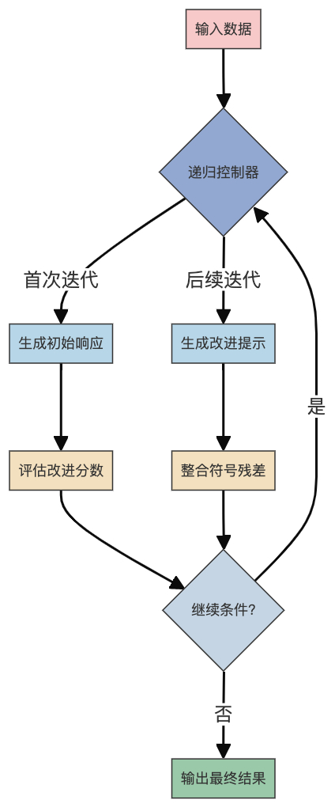

## 1）整体理解

⭐️目标与作用

* 实现LLM自我改进的递归模式框架，通过反馈循环使模型能迭代优化自身输出

* 探索上下文工程的递归范式，包括自我反思、策略自举和符号残差三大核心模式

* 提供可量化的改进评估体系（改进分数、复杂度等级、共振分数等）

⭐️使用场景

* 需要持续优化LLM输出的生产环境（如内容生成、决策支持系统）

* 研究递归提示工程和元认知能力的学术实验

* 构建具有长期记忆和自我进化能力的AI代理

⭐️核心概念与术语

1. 递归模式：通过迭代调用自身实现持续改进的算法结构

2. 符号残差：处理过程中产生的中间认知产物（类比人类思维的"思维碎片"）

3) 共振分数：衡量当前输出与原始输入语义一致性的指标（0-1）

4) 残差压缩：符号残差的去冗余化程度（0-1）

5. 场协议：管理递归过程的元规则集合

***

## 2）代码流程图

## 3）代码中的难点与解释

1. **递归停止条件判断**

   * 解释：需要综合评估改进分数、共振分数和残差压缩度等多维度指标

   * 影响：过早停止导致改进不足，过晚停止造成资源浪费

2. **符号残差管理**

   * 解释：需平衡残差积累（保留有用信息）与压缩（防止信息过载）

   * 影响：直接影响模型的长期记忆能力和推理连贯性

3) **状态空间爆炸**

   * 解释：递归过程中状态变量呈指数级增长

   * 影响：通过哈希压缩和选择性回溯等策略缓解

4) **温度参数动态衰减**

   * 解释：随迭代次数增加逐步降低生成随机性

   * 影响：初期鼓励探索，后期注重结果稳定性

## 4）扩展问题

| 序号 | 问题                   | 回答                                          |
| -- | -------------------- | ------------------------------------------- |
| 1  | 如何防止递归过程中的语义漂移？      | 通过共振分数监控+种子残差注入机制，当检测到漂移时自动回滚到最近稳定状态        |
| 2  | 递归模式与传统微调有何优劣？       | 递归模式实时自适应但计算成本高，微调效果稳定但缺乏灵活性，二者可互补          |
| 3  | 符号残差与向量数据库的记忆机制有何不同？ | 符号残差保留结构化认知片段，适合短期工作记忆；向量数据库存储原始数据，适合长期事实记忆 |

该框架通过模块化设计实现了递归模式的标准化，三种核心模式可单独使用或组合应用，为构建自改进AI系统提供了基础架构。特别值得注意的是其量化评估体系，使得递归过程具有可解释性和可控性。

***

