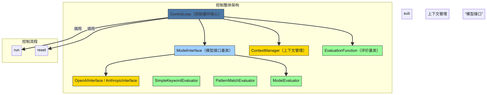

### 1）整体概要

上述代码定义了一个复杂的控制框架，旨在通过多种策略和模型交互实现基于上下文的智能任务解决方案。核心思想是利用大语言模型（如OpenAI的GPT系列或Anthropic的Claude模型）结合灵活的上下文管理、状态追踪、场域（神经场）模拟和协议定义，支持多次迭代与自我优化。主要任务包括：多步推理、状态跟踪、动态上下文调整、响应评价及递归式自我提升，广泛应用于复杂任务分解、知识图谱构建、情境模拟等。


### 2）逻辑图




### 3）代码的运行示例（简洁直观的流程说明）

```plain&#x20;text
用户输入任务（例如：解答数学题或分析情境）
    ↓
控制循环（ControlLoop）开始
    ├─ 初始化模型和上下文
    ├─ 生成模型响应
    ├─ 评估响应（关键词匹配、模式匹配或模型自评）
    ├─ 根据评估结果决定是否停止
    └─ 若未成功，持续多轮迭代，调整上下文和状态
最终输出：
    - 是否得到满意答案
    - 完成所需的轮数
    - 最终模型的答复内容（示意性快照）
    - 评估细节和过程追踪
```

对于神经场或递归控制示例，会在每轮中调整场域状态、形成吸引子，逐步优化响应，最终输出带有场域信息、递归改进细节的综合答案。


```python
"""
上下文工程控制循环模板
----------------------------------------

此模板提供了一个灵活的控制循环实现，用于协调基于上下文的与语言模型的交互。它允许：

1. 多步骤推理过程
2. 跨交互的状态跟踪
3. 动态上下文管理
4. 结果评估和改进

用法:
    control_loop = ControlLoop(
        model="gpt-4",
        initial_context={"goal": "逐步解决这个数学问题"},
        max_iterations=5
    )
    result = control_loop.run(input_data="144 的平方根是多少？")
"""
```

```python
# 配置日志记录
logging.basicConfig(
    level=logging.INFO,
    format='%(asctime)s - %(name)s - %(levelname)s - %(message)s'
)
logger = logging.getLogger("control_loop")

# ------------------------------------------------------------------------------
# 模型接口
# ------------------------------------------------------------------------------

class ModelInterface(ABC):
    """语言模型接口的抽象基类。"""
    
    @abstractmethod
    def generate(self, context: str, max_tokens: int = 1000) -> str:
        """根据给定的上下文从模型生成响应。"""
        pass

class OpenAIInterface(ModelInterface):
    """用于语言模型的 OpenAI API 接口。"""
    
    def __init__(self, model_name: str, api_key: Optional[str] = None):
        """
        初始化 OpenAI 接口。
        
        Args:
            model_name: 要使用的 OpenAI 模型的名称
            api_key: OpenAI API 密钥（如果在环境中设置，则可选）
        """
       

    def generate(self, context: str, max_tokens: int = 1000) -> str:
        """使用 OpenAI API 生成响应。"""
       

class AnthropicInterface(ModelInterface):
    """用于 Claude 模型的 Anthropic API 接口。"""
    
    def __init__(self, model_name: str, api_key: Optional[str] = None):
        """
        初始化 Anthropic 接口。
        
        Args:
            model_name: 要使用的 Anthropic 模型的名称
            api_key: Anthropic API 密钥（如果在环境中设置，则可选）
        """
        

    def generate(self, context: str, max_tokens: int = 1000) -> str:
        """使用 Anthropic API 生成响应。"""
        

# ------------------------------------------------------------------------------
# 上下文管理
# ------------------------------------------------------------------------------

class ContextManager:
    """管理语言模型交互的上下文。"""
    
    def __init__(self, 
                 initial_context: Dict[str, Any] = None, 
                 max_tokens: int = 4000,
                 reserved_tokens: int = 1000):
        """
        初始化上下文管理器。
        
        Args:
            initial_context: 初始上下文字典
            max_tokens: 上下文中的最大令牌数
            reserved_tokens: 为模型响应保留的令牌
        """
       
    
    def update(self, key: str, value: Any) -> None:
        """更新特定的上下文元素。"""
        
    
    def get_context_str(self, template: Optional[str] = None) -> str:
        """
        根据模板或默认格式获取格式化的上下文字符串。
        
        Args:
            template: 包含 {placeholders} 的可选模板字符串
            
        Returns:
            格式化的上下文字符串
        """
        
    
    def _prune_if_needed(self, context_str: str) -> str:
        """
        如果上下文超过最大令牌限制，则修剪上下文。
        
        Args:
            context_str: 当前上下文字符串
            
        Returns:
            修剪后的上下文字符串
        """
        
    
    def add_to_history(self, entry: Any) -> None:
        """将条目添加到交互历史记录中。"""
        
    
    def clear_history(self) -> None:
        """清除交互历史记录。"""
        

# ------------------------------------------------------------------------------
# 评估函数
# ------------------------------------------------------------------------------

class EvaluationFunction(ABC):
    """评估函数的基类。"""
    
    @abstractmethod
    def evaluate(self, response: str, context: Dict[str, Any]) -> Tuple[bool, float, str]:
        """
        评估模型响应。
        
        Args:
            response: 模型的响应
            context: 当前上下文字典
            
        Returns:
            (success_flag, score, feedback) 元组
        """
        pass

class SimpleKeywordEvaluator(EvaluationFunction):
    """根据关键字的存在评估响应。"""
    
    def __init__(self, required_keywords: List[str], forbidden_keywords: List[str] = None):
        """
        初始化关键字评估器。
        
        Args:
            required_keywords: 应该存在的关键字列表
            forbidden_keywords: 不应该存在的关键字列表
        """
        
    
    def evaluate(self, response: str, context: Dict[str, Any]) -> Tuple[bool, float, str]:
        """
        根据关键字的存在进行评估。
        
        Returns:
            (success_flag, score, feedback) 元组
        """
        
class PatternMatchEvaluator(EvaluationFunction):
    """根据正则表达式模式匹配评估响应。"""
    
    def __init__(self, required_patterns: List[str], forbidden_patterns: List[str] = None):
        """
        初始化模式评估器。
        
        Args:
            required_patterns: 应该匹配的正则表达式模式列表
            forbidden_patterns: 不应该匹配的正则表达式模式列表
        """
        
    
    def evaluate(self, response: str, context: Dict[str, Any]) -> Tuple[bool, float, str]:
        """
        根据模式匹配进行评估。
        
        Returns:
            (success_flag, score, feedback) 元组
        """
        

class ModelEvaluator(EvaluationFunction):
    """使用模型评估另一个模型的响应。"""
    
    def __init__(self, model_interface: ModelInterface, evaluation_prompt_template: str):
        """
        初始化模型评估器。
        
        Args:
            model_interface: 用于评估的 ModelInterface 实例
            evaluation_prompt_template: 评估提示的模板
        """
        
    
    def evaluate(self, response: str, context: Dict[str, Any]) -> Tuple[bool, float, str]:
        """
        使用另一个模型进行评估。
        
        Returns:
            (success_flag, score, feedback) 元组
        """
        

# ------------------------------------------------------------------------------
# 控制循环
# ------------------------------------------------------------------------------

class ControlLoop:
    """
    用于基于上下文的 LLM 交互的主控制循环。
    管理信息流、上下文更新和评估。
    """
    
    def __init__(self, 
                 model: Union[str, ModelInterface],
                 initial_context: Dict[str, Any] = None,
                 context_template: Optional[str] = None,
                 max_iterations: int = 5,
                 evaluators: List[EvaluationFunction] = None,
                 stop_on_success: bool = True,
                 success_threshold: float = 0.8):
        """
        初始化控制循环。
        
        Args:
            model: 模型名称或 ModelInterface 实例
            initial_context: 初始上下文字典
            context_template: 用于上下文格式化的可选模板
            max_iterations: 最大迭代次数
            evaluators: EvaluationFunction 实例列表
            stop_on_success: 是否在第一次成功时停止迭代
            success_threshold: 用于判断迭代是否成功的阈值
        """
        
    
    def add_evaluator(self, evaluator: EvaluationFunction) -> None:
        """添加评估函数。"""
        
    
    def run(self, input_data: Any = None) -> Dict[str, Any]:
        """
        使用给定输入运行控制循环。
        
        Args:
            input_data: 循环的输入数据
            
        Returns:
            包含最终响应和元数据的结果字典
        """
        
    
    def reset(self) -> None:
        """将控制循环重置为初始状态。"""
        

# ------------------------------------------------------------------------------
# 神经场扩展
# ------------------------------------------------------------------------------


class NeuralField:
    """
    用于上下文工程的神经场实现。
    将上下文视为连续场而不是离散标记。
    """
    
    def __init__(self, 
                 decay_rate: float = 0.05,
                 boundary_permeability: float = 0.8,
                 resonance_bandwidth: float = 0.6,
                 attractor_formation_threshold: float = 0.7):
        """
        初始化神经场。

        Args:
            decay_rate: 模式的基本衰减率
            boundary_permeability: 新信息进入的容易程度
            resonance_bandwidth: 模式的共振宽度
            attractor_formation_threshold: 吸引子形成的阈值
        """
        
    
    def inject(self, pattern: str, strength: float = 1.0) -> 'NeuralField':
        """
        将新模式引入场中。

        Args:
            pattern: 要注入的信息模式
            strength: 模式的强度

        Returns:
            用于链接的 Self
        """
        
    
    def _form_attractor(self, pattern: str) -> str:
        """
        围绕强模式形成新的吸引子。

        Args:
            pattern: 要围绕其形成吸引子的模式

        Returns:
            形成的吸引子的 ID
        """
        
    
    def _process_resonance(self, trigger_pattern: str) -> 'NeuralField':
        """
        处理来自触发模式的共振效应。

        Args:
            trigger_pattern: 触发共振的模式

        Returns:
            用于链接的 Self
        """
        
    
    def decay(self) -> 'NeuralField':
        """
        对所有模式应用自然衰减。

        Returns:
            用于链接的 Self
        """
        
    
    def _calculate_resonance(self, pattern1: str, pattern2: str) -> float:
        """
        计算两个模式之间的共振。

        Args:
            pattern1: 第一个模式
            pattern2: 第二个模式

        Returns:
            共振分数（0.0 到 1.0）
        """
        
    
    def _blend_patterns(self, pattern1: str, pattern2: str, blend_ratio: float) -> str:
        """
        根据比率混合两个模式。

        Args:
            pattern1: 第一个模式
            pattern2: 第二个模式
            blend_ratio: 混合比率（0.0 到 1.0）

        Returns:
            混合模式
        """
        
    
    def measure_field_stability(self) -> float:
        """
        测量场的稳定性。

        Returns:
            稳定性分数（0.0 到 1.0）
        """
        
    
    def get_context_representation(self) -> str:
        """
        获取当前场状态的字符串表示形式。

        Returns:
            场的字符串表示形式
        """
        

class NeuralFieldControlLoop(ControlLoop):
    """使用神经场进行上下文管理的控制循环实现。"""
    
    def __init__(self, 
                 model: Union[str, ModelInterface],
                 field_params: Dict[str, float] = None,
                 max_iterations: int = 5,
                 evaluators: List[EvaluationFunction] = None,
                 stop_on_success: bool = True,
                 success_threshold: float = 0.8):
        """
        初始化神经场控制循环。

        Args:
            model: 模型名称或 ModelInterface 实例
            field_params: 神经场的参数
            max_iterations: 最大迭代次数
            evaluators: EvaluationFunction 实例列表
            stop_on_success: 是否在第一次成功时停止迭代
            success_threshold: 用于判断迭代是否成功的阈值
        """
        
    
    def run(self, input_data: Any = None) -> Dict[str, Any]:
        """
        使用给定输入和神经场动态运行控制循环。

        Args:
            input_data: 循环的输入数据

        Returns:
            包含最终响应和元数据的结果字典
        """
        
    
    def reset(self) -> None:
        """将控制循环重置为初始状态。"""
        

# ------------------------------------------------------------------------------
# 协议框架集成
# ------------------------------------------------------------------------------

class ProtocolShell:
    """
    用于定义结构化上下文操作的协议外壳。
    基于上下文工程项目的 pareto-lang 格式。
    """
    
    def __init__(self, 
                 intent: str,
                 input_params: Dict[str, Any] = None,
                 process_steps: List[Dict[str, Any]] = None,
                 output_schema: Dict[str, Any] = None,
                 meta: Dict[str, Any] = None):
        """
        初始化协议外壳。

        Args:
            intent: 协议的目标或目的
            input_params: 输入参数和结构
            process_steps: 要执行的处理步骤列表
            output_schema: 预期的输出结构
            meta: 关于协议的元数据
        """
        
    
    def format(self) -> str:
        """
        将协议外壳格式化为 pareto-lang 格式的字符串。

        Returns:
            格式化的协议字符串
        """
        
    
    def execute(self, context: Dict[str, Any] = None) -> Dict[str, Any]:
        """
        执行协议步骤。
        这是一个简化的执行，使用上下文来解析变量。

        Args:
            context: 执行上下文

        Returns:
            输出字典
        """
        

class ProtocolShellControlLoop(ControlLoop):
    """使用协议外壳进行上下文操作的控制循环实现。"""
    
    def __init__(self, 
                 model: Union[str, ModelInterface],
                 protocol_shell: Union[ProtocolShell, Dict[str, Any]],
                 max_iterations: int = 5,
                 evaluators: List[EvaluationFunction] = None,
                 stop_on_success: bool = True,
                 success_threshold: float = 0.8):
        """
        初始化协议外壳控制循环。

        Args:
            model: 模型名称或 ModelInterface 实例
            protocol_shell: 协议外壳实例或定义字典
            max_iterations: 最大迭代次数
            evaluators: EvaluationFunction 实例列表
            stop_on_success: 是否在第一次成功时停止迭代
            success_threshold: 用于判断迭代是否成功的阈值
        """
        
    
    def run(self, input_data: Any = None) -> Dict[str, Any]:
        """
        使用给定输入和协议外壳运行控制循环。

        Args:
            input_data: 循环的输入数据

        Returns:
            包含最终响应和元数据的结果字典
        """
        
    
    def _extract_output_from_response(self, response: str) -> Dict[str, Any]:
        """
        从模型响应中提取结构化输出。

        Args:
            response: 模型响应文本

        Returns:
            提取的输出字典
        """
        
    
    def reset(self) -> None:
        """将控制循环重置为初始状态。"""
        

# ------------------------------------------------------------------------------
# 递归场控制循环
# ------------------------------------------------------------------------------

class RecursiveFieldControlLoop:
    """
    结合了神经场和协议外壳以及递归自改进功能的高级控制循环。
    """
    
    def __init__(self,
                 model: Union[str, ModelInterface],
                 field_params: Dict[str, float] = None,
                 protocol_template: Dict[str, Any] = None,
                 max_iterations: int = 10,
                 evaluators: List[EvaluationFunction] = None,
                 recursion_depth: int = 3):
        """
        初始化递归场控制循环。

        Args:
            model: 模型名称或 ModelInterface 实例
            field_params: 神经场的参数
            protocol_template: 协议外壳的模板
            max_iterations: 最大迭代次数
            evaluators: EvaluationFunction 实例列表
            recursion_depth: 递归自改进的最大深度
        """
        
    
    def run(self, input_data: Any = None) -> Dict[str, Any]:
        """
        运行递归场控制循环。

        Args:
            input_data: 循环的输入数据

        Returns:
            包含最终响应和元数据的结果字典
        """
        
    
    def _generate_protocol(self) -> ProtocolShell:
        """
        为当前迭代生成一个协议外壳。

        Returns:
            协议外壳实例
        """
        
    
    def _evaluate_response(self, response: str) -> List[Dict[str, Any]]:
        """
        使用所有评估器评估响应。

        Args:
            response: 要评估的模型响应

        Returns:
            评估结果列表
        """
        
    
    def _recursive_improve(self, response: str, evaluations: List[Dict[str, Any]]) -> Optional[str]:
        """
        尝试根据评估递归地改进响应。

        Args:
            response: 原始响应
            evaluations: 评估结果

        Returns:
            改进的响应，如果改进失败则返回 None
        """
        
    
    def _extract_output_from_response(self, response: str) -> Dict[str, Any]:
        """
        从模型响应中提取结构化输出。

        Args:
            response: 模型响应文本

        Returns:
            提取的输出字典
        """
        
    
    def reset(self) -> None:
        """将控制循环重置为初始状态。"""
        

# ------------------------------------------------------------------------------
# 符号残留跟踪器扩展
# ------------------------------------------------------------------------------

class SymbolicResidue:
    """表示神经场中的符号残留片段。"""
    
    def __init__(self, 
                 content: str,
                 source: str,
                 strength: float = 1.0,
                 state: str = "surfaced"):
        """
        初始化符号残留。

        Args:
            content: 残留的内容/模式
            source: 残留的来源
            strength: 残留的初始强度
            state: 残留的当前状态（surfaced、integrated、echo）
        """
        
    
    def interact(self, target: str, interaction_type: str, strength_delta: float) -> None:
        """记录与另一个元素的交互。"""
        
    
    def to_dict(self) -> Dict[str, Any]:
        """转换为字典表示形式。"""
        
    
    @classmethod
    def from_dict(cls, data: Dict[str, Any]) -> 'SymbolicResidue':
        """从字典表示形式创建。"""
        

class SymbolicResidueTracker:
    """跟踪和管理神经场中的符号残留。"""
    
    def __init__(self):
        """初始化残留跟踪器。"""
        
    
    def surface(self, content: str, source: str, strength: float = 1.0) -> str:
        """
        显示新的符号残留。

        Args:
            content: 残留的内容/模式
            source: 残留的来源
            strength: 残留的初始强度

        Returns:
            显示的残留的 ID
        """
        
    
    def integrate(self, residue_id: str, target: str, strength_delta: float = 0.5) -> None:
        """
        将残留集成到目标中。

        Args:
            residue_id: 要集成的残留的 ID
            target: 要集成的目标
            strength_delta: 集成引起的强度变化
        """
        
    
    def echo(self, residue_id: str, target: str, strength_delta: float = -0.2) -> None:
        """
        创建残留的回声。

        Args:
            residue_id: 要回声的残留的 ID
            target: 回声的目标
            strength_delta: 回声引起的强度变化
        """
        
    
    def get_active_residues(self, min_strength: float = 0.5) -> List[SymbolicResidue]:
        """获取强度高于指定阈值的活动残留。"""
        
    
    def get_residues_by_state(self, state: str) -> List[SymbolicResidue]:
        """获取指定状态的残留。"""
        
    
    def to_dict(self) -> Dict[str, Any]:
        """转换为字典表示形式。"""
        
    
    @classmethod
    def from_dict(cls, data: Dict[str, Any]) -> 'SymbolicResidueTracker':
        """从字典表示形式创建。"""
        

class ResidueEnhancedNeuralField(NeuralField):
    """具有显式符号残留跟踪的神经场。"""
    
    def __init__(self, 
                 decay_rate: float = 0.05,
                 boundary_permeability: float = 0.8,
                 resonance_bandwidth: float = 0.6,
                 attractor_formation_threshold: float = 0.7):
        """初始化增强残留的神经场。"""
        
    
    def inject(self, pattern: str, strength: float = 1.0, source: str = "manual") -> 'ResidueEnhancedNeuralField':
        """
        注入具有显式残留跟踪的模式。

        Args:
            pattern: 要注入的模式
            strength: 模式的强度
            source: 模式的来源

        Returns:
            用于链接的 Self
        """
        
    
    def _form_attractor(self, pattern: str) -> str:
        """形成具有残留集成的吸引子。"""
        
    
    def decay(self) -> 'ResidueEnhancedNeuralField':
        """应用具有残留回声的衰减。"""
        
    
    def get_context_representation(self) -> str:
        """获取带有残留信息的上下文表示形式。"""
        


# ------------------------------------------------------------------------------
# 使用示例
# ------------------------------------------------------------------------------


def basic_control_loop_example():
    """基本控制循环的使用示例。"""
    
def neural_field_example():
    """神经场控制循环的使用示例。"""
    
def protocol_shell_example():
    """协议外壳控制循环的使用示例。"""
    
def recursive_field_example():
    """递归场控制循环的使用示例。"""
    

```